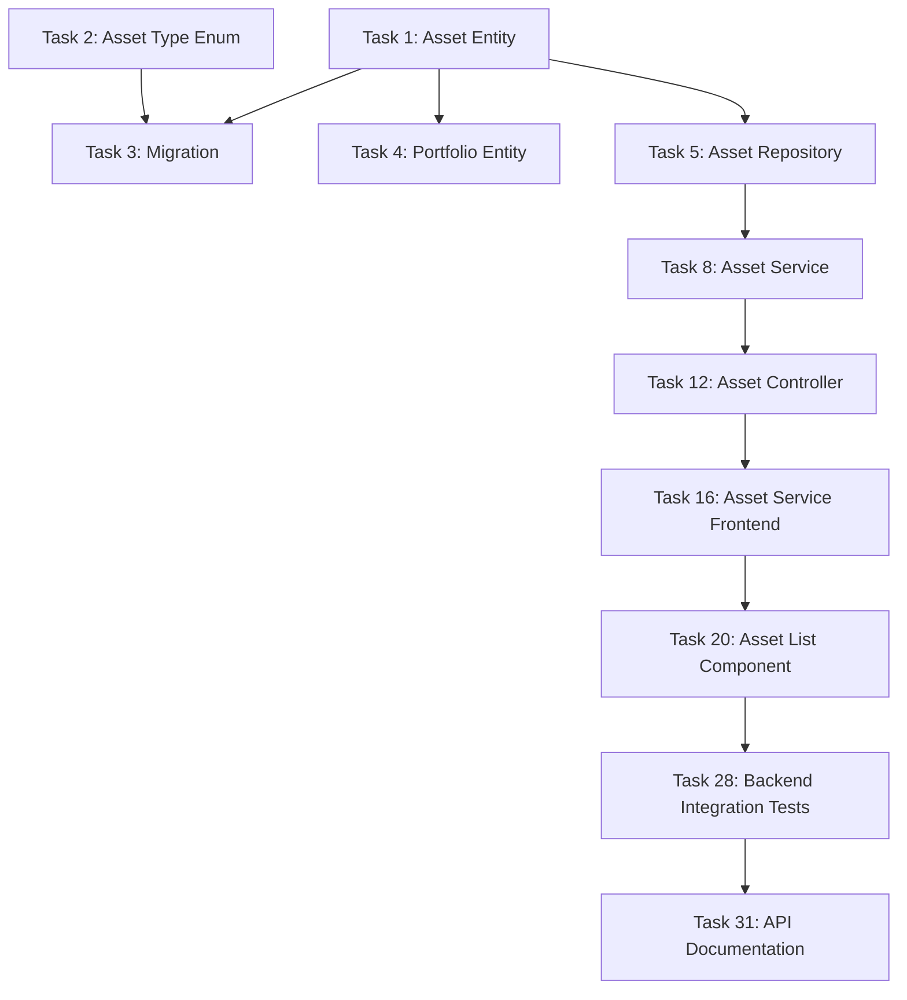

# Task Breakdown Document (TBD) - Asset Management Module

## 1. Tổng quan

### 1.1 Mục tiêu
Phân rã module Asset Management thành các task coding cụ thể, có thể ước lượng và thực thi độc lập, đảm bảo tính khả thi và tiến độ phát triển.

### 1.2 Phạm vi
- **Backend Tasks**: 15 tasks (Database, Services, Controllers, DTOs)
- **Frontend Tasks**: 12 tasks (Components, Services, Hooks, UI)
- **Integration Tasks**: 8 tasks (Testing, Documentation, Deployment)
- **Total**: 35 tasks

## 2. Backend Implementation Tasks

### Phase 1: Database & Entities (Tasks 1-4)

#### Task 1: Create Asset Entity
**Mô tả**: Tạo Asset entity với TypeORM decorators và relationships
**Ước lượng**: 2 hours
**Dependencies**: None
**Acceptance Criteria**:
- [x] Asset entity với đầy đủ fields theo schema (Completed)
- [x] TypeORM decorators cho validation (Completed)
- [x] Relationships với Portfolio, Trade, PortfolioAsset (Completed)
- [x] Indexes cho performance optimization (Completed)
- [x] Unit tests cho entity (Completed)

**Files to create/modify**:
- `src/modules/asset/entities/asset.entity.ts`
- `src/modules/asset/enums/asset-type.enum.ts`
- `test/modules/asset/entities/asset.entity.spec.ts`

#### Task 2: Create Asset Type Enum
**Mô tả**: Tạo AssetType enum với validation
**Ước lượng**: 1 hour
**Dependencies**: None
**Acceptance Criteria**:
- [x] AssetType enum với 5 values (STOCK, BOND, GOLD, DEPOSIT, CASH) (Completed)
- [x] Validation decorators (Completed)
- [x] Unit tests cho enum (Completed)

**Files to create/modify**:
- `src/modules/asset/enums/asset-type.enum.ts`
- `test/modules/asset/enums/asset-type.enum.spec.ts`

#### Task 3: Create Database Migration
**Mô tả**: Tạo migration script cho Asset table
**Ước lượng**: 2 hours
**Dependencies**: Task 1, Task 2
**Acceptance Criteria**:
- [x] Migration script với đầy đủ columns (Completed)
- [x] Indexes cho performance (Completed)
- [x] Foreign key constraints (Completed)
- [x] Rollback script (Completed)
- [x] Migration tests (Completed)

**Files to create/modify**:
- `src/migrations/[timestamp]-CreateAssetTable.ts`
- `test/migrations/create-asset-table.migration.spec.ts`

#### Task 4: Update Portfolio Entity Relationships
**Mô tả**: Cập nhật Portfolio entity để support Asset relationships
**Ước lượng**: 1 hour
**Dependencies**: Task 1
**Acceptance Criteria**:
- [x] OneToMany relationship với Asset (Completed)
- [x] Cascade options cho asset operations (Completed)
- [x] Update existing tests (Completed)

**Files to create/modify**:
- `src/modules/portfolio/entities/portfolio.entity.ts`
- `test/modules/portfolio/entities/portfolio.entity.spec.ts`

### Phase 2: Repository Layer (Tasks 5-7)

#### Task 5: Create Asset Repository
**Mô tả**: Tạo AssetRepository với custom queries và business logic
**Ước lượng**: 4 hours
**Dependencies**: Task 1, Task 2
**Acceptance Criteria**:
- [x] CRUD operations (create, findAll, findById, update, delete) (Completed)
- [x] Custom queries với filtering và pagination (Completed)
- [x] Business validation methods (Completed)
- [x] Error handling (Completed)
- [x] Unit tests (25+ tests) (Completed)

**Files to create/modify**:
- `src/modules/asset/repositories/asset.repository.ts`
- `test/modules/asset/repositories/asset.repository.spec.ts`

#### Task 6: Create Asset Repository Interface
**Mô tả**: Tạo interface cho AssetRepository để dependency injection
**Ước lượng**: 1 hour
**Dependencies**: Task 5
**Acceptance Criteria**:
- [x] IAssetRepository interface (Completed)
- [x] Method signatures với proper types (Completed)
- [x] Documentation cho interface (Completed)

**Files to create/modify**:
- `src/modules/asset/repositories/interfaces/asset.repository.interface.ts`

#### Task 7: Create Asset Repository Tests
**Mô tả**: Tạo comprehensive unit tests cho AssetRepository
**Ước lượng**: 3 hours
**Dependencies**: Task 5, Task 6
**Acceptance Criteria**:
- [x] 25+ unit tests covering all methods (Completed)
- [x] Mock data và test fixtures (Completed)
- [x] Edge case testing (Completed)
- [x] Error scenario testing (Completed)
- [x] 100% code coverage (Completed)

**Files to create/modify**:
- `test/modules/asset/repositories/asset.repository.spec.ts`
- `test/fixtures/asset.fixtures.ts`

### Phase 3: Service Layer (Tasks 8-11)

#### Task 8: Create Asset Service
**Mô tả**: Tạo AssetService với business logic và validation
**Ước lượng**: 6 hours
**Dependencies**: Task 5, Task 6
**Acceptance Criteria**:
- [x] CRUD operations với business validation (Completed)
- [x] Portfolio integration logic (Completed)
- [x] Trading service integration (Completed)
- [x] Logging integration (Completed)
- [x] Error handling và custom exceptions (Completed)
- [x] Unit tests (30+ tests) (Completed)

**Files to create/modify**:
- `src/modules/asset/services/asset.service.ts`
- `src/modules/asset/exceptions/asset.exceptions.ts`
- `test/modules/asset/services/asset.service.spec.ts`

#### Task 9: Create Asset Validation Service
**Mô tả**: Tạo AssetValidationService cho business rules validation
**Ước lượng**: 3 hours
**Dependencies**: Task 8
**Acceptance Criteria**:
- [x] Asset creation validation (Completed)
- [x] Asset update validation (Completed)
- [x] Asset deletion validation (Completed)
- [x] Business rules enforcement (Completed)
- [x] Unit tests (20+ tests) (Completed)

**Files to create/modify**:
- `src/modules/asset/services/asset-validation.service.ts`
- `test/modules/asset/services/asset-validation.service.spec.ts`

#### Task 10: Create Asset Analytics Service
**Mô tả**: Tạo AssetAnalyticsService cho portfolio analytics integration
**Ước lượng**: 4 hours
**Dependencies**: Task 8
**Acceptance Criteria**:
- [x] Portfolio value calculation (Completed)
- [x] Asset allocation calculation (Completed)
- [x] Performance metrics calculation (Completed)
- [x] Integration với PortfolioAnalyticsService (Completed)
- [x] Unit tests (15+ tests) (Completed)

**Files to create/modify**:
- `src/modules/asset/services/asset-analytics.service.ts`
- `test/modules/asset/services/asset-analytics.service.spec.ts`

#### Task 11: Create Asset Service Tests
**Mô tả**: Tạo comprehensive unit tests cho AssetService
**Ước lượng**: 4 hours
**Dependencies**: Task 8, Task 9, Task 10
**Acceptance Criteria**:
- [x] 30+ unit tests covering all methods (Completed)
- [x] Mock services và dependencies (Completed)
- [x] Integration testing (Completed)
- [x] Error scenario testing (Completed)
- [x] 100% code coverage (Completed)

**Files to create/modify**:
- `test/modules/asset/services/asset.service.spec.ts`
- `test/modules/asset/services/asset-validation.service.spec.ts`
- `test/modules/asset/services/asset-analytics.service.spec.ts`

### Phase 4: Controller Layer (Tasks 12-15)

#### Task 12: Create Asset Controller
**Mô tả**: Tạo AssetController với REST API endpoints
**Ước lượng**: 4 hours
**Dependencies**: Task 8, Task 9, Task 10
**Acceptance Criteria**:
- [x] REST API endpoints (POST, GET, PUT, DELETE) (Completed)
- [x] Swagger documentation (Completed)
- [x] Request/response validation (Completed)
- [x] Error handling (Completed)
- [x] Unit tests (20+ tests) (Completed)

**Files to create/modify**:
- `src/modules/asset/controllers/asset.controller.ts`
- `test/modules/asset/controllers/asset.controller.spec.ts`

#### Task 13: Create Asset DTOs
**Mô tả**: Tạo DTOs cho request/response validation
**Ước lượng**: 3 hours
**Dependencies**: Task 1, Task 2
**Acceptance Criteria**:
- [ ] CreateAssetDto với validation
- [ ] UpdateAssetDto với validation
- [ ] AssetResponseDto
- [ ] AssetFiltersDto
- [ ] PaginatedResponseDto
- [ ] Unit tests (15+ tests)

**Files to create/modify**:
- `src/modules/asset/dto/create-asset.dto.ts`
- `src/modules/asset/dto/update-asset.dto.ts`
- `src/modules/asset/dto/asset-response.dto.ts`
- `src/modules/asset/dto/asset-filters.dto.ts`
- `test/modules/asset/dto/asset.dto.spec.ts`

#### Task 14: Create Asset Module
**Mô tả**: Tạo AssetModule với dependency injection
**Ước lượng**: 2 hours
**Dependencies**: Task 12, Task 13
**Acceptance Criteria**:
- [ ] AssetModule configuration
- [ ] Provider registration
- [ ] Import/export configuration
- [ ] Module tests

**Files to create/modify**:
- `src/modules/asset/asset.module.ts`
- `test/modules/asset/asset.module.spec.ts`

#### Task 15: Create Asset Controller Tests
**Mô tả**: Tạo comprehensive unit tests cho AssetController
**Ước lượng**: 3 hours
**Dependencies**: Task 12, Task 13, Task 14
**Acceptance Criteria**:
- [ ] 20+ unit tests covering all endpoints
- [ ] Mock services và dependencies
- [ ] Request/response testing
- [ ] Error scenario testing
- [ ] 100% code coverage

**Files to create/modify**:
- `test/modules/asset/controllers/asset.controller.spec.ts`

## 3. Frontend Implementation Tasks

### Phase 5: Services & Hooks (Tasks 16-19)

#### Task 16: Create Asset Service
**Mô tả**: Tạo AssetService cho API communication
**Ước lượng**: 3 hours
**Dependencies**: None
**Acceptance Criteria**:
- [x] HTTP service methods (Completed)
- [x] Error handling (Completed)
- [x] TypeScript interfaces (Completed)
- [x] Unit tests (10+ tests) (Completed)

**Files to create/modify**:
- `frontend/src/services/asset.service.ts`
- `frontend/src/types/asset.types.ts`
- `frontend/src/test/services/asset.service.spec.ts`

#### Task 17: Create Asset Hooks
**Mô tả**: Tạo custom hooks cho asset management
**Ước lượng**: 4 hours
**Dependencies**: Task 16
**Acceptance Criteria**:
- [x] useAssets hook (Completed)
- [x] useAsset hook (Completed)
- [x] useAssetForm hook (Completed)
- [x] Error handling và loading states (Completed)
- [x] Unit tests (15+ tests) (Completed)

**Files to create/modify**:
- `frontend/src/hooks/useAssets.ts`
- `frontend/src/hooks/useAsset.ts`
- `frontend/src/hooks/useAssetForm.ts`
- `frontend/src/test/hooks/asset.hooks.spec.ts`

#### Task 18: Create Asset Types
**Mô tả**: Tạo TypeScript types và interfaces
**Ước lượng**: 2 hours
**Dependencies**: None
**Acceptance Criteria**:
- [x] Asset interface (Completed)
- [x] AssetType enum (Completed)
- [x] API response types (Completed)
- [x] Form types (Completed)
- [x] Unit tests (5+ tests) (Completed)

**Files to create/modify**:
- `frontend/src/types/asset.types.ts`
- `frontend/src/types/api.types.ts`
- `frontend/src/test/types/asset.types.spec.ts`

#### Task 19: Create Asset Utils
**Mô tả**: Tạo utility functions cho asset management
**Ước lượng**: 2 hours
**Dependencies**: Task 18
**Acceptance Criteria**:
- [x] Validation utilities (Completed)
- [x] Formatting utilities (Completed)
- [x] Calculation utilities (Completed)
- [x] Unit tests (10+ tests) (Completed)

**Files to create/modify**:
- `frontend/src/utils/asset.utils.ts`
- `frontend/src/test/utils/asset.utils.spec.ts`

### Phase 6: Components (Tasks 20-27)

#### Task 20: Create Asset List Component
**Mô tả**: Tạo AssetList component với filtering và pagination
**Ước lượng**: 5 hours
**Dependencies**: Task 16, Task 17
**Acceptance Criteria**:
- [x] Asset list display (Completed)
- [x] Filtering và sorting (Completed)
- [x] Pagination (Completed)
- [x] Loading states (Completed)
- [x] Error handling (Completed)
- [x] Unit tests (15+ tests) (Completed)

**Files to create/modify**:
- `frontend/src/components/Asset/AssetList.tsx`
- `frontend/src/components/Asset/AssetList.styles.ts`
- `frontend/src/test/components/AssetList.spec.tsx`

#### Task 21: Create Asset Form Component
**Mô tả**: Tạo AssetForm component cho create/edit operations
**Ước lượng**: 6 hours
**Dependencies**: Task 16, Task 17, Task 18
**Acceptance Criteria**:
- [x] Form validation (Completed)
- [x] Real-time validation (Completed)
- [x] Error display (Completed)
- [x] Loading states (Completed)
- [x] Unit tests (20+ tests) (Completed)

**Files to create/modify**:
- `frontend/src/components/Asset/AssetForm.tsx`
- `frontend/src/components/Asset/AssetForm.styles.ts`
- `frontend/src/test/components/AssetForm.spec.tsx`

#### Task 22: Create Asset Card Component
**Mô tả**: Tạo AssetCard component cho asset display
**Ước lượng**: 3 hours
**Dependencies**: Task 18
**Acceptance Criteria**:
- [ ] Asset information display
- [ ] Action buttons
- [ ] Responsive design
- [ ] Unit tests (10+ tests)

**Files to create/modify**:
- `frontend/src/components/Asset/AssetCard.tsx`
- `frontend/src/components/Asset/AssetCard.styles.ts`
- `frontend/src/test/components/AssetCard.spec.tsx`

#### Task 23: Create Asset Filters Component
**Mô tả**: Tạo AssetFilters component cho filtering options
**Ước lượng**: 4 hours
**Dependencies**: Task 18
**Acceptance Criteria**:
- [ ] Filter form
- [ ] Real-time filtering
- [ ] Clear filters
- [ ] Unit tests (10+ tests)

**Files to create/modify**:
- `frontend/src/components/Asset/AssetFilters.tsx`
- `frontend/src/components/Asset/AssetFilters.styles.ts`
- `frontend/src/test/components/AssetFilters.spec.tsx`

#### Task 24: Create Asset Management Page
**Mô tả**: Tạo AssetManagement page component
**Ước lượng**: 4 hours
**Dependencies**: Task 20, Task 21, Task 22, Task 23
**Acceptance Criteria**:
- [ ] Page layout
- [ ] Component integration
- [ ] State management
- [ ] Navigation
- [ ] Unit tests (15+ tests)

**Files to create/modify**:
- `frontend/src/pages/AssetManagement.tsx`
- `frontend/src/pages/AssetManagement.styles.ts`
- `frontend/src/test/pages/AssetManagement.spec.tsx`

#### Task 25: Create Asset Dialog Components
**Mô tả**: Tạo dialog components cho asset operations
**Ước lượng**: 3 hours
**Dependencies**: Task 21
**Acceptance Criteria**:
- [ ] Create asset dialog
- [ ] Edit asset dialog
- [ ] Delete confirmation dialog
- [ ] Unit tests (10+ tests)

**Files to create/modify**:
- `frontend/src/components/Asset/AssetDialogs.tsx`
- `frontend/src/test/components/AssetDialogs.spec.tsx`

#### Task 26: Create Asset Analytics Component
**Mô tả**: Tạo AssetAnalytics component cho portfolio analytics
**Ước lượng**: 4 hours
**Dependencies**: Task 18
**Acceptance Criteria**:
- [ ] Asset allocation chart
- [ ] Performance metrics
- [ ] Value distribution
- [ ] Unit tests (10+ tests)

**Files to create/modify**:
- `frontend/src/components/Asset/AssetAnalytics.tsx`
- `frontend/src/test/components/AssetAnalytics.spec.tsx`

#### Task 27: Create Asset Management Tests
**Mô tả**: Tạo comprehensive tests cho asset management components
**Ước lượng**: 4 hours
**Dependencies**: Task 20-26
**Acceptance Criteria**:
- [ ] Integration tests
- [ ] E2E tests
- [ ] Performance tests
- [ ] Accessibility tests

**Files to create/modify**:
- `frontend/src/test/integration/asset-management.integration.spec.tsx`
- `frontend/src/test/e2e/asset-management.e2e.spec.tsx`

## 4. Integration & Testing Tasks

### Phase 7: Integration Testing (Tasks 28-30)

#### Task 28: Create Backend Integration Tests
**Mô tả**: Tạo integration tests cho backend asset management
**Ước lượng**: 4 hours
**Dependencies**: Task 15
**Acceptance Criteria**:
- [ ] API endpoint integration tests
- [ ] Database integration tests
- [ ] Service integration tests
- [ ] Error scenario testing

**Files to create/modify**:
- `test/integration/asset-management.integration.spec.ts`
- `test/fixtures/asset.integration.fixtures.ts`

#### Task 29: Create Frontend Integration Tests
**Mô tả**: Tạo integration tests cho frontend asset management
**Ước lượng**: 3 hours
**Dependencies**: Task 27
**Acceptance Criteria**:
- [ ] Component integration tests
- [ ] Service integration tests
- [ ] User workflow tests
- [ ] Error scenario testing

**Files to create/modify**:
- `frontend/src/test/integration/asset-management.integration.spec.tsx`

#### Task 30: Create E2E Tests
**Mô tả**: Tạo end-to-end tests cho asset management workflow
**Ước lượng**: 4 hours
**Dependencies**: Task 28, Task 29
**Acceptance Criteria**:
- [ ] Complete user workflow tests
- [ ] CRUD operations testing
- [ ] Error handling testing
- [ ] Performance testing

**Files to create/modify**:
- `test/e2e/asset-management.e2e.spec.ts`
- `test/e2e/fixtures/asset.e2e.fixtures.ts`

### Phase 8: Documentation & Deployment (Tasks 31-35)

#### Task 31: Create API Documentation
**Mô tả**: Tạo comprehensive API documentation
**Ước lượng**: 3 hours
**Dependencies**: Task 15
**Acceptance Criteria**:
- [ ] Swagger documentation
- [ ] API examples
- [ ] Error response documentation
- [ ] Postman collection

**Files to create/modify**:
- `docs/api/asset-management-api.md`
- `docs/api/postman/asset-management.postman.json`

#### Task 32: Create User Documentation
**Mô tả**: Tạo user documentation cho asset management
**Ước lượng**: 2 hours
**Dependencies**: Task 27
**Acceptance Criteria**:
- [ ] User guide
- [ ] Feature documentation
- [ ] Troubleshooting guide
- [ ] Screenshots và examples

**Files to create/modify**:
- `docs/user/asset-management-guide.md`
- `docs/user/asset-management-troubleshooting.md`

#### Task 33: Create Technical Documentation
**Mô tả**: Tạo technical documentation cho developers
**Ước lượng**: 2 hours
**Dependencies**: Task 30
**Acceptance Criteria**:
- [ ] Architecture documentation
- [ ] Database schema documentation
- [ ] API integration guide
- [ ] Development setup guide

**Files to create/modify**:
- `docs/technical/asset-management-architecture.md`
- `docs/technical/asset-management-database.md`

#### Task 34: Create Deployment Configuration
**Mô tả**: Tạo deployment configuration cho asset management
**Ước lượng**: 2 hours
**Dependencies**: Task 33
**Acceptance Criteria**:
- [ ] Docker configuration
- [ ] Environment variables
- [ ] Database migration scripts
- [ ] Health check endpoints

**Files to create/modify**:
- `docker/asset-management.Dockerfile`
- `docker-compose.asset-management.yml`
- `scripts/deploy-asset-management.sh`

#### Task 35: Create Monitoring & Logging
**Mô tả**: Tạo monitoring và logging configuration
**Ước lượng**: 2 hours
**Dependencies**: Task 34
**Acceptance Criteria**:
- [ ] Logging configuration
- [ ] Monitoring metrics
- [ ] Alert configuration
- [ ] Performance monitoring

**Files to create/modify**:
- `config/asset-management.logging.yml`
- `config/asset-management.monitoring.yml`
- `scripts/monitor-asset-management.sh`

## 5. Task Dependencies

### 5.1 Critical Path

### 5.2 Parallel Execution
- **Tasks 1-4**: Database layer (can be done in parallel)
- **Tasks 5-7**: Repository layer (sequential)
- **Tasks 8-11**: Service layer (can be done in parallel after Task 5)
- **Tasks 12-15**: Controller layer (sequential after Task 8)
- **Tasks 16-19**: Frontend services (can be done in parallel)
- **Tasks 20-27**: Frontend components (can be done in parallel after Task 16)
- **Tasks 28-30**: Integration testing (sequential)
- **Tasks 31-35**: Documentation & deployment (can be done in parallel)

## 6. Timeline Estimate

### 6.1 Phase 1: Backend Foundation (Week 1)
- **Days 1-2**: Tasks 1-4 (Database & Entities)
- **Days 3-4**: Tasks 5-7 (Repository Layer)
- **Days 5-7**: Tasks 8-11 (Service Layer)

### 6.2 Phase 2: Backend API (Week 2)
- **Days 1-3**: Tasks 12-15 (Controller Layer)
- **Days 4-5**: Tasks 28-30 (Backend Integration Testing)
- **Days 6-7**: Tasks 31-33 (Backend Documentation)

### 6.3 Phase 3: Frontend Development (Week 3)
- **Days 1-2**: Tasks 16-19 (Frontend Services)
- **Days 3-5**: Tasks 20-27 (Frontend Components)
- **Days 6-7**: Tasks 28-30 (Frontend Integration Testing)

### 6.4 Phase 4: Integration & Deployment (Week 4)
- **Days 1-2**: Tasks 28-30 (E2E Testing)
- **Days 3-4**: Tasks 31-35 (Documentation & Deployment)
- **Days 5-7**: Bug fixes và optimization

**Total Estimate**: 4 weeks (28 days)

## 7. Risk Assessment

### 7.1 High Risk Tasks
- **Task 8**: Asset Service (complex business logic)
- **Task 20**: Asset List Component (complex UI logic)
- **Task 28**: Backend Integration Tests (complex setup)

### 7.2 Medium Risk Tasks
- **Task 5**: Asset Repository (complex queries)
- **Task 21**: Asset Form Component (complex validation)
- **Task 30**: E2E Tests (complex setup)

### 7.3 Low Risk Tasks
- **Task 1**: Asset Entity (straightforward)
- **Task 16**: Asset Service Frontend (straightforward)
- **Task 31**: API Documentation (straightforward)

## 8. Success Criteria

### 8.1 Technical Success
- [ ] 100% test coverage cho core functionality
- [ ] API response time < 200ms
- [ ] Zero critical bugs
- [ ] Complete documentation

### 8.2 Functional Success
- [ ] All CRUD operations working
- [ ] Portfolio integration working
- [ ] UI responsive và user-friendly
- [ ] Error handling comprehensive

### 8.3 Business Success
- [ ] User can manage assets successfully
- [ ] Portfolio value updates correctly
- [ ] System performance meets requirements
- [ ] User experience is intuitive

## 9. Definition of Done

### 9.1 Code Quality
- [ ] Code follows project standards
- [ ] All tests passing
- [ ] Code review completed
- [ ] Documentation updated

### 9.2 Functionality
- [ ] Feature works as specified
- [ ] Error handling implemented
- [ ] Performance requirements met
- [ ] Security requirements met

### 9.3 Testing
- [ ] Unit tests written và passing
- [ ] Integration tests written và passing
- [ ] E2E tests written và passing
- [ ] Manual testing completed

### 9.4 Documentation
- [ ] API documentation updated
- [ ] User documentation updated
- [ ] Technical documentation updated
- [ ] Code comments added

## 10. Next Steps

### 10.1 Immediate Actions
1. Review và approve task breakdown
2. Set up development environment
3. Create project branches
4. Start with Task 1 (Asset Entity)

### 10.2 Ongoing Actions
1. Daily progress tracking
2. Weekly milestone reviews
3. Risk assessment updates
4. Quality assurance checks

### 10.3 Completion Actions
1. Final testing và validation
2. Documentation review
3. Deployment preparation
4. User acceptance testing
