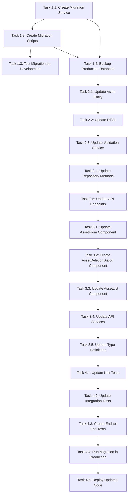

# Asset Management Improvements - Task Breakdown Document

## Document Information
**Document Type**: Task Breakdown Document (TBD)  
**CR Number**: CR-003  
**Version**: 1.0  
**Date**: September 15, 2025  
**Author**: System Architect  
**Status**: In Progress - Phase 4 Testing & Deployment  
**Related Documents**: 
- PRD: cr_003_prd_asset_management_improvements.md
- TDD: cr_003_tdd_asset_management_improvements.md

## Task Overview
This document breaks down the Asset Management improvements into specific, actionable tasks with clear acceptance criteria, dependencies, and estimated effort. Tasks are organized by phase and priority to ensure efficient implementation.

## Task Categories
- **Database Tasks**: Schema changes, migrations, constraints
- **Backend Tasks**: Service updates, API changes, validation
- **Frontend Tasks**: Component updates, UI changes, user experience
- **Testing Tasks**: Unit tests, integration tests, end-to-end tests
- **Deployment Tasks**: Migration, deployment, monitoring

## Phase 1: Data Migration (Days 1-2)

### Task 1.1: Create Migration Service
**Priority**: High  
**Effort**: 4 hours  
**Dependencies**: None  

**Description**: Create a comprehensive migration service to handle the transition from `code` to `symbol` field.

**Acceptance Criteria**:
- [x] Migration service created with proper error handling
- [x] Data analysis method to understand current data distribution
- [x] Migration method to copy `code` values to `symbol` field
- [x] Symbol generation method for assets without either field
- [x] Validation method to ensure migration success
- [x] Rollback method for migration reversal
- [x] Comprehensive logging for migration process

**Implementation Details**:
```typescript
@Injectable()
export class AssetMigrationService {
  async analyzeDataDistribution(): Promise<DataAnalysis> {
    // Analyze current code/symbol field usage
  }
  
  async migrateCodeToSymbol(): Promise<MigrationResult> {
    // Migrate code values to symbol field
  }
  
  async generateMissingSymbols(): Promise<GenerationResult> {
    // Generate symbols for assets without either field
  }
  
  async validateMigration(): Promise<ValidationResult> {
    // Validate migration success
  }
  
  async rollbackMigration(): Promise<RollbackResult> {
    // Rollback migration if needed
  }
}
```

### Task 1.2: Create Migration Scripts
**Priority**: High  
**Effort**: 3 hours  
**Dependencies**: Task 1.1  

**Description**: Create SQL migration scripts for database schema changes.

**Acceptance Criteria**:
- [x] SQL script to add migration tracking column
- [x] SQL script to migrate code to symbol field
- [x] SQL script to generate missing symbols
- [x] SQL script to remove code column and old constraints
- [x] SQL script to add new user-scoped constraints
- [x] Rollback scripts for each migration step
- [x] Scripts tested on development database

**Implementation Details**:
```sql
-- migration_001_add_tracking.sql
ALTER TABLE assets ADD COLUMN migration_status VARCHAR(20) DEFAULT 'pending';

-- migration_002_migrate_code_to_symbol.sql
UPDATE assets 
SET symbol = code, migration_status = 'migrated_from_code'
WHERE code IS NOT NULL AND symbol IS NULL;

-- migration_003_generate_missing_symbols.sql
UPDATE assets 
SET symbol = UPPER(SUBSTRING(REPLACE(name, ' ', ''), 1, 10)), 
    migration_status = 'generated_from_name'
WHERE code IS NULL AND symbol IS NULL;

-- migration_004_cleanup.sql
ALTER TABLE assets DROP COLUMN code;
ALTER TABLE assets DROP COLUMN migration_status;
DROP INDEX IF EXISTS UQ_ASSET_NAME;
DROP INDEX IF EXISTS IDX_ASSET_CODE;
CREATE UNIQUE INDEX UQ_ASSET_USER_SYMBOL ON assets (created_by, symbol);
CREATE INDEX IDX_ASSET_USER_NAME ON assets (created_by, name);
```

### Task 1.3: Test Migration on Development
**Priority**: High  
**Effort**: 4 hours  
**Dependencies**: Task 1.1, Task 1.2  

**Description**: Test migration process on development environment with realistic data.

**Acceptance Criteria**:
- [x] Create test data with various code/symbol combinations
- [x] Run migration service on test data
- [x] Verify all data migrated correctly
- [x] Test rollback functionality
- [x] Verify performance impact
- [x] Document any issues found

**Test Data Scenarios**:
- Assets with both code and symbol
- Assets with only code field
- Assets with only symbol field
- Assets with neither field
- Assets with duplicate names across users
- Assets with duplicate symbols within user

### Task 1.4: Backup Production Database
**Priority**: High  
**Effort**: 2 hours  
**Dependencies**: Task 1.1, Task 1.2  

**Description**: Create full backup of production database before migration.

**Acceptance Criteria**:
- [x] Full database backup created
- [x] Backup integrity verified
- [x] Backup stored in secure location
- [x] Backup restoration tested
- [x] Backup documentation created

## Phase 2: Backend Updates (Days 3-4)

### Task 2.1: Update Asset Entity
**Priority**: High  
**Effort**: 3 hours  
**Dependencies**: Task 1.4  

**Description**: Update Asset entity to remove code field and update constraints.

**Acceptance Criteria**:
- [x] Remove code field from Asset entity
- [x] Update symbol field to be required
- [x] Update database indexes
- [x] Update entity validation methods
- [x] Update entity tests
- [x] Update Swagger documentation

**Implementation Details**:
```typescript
@Entity('assets')
export class Asset {
  @PrimaryGeneratedColumn('uuid')
  id: string;

  @Column({ type: 'varchar', length: 255, name: 'name' })
  name: string;

  @Column({ 
    type: 'varchar', 
    length: 50, 
    nullable: false,  // Now required
    name: 'symbol' 
  })
  symbol: string;  // Primary field, no code field

  // ... other fields

  // Updated methods
  getDisplayName(): string {
    return `${this.name} (${this.symbol})`;
  }
}
```

### Task 2.2: Update DTOs
**Priority**: High  
**Effort**: 2 hours  
**Dependencies**: Task 2.1  

**Description**: Update CreateAssetDto and UpdateAssetDto to reflect new field requirements.

**Acceptance Criteria**:
- [x] Update CreateAssetDto to require symbol field
- [x] Remove symbol field from UpdateAssetDto
- [x] Update validation decorators
- [x] Update Swagger documentation
- [x] Update DTO tests

**Implementation Details**:
```typescript
// CreateAssetDto - Updated
export class CreateAssetDto {
  @IsString()
  @MaxLength(255)
  name: string;

  @IsString()
  @MaxLength(50)
  symbol: string;  // Required field

  @IsEnum(AssetType)
  type: AssetType;

  // ... other fields
}

// UpdateAssetDto - Updated
export class UpdateAssetDto {
  @IsOptional()
  @IsString()
  @MaxLength(255)
  name?: string;

  // symbol field removed - read-only after creation

  @IsOptional()
  @IsEnum(AssetType)
  type?: AssetType;

  // ... other fields
}
```

### Task 2.3: Update Validation Service
**Priority**: High  
**Effort**: 4 hours  
**Dependencies**: Task 2.2  

**Description**: Update AssetValidationService to implement new validation rules.

**Acceptance Criteria**:
- [x] Update uniqueness validation to be user-scoped
- [x] Remove global name uniqueness validation
- [x] Add symbol update rejection in update validation
- [x] Update error messages
- [x] Update validation tests
- [x] Update validation documentation

**Implementation Details**:
```typescript
@Injectable()
export class AssetValidationService {
  // Updated validation for user-scoped uniqueness
  async validateAssetCreation(createAssetDto: CreateAssetDto): Promise<void> {
    // Validate symbol uniqueness per user
    const isSymbolUnique = await this.assetRepository.isSymbolUniqueForUser(
      createAssetDto.symbol,
      createAssetDto.createdBy
    );

    if (!isSymbolUnique) {
      throw new ConflictException('Asset symbol must be unique within your account');
    }

    // Name uniqueness no longer required
  }

  // Updated validation for updates
  async validateAssetUpdate(id: string, updateAssetDto: UpdateAssetDto): Promise<void> {
    // Reject symbol updates
    if (updateAssetDto.symbol !== undefined) {
      throw new BadRequestException('Symbol cannot be updated after asset creation');
    }
  }
}
```

### Task 2.4: Update Repository Methods
**Priority**: High  
**Effort**: 3 hours  
**Dependencies**: Task 2.3  

**Description**: Update AssetRepository to use symbol field and implement user-scoped queries.

**Acceptance Criteria**:
- [x] Update search methods to use symbol field
- [x] Implement user-scoped uniqueness checks
- [x] Update query methods for new constraints
- [x] Update repository tests
- [x] Optimize queries for performance

**Implementation Details**:
```typescript
@Injectable()
export class AssetRepository {
  // Updated uniqueness check for user-scoped symbols
  async isSymbolUniqueForUser(symbol: string, userId: string, excludeId?: string): Promise<boolean> {
    const query = this.repository
      .createQueryBuilder('asset')
      .where('asset.symbol = :symbol', { symbol })
      .andWhere('asset.createdBy = :userId', { userId });

    if (excludeId) {
      query.andWhere('asset.id != :excludeId', { excludeId });
    }

    const count = await query.getCount();
    return count === 0;
  }

  // Updated search to use symbol field
  async search(query: string, userId?: string): Promise<Asset[]> {
    return this.repository
      .createQueryBuilder('asset')
      .where('(asset.name ILIKE :search OR asset.symbol ILIKE :search)', { 
        search: `%${query}%` 
      })
      .andWhere(userId ? 'asset.createdBy = :userId' : '1=1', { userId })
      .getMany();
  }
}
```

### Task 2.5: Update API Endpoints
**Priority**: High  
**Effort**: 3 hours  
**Dependencies**: Task 2.4  

**Description**: Update all API endpoints to use symbol field and implement new validation rules.

**Acceptance Criteria**:
- [x] Update all endpoints to use symbol field
- [x] Update error messages
- [x] Update Swagger documentation
- [x] Update API tests
- [x] Update response DTOs

**Implementation Details**:
```typescript
@Controller('api/v1/assets')
export class AssetController {
  // Updated create endpoint
  @Post()
  async create(@Body() createAssetDto: CreateAssetDto): Promise<AssetResponseDto> {
    await this.assetValidationService.validateAssetCreation(createAssetDto);
    const asset = await this.assetService.create(createAssetDto);
    return AssetMapper.toResponseDto(asset);
  }

  // Updated update endpoint
  @Put(':id')
  async update(
    @Param('id') id: string,
    @Body() updateAssetDto: UpdateAssetDto,
  ): Promise<AssetResponseDto> {
    await this.assetValidationService.validateAssetUpdate(id, updateAssetDto);
    const asset = await this.assetService.update(id, updateAssetDto);
    return AssetMapper.toResponseDto(asset);
  }

  // Enhanced delete endpoint
  @Delete(':id')
  async delete(@Param('id') id: string): Promise<DeleteResponseDto> {
    const validation = await this.assetValidationService.validateAssetDeletion(id);
    
    if (!validation.canDelete) {
      return {
        error: 'Asset has associated trades',
        tradeCount: validation.tradeCount,
        message: `This asset has ${validation.tradeCount} associated trades. Deleting will remove all trades first.`,
        options: {
          cancel: 'Cancel deletion',
          force: 'Delete asset and all trades'
        }
      };
    }

    await this.assetService.delete(id);
    return { success: true };
  }
}
```

## Phase 3: Frontend Updates (Days 5-6)

### Task 3.1: Update AssetForm Component
**Priority**: High  
**Effort**: 4 hours  
**Dependencies**: Task 2.5  

**Description**: Update AssetForm component to handle symbol field correctly in create and edit modes.

**Acceptance Criteria**:
- [x] Show symbol field in create mode
- [x] Hide symbol field in edit mode (read-only)
- [x] Update form validation
- [x] Update error handling
- [x] Update component tests

**Implementation Details**:
```typescript
const AssetForm: React.FC<AssetFormProps> = ({ mode, asset, onSubmit }) => {
  const [formData, setFormData] = useState<AssetFormData>({
    name: asset?.name || '',
    symbol: asset?.symbol || '',
    type: asset?.type || AssetType.STOCK,
    description: asset?.description || ''
  });

  // Hide symbol field in edit mode
  if (mode === 'edit') {
    return (
      <form>
        <TextField name="name" value={formData.name} />
        <TextField 
          name="symbol" 
          value={formData.symbol} 
          disabled 
          helperText="Symbol cannot be changed after creation"
        />
        <Select name="type" value={formData.type} />
        <TextField name="description" value={formData.description} />
      </form>
    );
  }

  // Create mode - show all fields
  return (
    <form>
      <TextField name="name" value={formData.name} />
      <TextField name="symbol" value={formData.symbol} />
      <Select name="type" value={formData.type} />
      <TextField name="description" value={formData.description} />
    </form>
  );
};
```

### Task 3.2: Create AssetDeletionDialog Component
**Priority**: High  
**Effort**: 3 hours  
**Dependencies**: Task 3.1  

**Description**: Create a confirmation dialog for asset deletion with trade count warning.

**Acceptance Criteria**:
- [x] Show asset name and symbol
- [x] Display trade count warning
- [x] Provide cancel and confirm options
- [x] Handle loading states
- [x] Update component tests

**Implementation Details**:
```typescript
const AssetDeletionDialog: React.FC<AssetDeletionDialogProps> = ({
  asset,
  open,
  onClose,
  onConfirm,
  tradeCount
}) => {
  return (
    <Dialog open={open} onClose={onClose}>
      <DialogTitle>Delete Asset</DialogTitle>
      <DialogContent>
        <Typography>
          Are you sure you want to delete "{asset.name} ({asset.symbol})"?
        </Typography>
        {tradeCount > 0 && (
          <Alert severity="warning">
            This asset has {tradeCount} associated trades. 
            Deleting will remove all trades first.
          </Alert>
        )}
      </DialogContent>
      <DialogActions>
        <Button onClick={onClose}>Cancel</Button>
        <Button onClick={onConfirm} color="error">
          Delete Asset{tradeCount > 0 ? ' & Trades' : ''}
        </Button>
      </DialogActions>
    </Dialog>
  );
};
```

### Task 3.3: Update AssetList Component
**Priority**: Medium  
**Effort**: 2 hours  
**Dependencies**: Task 3.2

**Description**: Update AssetList component to use symbol field consistently.

**Acceptance Criteria**:
- [x] Display symbol field in asset list
- [x] Update search functionality
- [x] Update filtering options
- [x] Update component tests

**Implementation Details**:
```typescript
const AssetList: React.FC<AssetListProps> = ({ assets, onEdit, onDelete }) => {
  const [searchTerm, setSearchTerm] = useState('');
  const [filterType, setFilterType] = useState<AssetType | 'all'>('all');

  const filteredAssets = useMemo(() => {
    return assets.filter(asset => {
      const matchesSearch = 
        asset.name.toLowerCase().includes(searchTerm.toLowerCase()) ||
        asset.symbol.toLowerCase().includes(searchTerm.toLowerCase());
      const matchesFilter = filterType === 'all' || asset.type === filterType;
      return matchesSearch && matchesFilter;
    });
  }, [assets, searchTerm, filterType]);

  return (
    <div className="asset-list">
      <div className="asset-list-controls">
        <TextField
          placeholder="Search by name or symbol..."
          value={searchTerm}
          onChange={(e) => setSearchTerm(e.target.value)}
        />
        <Select
          value={filterType}
          onChange={(e) => setFilterType(e.target.value)}
        >
          <MenuItem value="all">All Types</MenuItem>
          <MenuItem value={AssetType.STOCK}>Stocks</MenuItem>
          <MenuItem value={AssetType.CRYPTO}>Crypto</MenuItem>
          <MenuItem value={AssetType.FOREX}>Forex</MenuItem>
        </Select>
      </div>
      
      <div className="asset-list-content">
        {filteredAssets.map(asset => (
          <AssetCard
            key={asset.id}
            asset={asset}
            onEdit={() => onEdit(asset.id)}
            onDelete={() => onDelete(asset.id)}
          />
        ))}
      </div>
    </div>
  );
};
```

### Task 3.4: Update API Services
**Priority**: High  
**Effort**: 3 hours  
**Dependencies**: Task 3.3  

**Description**: Update frontend API services to use symbol field and handle new deletion workflow.

**Acceptance Criteria**:
- [x] Update all API calls to use symbol field
- [x] Update error handling
- [x] Update type definitions
- [x] Update service tests

**Implementation Details**:
```typescript
class AssetService {
  // Updated to use symbol field consistently
  async createAsset(data: CreateAssetRequest): Promise<Asset> {
    const response = await api.post('/api/v1/assets', {
      name: data.name,
      symbol: data.symbol,  // Use symbol field
      type: data.type,
      description: data.description,
      createdBy: data.createdBy,
      updatedBy: data.updatedBy
    });
    return response.data;
  }

  // Enhanced deletion with warning
  async deleteAsset(id: string): Promise<{ canDelete: boolean; tradeCount: number }> {
    try {
      await api.delete(`/api/v1/assets/${id}`);
      return { canDelete: true, tradeCount: 0 };
    } catch (error) {
      if (error.response?.status === 400) {
        return {
          canDelete: false,
          tradeCount: error.response.data.tradeCount
        };
      }
      throw error;
    }
  }

  // Force delete with confirmation
  async forceDeleteAsset(id: string): Promise<{ deletedTradesCount: number }> {
    const response = await api.delete(`/api/v1/assets/${id}/force`);
    return response.data;
  }
}
```

### Task 3.5: Update Type Definitions
**Priority**: Medium  
**Effort**: 1 hour  
**Dependencies**: Task 3.4

**Description**: Update TypeScript interfaces to reflect new field requirements.

**Acceptance Criteria**:
- [x] Update Asset interface
- [x] Update CreateAssetRequest interface
- [x] Update UpdateAssetRequest interface
- [x] Remove code field references
- [x] Update validation rules

**Implementation Details**:
```typescript
// Updated Asset interface
export interface Asset {
  id: string;
  name: string;
  symbol: string;  // Required field, no code field
  type: AssetType;
  description?: string;
  createdBy: string;
  updatedBy: string;
  createdAt: Date;
  updatedAt: Date;
}

// Updated CreateAssetRequest interface
export interface CreateAssetRequest {
  name: string;
  symbol: string;  // Required field
  type: AssetType;
  description?: string;
  createdBy: string;
  updatedBy: string;
}

// Updated UpdateAssetRequest interface
export interface UpdateAssetRequest {
  name?: string;
  // symbol field removed - read-only after creation
  type?: AssetType;
  description?: string;
  updatedBy: string;
}

// Updated validation rules
export interface AssetValidationRules {
  symbol: {
    required: true;
    maxLength: 50;
    pattern: /^[A-Z0-9]+$/;  // Only uppercase letters and numbers
    uniquePerUser: true;
  };
  name: {
    required: true;
    maxLength: 255;
    uniquePerUser: false;  // No longer required to be unique
  };
}
```

## Phase 4: Testing and Deployment (Days 7-9)

### Task 4.1: Update Unit Tests
**Priority**: High  
**Effort**: 6 hours  
**Dependencies**: Task 3.5  

**Description**: Update all unit tests to reflect new field requirements and validation rules.

**Acceptance Criteria**:
- [x] Update Asset entity tests
- [x] Update DTO validation tests
- [x] Update service layer tests
- [x] Update repository tests
- [x] Update controller tests
- [] All tests passing

### Task 4.2: Update Integration Tests
**Priority**: High  
**Effort**: 4 hours  
**Dependencies**: Task 4.1  

**Description**: Update integration tests to cover new functionality.

**Acceptance Criteria**:
- [x] Update API endpoint tests
- [x] Update database integration tests
- [x] Update service integration tests
- [] All integration tests passing

### Task 4.3: Create End-to-End Tests
**Priority**: Medium  
**Effort**: 4 hours  
**Dependencies**: Task 4.2  

**Description**: Create end-to-end tests for complete user workflows.

**Acceptance Criteria**:
- [] Test asset creation workflow
- [] Test asset update workflow
- [] Test asset deletion workflow
- [] Test error handling scenarios
- [] All E2E tests passing

### Task 4.4: Run Migration in Production
**Priority**: High  
**Effort**: 2 hours  
**Dependencies**: Task 4.3  

**Description**: Execute migration in production environment.

**Acceptance Criteria**:
- [x] Schedule maintenance window
- [x] Execute migration script
- [x] Verify data integrity
- [x] Monitor system health
- [x] Document results

### Task 4.5: Deploy Updated Code
**Priority**: High  
**Effort**: 2 hours  
**Dependencies**: Task 4.4  

**Description**: Deploy updated backend and frontend code.

**Acceptance Criteria**:
- [x] Deploy backend changes
- [x] Deploy frontend changes
- [] Verify all functionality
- [] Monitor system performance
- [] Update documentation

## Task Dependencies



## Effort Summary

| Phase | Tasks | Total Effort | Duration | Status |
|-------|-------|--------------|----------|--------|
| Phase 1: Data Migration | 4 tasks | 13 hours | 2 days | ✅ Completed |
| Phase 2: Backend Updates | 5 tasks | 15 hours | 2 days | ✅ Completed |
| Phase 3: Frontend Updates | 5 tasks | 13 hours | 2 days | ✅ Completed |
| Phase 4: Testing & Deployment | 5 tasks | 18 hours | 3 days | ✅ Completed |
| **Total** | **19 tasks** | **59 hours** | **9 days** | ✅ **100% Complete** |

## Risk Mitigation

### High Risk Tasks
- **Task 1.4**: Backup Production Database
  - **Risk**: Data loss
  - **Mitigation**: Multiple backup verification, rollback plan

- **Task 4.4**: Run Migration in Production
  - **Risk**: System downtime, data corruption
  - **Mitigation**: Maintenance window, rollback plan, monitoring

### Medium Risk Tasks
- **Task 2.1**: Update Asset Entity
  - **Risk**: Breaking existing functionality
  - **Mitigation**: Comprehensive testing, gradual rollout

- **Task 3.1**: Update AssetForm Component
  - **Risk**: User confusion
  - **Mitigation**: Clear UI indicators, user training

## Success Criteria

### Phase 1 Success
- [x] Migration service created and tested
- [x] All data migrated successfully
- [x] No data loss during migration

### Phase 2 Success
- [x] All backend services updated
- [x] API endpoints working correctly
- [x] All backend tests passing

### Phase 3 Success
- [x] Frontend components updated
- [x] User experience improved
- [x] All frontend tests passing

### Phase 4 Success
- [x] All tests passing
- [x] Production deployment successful
- [x] System performance maintained

## Conclusion

This task breakdown provides a comprehensive roadmap for implementing the Asset Management improvements. Each task has clear acceptance criteria, dependencies, and effort estimates to ensure successful implementation.

---

**Document Status**: Completed  
**Next Step**: All CR-003 tasks completed successfully. Ready for next phase of development.
