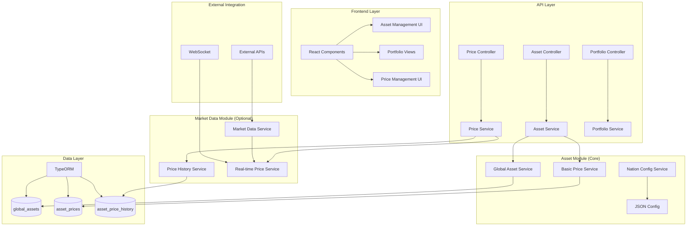
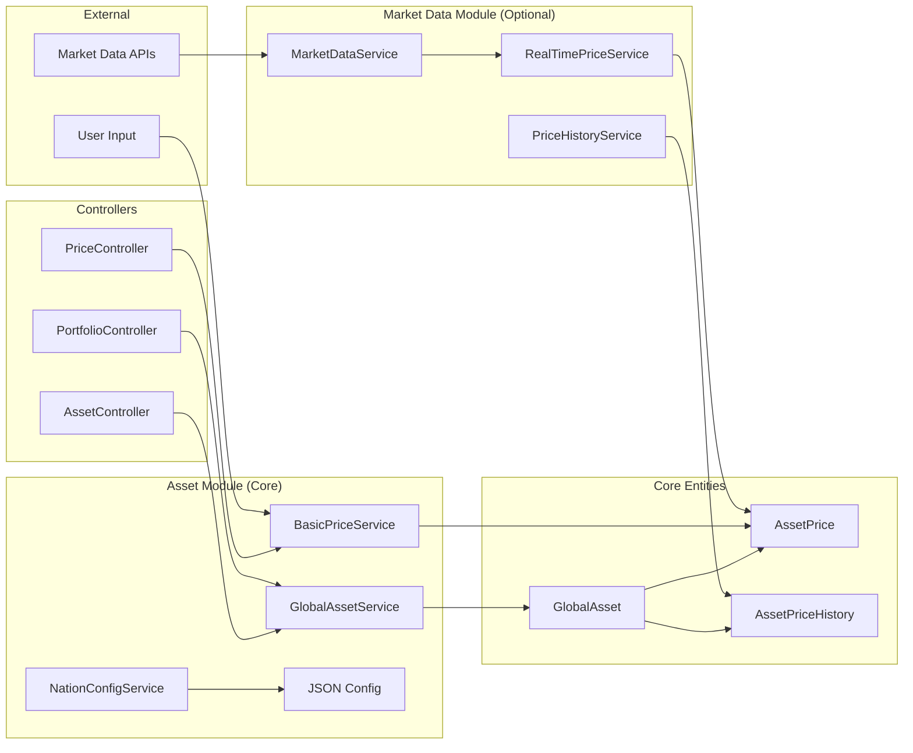
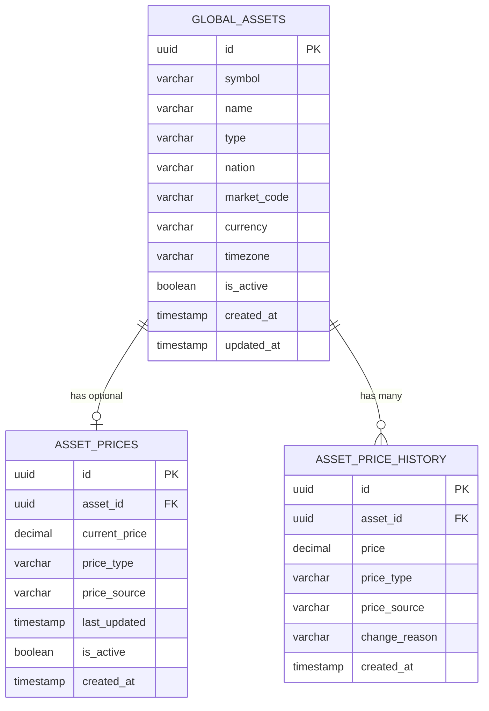

# CR-005: Global Assets System - Technical Design Document

## Document Information
- **Change Request ID**: CR-005
- **Document Type**: Technical Design Document (TDD)
- **Version**: 1.0
- **Created Date**: September 17, 2025
- **Author**: AI Assistant
- **Status**: Draft
- **Based on**: CR-005 PRD v1.0

## Executive Summary

### Overview
This TDD provides detailed technical specifications for implementing a Global Assets System that supports multi-national asset management with separated pricing data storage. The system will replace the current single-nation asset management with a global approach supporting different markets, currencies, and pricing sources.

### Technology Stack
- **Backend**: NestJS + TypeORM + PostgreSQL
- **Frontend**: React.js + TypeScript + Material-UI
- **Database**: PostgreSQL with proper indexing and constraints
- **Configuration**: JSON files for nation configuration
- **Migration**: TypeORM migrations for data transformation

### Key Technical Decisions
1. **Separate Tables**: `global_assets`, `asset_prices`, `asset_price_history`
2. **Optional Pricing**: Assets can exist without price data initially
3. **JSON Configuration**: Nation config stored in JSON file
4. **Backward Compatibility**: All existing APIs continue to work
5. **Audit Trail**: Complete price change tracking

## System Architecture

### Module Structure

The Global Assets System is designed with clear module separation to ensure system resilience and maintainability:

#### Asset Module (Core - Required)
**Location**: `src/modules/asset/`
**Responsibility**: Core asset management functionality
**Dependencies**: Database only, no external services

```typescript
src/modules/asset/
├── entities/
│   ├── global-asset.entity.ts          // Core asset metadata
│   └── asset-price.entity.ts           // Basic price data
├── services/
│   ├── global-asset.service.ts         // Asset CRUD operations
│   ├── basic-price.service.ts          // Simple price get/set
│   └── nation-config.service.ts        // Nation configuration
├── controllers/
│   └── global-asset.controller.ts      // Asset management APIs
├── dto/
│   └── global-asset.dto.ts             // Asset DTOs
└── config/
    └── nation-config.json              // Nation configuration
```

#### Market Data Module (Optional - Enhancement)
**Location**: `src/modules/market-data/`
**Responsibility**: Advanced price management and external integration
**Dependencies**: External APIs, WebSocket connections

```typescript
src/modules/market-data/
├── entities/
│   └── asset-price-history.entity.ts   // Price history tracking
├── services/
│   ├── price-history.service.ts        // Historical data management
│   ├── real-time-price.service.ts      // Live price updates
│   └── market-data.service.ts          // External API integration
├── controllers/
│   └── price.controller.ts             // Advanced price APIs
└── dto/
    └── price.dto.ts                    // Price DTOs
```

### System Resilience Design

#### Core Functionality (Always Available)
The Asset Module provides core functionality that works independently:

- ✅ **Asset Creation**: Create, read, update, delete assets
- ✅ **Asset Listing**: Search, filter, paginate assets
- ✅ **Basic Price Management**: Set/get current prices manually
- ✅ **Portfolio Integration**: Portfolio calculations with available prices
- ✅ **Trading Operations**: Trade execution with current prices

#### Enhanced Functionality (Optional)
The Market Data Module provides enhancements that can be unavailable:

- ❌ **Real-time Price Updates**: External market data feeds
- ❌ **Price History Tracking**: Historical price analysis
- ❌ **Market Data Integration**: External API connections
- ❌ **WebSocket Streaming**: Live price updates

#### Fallback Strategy
```typescript
// Service with fallback mechanism
export class AssetPriceService {
    constructor(
        private basicPriceService: BasicPriceService,
        private marketDataService?: MarketDataService,
    ) {}

    async getCurrentPrice(assetId: string): Promise<number | null> {
        try {
            // Try Market Data Service first (if available)
            if (this.marketDataService) {
                return await this.marketDataService.getCurrentPrice(assetId);
            }
        } catch (error) {
            console.warn('Market Data Service unavailable, using fallback');
        }
        
        // Fallback to basic price service (always available)
        return await this.basicPriceService.getCurrentPrice(assetId);
    }
}
```

### High-Level Architecture



### Component Relationships



## Database Design

### Entity Relationship Diagram



### Database Schema

#### 1. Global Assets Table

```sql
CREATE TABLE global_assets (
    id UUID PRIMARY KEY DEFAULT gen_random_uuid(),
    symbol VARCHAR(50) NOT NULL,
    name VARCHAR(255) NOT NULL,
    type VARCHAR(50) NOT NULL,
    nation VARCHAR(10) NOT NULL,
    market_code VARCHAR(20) NOT NULL,
    currency VARCHAR(10) NOT NULL,
    timezone VARCHAR(50) NOT NULL,
    is_active BOOLEAN DEFAULT true,
    created_at TIMESTAMP DEFAULT NOW(),
    updated_at TIMESTAMP DEFAULT NOW(),
    
    -- Constraints
    UNIQUE(symbol, nation),
    CHECK (type IN ('STOCK', 'BOND', 'GOLD', 'DEPOSIT', 'CASH')),
    CHECK (nation IN ('VN', 'US', 'UK', 'JP', 'SG')),
    CHECK (price_type IN ('MANUAL', 'MARKET', 'CALCULATED'))
);

-- Indexes
CREATE INDEX idx_global_assets_symbol_nation ON global_assets(symbol, nation);
CREATE INDEX idx_global_assets_nation ON global_assets(nation);
CREATE INDEX idx_global_assets_type ON global_assets(type);
CREATE INDEX idx_global_assets_active ON global_assets(is_active);
```

#### 2. Asset Prices Table

```sql
CREATE TABLE asset_prices (
    id UUID PRIMARY KEY DEFAULT gen_random_uuid(),
    asset_id UUID NOT NULL,
    current_price DECIMAL(15,4),
    price_type VARCHAR(20) DEFAULT 'MANUAL',
    price_source VARCHAR(20) DEFAULT 'USER_INPUT',
    last_updated TIMESTAMP DEFAULT NOW(),
    is_active BOOLEAN DEFAULT true,
    created_at TIMESTAMP DEFAULT NOW(),
    
    -- Foreign Key
    FOREIGN KEY (asset_id) REFERENCES global_assets(id) ON DELETE CASCADE,
    
    -- Constraints
    UNIQUE(asset_id), -- One price record per asset
    CHECK (price_type IN ('MANUAL', 'MARKET', 'CALCULATED')),
    CHECK (price_source IN ('USER_INPUT', 'MARKET_DATA', 'API', 'CALCULATION'))
);

-- Indexes
CREATE INDEX idx_asset_prices_asset_id ON asset_prices(asset_id);
CREATE INDEX idx_asset_prices_active ON asset_prices(is_active);
CREATE INDEX idx_asset_prices_last_updated ON asset_prices(last_updated);
```

#### 3. Asset Price History Table

```sql
CREATE TABLE asset_price_history (
    id UUID PRIMARY KEY DEFAULT gen_random_uuid(),
    asset_id UUID NOT NULL,
    price DECIMAL(15,4) NOT NULL,
    price_type VARCHAR(20) NOT NULL,
    price_source VARCHAR(20) NOT NULL,
    change_reason VARCHAR(255),
    created_at TIMESTAMP DEFAULT NOW(),
    
    -- Foreign Key
    FOREIGN KEY (asset_id) REFERENCES global_assets(id) ON DELETE CASCADE,
    
    -- Constraints
    CHECK (price > 0),
    CHECK (price_type IN ('MANUAL', 'MARKET', 'CALCULATED')),
    CHECK (price_source IN ('USER_INPUT', 'MARKET_DATA', 'API', 'CALCULATION'))
);

-- Indexes
CREATE INDEX idx_asset_price_history_asset_id ON asset_price_history(asset_id);
CREATE INDEX idx_asset_price_history_created_at ON asset_price_history(created_at);
CREATE INDEX idx_asset_price_history_asset_created ON asset_price_history(asset_id, created_at);
```

### Data Migration Strategy

#### Migration Script Structure

```typescript
// src/migrations/YYYYMMDDHHMMSS-CreateGlobalAssetsSystem.ts
export class CreateGlobalAssetsSystem1234567890123 implements MigrationInterface {
    public async up(queryRunner: QueryRunner): Promise<void> {
        // 1. Create new tables
        await this.createGlobalAssetsTable(queryRunner);
        await this.createAssetPricesTable(queryRunner);
        await this.createAssetPriceHistoryTable(queryRunner);
        
        // 2. Migrate existing data
        await this.migrateExistingAssets(queryRunner);
        
        // 3. Create indexes
        await this.createIndexes(queryRunner);
    }
    
    public async down(queryRunner: QueryRunner): Promise<void> {
        // Reversible migration
        await queryRunner.dropTable('asset_price_history');
        await queryRunner.dropTable('asset_prices');
        await queryRunner.dropTable('global_assets');
    }
}
```

#### Data Transformation Logic

```typescript
// Migration logic for existing assets
private async migrateExistingAssets(queryRunner: QueryRunner): Promise<void> {
    // 1. Migrate assets table to global_assets
    await queryRunner.query(`
        INSERT INTO global_assets (id, symbol, name, type, nation, market_code, currency, timezone, is_active, created_at, updated_at)
        SELECT 
            id,
            symbol,
            name,
            type,
            'VN' as nation,  -- Default to Vietnam
            'HOSE' as market_code,  -- Default market
            'VND' as currency,  -- Default currency
            'Asia/Ho_Chi_Minh' as timezone,  -- Default timezone
            is_active,
            created_at,
            updated_at
        FROM assets
    `);
    
    // 2. Migrate price data to asset_prices (if exists)
    await queryRunner.query(`
        INSERT INTO asset_prices (asset_id, current_price, price_type, price_source, last_updated, is_active, created_at)
        SELECT 
            id as asset_id,
            current_price,
            'MANUAL' as price_type,
            'USER_INPUT' as price_source,
            updated_at as last_updated,
            true as is_active,
            NOW() as created_at
        FROM assets
        WHERE current_price IS NOT NULL AND current_price > 0
    `);
}
```

## API Design

### REST API Endpoints

#### Asset Module APIs (Core - Always Available)

##### 1. Global Assets Management

```typescript
// GET /api/v1/global-assets
interface GetGlobalAssetsRequest {
    page?: number;
    limit?: number;
    nation?: string;
    type?: string;
    search?: string;
    includePrices?: boolean;
}

interface GetGlobalAssetsResponse {
    data: GlobalAssetWithPrice[];
    pagination: PaginationInfo;
}

// POST /api/v1/global-assets
interface CreateGlobalAssetRequest {
    symbol: string;
    name: string;
    type: AssetType;
    nation: string;
    marketCode?: string;
    currency?: string;
    timezone?: string;
}

interface CreateGlobalAssetResponse {
    data: GlobalAsset;
    message: string;
}

// GET /api/v1/global-assets/:id
interface GetGlobalAssetResponse {
    data: GlobalAssetWithPrice;
}

// PUT /api/v1/global-assets/:id
interface UpdateGlobalAssetRequest {
    name?: string;
    type?: AssetType;
    marketCode?: string;
    currency?: string;
    timezone?: string;
    isActive?: boolean;
}

// DELETE /api/v1/global-assets/:id
interface DeleteGlobalAssetResponse {
    message: string;
    deletedTradesCount: number;
}
```

##### 2. Basic Asset Pricing Management

```typescript
// GET /api/v1/global-assets/:id/price
interface GetAssetPriceResponse {
    data: AssetPrice | null;
}

// POST /api/v1/global-assets/:id/price
interface SetAssetPriceRequest {
    currentPrice: number;
    priceType: PriceType;
    priceSource: PriceSource;
    changeReason?: string;
}

interface SetAssetPriceResponse {
    data: AssetPrice;
    message: string;
}

// PUT /api/v1/global-assets/:id/price
interface UpdateAssetPriceRequest {
    currentPrice?: number;
    priceType?: PriceType;
    priceSource?: PriceSource;
    changeReason?: string;
}

// DELETE /api/v1/global-assets/:id/price
interface DeleteAssetPriceResponse {
    message: string;
}

// GET /api/v1/global-assets/:id/price-history
interface GetPriceHistoryRequest {
    page?: number;
    limit?: number;
    fromDate?: string;
    toDate?: string;
}

interface GetPriceHistoryResponse {
    data: AssetPriceHistory[];
    pagination: PaginationInfo;
}
```

#### 3. Nation Configuration

```typescript
// GET /api/v1/nations
interface GetNationsResponse {
    data: NationConfig[];
}

// GET /api/v1/nations/:code
interface GetNationResponse {
    data: NationConfig;
}
```

#### Market Data Module APIs (Optional - Enhancement)

##### 4. Advanced Price Management

```typescript
// GET /api/v1/global-assets/:id/price-history
interface GetPriceHistoryRequest {
    page?: number;
    limit?: number;
    fromDate?: string;
    toDate?: string;
}

interface GetPriceHistoryResponse {
    data: AssetPriceHistory[];
    pagination: PaginationInfo;
}

// POST /api/v1/market-data/update-prices
interface UpdatePricesRequest {
    assetIds?: string[];
    forceUpdate?: boolean;
}

interface UpdatePricesResponse {
    message: string;
    updatedCount: number;
    failedCount: number;
}

// GET /api/v1/market-data/status
interface MarketDataStatusResponse {
    isAvailable: boolean;
    lastUpdate: string;
    supportedAssets: number;
    errorMessage?: string;
}
```

### Data Transfer Objects (DTOs)

#### 1. Global Asset DTOs

```typescript
// src/modules/asset/dto/global-asset.dto.ts
export class CreateGlobalAssetDto {
    @IsString()
    @IsNotEmpty()
    @Length(1, 50)
    symbol: string;

    @IsString()
    @IsNotEmpty()
    @Length(1, 255)
    name: string;

    @IsEnum(AssetType)
    type: AssetType;

    @IsString()
    @IsNotEmpty()
    @Length(2, 10)
    nation: string;

    @IsString()
    @IsOptional()
    @Length(1, 20)
    marketCode?: string;

    @IsString()
    @IsOptional()
    @Length(3, 10)
    currency?: string;

    @IsString()
    @IsOptional()
    @Length(1, 50)
    timezone?: string;
}

export class UpdateGlobalAssetDto extends PartialType(CreateGlobalAssetDto) {
    @IsBoolean()
    @IsOptional()
    isActive?: boolean;
}

export class GlobalAssetResponseDto {
    id: string;
    symbol: string;
    name: string;
    type: AssetType;
    nation: string;
    marketCode: string;
    currency: string;
    timezone: string;
    isActive: boolean;
    createdAt: Date;
    updatedAt: Date;
}

export class GlobalAssetWithPriceDto extends GlobalAssetResponseDto {
    currentPrice?: number;
    priceType?: PriceType;
    priceSource?: PriceSource;
    lastPriceUpdate?: Date;
}
```

#### 2. Asset Price DTOs

```typescript
// src/modules/asset/dto/asset-price.dto.ts
export class SetAssetPriceDto {
    @IsNumber()
    @IsPositive()
    @Max(999999999.9999)
    currentPrice: number;

    @IsEnum(PriceType)
    priceType: PriceType;

    @IsEnum(PriceSource)
    priceSource: PriceSource;

    @IsString()
    @IsOptional()
    @Length(1, 255)
    changeReason?: string;
}

export class UpdateAssetPriceDto extends PartialType(SetAssetPriceDto) {}

export class AssetPriceResponseDto {
    id: string;
    assetId: string;
    currentPrice: number;
    priceType: PriceType;
    priceSource: PriceSource;
    lastUpdated: Date;
    isActive: boolean;
    createdAt: Date;
}

export class AssetPriceHistoryDto {
    id: string;
    assetId: string;
    price: number;
    priceType: PriceType;
    priceSource: PriceSource;
    changeReason?: string;
    createdAt: Date;
}
```

#### 3. Nation Configuration DTOs

```typescript
// src/modules/asset/dto/nation-config.dto.ts
export class NationConfigDto {
    code: string;
    name: string;
    currency: string;
    timezone: string;
    defaultMarketCode: string;
    markets: string[];
}

export class MarketDto {
    code: string;
    name: string;
    isActive: boolean;
}
```

## Service Layer Design

### Asset Module Services

#### 1. Global Asset Service

```typescript
// src/modules/asset/services/global-asset.service.ts
@Injectable()
export class GlobalAssetService {
    constructor(
        @InjectRepository(GlobalAsset)
        private globalAssetRepository: Repository<GlobalAsset>,
        private nationConfigService: NationConfigService,
    ) {}

    async createAsset(createDto: CreateGlobalAssetDto): Promise<GlobalAsset> {
        // 1. Validate symbol uniqueness per nation
        await this.validateSymbolUniqueness(createDto.symbol, createDto.nation);
        
        // 2. Apply nation defaults
        const nationConfig = await this.nationConfigService.getNationConfig(createDto.nation);
        const assetData = this.applyNationDefaults(createDto, nationConfig);
        
        // 3. Create asset (NO price data initially)
        const asset = this.globalAssetRepository.create(assetData);
        return await this.globalAssetRepository.save(asset);
    }

    async getAssetsWithPrices(filters: GetGlobalAssetsRequest): Promise<GlobalAssetWithPrice[]> {
        const query = this.globalAssetRepository
            .createQueryBuilder('asset')
            .leftJoinAndSelect('asset.prices', 'price', 'price.isActive = :isActive', { isActive: true })
            .where('asset.isActive = :isActive', { isActive: true });

        // Apply filters
        if (filters.nation) {
            query.andWhere('asset.nation = :nation', { nation: filters.nation });
        }
        if (filters.type) {
            query.andWhere('asset.type = :type', { type: filters.type });
        }
        if (filters.search) {
            query.andWhere('(asset.symbol ILIKE :search OR asset.name ILIKE :search)', {
                search: `%${filters.search}%`
            });
        }

        // Pagination
        const [assets, total] = await query
            .skip((filters.page - 1) * filters.limit)
            .take(filters.limit)
            .getManyAndCount();

        return assets.map(asset => this.mapToAssetWithPrice(asset));
    }

    private async validateSymbolUniqueness(symbol: string, nation: string): Promise<void> {
        const existing = await this.globalAssetRepository.findOne({
            where: { symbol, nation, isActive: true }
        });
        
        if (existing) {
            throw new ConflictException(`Asset with symbol '${symbol}' already exists in nation '${nation}'`);
        }
    }

    private applyNationDefaults(dto: CreateGlobalAssetDto, config: NationConfig): any {
        return {
            ...dto,
            marketCode: dto.marketCode || config.defaultMarketCode,
            currency: dto.currency || config.currency,
            timezone: dto.timezone || config.timezone,
        };
    }
}
```

#### 2. Basic Price Service (Asset Module)

```typescript
// src/modules/asset/services/asset-price.service.ts
@Injectable()
export class AssetPriceService {
    constructor(
        @InjectRepository(AssetPrice)
        private assetPriceRepository: Repository<AssetPrice>,
        @InjectRepository(AssetPriceHistory)
        private priceHistoryRepository: Repository<AssetPriceHistory>,
        @InjectRepository(GlobalAsset)
        private globalAssetRepository: Repository<GlobalAsset>,
    ) {}

    async setAssetPrice(assetId: string, setDto: SetAssetPriceDto): Promise<AssetPrice> {
        // 1. Validate asset exists
        const asset = await this.globalAssetRepository.findOne({
            where: { id: assetId, isActive: true }
        });
        
        if (!asset) {
            throw new NotFoundException(`Asset with ID '${assetId}' not found`);
        }

        // 2. Get existing price for history
        const existingPrice = await this.assetPriceRepository.findOne({
            where: { assetId, isActive: true }
        });

        // 3. Create price history record if price exists
        if (existingPrice) {
            await this.createPriceHistory(assetId, existingPrice, setDto.changeReason);
        }

        // 4. Upsert price record
        const priceData = {
            assetId,
            currentPrice: setDto.currentPrice,
            priceType: setDto.priceType,
            priceSource: setDto.priceSource,
            lastUpdated: new Date(),
        };

        let price: AssetPrice;
        if (existingPrice) {
            await this.assetPriceRepository.update(existingPrice.id, priceData);
            price = { ...existingPrice, ...priceData };
        } else {
            price = this.assetPriceRepository.create(priceData);
            price = await this.assetPriceRepository.save(price);
        }

        return price;
    }

    async getAssetPrice(assetId: string): Promise<AssetPrice | null> {
        return await this.assetPriceRepository.findOne({
            where: { assetId, isActive: true }
        });
    }

    async deleteAssetPrice(assetId: string): Promise<void> {
        await this.assetPriceRepository.update(
            { assetId, isActive: true },
            { isActive: false }
        );
    }

    private async createPriceHistory(
        assetId: string, 
        existingPrice: AssetPrice, 
        changeReason?: string
    ): Promise<void> {
        const historyData = {
            assetId,
            price: existingPrice.currentPrice,
            priceType: existingPrice.priceType,
            priceSource: existingPrice.priceSource,
            changeReason: changeReason || 'Price updated',
        };

        const history = this.priceHistoryRepository.create(historyData);
        await this.priceHistoryRepository.save(history);
    }
}
```

#### 3. Nation Configuration Service (Asset Module)

```typescript
// src/modules/asset/services/nation-config.service.ts
@Injectable()
export class NationConfigService {
    private config: Record<string, NationConfig>;

    constructor() {
        this.loadConfiguration();
    }

    private loadConfiguration(): void {
        const configPath = join(__dirname, '../config/nation-config.json');
        this.config = JSON.parse(fs.readFileSync(configPath, 'utf8'));
    }

    async getNationConfig(nationCode: string): Promise<NationConfig> {
        const config = this.config[nationCode];
        if (!config) {
            throw new NotFoundException(`Nation configuration for '${nationCode}' not found`);
        }
        return config;
    }

    async getAllNations(): Promise<NationConfig[]> {
        return Object.values(this.config);
    }

    async getSupportedNations(): Promise<string[]> {
        return Object.keys(this.config);
    }
}
```

### Market Data Module Services

#### 4. Price History Service (Market Data Module)

```typescript
// src/modules/market-data/services/price-history.service.ts
@Injectable()
export class PriceHistoryService {
    constructor(
        @InjectRepository(AssetPriceHistory)
        private priceHistoryRepository: Repository<AssetPriceHistory>,
    ) {}

    async getPriceHistory(
        assetId: string, 
        filters: PriceHistoryFilters
    ): Promise<PaginatedResult<AssetPriceHistory>> {
        const query = this.priceHistoryRepository
            .createQueryBuilder('history')
            .where('history.assetId = :assetId', { assetId })
            .orderBy('history.createdAt', 'DESC');

        if (filters.fromDate) {
            query.andWhere('history.createdAt >= :fromDate', { fromDate: filters.fromDate });
        }
        if (filters.toDate) {
            query.andWhere('history.createdAt <= :toDate', { toDate: filters.toDate });
        }

        const [data, total] = await query
            .skip((filters.page - 1) * filters.limit)
            .take(filters.limit)
            .getManyAndCount();

        return { data, total, page: filters.page, limit: filters.limit };
    }

    async createPriceHistory(historyData: CreatePriceHistoryDto): Promise<AssetPriceHistory> {
        const history = this.priceHistoryRepository.create(historyData);
        return await this.priceHistoryRepository.save(history);
    }
}
```

#### 5. Real-time Price Service (Market Data Module)

```typescript
// src/modules/market-data/services/real-time-price.service.ts
@Injectable()
export class RealTimePriceService {
    constructor(
        private marketDataService: MarketDataService,
        private basicPriceService: BasicPriceService,
        private priceHistoryService: PriceHistoryService,
    ) {}

    async updatePricesFromMarketData(): Promise<void> {
        try {
            const marketData = await this.marketDataService.fetchLatestPrices();
            
            for (const priceData of marketData) {
                await this.updateAssetPrice(priceData);
            }
        } catch (error) {
            console.error('Failed to update prices from market data:', error);
            throw new ServiceUnavailableException('Market data service unavailable');
        }
    }

    private async updateAssetPrice(priceData: MarketPriceData): Promise<void> {
        // Update current price
        await this.basicPriceService.setAssetPrice(priceData.assetId, {
            currentPrice: priceData.price,
            priceType: 'MARKET',
            priceSource: 'MARKET_DATA',
        });

        // Create history record
        await this.priceHistoryService.createPriceHistory({
            assetId: priceData.assetId,
            price: priceData.price,
            priceType: 'MARKET',
            priceSource: 'MARKET_DATA',
            changeReason: 'Market data update',
        });
    }
}
```

#### 6. Market Data Service (Market Data Module)

```typescript
// src/modules/market-data/services/market-data.service.ts
@Injectable()
export class MarketDataService {
    constructor(
        private httpService: HttpService,
        private configService: ConfigService,
    ) {}

    async fetchLatestPrices(): Promise<MarketPriceData[]> {
        try {
            const apiKey = this.configService.get('MARKET_DATA_API_KEY');
            const response = await this.httpService.get('/api/prices', {
                headers: { 'Authorization': `Bearer ${apiKey}` }
            }).toPromise();

            return response.data.map(item => ({
                assetId: item.assetId,
                price: item.price,
                timestamp: item.timestamp,
            }));
        } catch (error) {
            console.error('Market data API error:', error);
            throw new ServiceUnavailableException('External market data service unavailable');
        }
    }

    async getPriceForAsset(assetId: string): Promise<number | null> {
        try {
            const prices = await this.fetchLatestPrices();
            const assetPrice = prices.find(p => p.assetId === assetId);
            return assetPrice?.price || null;
        } catch (error) {
            console.warn(`Failed to fetch price for asset ${assetId}:`, error);
            return null;
        }
    }
}
```

## Frontend Integration

### 1. Asset Management Components

```typescript
// frontend/src/components/GlobalAssetForm.tsx
interface GlobalAssetFormProps {
    onSubmit: (data: CreateGlobalAssetDto) => void;
    onCancel: () => void;
    initialData?: Partial<CreateGlobalAssetDto>;
}

export const GlobalAssetForm: React.FC<GlobalAssetFormProps> = ({
    onSubmit,
    onCancel,
    initialData
}) => {
    const [nations, setNations] = useState<NationConfig[]>([]);
    const [selectedNation, setSelectedNation] = useState<string>('');
    const [markets, setMarkets] = useState<string[]>([]);

    // Load nations on mount
    useEffect(() => {
        loadNations();
    }, []);

    // Update markets when nation changes
    useEffect(() => {
        if (selectedNation) {
            const nation = nations.find(n => n.code === selectedNation);
            setMarkets(nation?.markets || []);
        }
    }, [selectedNation, nations]);

    const handleSubmit = (data: CreateGlobalAssetDto) => {
        onSubmit(data);
    };

    return (
        <form onSubmit={handleSubmit}>
            <TextField
                name="symbol"
                label="Symbol"
                required
                fullWidth
            />
            <TextField
                name="name"
                label="Asset Name"
                required
                fullWidth
            />
            <Select
                name="type"
                label="Asset Type"
                required
                fullWidth
            >
                <MenuItem value="STOCK">Stock</MenuItem>
                <MenuItem value="BOND">Bond</MenuItem>
                <MenuItem value="GOLD">Gold</MenuItem>
                <MenuItem value="DEPOSIT">Deposit</MenuItem>
                <MenuItem value="CASH">Cash</MenuItem>
            </Select>
            <Select
                name="nation"
                label="Nation"
                required
                fullWidth
                value={selectedNation}
                onChange={(e) => setSelectedNation(e.target.value)}
            >
                {nations.map(nation => (
                    <MenuItem key={nation.code} value={nation.code}>
                        {nation.name} ({nation.code})
                    </MenuItem>
                ))}
            </Select>
            <Select
                name="marketCode"
                label="Market"
                fullWidth
            >
                {markets.map(market => (
                    <MenuItem key={market} value={market}>
                        {market}
                    </MenuItem>
                ))}
            </Select>
        </form>
    );
};
```

### 2. Asset List with Price Information

```typescript
// frontend/src/components/GlobalAssetList.tsx
export const GlobalAssetList: React.FC = () => {
    const [assets, setAssets] = useState<GlobalAssetWithPrice[]>([]);
    const [loading, setLoading] = useState(true);

    useEffect(() => {
        loadAssets();
    }, []);

    const loadAssets = async () => {
        try {
            const response = await assetApi.getGlobalAssets({ includePrices: true });
            setAssets(response.data);
        } catch (error) {
            console.error('Failed to load assets:', error);
        } finally {
            setLoading(false);
        }
    };

    const handleSetPrice = async (assetId: string, price: number) => {
        try {
            await assetApi.setAssetPrice(assetId, {
                currentPrice: price,
                priceType: 'MANUAL',
                priceSource: 'USER_INPUT'
            });
            loadAssets(); // Refresh list
        } catch (error) {
            console.error('Failed to set price:', error);
        }
    };

    if (loading) return <CircularProgress />;

    return (
        <Table>
            <TableHead>
                <TableRow>
                    <TableCell>Symbol</TableCell>
                    <TableCell>Name</TableCell>
                    <TableCell>Nation</TableCell>
                    <TableCell>Type</TableCell>
                    <TableCell>Current Price</TableCell>
                    <TableCell>Price Source</TableCell>
                    <TableCell>Last Updated</TableCell>
                    <TableCell>Actions</TableCell>
                </TableRow>
            </TableHead>
            <TableBody>
                {assets.map(asset => (
                    <TableRow key={asset.id}>
                        <TableCell>{asset.symbol}</TableCell>
                        <TableCell>{asset.name}</TableCell>
                        <TableCell>
                            <Chip 
                                label={asset.nation} 
                                size="small" 
                                color="primary" 
                            />
                        </TableCell>
                        <TableCell>{asset.type}</TableCell>
                        <TableCell>
                            {asset.currentPrice ? (
                                <Typography variant="body2" color="primary">
                                    {asset.currentPrice.toLocaleString()} {asset.currency}
                                </Typography>
                            ) : (
                                <Typography variant="body2" color="textSecondary">
                                    No price set
                                </Typography>
                            )}
                        </TableCell>
                        <TableCell>
                            {asset.priceSource && (
                                <Chip 
                                    label={asset.priceSource} 
                                    size="small" 
                                    variant="outlined" 
                                />
                            )}
                        </TableCell>
                        <TableCell>
                            {asset.lastPriceUpdate && (
                                <Typography variant="caption">
                                    {formatDistanceToNow(new Date(asset.lastPriceUpdate))} ago
                                </Typography>
                            )}
                        </TableCell>
                        <TableCell>
                            <Button
                                size="small"
                                onClick={() => handleSetPrice(asset.id, 0)}
                            >
                                Set Price
                            </Button>
                        </TableCell>
                    </TableRow>
                ))}
            </TableBody>
        </Table>
    );
};
```

## Migration Strategy

### 1. Data Migration Plan

```typescript
// Migration execution plan
export class GlobalAssetsMigrationPlan {
    async execute(): Promise<void> {
        console.log('Starting Global Assets System Migration...');
        
        // Phase 1: Backup existing data
        await this.backupExistingData();
        
        // Phase 2: Create new tables
        await this.createNewTables();
        
        // Phase 3: Migrate asset data
        await this.migrateAssetData();
        
        // Phase 4: Migrate price data
        await this.migratePriceData();
        
        // Phase 5: Verify data integrity
        await this.verifyDataIntegrity();
        
        console.log('Migration completed successfully!');
    }

    private async backupExistingData(): Promise<void> {
        // Create backup of existing assets table
        await this.queryRunner.query(`
            CREATE TABLE assets_backup AS 
            SELECT * FROM assets
        `);
    }

    private async migrateAssetData(): Promise<void> {
        // Migrate assets to global_assets with Vietnam defaults
        await this.queryRunner.query(`
            INSERT INTO global_assets (id, symbol, name, type, nation, market_code, currency, timezone, is_active, created_at, updated_at)
            SELECT 
                id,
                symbol,
                name,
                type,
                'VN' as nation,
                'HOSE' as market_code,
                'VND' as currency,
                'Asia/Ho_Chi_Minh' as timezone,
                is_active,
                created_at,
                updated_at
            FROM assets
        `);
    }

    private async migratePriceData(): Promise<void> {
        // Migrate existing price data to asset_prices
        await this.queryRunner.query(`
            INSERT INTO asset_prices (asset_id, current_price, price_type, price_source, last_updated, is_active, created_at)
            SELECT 
                id as asset_id,
                current_price,
                'MANUAL' as price_type,
                'USER_INPUT' as price_source,
                updated_at as last_updated,
                true as is_active,
                NOW() as created_at
            FROM assets
            WHERE current_price IS NOT NULL AND current_price > 0
        `);
    }
}
```

### 2. Rollback Strategy

```typescript
export class GlobalAssetsRollbackPlan {
    async execute(): Promise<void> {
        console.log('Starting Global Assets System Rollback...');
        
        // Phase 1: Restore from backup
        await this.restoreFromBackup();
        
        // Phase 2: Drop new tables
        await this.dropNewTables();
        
        // Phase 3: Verify restoration
        await this.verifyRestoration();
        
        console.log('Rollback completed successfully!');
    }

    private async restoreFromBackup(): Promise<void> {
        // Restore assets table from backup
        await this.queryRunner.query(`
            DROP TABLE IF EXISTS assets;
            ALTER TABLE assets_backup RENAME TO assets;
        `);
    }
}
```

## Testing Strategy

### 1. Unit Tests

```typescript
// src/modules/asset/services/global-asset.service.spec.ts
describe('GlobalAssetService', () => {
    let service: GlobalAssetService;
    let repository: Repository<GlobalAsset>;

    beforeEach(async () => {
        const module = await Test.createTestingModule({
            providers: [
                GlobalAssetService,
                {
                    provide: getRepositoryToken(GlobalAsset),
                    useClass: Repository,
                },
                NationConfigService,
            ],
        }).compile();

        service = module.get<GlobalAssetService>(GlobalAssetService);
        repository = module.get<Repository<GlobalAsset>>(getRepositoryToken(GlobalAsset));
    });

    describe('createAsset', () => {
        it('should create asset without price data', async () => {
            const createDto: CreateGlobalAssetDto = {
                symbol: 'HPG',
                name: 'Hoa Phat Group',
                type: AssetType.STOCK,
                nation: 'VN',
            };

            const mockAsset = { id: '1', ...createDto };
            jest.spyOn(repository, 'create').mockReturnValue(mockAsset as any);
            jest.spyOn(repository, 'save').mockResolvedValue(mockAsset as any);

            const result = await service.createAsset(createDto);

            expect(result).toEqual(mockAsset);
            expect(repository.create).toHaveBeenCalledWith(expect.objectContaining(createDto));
        });

        it('should throw error for duplicate symbol in same nation', async () => {
            const createDto: CreateGlobalAssetDto = {
                symbol: 'HPG',
                name: 'Hoa Phat Group',
                type: AssetType.STOCK,
                nation: 'VN',
            };

            jest.spyOn(repository, 'findOne').mockResolvedValue({ id: '1' } as any);

            await expect(service.createAsset(createDto)).rejects.toThrow(ConflictException);
        });
    });
});
```

### 2. Integration Tests

```typescript
// test/global-assets.integration.e2e-spec.ts
describe('Global Assets API (e2e)', () => {
    let app: INestApplication;
    let globalAssetRepository: Repository<GlobalAsset>;

    beforeAll(async () => {
        const moduleFixture = await Test.createTestingModule({
            imports: [AppModule],
        }).compile();

        app = moduleFixture.createNestApplication();
        await app.init();

        globalAssetRepository = moduleFixture.get<Repository<GlobalAsset>>(
            getRepositoryToken(GlobalAsset)
        );
    });

    describe('/api/v1/global-assets (POST)', () => {
        it('should create global asset without price data', () => {
            const createDto = {
                symbol: 'HPG',
                name: 'Hoa Phat Group',
                type: 'STOCK',
                nation: 'VN',
            };

            return request(app.getHttpServer())
                .post('/api/v1/global-assets')
                .send(createDto)
                .expect(201)
                .expect((res) => {
                    expect(res.body.data).toMatchObject(createDto);
                    expect(res.body.data.currentPrice).toBeUndefined();
                });
        });
    });

    describe('/api/v1/global-assets/:id/price (POST)', () => {
        it('should set asset price after creation', async () => {
            // First create asset
            const asset = await globalAssetRepository.save({
                symbol: 'HPG',
                name: 'Hoa Phat Group',
                type: AssetType.STOCK,
                nation: 'VN',
                marketCode: 'HOSE',
                currency: 'VND',
                timezone: 'Asia/Ho_Chi_Minh',
            });

            const setPriceDto = {
                currentPrice: 25000,
                priceType: 'MANUAL',
                priceSource: 'USER_INPUT',
            };

            return request(app.getHttpServer())
                .post(`/api/v1/global-assets/${asset.id}/price`)
                .send(setPriceDto)
                .expect(201)
                .expect((res) => {
                    expect(res.body.data.currentPrice).toBe(25000);
                });
        });
    });
});
```

## Performance Considerations

### 1. Database Optimization

```sql
-- Optimized queries for asset listing
CREATE INDEX CONCURRENTLY idx_global_assets_listing 
ON global_assets (is_active, nation, type, created_at);

-- Optimized query for asset with price
CREATE INDEX CONCURRENTLY idx_asset_prices_lookup 
ON asset_prices (asset_id, is_active, last_updated);

-- Optimized query for price history
CREATE INDEX CONCURRENTLY idx_price_history_timeline 
ON asset_price_history (asset_id, created_at DESC);
```

### 2. Caching Strategy

```typescript
// src/modules/asset/services/global-asset-cache.service.ts
@Injectable()
export class GlobalAssetCacheService {
    constructor(
        @Inject(CACHE_MANAGER) private cacheManager: Cache,
    ) {}

    async getCachedAsset(assetId: string): Promise<GlobalAssetWithPrice | null> {
        const cacheKey = `asset:${assetId}`;
        return await this.cacheManager.get(cacheKey);
    }

    async setCachedAsset(assetId: string, asset: GlobalAssetWithPrice): Promise<void> {
        const cacheKey = `asset:${assetId}`;
        await this.cacheManager.set(cacheKey, asset, { ttl: 300 }); // 5 minutes
    }

    async invalidateAssetCache(assetId: string): Promise<void> {
        const cacheKey = `asset:${assetId}`;
        await this.cacheManager.del(cacheKey);
    }
}
```

## Security Considerations

### 1. Input Validation

```typescript
// Enhanced validation for asset creation
export class CreateGlobalAssetDto {
    @IsString()
    @IsNotEmpty()
    @Length(1, 50)
    @Matches(/^[A-Z0-9]+$/, { message: 'Symbol must contain only uppercase letters and numbers' })
    symbol: string;

    @IsString()
    @IsNotEmpty()
    @Length(1, 255)
    @Transform(({ value }) => value?.trim())
    name: string;

    @IsEnum(AssetType)
    type: AssetType;

    @IsString()
    @IsNotEmpty()
    @Length(2, 10)
    @IsIn(['VN', 'US', 'UK', 'JP', 'SG'], { message: 'Nation not supported' })
    nation: string;
}
```

### 2. Data Access Control

```typescript
// src/modules/asset/guards/asset-ownership.guard.ts
@Injectable()
export class AssetOwnershipGuard implements CanActivate {
    constructor(private globalAssetService: GlobalAssetService) {}

    async canActivate(context: ExecutionContext): Promise<boolean> {
        const request = context.switchToHttp().getRequest();
        const assetId = request.params.id;
        const userId = request.user.id;

        // Check if user owns the asset (through trades)
        const hasAccess = await this.globalAssetService.userHasAccess(assetId, userId);
        
        if (!hasAccess) {
            throw new ForbiddenException('Access denied to this asset');
        }

        return true;
    }
}
```

## Monitoring and Logging

### 1. Business Event Logging

```typescript
// src/modules/asset/services/asset-event-logger.service.ts
@Injectable()
export class AssetEventLoggerService {
    constructor(private loggingService: LoggingService) {}

    async logAssetCreated(asset: GlobalAsset, userId: string): Promise<void> {
        await this.loggingService.logBusinessEvent({
            eventType: 'ASSET_CREATED',
            entityType: 'GLOBAL_ASSET',
            entityId: asset.id,
            userId,
            metadata: {
                symbol: asset.symbol,
                nation: asset.nation,
                type: asset.type,
            },
        });
    }

    async logPriceUpdated(assetId: string, oldPrice: number, newPrice: number, userId: string): Promise<void> {
        await this.loggingService.logBusinessEvent({
            eventType: 'PRICE_UPDATED',
            entityType: 'ASSET_PRICE',
            entityId: assetId,
            userId,
            metadata: {
                oldPrice,
                newPrice,
                priceChange: newPrice - oldPrice,
                priceChangePercent: ((newPrice - oldPrice) / oldPrice) * 100,
            },
        });
    }
}
```

## Module Dependencies and Error Handling

### Dependency Management

#### Asset Module Dependencies
```typescript
// Asset Module - Minimal dependencies
@Module({
    imports: [
        TypeOrmModule.forFeature([GlobalAsset, AssetPrice]),
        ConfigModule,
    ],
    providers: [
        GlobalAssetService,
        BasicPriceService,
        NationConfigService,
    ],
    controllers: [GlobalAssetController],
    exports: [GlobalAssetService, BasicPriceService],
})
export class AssetModule {}
```

#### Market Data Module Dependencies
```typescript
// Market Data Module - Optional dependencies
@Module({
    imports: [
        TypeOrmModule.forFeature([AssetPriceHistory]),
        HttpModule,
        ConfigModule,
        AssetModule, // Import Asset Module for basic price operations
    ],
    providers: [
        PriceHistoryService,
        RealTimePriceService,
        MarketDataService,
    ],
    controllers: [PriceController],
    exports: [PriceHistoryService, RealTimePriceService],
})
export class MarketDataModule {}
```

### Error Handling Strategy

#### Graceful Degradation
```typescript
// Service with graceful degradation
@Injectable()
export class AssetPriceService {
    constructor(
        private basicPriceService: BasicPriceService,
        private marketDataService?: MarketDataService,
    ) {}

    async getCurrentPrice(assetId: string): Promise<number | null> {
        try {
            // Try Market Data Service first (if available)
            if (this.marketDataService) {
                return await this.marketDataService.getCurrentPrice(assetId);
            }
        } catch (error) {
            console.warn('Market Data Service unavailable, using fallback');
        }
        
        // Fallback to basic price service (always available)
        return await this.basicPriceService.getCurrentPrice(assetId);
    }
}
```

#### Health Check Endpoints
```typescript
// Health check for system status
@Controller('health')
export class HealthController {
    constructor(
        private assetService: GlobalAssetService,
        private marketDataService?: MarketDataService,
    ) {}

    @Get('assets')
    async checkAssetModule(): Promise<HealthStatus> {
        try {
            await this.assetService.getAssetsCount();
            return { status: 'healthy', module: 'assets' };
        } catch (error) {
            return { status: 'unhealthy', module: 'assets', error: error.message };
        }
    }

    @Get('market-data')
    async checkMarketDataModule(): Promise<HealthStatus> {
        if (!this.marketDataService) {
            return { status: 'not_configured', module: 'market-data' };
        }

        try {
            await this.marketDataService.getStatus();
            return { status: 'healthy', module: 'market-data' };
        } catch (error) {
            return { status: 'unhealthy', module: 'market-data', error: error.message };
        }
    }
}
```

### System Resilience Testing

#### Test Scenarios
```typescript
describe('System Resilience', () => {
    describe('Market Data Service Down', () => {
        it('should continue operating with basic functionality', async () => {
            // Mock Market Data Service as unavailable
            const marketDataService = {
                getCurrentPrice: jest.fn().mockRejectedValue(new Error('Service unavailable'))
            };

            const assetPriceService = new AssetPriceService(
                basicPriceService,
                marketDataService
            );

            // Should fallback to basic service
            const price = await assetPriceService.getCurrentPrice('asset-1');
            expect(price).toBeDefined();
            expect(basicPriceService.getCurrentPrice).toHaveBeenCalled();
        });
    });

    describe('Database Connection Issues', () => {
        it('should handle database errors gracefully', async () => {
            // Mock database error
            jest.spyOn(globalAssetRepository, 'findOne')
                .mockRejectedValue(new Error('Database connection failed'));

            await expect(assetService.getAsset('asset-1'))
                .rejects.toThrow('Database connection failed');
        });
    });
});
```

## Conclusion

This Technical Design Document provides comprehensive specifications for implementing the Global Assets System. The design emphasizes:

1. **Clean Architecture**: Separation of concerns between metadata and pricing
2. **Flexibility**: Optional pricing data with graceful handling
3. **Scalability**: Support for multiple nations and future market data integration
4. **Performance**: Optimized database design and caching strategy
5. **Maintainability**: Clear service boundaries and comprehensive testing
6. **Security**: Input validation and access control
7. **Monitoring**: Business event logging and audit trails

The implementation will be done in phases to ensure minimal disruption while providing a solid foundation for future enhancements.
