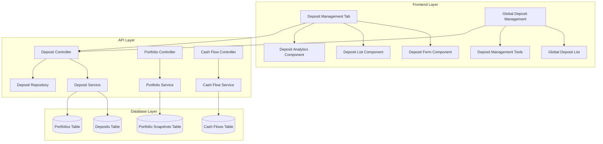
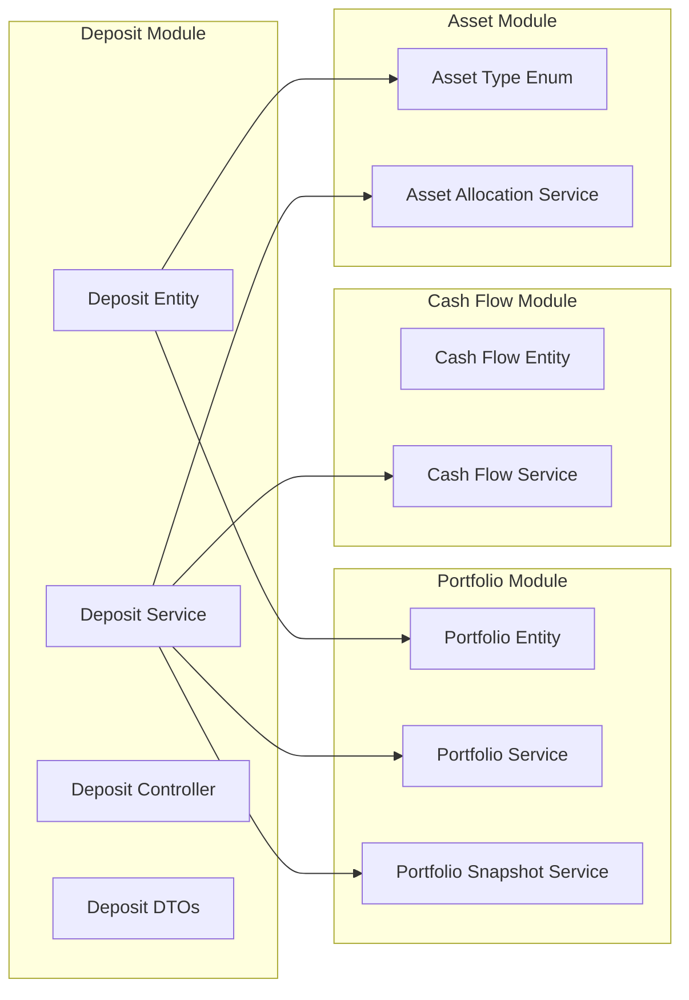

# CR-007: Deposit Management System - Technical Design Document

## 1. Overview

### 1.1 Purpose
This document provides the technical design for implementing the Deposit Management System within the existing Portfolio Management System. The design follows the established architecture patterns and integrates seamlessly with existing modules.

### 1.2 Scope
- Database schema design for deposit management
- API design for deposit operations
- Frontend component architecture
- Integration with existing portfolio and cash flow systems
- Performance and security considerations

### 1.3 Technology Stack
- **Backend:** NestJS with TypeORM
- **Database:** PostgreSQL
- **Frontend:** React.js with TypeScript
- **UI Framework:** Material-UI
- **State Management:** React Query
- **Caching:** Redis

## 2. System Architecture

### 2.1 High-Level Architecture



### 2.2 Module Integration



## 3. Database Design

### 3.1 Deposit Entity

```typescript
@Entity('deposits')
export class Deposit {
  @PrimaryGeneratedColumn('uuid', { name: 'deposit_id' })
  depositId: string;

  @Column('uuid', { name: 'portfolio_id' })
  portfolioId: string;

  @Column({ type: 'varchar', length: 100 })
  bankName: string;

  @Column({ type: 'varchar', length: 50 })
  accountNumber: string;

  @Column({ type: 'decimal', precision: 20, scale: 2 })
  principal: number;

  @Column({ type: 'decimal', precision: 5, scale: 2 })
  interestRate: number; // %/year

  @Column({ type: 'date', name: 'start_date' })
  startDate: Date;

  @Column({ type: 'date', name: 'end_date' })
  endDate: Date;

  @Column({ type: 'varchar', length: 20, default: 'ACTIVE' })
  status: 'ACTIVE' | 'SETTLED';

  @Column({ type: 'decimal', precision: 20, scale: 2, nullable: true })
  actualInterest: number; // For early settlement

  @Column({ type: 'text', nullable: true })
  notes: string;

  @Column({ type: 'timestamp', name: 'created_at', default: () => 'CURRENT_TIMESTAMP' })
  createdAt: Date;

  @Column({ type: 'timestamp', name: 'updated_at', default: () => 'CURRENT_TIMESTAMP' })
  updatedAt: Date;

  @Column({ type: 'timestamp', name: 'settled_at', nullable: true })
  settledAt: Date;

  // Relationships
  @ManyToOne(() => Portfolio, portfolio => portfolio.deposits)
  @JoinColumn({ name: 'portfolio_id' })
  portfolio: Portfolio;

  // Business Logic Methods
  calculateAccruedInterest(): number;
  calculateTotalValue(): number;
  isMatured(): boolean;
  canBeEdited(): boolean;
}
```

### 3.2 Portfolio Snapshot Updates

```typescript
@Entity('portfolio_snapshots')
export class PortfolioSnapshot {
  // ... existing fields ...

  @Column({ type: 'decimal', precision: 20, scale: 2, default: 0 })
  totalDepositPrincipal: number;

  @Column({ type: 'decimal', precision: 20, scale: 2, default: 0 })
  totalDepositInterest: number;

  @Column({ type: 'decimal', precision: 20, scale: 2, default: 0 })
  totalDepositValue: number;

  @Column({ type: 'integer', default: 0 })
  totalDepositCount: number;

  // ... existing fields ...
}
```

### 3.3 Database Migration

```sql
-- Create deposits table
CREATE TABLE deposits (
    deposit_id UUID PRIMARY KEY DEFAULT gen_random_uuid(),
    portfolio_id UUID NOT NULL,
    bank_name VARCHAR(100) NOT NULL,
    account_number VARCHAR(50) NOT NULL,
    principal DECIMAL(20,2) NOT NULL,
    interest_rate DECIMAL(5,2) NOT NULL,
    start_date DATE NOT NULL,
    end_date DATE NOT NULL,
    status VARCHAR(20) DEFAULT 'ACTIVE',
    actual_interest DECIMAL(20,2),
    notes TEXT,
    created_at TIMESTAMP DEFAULT CURRENT_TIMESTAMP,
    updated_at TIMESTAMP DEFAULT CURRENT_TIMESTAMP,
    settled_at TIMESTAMP,
    CONSTRAINT fk_deposits_portfolio FOREIGN KEY (portfolio_id) REFERENCES portfolios(portfolio_id)
);

-- Add indexes
CREATE INDEX idx_deposits_portfolio_id ON deposits(portfolio_id);
CREATE INDEX idx_deposits_status ON deposits(status);
CREATE INDEX idx_deposits_start_date ON deposits(start_date);
CREATE INDEX idx_deposits_end_date ON deposits(end_date);

-- Add deposit fields to portfolio_snapshots
ALTER TABLE portfolio_snapshots 
ADD COLUMN total_deposit_principal DECIMAL(20,2) DEFAULT 0,
ADD COLUMN total_deposit_interest DECIMAL(20,2) DEFAULT 0,
ADD COLUMN total_deposit_value DECIMAL(20,2) DEFAULT 0,
ADD COLUMN total_deposit_count INTEGER DEFAULT 0;
```

## 4. API Design

### 4.1 Deposit Controller

```typescript
@Controller('api/v1/deposits')
@ApiTags('Deposits')
export class DepositController {
  constructor(private readonly depositService: DepositService) {}

  @Post()
  @ApiOperation({ summary: 'Create a new deposit' })
  @ApiResponse({ status: 201, description: 'Deposit created successfully' })
  async createDeposit(@Body() createDepositDto: CreateDepositDto): Promise<DepositResponseDto> {
    return this.depositService.createDeposit(createDepositDto);
  }

  @Get()
  @ApiOperation({ summary: 'Get all deposits' })
  @ApiQuery({ name: 'portfolioId', required: false })
  @ApiQuery({ name: 'status', required: false })
  @ApiQuery({ name: 'page', required: false })
  @ApiQuery({ name: 'limit', required: false })
  async getDeposits(
    @Query('portfolioId') portfolioId?: string,
    @Query('status') status?: string,
    @Query('page') page: number = 1,
    @Query('limit') limit: number = 10
  ): Promise<PaginatedResponse<DepositResponseDto>> {
    return this.depositService.getDeposits({ portfolioId, status, page, limit });
  }

  @Get(':id')
  @ApiOperation({ summary: 'Get deposit by ID' })
  async getDeposit(@Param('id') id: string): Promise<DepositResponseDto> {
    return this.depositService.getDepositById(id);
  }

  @Put(':id')
  @ApiOperation({ summary: 'Update deposit' })
  async updateDeposit(
    @Param('id') id: string,
    @Body() updateDepositDto: UpdateDepositDto
  ): Promise<DepositResponseDto> {
    return this.depositService.updateDeposit(id, updateDepositDto);
  }

  @Post(':id/settle')
  @ApiOperation({ summary: 'Settle deposit' })
  async settleDeposit(
    @Param('id') id: string,
    @Body() settleDepositDto: SettleDepositDto
  ): Promise<DepositResponseDto> {
    return this.depositService.settleDeposit(id, settleDepositDto);
  }

  @Delete(':id')
  @ApiOperation({ summary: 'Delete deposit' })
  async deleteDeposit(@Param('id') id: string): Promise<void> {
    return this.depositService.deleteDeposit(id);
  }

  @Get('portfolio/:portfolioId/analytics')
  @ApiOperation({ summary: 'Get deposit analytics for portfolio' })
  async getDepositAnalytics(@Param('portfolioId') portfolioId: string): Promise<DepositAnalyticsDto> {
    return this.depositService.getDepositAnalytics(portfolioId);
  }
}
```

### 4.2 DTOs

```typescript
export class CreateDepositDto {
  @IsUUID()
  @ApiProperty({ description: 'Portfolio ID' })
  portfolioId: string;

  @IsString()
  @Length(1, 100)
  @ApiProperty({ description: 'Bank name' })
  bankName: string;

  @IsString()
  @Length(1, 50)
  @ApiProperty({ description: 'Account number' })
  accountNumber: string;

  @IsNumber()
  @Min(0)
  @ApiProperty({ description: 'Principal amount' })
  principal: number;

  @IsNumber()
  @Min(0)
  @Max(100)
  @ApiProperty({ description: 'Interest rate (%/year)' })
  interestRate: number;

  @IsDateString()
  @ApiProperty({ description: 'Start date' })
  startDate: string;

  @IsDateString()
  @ApiProperty({ description: 'End date' })
  endDate: string;

  @IsOptional()
  @IsString()
  @ApiProperty({ description: 'Notes', required: false })
  notes?: string;
}

export class UpdateDepositDto extends PartialType(CreateDepositDto) {}

export class SettleDepositDto {
  @IsNumber()
  @Min(0)
  @ApiProperty({ description: 'Actual interest received' })
  actualInterest: number;

  @IsOptional()
  @IsString()
  @ApiProperty({ description: 'Settlement notes', required: false })
  notes?: string;
}

export class DepositResponseDto {
  @ApiProperty()
  depositId: string;

  @ApiProperty()
  portfolioId: string;

  @ApiProperty()
  bankName: string;

  @ApiProperty()
  accountNumber: string;

  @ApiProperty()
  principal: number;

  @ApiProperty()
  interestRate: number;

  @ApiProperty()
  startDate: string;

  @ApiProperty()
  endDate: string;

  @ApiProperty()
  status: string;

  @ApiProperty()
  actualInterest?: number;

  @ApiProperty()
  notes?: string;

  @ApiProperty()
  accruedInterest: number;

  @ApiProperty()
  totalValue: number;

  @ApiProperty()
  isMatured: boolean;

  @ApiProperty()
  canBeEdited: boolean;

  @ApiProperty()
  createdAt: string;

  @ApiProperty()
  updatedAt: string;

  @ApiProperty()
  settledAt?: string;
}

export class DepositAnalyticsDto {
  @ApiProperty()
  totalDeposits: number;

  @ApiProperty()
  totalPrincipal: number;

  @ApiProperty()
  totalAccruedInterest: number;

  @ApiProperty()
  totalValue: number;

  @ApiProperty()
  averageInterestRate: number;

  @ApiProperty()
  activeDeposits: number;

  @ApiProperty()
  settledDeposits: number;
}
```

## 5. Service Layer Design

### 5.1 Deposit Service

```typescript
@Injectable()
export class DepositService {
  constructor(
    private readonly depositRepository: DepositRepository,
    private readonly portfolioService: PortfolioService,
    private readonly cashFlowService: CashFlowService,
    private readonly portfolioSnapshotService: PortfolioSnapshotService
  ) {}

  async createDeposit(createDepositDto: CreateDepositDto): Promise<DepositResponseDto> {
    // Validate portfolio exists
    await this.portfolioService.getPortfolioDetails(createDepositDto.portfolioId);

    // Create deposit
    const deposit = this.depositRepository.create(createDepositDto);
    const savedDeposit = await this.depositRepository.save(deposit);

    // Create cash flow entry
    await this.cashFlowService.createCashFlow({
      portfolioId: createDepositDto.portfolioId,
      amount: -createDepositDto.principal,
      type: 'DEPOSIT_CREATION',
      description: `Deposit created: ${createDepositDto.bankName}`,
      date: createDepositDto.startDate
    });

    // Update portfolio snapshot
    await this.updatePortfolioSnapshot(createDepositDto.portfolioId);

    return this.mapToResponseDto(savedDeposit);
  }

  async getDeposits(filters: DepositFilters): Promise<PaginatedResponse<DepositResponseDto>> {
    const { data, total } = await this.depositRepository.findWithPagination(filters);
    
    return {
      data: data.map(deposit => this.mapToResponseDto(deposit)),
      pagination: {
        total,
        page: filters.page,
        limit: filters.limit,
        totalPages: Math.ceil(total / filters.limit)
      }
    };
  }

  async getDepositById(id: string): Promise<DepositResponseDto> {
    const deposit = await this.depositRepository.findOneOrFail(id);
    return this.mapToResponseDto(deposit);
  }

  async updateDeposit(id: string, updateDepositDto: UpdateDepositDto): Promise<DepositResponseDto> {
    const deposit = await this.depositRepository.findOneOrFail(id);
    
    if (!deposit.canBeEdited()) {
      throw new BadRequestException('Cannot edit settled deposit');
    }

    Object.assign(deposit, updateDepositDto);
    const updatedDeposit = await this.depositRepository.save(deposit);

    // Update portfolio snapshot
    await this.updatePortfolioSnapshot(deposit.portfolioId);

    return this.mapToResponseDto(updatedDeposit);
  }

  async settleDeposit(id: string, settleDepositDto: SettleDepositDto): Promise<DepositResponseDto> {
    const deposit = await this.depositRepository.findOneOrFail(id);
    
    if (deposit.status === 'SETTLED') {
      throw new BadRequestException('Deposit already settled');
    }

    // Update deposit
    deposit.status = 'SETTLED';
    deposit.actualInterest = settleDepositDto.actualInterest;
    deposit.settledAt = new Date();
    if (settleDepositDto.notes) {
      deposit.notes = settleDepositDto.notes;
    }

    const settledDeposit = await this.depositRepository.save(deposit);

    // Create cash flow entry
    const totalAmount = deposit.principal + settleDepositDto.actualInterest;
    await this.cashFlowService.createCashFlow({
      portfolioId: deposit.portfolioId,
      amount: totalAmount,
      type: 'DEPOSIT_SETTLEMENT',
      description: `Deposit settled: ${deposit.bankName}`,
      date: new Date().toISOString()
    });

    // Update portfolio snapshot
    await this.updatePortfolioSnapshot(deposit.portfolioId);

    return this.mapToResponseDto(settledDeposit);
  }

  async deleteDeposit(id: string): Promise<void> {
    const deposit = await this.depositRepository.findOneOrFail(id);
    
    if (!deposit.canBeEdited()) {
      throw new BadRequestException('Cannot delete settled deposit');
    }

    await this.depositRepository.remove(deposit);

    // Update portfolio snapshot
    await this.updatePortfolioSnapshot(deposit.portfolioId);
  }

  async getDepositAnalytics(portfolioId: string): Promise<DepositAnalyticsDto> {
    const deposits = await this.depositRepository.findByPortfolioId(portfolioId);
    
    const activeDeposits = deposits.filter(d => d.status === 'ACTIVE');
    const settledDeposits = deposits.filter(d => d.status === 'SETTLED');

    const totalPrincipal = deposits.reduce((sum, d) => sum + d.principal, 0);
    const totalAccruedInterest = activeDeposits.reduce((sum, d) => sum + d.calculateAccruedInterest(), 0);
    const totalSettledInterest = settledDeposits.reduce((sum, d) => sum + (d.actualInterest || 0), 0);
    const totalValue = totalPrincipal + totalAccruedInterest + totalSettledInterest;
    const averageInterestRate = deposits.length > 0 
      ? deposits.reduce((sum, d) => sum + d.interestRate, 0) / deposits.length 
      : 0;

    return {
      totalDeposits: deposits.length,
      totalPrincipal,
      totalAccruedInterest,
      totalValue,
      averageInterestRate,
      activeDeposits: activeDeposits.length,
      settledDeposits: settledDeposits.length
    };
  }

  private async updatePortfolioSnapshot(portfolioId: string): Promise<void> {
    const deposits = await this.depositRepository.findByPortfolioId(portfolioId);
    const activeDeposits = deposits.filter(d => d.status === 'ACTIVE');

    const totalDepositPrincipal = activeDeposits.reduce((sum, d) => sum + d.principal, 0);
    const totalDepositInterest = activeDeposits.reduce((sum, d) => sum + d.calculateAccruedInterest(), 0);
    const totalDepositValue = totalDepositPrincipal + totalDepositInterest;
    const totalDepositCount = activeDeposits.length;

    await this.portfolioSnapshotService.updateDepositFields(portfolioId, {
      totalDepositPrincipal,
      totalDepositInterest,
      totalDepositValue,
      totalDepositCount
    });
  }

  private mapToResponseDto(deposit: Deposit): DepositResponseDto {
    return {
      depositId: deposit.depositId,
      portfolioId: deposit.portfolioId,
      bankName: deposit.bankName,
      accountNumber: deposit.accountNumber,
      principal: deposit.principal,
      interestRate: deposit.interestRate,
      startDate: deposit.startDate.toISOString(),
      endDate: deposit.endDate.toISOString(),
      status: deposit.status,
      actualInterest: deposit.actualInterest,
      notes: deposit.notes,
      accruedInterest: deposit.calculateAccruedInterest(),
      totalValue: deposit.calculateTotalValue(),
      isMatured: deposit.isMatured(),
      canBeEdited: deposit.canBeEdited(),
      createdAt: deposit.createdAt.toISOString(),
      updatedAt: deposit.updatedAt.toISOString(),
      settledAt: deposit.settledAt?.toISOString()
    };
  }
}
```

### 5.2 Repository Design

```typescript
@Injectable()
export class DepositRepository {
  constructor(
    @InjectRepository(Deposit)
    private readonly repository: Repository<Deposit>
  ) {}

  async findWithPagination(filters: DepositFilters): Promise<{ data: Deposit[], total: number }> {
    const queryBuilder = this.repository.createQueryBuilder('deposit');

    if (filters.portfolioId) {
      queryBuilder.andWhere('deposit.portfolioId = :portfolioId', { portfolioId: filters.portfolioId });
    }

    if (filters.status) {
      queryBuilder.andWhere('deposit.status = :status', { status: filters.status });
    }

    const [data, total] = await queryBuilder
      .orderBy('deposit.createdAt', 'DESC')
      .skip((filters.page - 1) * filters.limit)
      .take(filters.limit)
      .getManyAndCount();

    return { data, total };
  }

  async findByPortfolioId(portfolioId: string): Promise<Deposit[]> {
    return this.repository.find({
      where: { portfolioId },
      order: { createdAt: 'DESC' }
    });
  }

  async findOneOrFail(id: string): Promise<Deposit> {
    const deposit = await this.repository.findOne({ where: { depositId: id } });
    if (!deposit) {
      throw new NotFoundException(`Deposit with ID ${id} not found`);
    }
    return deposit;
  }
}
```

## 6. Frontend Design

### 6.1 Component Architecture

```typescript
// Deposit Management Tab Component
export const DepositManagementTab: React.FC<{ portfolioId: string }> = ({ portfolioId }) => {
  const [deposits, setDeposits] = useState<DepositResponseDto[]>([]);
  const [loading, setLoading] = useState(true);
  const [showCreateForm, setShowCreateForm] = useState(false);

  return (
    <Box>
      <Box display="flex" justifyContent="space-between" alignItems="center" mb={3}>
        <Typography variant="h6">Deposit Management</Typography>
        <Button
          variant="contained"
          startIcon={<AddIcon />}
          onClick={() => setShowCreateForm(true)}
        >
          Create Deposit
        </Button>
      </Box>

      <DepositList
        deposits={deposits}
        loading={loading}
        onEdit={handleEdit}
        onSettle={handleSettle}
        onDelete={handleDelete}
      />

      <DepositForm
        open={showCreateForm}
        onClose={() => setShowCreateForm(false)}
        onSubmit={handleCreate}
        portfolioId={portfolioId}
      />
    </Box>
  );
};

// Deposit Form Component
export const DepositForm: React.FC<DepositFormProps> = ({
  open,
  onClose,
  onSubmit,
  portfolioId,
  initialData
}) => {
  const [formData, setFormData] = useState<CreateDepositDto>({
    portfolioId,
    bankName: '',
    accountNumber: '',
    principal: 0,
    interestRate: 0,
    startDate: new Date().toISOString().split('T')[0],
    endDate: '',
    notes: ''
  });

  const handleTermChange = (term: string) => {
    const startDate = new Date(formData.startDate);
    const endDate = calculateEndDate(startDate, term);
    setFormData(prev => ({
      ...prev,
      endDate: endDate.toISOString().split('T')[0]
    }));
  };

  return (
    <Dialog open={open} onClose={onClose} maxWidth="md" fullWidth>
      <DialogTitle>
        {initialData ? 'Edit Deposit' : 'Create New Deposit'}
      </DialogTitle>
      <DialogContent>
        <Grid container spacing={2}>
          <Grid item xs={12} sm={6}>
            <TextField
              fullWidth
              label="Bank Name"
              value={formData.bankName}
              onChange={(e) => setFormData(prev => ({ ...prev, bankName: e.target.value }))}
              required
            />
          </Grid>
          <Grid item xs={12} sm={6}>
            <TextField
              fullWidth
              label="Account Number"
              value={formData.accountNumber}
              onChange={(e) => setFormData(prev => ({ ...prev, accountNumber: e.target.value }))}
              required
            />
          </Grid>
          <Grid item xs={12} sm={6}>
            <TextField
              fullWidth
              label="Principal Amount (VND)"
              type="number"
              value={formData.principal}
              onChange={(e) => setFormData(prev => ({ ...prev, principal: Number(e.target.value) }))}
              required
            />
          </Grid>
          <Grid item xs={12} sm={6}>
            <TextField
              fullWidth
              label="Interest Rate (%/year)"
              type="number"
              value={formData.interestRate}
              onChange={(e) => setFormData(prev => ({ ...prev, interestRate: Number(e.target.value) }))}
              required
            />
          </Grid>
          <Grid item xs={12} sm={6}>
            <TextField
              fullWidth
              label="Term"
              select
              value={getTermFromDates(formData.startDate, formData.endDate)}
              onChange={(e) => handleTermChange(e.target.value)}
            >
              <MenuItem value="1M">1 Month</MenuItem>
              <MenuItem value="3M">3 Months</MenuItem>
              <MenuItem value="6M">6 Months</MenuItem>
              <MenuItem value="1Y">1 Year</MenuItem>
              <MenuItem value="2Y">2 Years</MenuItem>
              <MenuItem value="3Y">3 Years</MenuItem>
              <MenuItem value="5Y">5 Years</MenuItem>
            </TextField>
          </Grid>
          <Grid item xs={12} sm={6}>
            <TextField
              fullWidth
              label="Start Date"
              type="date"
              value={formData.startDate}
              onChange={(e) => setFormData(prev => ({ ...prev, startDate: e.target.value }))}
              required
            />
          </Grid>
          <Grid item xs={12} sm={6}>
            <TextField
              fullWidth
              label="End Date"
              type="date"
              value={formData.endDate}
              onChange={(e) => setFormData(prev => ({ ...prev, endDate: e.target.value }))}
              required
            />
          </Grid>
          <Grid item xs={12}>
            <TextField
              fullWidth
              label="Notes"
              multiline
              rows={3}
              value={formData.notes}
              onChange={(e) => setFormData(prev => ({ ...prev, notes: e.target.value }))}
            />
          </Grid>
        </Grid>
      </DialogContent>
      <DialogActions>
        <Button onClick={onClose}>Cancel</Button>
        <Button onClick={handleSubmit} variant="contained">
          {initialData ? 'Update' : 'Create'}
        </Button>
      </DialogActions>
    </Dialog>
  );
};
```

### 6.2 Global Deposit Management

```typescript
// Global Deposit Management Page
export const GlobalDepositManagement: React.FC = () => {
  const [deposits, setDeposits] = useState<DepositResponseDto[]>([]);
  const [loading, setLoading] = useState(true);
  const [filters, setFilters] = useState<DepositFilters>({
    page: 1,
    limit: 10
  });

  return (
    <Box>
      <Typography variant="h4" gutterBottom>
        Deposit Management
      </Typography>

      <DepositFilters
        filters={filters}
        onFiltersChange={setFilters}
      />

      <DepositTable
        deposits={deposits}
        loading={loading}
        onEdit={handleEdit}
        onSettle={handleSettle}
        onDelete={handleDelete}
      />

      <Pagination
        page={filters.page}
        limit={filters.limit}
        total={deposits.length}
        onPageChange={(page) => setFilters(prev => ({ ...prev, page }))}
        onLimitChange={(limit) => setFilters(prev => ({ ...prev, limit, page: 1 }))}
      />
    </Box>
  );
};
```

## 7. Integration Points

### 7.1 Portfolio Integration

```typescript
// Portfolio Service Updates
export class PortfolioService {
  async calculatePortfolioValues(portfolioId: string): Promise<PortfolioCalculationResult> {
    // ... existing calculation logic ...

    // Add deposit values
    const depositAnalytics = await this.depositService.getDepositAnalytics(portfolioId);
    const totalValue = investmentValue + cashBalance + depositAnalytics.totalValue;

    return {
      ...existingResult,
      totalValue,
      depositValue: depositAnalytics.totalValue,
      depositCount: depositAnalytics.totalDeposits
    };
  }
}
```

### 7.2 Asset Allocation Integration

```typescript
// Asset Allocation Service Updates
export class AssetAllocationService {
  async getAssetAllocation(portfolioId: string): Promise<AssetAllocationResult> {
    // ... existing allocation logic ...

    // Add deposits as special asset type
    const depositAnalytics = await this.depositService.getDepositAnalytics(portfolioId);
    if (depositAnalytics.totalValue > 0) {
      allocations.push({
        assetType: 'DEPOSIT',
        value: depositAnalytics.totalValue,
        percentage: (depositAnalytics.totalValue / totalValue) * 100,
        count: depositAnalytics.totalDeposits
      });
    }

    return allocations;
  }
}
```

## 8. Performance Considerations

### 8.1 Database Optimization
- **Indexes:** Proper indexing on frequently queried fields
- **Pagination:** Implement pagination for large deposit lists
- **Caching:** Cache deposit analytics for better performance

### 8.2 Frontend Optimization
- **Lazy Loading:** Load deposit data only when needed
- **Memoization:** Use React.memo for expensive components
- **Virtual Scrolling:** For large deposit lists

## 9. Security Considerations

### 9.1 Data Validation
- **Input Validation:** Validate all input data on both client and server
- **SQL Injection:** Use parameterized queries
- **XSS Prevention:** Sanitize user input

### 9.2 Access Control
- **Portfolio Ownership:** Users can only access their own deposits
- **Role-based Access:** Implement proper role-based access control
- **Audit Logging:** Log all deposit operations

## 10. Testing Strategy

### 10.1 Unit Tests
- **Service Tests:** Test all business logic
- **Repository Tests:** Test database operations
- **Component Tests:** Test React components

### 10.2 Integration Tests
- **API Tests:** Test all API endpoints
- **Database Tests:** Test database operations
- **Frontend Tests:** Test user interactions

### 10.3 End-to-End Tests
- **User Workflows:** Test complete user journeys
- **Cross-browser Testing:** Test on different browsers
- **Mobile Testing:** Test on mobile devices

## 11. Deployment Considerations

### 11.1 Database Migration
- **Migration Scripts:** Create proper migration scripts
- **Rollback Plan:** Prepare rollback procedures
- **Data Backup:** Backup existing data before migration

### 11.2 Frontend Deployment
- **Build Optimization:** Optimize production build
- **CDN Integration:** Use CDN for static assets
- **Caching Strategy:** Implement proper caching

## 12. Monitoring and Logging

### 12.1 Application Monitoring
- **Performance Metrics:** Monitor response times
- **Error Tracking:** Track and alert on errors
- **User Analytics:** Track user behavior

### 12.2 Business Metrics
- **Deposit Creation Rate:** Track deposit creation
- **Settlement Rate:** Track deposit settlements
- **User Engagement:** Track feature usage

---

**Document Version:** 1.0  
**Created Date:** December 21, 2024  
**Author:** AI Assistant  
**Status:** Draft  
**Next Review:** After Task Breakdown Document completion
