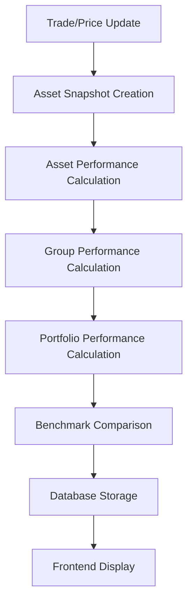

# Fund Manager Snapshot System - Architecture Documentation

## 📋 Overview

This document outlines the enhanced snapshot system designed to meet the comprehensive requirements of fund managers for portfolio performance analysis.

## 🎯 Requirements Analysis

### Asset-Level Requirements
- **Absolute Return**: Realized and unrealized P&L tracking
- **Simple Return**: Percentage change calculations
- **TWR (Time-Weighted Return)**: Standardized performance metrics across multiple timeframes

### Group-Level Requirements
- **Asset Grouping**: Group assets by type (Stock, Bond, Crypto, etc.)
- **Group TWR**: Time-weighted returns for each asset group
- **Sharpe Ratio**: Risk-adjusted return metrics
- **Risk-adjusted Returns**: Performance metrics considering risk

### Portfolio-Level Requirements
1. **Portfolio Value Aggregation**: Vt = Σ(Price_i,t × Quantity_i,t)
2. **TWR Calculation**: Standard TWR excluding cash flow effects
3. **MWR/IRR**: Money-weighted returns reflecting investor perspective
4. **Benchmark Comparison**: Alpha calculation vs benchmarks
5. **Risk Assessment**: Sharpe Ratio, Max Drawdown, Volatility

## 🏗️ Database Architecture

### 8 Main Tables

| Table | Columns | Purpose |
|-------|---------|---------|
| `portfolios` | 11 | Basic portfolio information |
| `assets` | 11 | Asset information |
| `portfolio_snapshots` | 45 | Portfolio-level snapshots (existing) |
| `asset_allocation_snapshots` | 25 | Asset allocation snapshots (existing) |
| `portfolio_performance_snapshots` | 35 | Portfolio performance metrics (NEW) |
| `asset_performance_snapshots` | 25 | Asset performance metrics (NEW) |
| `asset_group_performance_snapshots` | 25 | Asset group performance metrics (NEW) |
| `benchmark_data` | 20 | Benchmark comparison data (NEW) |

**Total: 8 tables with 197 columns**

## 📊 Entity Design

### PortfolioPerformanceSnapshot
```typescript
@Entity('portfolio_performance_snapshots')
export class PortfolioPerformanceSnapshot {
  // TWR Metrics (1D, 1W, 1M, 3M, 6M, 1Y, YTD)
  // MWR/IRR Metrics (1M, 3M, 6M, 1Y, YTD)
  // Alpha/Beta Metrics (1M, 3M, 6M, 1Y, YTD)
  // Information Ratio & Tracking Error
  // Cash Flow Tracking
  // Benchmark Comparison Data (JSON)
}
```

### AssetPerformanceSnapshot
```typescript
@Entity('asset_performance_snapshots')
export class AssetPerformanceSnapshot {
  // Asset TWR Metrics (1D, 1W, 1M, 3M, 6M, 1Y, YTD)
  // Asset Risk Metrics (Volatility, Sharpe Ratio, Max Drawdown)
  // Asset Risk-Adjusted Returns
}
```

### AssetGroupPerformanceSnapshot
```typescript
@Entity('asset_group_performance_snapshots')
export class AssetGroupPerformanceSnapshot {
  // Group TWR Metrics (1D, 1W, 1M, 3M, 6M, 1Y, YTD)
  // Group Risk Metrics (Sharpe Ratio, Volatility, Max Drawdown)
  // Group Risk-Adjusted Returns
  // Group Statistics (Asset Count, Allocation Percentage)
}
```

### BenchmarkData
```typescript
@Entity('benchmark_data')
export class BenchmarkData {
  // Benchmark Performance (1D, 1W, 1M, 3M, 6M, 1Y, YTD)
  // Benchmark Risk Metrics (Volatility, Max Drawdown)
}
```

## 🔧 Service Architecture

### PerformanceSnapshotService
```typescript
@Injectable()
export class PerformanceSnapshotService {
  async createPerformanceSnapshots(
    portfolioId: string,
    snapshotDate: Date,
    granularity: SnapshotGranularity
  ): Promise<{
    portfolioSnapshot: PortfolioPerformanceSnapshot;
    assetSnapshots: AssetPerformanceSnapshot[];
    groupSnapshots: AssetGroupPerformanceSnapshot[];
  }>
}
```

### Calculation Services
- **TWRCalculationService**: Time-weighted return calculations
- **MWRCalculationService**: Money-weighted return calculations
- **AlphaBetaCalculationService**: Alpha/Beta calculations vs benchmarks
- **RiskMetricsService**: Sharpe ratio, volatility, max drawdown calculations

## 📈 Performance Metrics

### Time Periods
- **1D**: 1 Day
- **1W**: 1 Week
- **1M**: 1 Month
- **3M**: 3 Months
- **6M**: 6 Months
- **1Y**: 1 Year
- **YTD**: Year to Date

### Metric Types
- **TWR**: Time-Weighted Return
- **MWR**: Money-Weighted Return
- **IRR**: Internal Rate of Return
- **Alpha**: Excess return vs benchmark
- **Beta**: Systematic risk measure
- **Sharpe Ratio**: Risk-adjusted return
- **Volatility**: Standard deviation of returns
- **Max Drawdown**: Maximum peak-to-trough decline
- **Information Ratio**: Active return per unit of tracking error
- **Tracking Error**: Standard deviation of excess returns

## 🗄️ Database Indexes

### Primary Indexes
```sql
-- Portfolio Performance
CREATE INDEX idx_portfolio_performance_portfolio_date 
ON portfolio_performance_snapshots (portfolio_id, snapshot_date, granularity);

-- Asset Performance
CREATE INDEX idx_asset_performance_portfolio_asset_date 
ON asset_performance_snapshots (portfolio_id, asset_id, snapshot_date, granularity);

-- Asset Group Performance
CREATE INDEX idx_asset_group_performance_portfolio_type_date 
ON asset_group_performance_snapshots (portfolio_id, asset_type, snapshot_date, granularity);

-- Benchmark Data
CREATE INDEX idx_benchmark_data_benchmark_date 
ON benchmark_data (benchmark_id, snapshot_date, granularity);
```

## 🔄 Implementation Timeline

### Phase 1: Database Schema (Week 1-2)
- Create migration files
- Update entity definitions
- Test database changes

### Phase 2: Service Layer (Week 3-4)
- Implement calculation services
- Add TWR, MWR, IRR calculations
- Add Alpha/Beta calculations

### Phase 3: Integration (Week 5-6)
- Update snapshot creation process
- Integrate with existing services
- Add comprehensive testing

### Phase 4: Frontend Updates (Week 7-8)
- Update UI components
- Add new metrics display
- Performance optimization

## 🎯 Benefits

### For Fund Managers
- **Comprehensive Analysis**: All required metrics in one system
- **Real-time Performance**: Pre-computed snapshots for fast queries
- **Risk Assessment**: Complete risk metrics across all levels
- **Benchmark Comparison**: Alpha/Beta calculations vs benchmarks

### For System Performance
- **Optimized Queries**: Indexed tables for fast data retrieval
- **Scalable Architecture**: Separate entities for different concerns
- **Data Integrity**: Atomic transactions ensure consistency
- **Maintainable Code**: Clear separation of responsibilities

## 🔍 Data Flow



## 📝 Migration Strategy

### Backward Compatibility
- Keep existing `portfolio_snapshots` and `asset_allocation_snapshots`
- Add new performance tables alongside existing ones
- Gradual migration of data and functionality

### Data Validation
- Ensure portfolio totals = sum of asset totals
- Validate TWR calculations against known benchmarks
- Cross-check Alpha/Beta calculations

## 🚀 Future Enhancements

### Potential Additions
- **Factor Analysis**: Fama-French factor models
- **Risk Attribution**: Risk contribution by asset/group
- **Scenario Analysis**: Stress testing capabilities
- **Custom Benchmarks**: User-defined benchmark creation
- **Performance Attribution**: Return attribution analysis

## 📚 References

- **TWR Calculation**: CFA Institute standards
- **MWR/IRR**: Financial mathematics best practices
- **Alpha/Beta**: Modern Portfolio Theory
- **Risk Metrics**: Risk management industry standards
