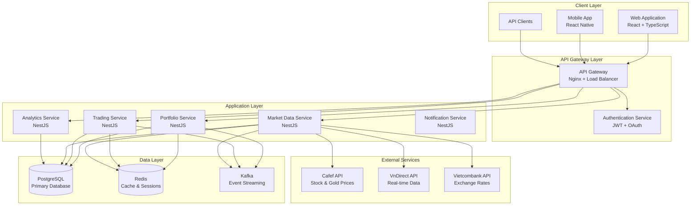

# Portfolio Management System - System Design

## Architecture Overview

### High-Level Architecture


## Microservices Architecture

### Service Responsibilities

#### 1. Portfolio Service
**Responsibilities:**
- Portfolio CRUD operations
- Portfolio value calculations
- Asset allocation tracking
- Performance metrics calculation
- Portfolio snapshots management

**Key Components:**
- PortfolioController: REST API endpoints
- PortfolioService: Business logic
- PortfolioRepository: Data access layer
- PortfolioCalculator: Value calculation engine

**Database Tables:**
- portfolios
- portfolio_assets
- nav_snapshots
- portfolio_asset_snapshots

#### 2. Trading Service
**Responsibilities:**
- Trade recording and management
- FIFO/LIFO calculations
- Trade matching and details
- Position management
- Risk management (stop-loss, take-profit)

**Key Components:**
- TradingController: REST API endpoints
- TradingService: Business logic
- TradeRepository: Data access layer
- FIFOEngine: Trade matching algorithm
- PositionManager: Position tracking

**Database Tables:**
- trades
- trade_details
- assets
- asset_targets

#### 3. Market Data Service
**Responsibilities:**
- External API integration
- Price data management
- Market data synchronization
- Manual price input
- Data quality monitoring

**Key Components:**
- MarketDataController: REST API endpoints
- MarketDataService: Business logic
- PriceRepository: Data access layer
- ExternalAPIClient: Third-party integrations
- DataScheduler: Automated data updates

**Database Tables:**
- prices
- market_data_sources
- price_alerts

#### 4. Analytics Service
**Responsibilities:**
- Performance analytics
- TWR/IRR calculations
- Reporting generation
- Benchmark comparison
- Risk metrics calculation

**Key Components:**
- AnalyticsController: REST API endpoints
- AnalyticsService: Business logic
- ReportGenerator: Report creation
- PerformanceCalculator: TWR/IRR algorithms
- BenchmarkService: Comparison tools

#### 5. Notification Service
**Responsibilities:**
- Real-time notifications
- Alert management
- Email/SMS notifications
- WebSocket connections
- Event processing

**Key Components:**
- NotificationController: REST API endpoints
- NotificationService: Business logic
- WebSocketGateway: Real-time connections
- EmailService: Email notifications
- AlertManager: Alert processing

## Database Design

### Core Tables

#### Users and Portfolios
```sql
-- User accounts
CREATE TABLE accounts (
    account_id UUID PRIMARY KEY,
    name TEXT NOT NULL,
    email TEXT UNIQUE NOT NULL,
    base_currency TEXT NOT NULL DEFAULT 'VND',
    created_at TIMESTAMP DEFAULT NOW(),
    updated_at TIMESTAMP DEFAULT NOW()
);

-- Portfolios
CREATE TABLE portfolios (
    portfolio_id UUID PRIMARY KEY,
    account_id UUID NOT NULL REFERENCES accounts(account_id),
    name TEXT NOT NULL,
    base_currency TEXT NOT NULL DEFAULT 'VND',
    created_at TIMESTAMP DEFAULT NOW(),
    updated_at TIMESTAMP DEFAULT NOW()
);
```

#### Assets and Prices
```sql
-- Investment assets
CREATE TABLE assets (
    asset_id UUID PRIMARY KEY,
    symbol TEXT NOT NULL,
    name TEXT NOT NULL,
    type TEXT NOT NULL, -- STOCK, BOND, ETF, GOLD, DEPOSIT
    asset_class TEXT NOT NULL, -- Equities, FixedIncome, Commodities
    currency TEXT NOT NULL,
    is_active BOOLEAN DEFAULT TRUE,
    created_at TIMESTAMP DEFAULT NOW()
);

-- Market prices
CREATE TABLE prices (
    asset_id UUID NOT NULL REFERENCES assets(asset_id),
    price_date TIMESTAMP NOT NULL,
    price NUMERIC(20,6) NOT NULL,
    source TEXT NOT NULL, -- CAFEF, VNDIRECT, MANUAL
    created_at TIMESTAMP DEFAULT NOW(),
    PRIMARY KEY (asset_id, price_date)
);
```

#### Trading System
```sql
-- Trades
CREATE TABLE trades (
    trade_id UUID PRIMARY KEY,
    portfolio_id UUID NOT NULL REFERENCES portfolios(portfolio_id),
    asset_id UUID NOT NULL REFERENCES assets(asset_id),
    trade_date TIMESTAMP NOT NULL,
    side TEXT NOT NULL CHECK (side IN ('BUY','SELL')),
    quantity NUMERIC(20,6) NOT NULL,
    price NUMERIC(20,6) NOT NULL,
    fee NUMERIC(20,6) DEFAULT 0,
    tax NUMERIC(20,6) DEFAULT 0,
    trade_type TEXT DEFAULT 'NORMAL', -- NORMAL, DIVIDEND_CASH, DIVIDEND_REINVEST, DIVIDEND_STOCK
    source TEXT, -- VNDIRECT, SSI, MANUAL
    created_at TIMESTAMP DEFAULT NOW()
);

-- Trade details (FIFO matching)
CREATE TABLE trade_details (
    detail_id BIGSERIAL PRIMARY KEY,
    sell_trade_id UUID NOT NULL REFERENCES trades(trade_id),
    buy_trade_id UUID NOT NULL REFERENCES trades(trade_id),
    asset_id UUID NOT NULL REFERENCES assets(asset_id),
    matched_qty NUMERIC(20,6) NOT NULL,
    buy_price NUMERIC(20,6) NOT NULL,
    sell_price NUMERIC(20,6) NOT NULL,
    fee_tax NUMERIC(20,6) DEFAULT 0,
    pnl NUMERIC(20,6) NOT NULL,
    created_at TIMESTAMP DEFAULT NOW()
);
```

#### Portfolio Tracking
```sql
-- Current portfolio positions
CREATE TABLE portfolio_assets (
    portfolio_id UUID NOT NULL REFERENCES portfolios(portfolio_id),
    asset_id UUID NOT NULL REFERENCES assets(asset_id),
    quantity NUMERIC(30,10) NOT NULL DEFAULT 0,
    avg_cost NUMERIC(18,6) NOT NULL DEFAULT 0,
    market_value NUMERIC(18,6),
    unrealized_pl NUMERIC(18,6),
    updated_at TIMESTAMP NOT NULL DEFAULT NOW(),
    PRIMARY KEY (portfolio_id, asset_id)
);

-- NAV snapshots for performance calculation
CREATE TABLE nav_snapshots (
    portfolio_id UUID NOT NULL REFERENCES portfolios(portfolio_id),
    nav_date DATE NOT NULL,
    nav_value NUMERIC(20,6) NOT NULL,
    cash_balance NUMERIC(20,6) NOT NULL,
    total_value NUMERIC(20,6) NOT NULL,
    created_at TIMESTAMP DEFAULT NOW(),
    PRIMARY KEY (portfolio_id, nav_date)
);
```

### Database Optimization

#### Indexing Strategy
```sql
-- Performance indexes
CREATE INDEX idx_trades_portfolio_date ON trades(portfolio_id, trade_date);
CREATE INDEX idx_trades_asset_date ON trades(asset_id, trade_date);
CREATE INDEX idx_prices_asset_date ON prices(asset_id, price_date DESC);
CREATE INDEX idx_portfolio_assets_portfolio ON portfolio_assets(portfolio_id);
CREATE INDEX idx_nav_snapshots_portfolio_date ON nav_snapshots(portfolio_id, nav_date DESC);
```

#### Partitioning Strategy
```sql
-- Partition trades table by date
CREATE TABLE trades_y2024 PARTITION OF trades
FOR VALUES FROM ('2024-01-01') TO ('2025-01-01');

-- Partition prices table by date
CREATE TABLE prices_y2024 PARTITION OF prices
FOR VALUES FROM ('2024-01-01') TO ('2025-01-01');
```

## API Design

### REST API Structure

#### Portfolio Management APIs
```typescript
// Portfolio CRUD
GET    /api/v1/portfolios                    // List portfolios
POST   /api/v1/portfolios                    // Create portfolio
GET    /api/v1/portfolios/:id                // Get portfolio details
PUT    /api/v1/portfolios/:id                // Update portfolio
DELETE /api/v1/portfolios/:id                // Delete portfolio

// Portfolio analytics
GET    /api/v1/portfolios/:id/nav            // Get current NAV
GET    /api/v1/portfolios/:id/nav/history    // Get NAV history
GET    /api/v1/portfolios/:id/performance    // Get performance metrics
GET    /api/v1/portfolios/:id/allocation     // Get asset allocation
GET    /api/v1/portfolios/:id/positions      // Get current positions
```

#### Trading APIs
```typescript
// Trade management
GET    /api/v1/trades                        // List trades
POST   /api/v1/trades                        // Create trade
GET    /api/v1/trades/:id                    // Get trade details
PUT    /api/v1/trades/:id                    // Update trade
DELETE /api/v1/trades/:id                    // Delete trade

// Asset management
GET    /api/v1/assets                        // List assets
POST   /api/v1/assets                        // Create asset
GET    /api/v1/assets/:id                    // Get asset details
PUT    /api/v1/assets/:id                    // Update asset
POST   /api/v1/assets/:id/targets            // Set stop-loss/take-profit
```

#### Market Data APIs
```typescript
// Price management
GET    /api/v1/market/prices                 // Get current prices
GET    /api/v1/market/prices/:assetId        // Get asset price history
POST   /api/v1/market/prices                 // Manual price input
GET    /api/v1/market/refresh                // Refresh all prices
POST   /api/v1/market/refresh/:assetId       // Refresh specific asset
```

### WebSocket APIs
```typescript
// Real-time updates
WS     /ws/portfolio/:id                     // Portfolio updates
WS     /ws/prices                            // Price updates
WS     /ws/alerts                            // Alert notifications
```

## Security Design

### Authentication & Authorization
- **JWT Tokens**: Stateless authentication
- **Role-based Access**: User roles and permissions
- **API Rate Limiting**: Prevent abuse
- **Input Validation**: Sanitize all inputs
- **HTTPS Only**: Encrypt all communications

### Data Security
- **Database Encryption**: Encrypt sensitive data
- **Audit Logging**: Track all operations
- **Backup Encryption**: Secure backup storage
- **Access Controls**: Database-level permissions

## Scalability Design

### Horizontal Scaling
- **Stateless Services**: No session state
- **Load Balancing**: Distribute requests
- **Database Sharding**: Partition by portfolio_id
- **Caching Strategy**: Multi-level caching

### Performance Optimization
- **Database Indexing**: Optimize queries
- **Connection Pooling**: Reuse connections
- **Async Processing**: Non-blocking operations
- **CDN Integration**: Static asset delivery

## Monitoring & Observability

### Logging Strategy
- **Structured Logging**: JSON format
- **Log Levels**: DEBUG, INFO, WARN, ERROR
- **Correlation IDs**: Track requests
- **Centralized Logging**: ELK stack

### Metrics & Monitoring
- **Application Metrics**: Response times, error rates
- **Business Metrics**: Trade volume, portfolio values
- **Infrastructure Metrics**: CPU, memory, disk
- **Alerting**: Proactive issue detection

### Health Checks
- **Service Health**: Liveness and readiness probes
- **Database Health**: Connection and query performance
- **External Dependencies**: API availability
- **Resource Health**: Memory, disk, network
