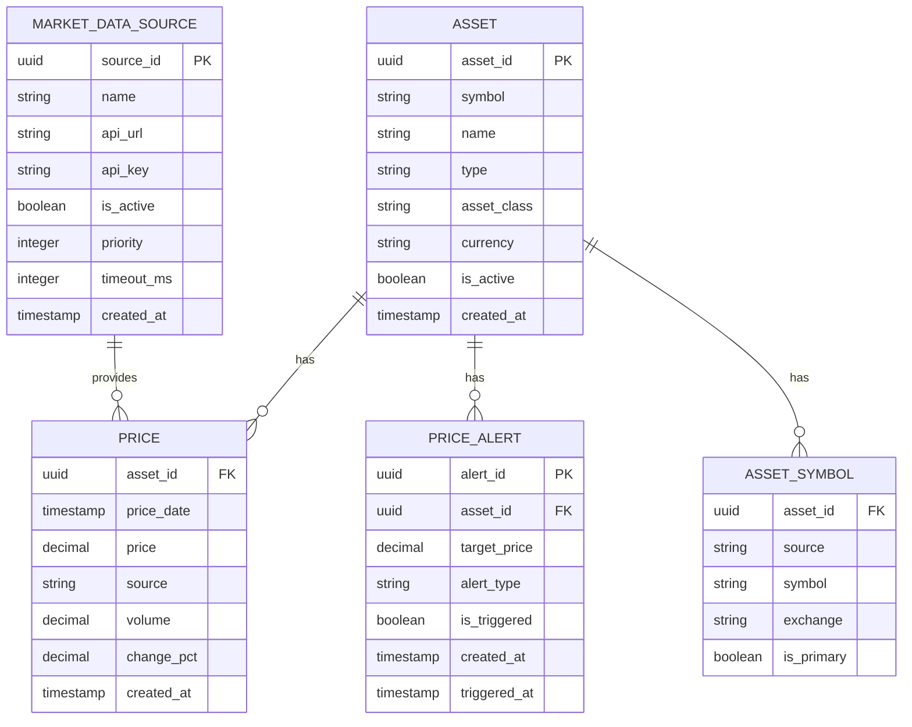
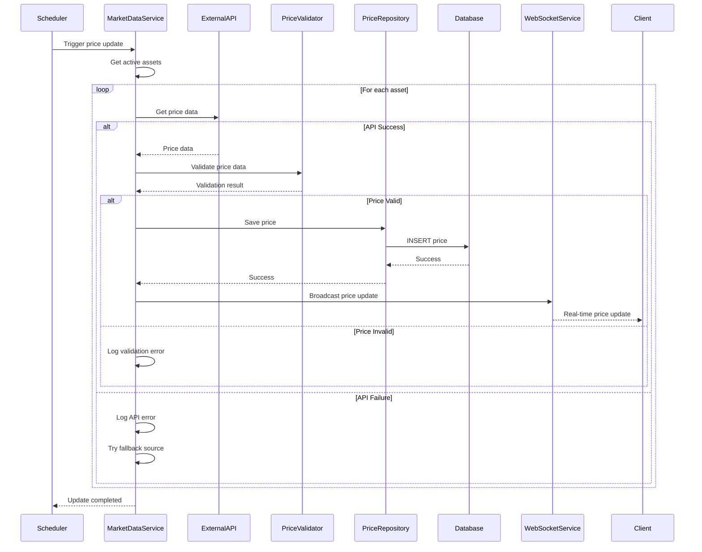
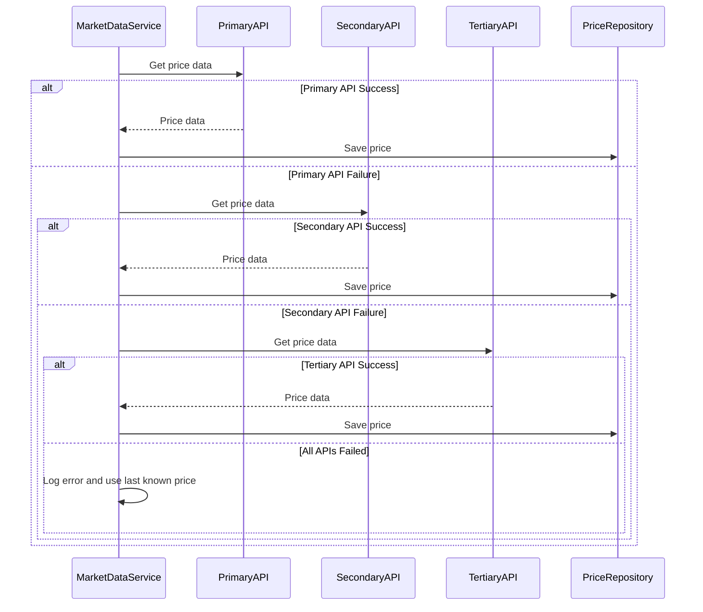

# Technical Design Document: Market Data Integration Module

## 1. Overview

The Market Data Integration module is responsible for fetching, processing, and managing real-time market data from external sources including Cafef, VnDirect, and Vietcombank. This module handles price updates, data synchronization, manual price input, and provides a reliable data source for portfolio calculations and real-time updates.

## 2. Requirements

### 2.1 Functional Requirements

* **External Data Integration**
  * As a system administrator, I want to integrate with Cafef API so that I can get stock and gold prices
  * As a system administrator, I want to integrate with VnDirect API so that I can get real-time stock data
  * As a system administrator, I want to integrate with Vietcombank API so that I can get exchange rates
  * As a system administrator, I want to have fallback mechanisms so that the system continues to work when external APIs fail

* **Price Management**
  * As a portfolio manager, I want to see current market prices for all assets so that I can track portfolio values
  * As a portfolio manager, I want prices to update every 5 minutes so that I have current market data
  * As a system administrator, I want to manually input prices so that I can handle missing or delayed data
  * As a portfolio manager, I want to see price history so that I can analyze price trends

* **Data Quality and Validation**
  * As a system administrator, I want to validate price data so that I can ensure data accuracy
  * As a system administrator, I want to detect and handle price anomalies so that I can maintain data quality
  * As a system administrator, I want to log all data operations so that I can audit data changes

* **Real-time Updates**
  * As a portfolio manager, I want to receive real-time price updates so that I can see current market conditions
  * As a portfolio manager, I want to be notified when prices change significantly so that I can take action
  * As a system administrator, I want to control update frequency so that I can balance performance and accuracy

### 2.2 Non-Functional Requirements

* **Performance**: Price updates should complete within 30 seconds
* **Reliability**: System should maintain 99.9% uptime for price data
* **Data Accuracy**: Price data should be accurate within 1% of actual market prices
* **Scalability**: System should handle 10,000+ assets with price updates
* **Latency**: Price data should be available within 5 minutes of market changes

## 3. Technical Design

### 3.1. Data Model Changes

The Market Data Integration module will use the following entities:



### 3.2. API Changes

#### Market Data Controller Endpoints

```typescript
// Price Management
GET    /api/v1/market/prices                 // Get current prices
GET    /api/v1/market/prices/:assetId        // Get price history for asset
POST   /api/v1/market/prices                 // Manual price input
PUT    /api/v1/market/prices/:assetId        // Update specific asset price

// Data Source Management
GET    /api/v1/market/sources                // List data sources
POST   /api/v1/market/sources                // Add new data source
PUT    /api/v1/market/sources/:id            // Update data source
DELETE /api/v1/market/sources/:id            // Remove data source

// Data Refresh
POST   /api/v1/market/refresh                // Refresh all prices
POST   /api/v1/market/refresh/:assetId       // Refresh specific asset
GET    /api/v1/market/refresh/status         // Get refresh status

// Price Alerts
GET    /api/v1/market/alerts                 // List price alerts
POST   /api/v1/market/alerts                 // Create price alert
PUT    /api/v1/market/alerts/:id             // Update price alert
DELETE /api/v1/market/alerts/:id             // Delete price alert
```

#### Example API Requests and Responses

**Get Current Prices:**
```json
GET /api/v1/market/prices

Response:
{
  "prices": [
    {
      "asset_id": "456e7890-e89b-12d3-a456-426614174001",
      "symbol": "HPG",
      "name": "Hoa Phat Group",
      "price": 31000,
      "change_pct": 2.5,
      "volume": 1500000,
      "source": "VNDIRECT",
      "updated_at": "2024-12-19T15:30:00Z"
    },
    {
      "asset_id": "789e0123-e89b-12d3-a456-426614174002",
      "symbol": "GOLD",
      "name": "Gold",
      "price": 1900000,
      "change_pct": -0.5,
      "volume": 0,
      "source": "CAFEF",
      "updated_at": "2024-12-19T15:25:00Z"
    }
  ],
  "total_assets": 2,
  "last_updated": "2024-12-19T15:30:00Z"
}
```

**Manual Price Input:**
```json
POST /api/v1/market/prices
{
  "asset_id": "456e7890-e89b-12d3-a456-426614174001",
  "price": 31500,
  "source": "MANUAL",
  "notes": "Manual price update due to API failure"
}

Response:
{
  "asset_id": "456e7890-e89b-12d3-a456-426614174001",
  "price": 31500,
  "source": "MANUAL",
  "created_at": "2024-12-19T15:35:00Z",
  "status": "success"
}
```

**Refresh All Prices:**
```json
POST /api/v1/market/refresh

Response:
{
  "refresh_id": "refresh_123e4567-e89b-12d3-a456-426614174000",
  "status": "started",
  "total_assets": 150,
  "started_at": "2024-12-19T15:30:00Z",
  "estimated_completion": "2024-12-19T15:35:00Z"
}
```

### 3.3. UI Changes

#### Frontend Components (React.js)

**Market Data Dashboard:**
- `MarketDataDashboard.tsx`: Overview of market data status
- `PriceTable.tsx`: Table showing current prices
- `PriceChart.tsx`: Chart showing price history
- `DataSourceStatus.tsx`: Status of external data sources

**Price Management:**
- `PriceInputForm.tsx`: Form for manual price input
- `PriceHistoryView.tsx`: Historical price data
- `PriceAlertSettings.tsx`: Price alert configuration

**Data Source Management:**
- `DataSourceList.tsx`: List of configured data sources
- `DataSourceConfig.tsx`: Configuration for data sources
- `RefreshStatus.tsx`: Status of price refresh operations

### 3.4. Logic Flow

#### Price Update Flow



#### Data Source Fallback Flow



### 3.5. Dependencies

**New Dependencies Required:**
- `@nestjs/axios`: HTTP client for external API calls
- `@nestjs/schedule`: Scheduled tasks for price updates
- `@nestjs/websockets`: WebSocket support for real-time updates
- `@nestjs/platform-socket.io`: Socket.IO integration
- `axios`: HTTP client for API requests
- `node-cron`: Cron job scheduling
- `socket.io`: WebSocket communication
- `cheerio`: HTML parsing for web scraping (if needed)

**Existing Dependencies:**
- `@nestjs/common`: Core NestJS functionality
- `@nestjs/core`: NestJS framework
- `typeorm`: Database ORM
- `pg`: PostgreSQL driver
- `redis`: Redis client for caching

### 3.6. Security Considerations

* **API Key Management**: External API keys will be encrypted and stored securely
* **Rate Limiting**: API calls will be rate-limited to prevent abuse
* **Input Validation**: All price data will be validated before storage
* **Data Integrity**: Price data will be validated for anomalies
* **Access Control**: Market data operations will be restricted to authorized users
* **Audit Logging**: All data operations will be logged for audit purposes

### 3.7. Performance Considerations

* **Caching Strategy**: Price data will be cached in Redis with 5-minute TTL
* **Batch Processing**: Price updates will be processed in batches
* **Connection Pooling**: HTTP connections will be pooled for external APIs
* **Async Processing**: Price updates will be done asynchronously
* **Database Indexing**: Proper indexes on price_date and asset_id
* **Circuit Breaker**: External API calls will use circuit breaker pattern

## 4. Testing Plan

### 4.1. Unit Tests
* **MarketDataService**: Test price fetching, validation, and storage
* **ExternalAPIClient**: Test API integration and error handling
* **PriceValidator**: Test price validation logic
* **MarketDataController**: Test API endpoints and responses

### 4.2. Integration Tests
* **External API Integration**: Test real API calls with mock data
* **Database Integration**: Test price storage and retrieval
* **WebSocket Integration**: Test real-time price updates
* **Scheduler Integration**: Test scheduled price updates

### 4.3. Performance Tests
* **API Response Time**: Test external API response times
* **Price Update Performance**: Test batch price update performance
* **WebSocket Performance**: Test real-time update performance
* **Database Performance**: Test price query performance

### 4.4. User Acceptance Tests
* **Price Updates**: Test automatic price updates
* **Manual Price Input**: Test manual price input functionality
* **Real-time Updates**: Test real-time price updates in UI
* **Data Source Management**: Test data source configuration

## 5. Open Questions

1. **Data Source Priority**: How should we prioritize data sources when multiple sources are available? define later.
2. **Price Validation**: What validation rules should we apply to price data? must be number.
3. **Update Frequency**: Should update frequency be configurable per asset type? yes
4. **Error Handling**: How should we handle prolonged API failures? write log for debug later
5. **Data Retention**: How long should we retain historical price data? Just keep the latest.

## 6. Alternatives Considered

### 6.1. Data Source Strategy
**Alternative**: Use only one primary data source
**Rejected**: Multiple sources provide better reliability and data quality

### 6.2. Update Mechanism
**Alternative**: Use webhooks instead of polling
**Rejected**: Polling provides better control and reliability

### 6.3. Data Storage
**Alternative**: Use time-series database for price data
**Rejected**: PostgreSQL with proper indexing is sufficient and simpler

### 6.4. Real-time Updates
**Alternative**: Use Server-Sent Events instead of WebSocket
**Rejected**: WebSocket provides better bidirectional communication
