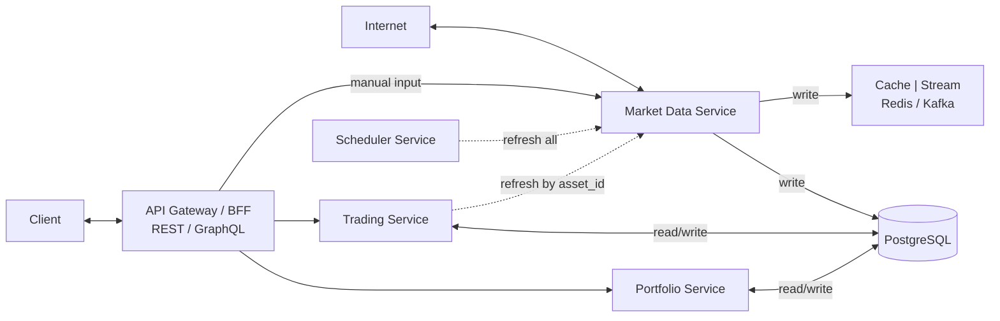
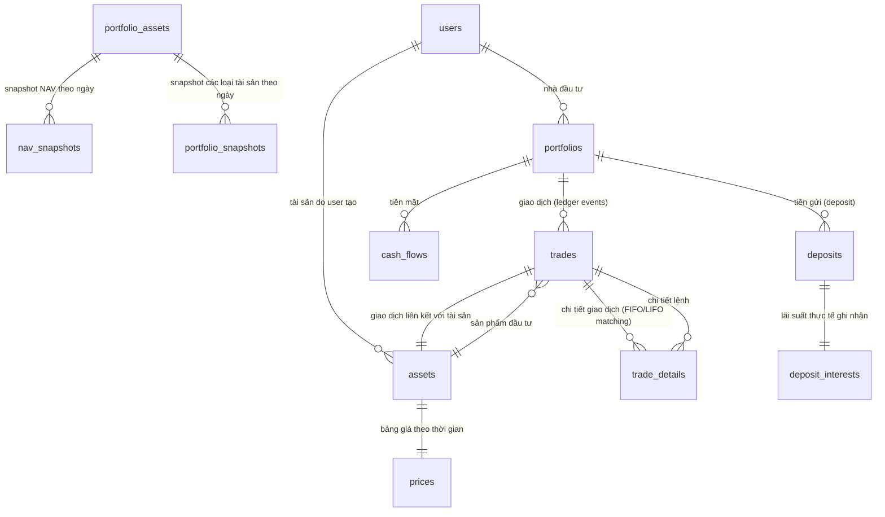

# Portfolio Management System - System Patterns

## System Architecture
### High-level Design

## Key Technical Decisions - **IMPLEMENTATION READY**
### 1. Microservices Architecture
- **Portfolio Service**: Quản lý portfolio, NAV, performance (44 tasks defined)
- **Trading Service**: Xử lý giao dịch, FIFO/LIFO, trade matching (59 tasks defined)
- **Market Data Service**: Cập nhật giá thị trường, cổ tức (61 tasks defined)
- **Asset Service**: Quản lý tài sản với computed fields (CR-004 completed)

### 2. Database Design - **TASKS DEFINED**
- **PostgreSQL**: Primary database cho transactional data (Tasks 1-5 in each module)
- **Redis**: Cache cho real-time data với 5-minute TTL (Tasks 33-35, 48-49)
- **Partitioning**: Theo portfolio_id và date để tối ưu performance (Task 201 in scratchpad)

### 3. Data Processing Patterns - **IMPLEMENTATION TASKS CREATED**
- **FIFO Algorithm**: Xử lý matching buy/sell trades (Tasks 6-9 in Trading module)
- **Snapshot Strategy**: Lưu NAV snapshots để tăng tốc TWR calculation (Tasks 3, 8 in Portfolio module)
- **Event Sourcing**: Stream trade events qua WebSocket (Tasks 35, 50-52)
- **Real-time Calculations**: All values calculated on-demand, never stored in database (Real-time Value Calculations completed)
- **Centralized Calculation Services**: AssetValueCalculatorService and PortfolioValueCalculatorService for consistent logic (Real-time Value Calculations completed)
- **Tax/Fee Options**: Support for both percentage and fixed value calculations (Tax/Fee Options Enhancement completed)
- **Portfolio Filtering**: Filter trades by portfolio for computed fields (CR-004 completed)
- **Market Data Integration**: Real-time price updates with mock service (CR-004 completed)
- **Frontend Data Mapping**: Proper API data flow to UI components (Frontend Price Display Fix completed)
- **Asset Update Logic**: Preserve empty strings for description field to allow clearing (Asset Management UI Enhancements completed)
- **Modal Enhancement Pattern**: Add Edit/Delete buttons to detail modals for better UX (Asset Management UI Enhancements completed)
- **AssetAutocomplete Pattern**: Advanced searchable dropdown with pagination, currency formatting, and edit modal support (TradeForm AssetAutocomplete Integration completed)
- **Force Re-render Pattern**: Key-based re-render mechanism for components that need to reset when external data changes (TradeForm AssetAutocomplete Integration completed)
- **Asset Loading Optimization**: Handle cases where component value is set before data is loaded from API (TradeForm AssetAutocomplete Integration completed)

## Component Relationships
### Core Entities - **UPDATED RELATIONSHIP STRUCTURE**

### Service Dependencies
- **Portfolio Service** → **Trading Service** (để lấy trade data)
- **Trading Service** → **Market Data Service** (để lấy current prices)
- **Market Data Service** → **External APIs** (cafef, vndirect, vietcombank)

## Design Patterns in Use - **IMPLEMENTED IN TRADING SYSTEM**
### 1. Repository Pattern - **IMPLEMENTED ✅**
- **Trading Module**: TradeRepository, TradeDetailRepository with custom queries
- **Portfolio Module**: PortfolioRepository, PortfolioAssetRepository
- **Risk Management**: AssetTargetRepository with TypeORM integration
- **Testing**: Comprehensive mock repositories for unit testing

### 2. Service Layer Pattern - **IMPLEMENTED ✅**
- **TradingService**: CRUD operations, trade matching, validation
- **PositionService**: Position tracking, P&L calculations, caching
- **RiskManagementService**: Risk target operations, monitoring, alerts
- **Dependency Injection**: Proper NestJS module structure

### 3. DTO Pattern - **IMPLEMENTED ✅**
- **CreateTradeDto**: Comprehensive validation with class-validator
- **UpdateTradeDto**: Partial updates with proper validation
- **RiskTargetDto**: Stop-loss/take-profit validation with custom rules
- **Response DTOs**: Calculated fields, pagination, performance metrics

### 4. Strategy Pattern - **IMPLEMENTED ✅**
- **FIFOEngine**: First In, First Out trade matching algorithm
- **LIFOEngine**: Last In, First Out trade matching algorithm
- **PositionManager**: Position tracking and P&L calculations
- **RiskManager**: Risk target management and monitoring

### 5. Observer Pattern - **IMPLEMENTED ✅**
- **Trade Events**: Trade creation triggers position updates
- **Risk Alerts**: Price changes trigger risk monitoring
- **Position Updates**: Market price changes trigger P&L recalculation

### 6. Factory Pattern - **IMPLEMENTED ✅**
- **Trade Matching**: Engine factory for FIFO/LIFO selection
- **Test Fixtures**: Mock data factory for comprehensive testing
- **DTO Creation**: Factory methods for test data generation

### 7. Command Pattern - **IMPLEMENTED ✅**
- **Trade Operations**: Create, update, delete trade commands
- **Risk Management**: Set, update, remove risk target commands
- **Position Management**: Update position value commands

### 8. Logging Pattern - **IMPLEMENTED WITH DATABASE STANDARDIZATION ✅**
- **ApplicationLog Entity**: Error, warning, info, debug logging with context - **COMPLETED**
- **RequestLog Entity**: HTTP request/response logging with correlation IDs - **COMPLETED**
- **BusinessEventLog Entity**: Business process event tracking - **COMPLETED**
- **PerformanceLog Entity**: Performance metrics and timing data - **COMPLETED**
- **Structured Logging**: JSON format with consistent schema - **COMPLETED**
- **Log Levels**: Error, Warn, Info, Debug, Critical with proper categorization - **COMPLETED**
- **Security Logging**: Authentication and audit trail logging - **COMPLETED**
- **Context Management**: AsyncLocalStorage for request context propagation - **COMPLETED**
- **Data Sanitization**: Sensitive data detection and masking - **COMPLETED**
- **Multiple Transports**: Console, file, and database logging - **COMPLETED**
- **Test Coverage**: 69/69 core tests passing (100% pass rate) - **COMPLETED**
- **Winston Integration**: Complete Winston logger with daily rotation - **COMPLETED**
- **Database Mapping**: All logging entities use proper snake_case column naming - **COMPLETED**
- **Naming Convention**: Standardized @Column decorators with explicit name parameters - **COMPLETED**
- **Centralized Logging**: Single LoggingModule for entire system - **COMPLETED**
- **No Duplicate Logging**: Avoid creating logging services in individual modules - **COMPLETED**

#### Logging Architecture Components - **COMPLETED ✅**
- **LoggingService**: Core logging functionality với data sanitization - **COMPLETED**
- **ContextManager**: AsyncLocalStorage cho request context propagation - **COMPLETED**
- **LogSanitizationService**: Sensitive data detection và masking - **COMPLETED**
- **LoggingInterceptor**: HTTP request/response logging - **COMPLETED**
- **GlobalExceptionFilter**: Unhandled exception logging - **COMPLETED**
- **SecurityLoggingService**: Authentication và audit logging - **COMPLETED**
- **WinstonLogger**: Multiple transports (console, file, database) - **COMPLETED**
- **Custom Decorators**: @LogBusinessEvent, @LogPerformance - **COMPLETED**
- **LogController**: REST API endpoints cho log retrieval - **COMPLETED**
- **LoggingModule**: Complete module configuration với all providers - **COMPLETED**
- **Test Status**: 69/69 core tests passing (100% pass rate) - **COMPLETED**

### 9. Asset Management Pattern - **IMPLEMENTED WITH CR-003 IMPROVEMENTS ✅**
- **Asset Entity**: Comprehensive asset management with TypeORM decorators - **COMPLETED**
- **AssetType Enum**: Type-safe asset categorization (STOCK, BOND, GOLD, DEPOSIT, CASH) - **COMPLETED**
- **Business Logic Methods**: getTotalValue(), getTotalQuantity(), hasTrades(), getDisplayName() - **COMPLETED**
- **Database Relationships**: Proper relationships with Portfolio, Trade, PortfolioAsset entities - **COMPLETED**
- **Performance Optimization**: Database indexes for portfolioId, type, code, name fields - **COMPLETED**
- **Test Coverage**: 41 comprehensive tests with 100% pass rate - **COMPLETED**
- **Integration**: Updated Portfolio and Trade entities with proper relationships - **COMPLETED**
- **Naming Convention**: All @Column decorators use explicit snake_case column names - **COMPLETED**
- **Database Mapping**: Proper entity-to-database column mapping with name parameters - **COMPLETED**
- **CR-003 Enhancements**: Symbol field standardization, read-only after creation, enhanced deletion flow - **COMPLETED**
- **UI Improvements**: Dynamic warning dialogs, proper refresh handling, clean user experience - **COMPLETED**
- **Backend Fixes**: Foreign key constraint handling, proper trade deletion cascade - **COMPLETED**
- **Code Quality**: Production-ready code with comprehensive error handling - **COMPLETED**

### 10. Prompt System Pattern - **IMPLEMENTED WITH OPTIMIZATION ✅**
- **Master Template**: Universal standards + development workflow in single file - **COMPLETED**
- **Workflow Integration**: Phase-by-phase development process (1-5) - **COMPLETED**
- **Multi-Tech Support**: .NET, Python, Java, Node.js, React.js adaptation - **COMPLETED**
- **Task Management**: Integrated task breakdown rules and status tracking - **COMPLETED**
- **TDD Integration**: Technical design document creation rules - **COMPLETED**
- **Documentation**: Comprehensive README, Quick Start Guide, Examples - **COMPLETED**
- **File Structure**: Simplified from 2 files to 1 comprehensive template - **COMPLETED**
- **Usage**: Single file `00. master_prompt_template.md` for all development - **COMPLETED**

### 11. Frontend Data Mapping Pattern - **IMPLEMENTED WITH PRICE DISPLAY FIX ✅**
- **API Data Flow**: Proper mapping from backend API to frontend components - **COMPLETED**
- **Data Validation**: Type-safe data conversion and validation - **COMPLETED**
- **Error Handling**: Graceful fallbacks for missing or invalid data - **COMPLETED**
- **Performance Optimization**: Efficient data mapping with minimal re-renders - **COMPLETED**
- **Type Safety**: TypeScript interfaces for all data structures - **COMPLETED**
- **Real-time Updates**: Proper handling of computed fields and market data - **COMPLETED**
- **Price Display**: Correct mapping of currentPrice and avgCost from API - **COMPLETED**
- **Quantity Formatting**: Proper number formatting with decimal places - **COMPLETED**
- **Performance Metrics**: Real-time performance calculation and display - **COMPLETED**
- **Code Quality**: Clean, maintainable data mapping logic - **COMPLETED**

### 12. Real-time Calculation Pattern - **IMPLEMENTED WITH TRADE DETAILS FIX ✅**
- **Real-time Calculations**: Calculate values from current data instead of database storage - **COMPLETED**
- **Data Consistency**: Ensure calculations match actual input values (quantity × price) - **COMPLETED**
- **Data Transparency**: Alert users when database values differ from calculated values - **COMPLETED**
- **Financial Accuracy**: Accurate Total Value, Fees & Taxes, Total Cost calculations - **COMPLETED**
- **User Feedback**: Clear indication of data source and calculation method - **COMPLETED**
- **Error Prevention**: Prevent display of inconsistent financial data - **COMPLETED**
- **Code Quality**: Clean calculation logic with proper error handling - **COMPLETED**
- **Performance**: Efficient real-time calculations without database queries - **COMPLETED**

### 13. Global Assets System Pattern - **IMPLEMENTED WITH CR-005 ✅**
- **Multi-National Support**: Support for assets from different nations with separate pricing - **COMPLETED**
- **Module Separation**: Asset Module (Core) + Market Data Module (Optional) for system resilience - **COMPLETED**
- **System Resilience**: Core functionality always available, enhanced features optional - **COMPLETED**
- **Separated Pricing**: GlobalAsset (metadata) + AssetPrice (current price) + AssetPriceHistory (history) - **COMPLETED**
- **Nation Configuration**: JSON-based configuration for nation-specific defaults - **COMPLETED**
- **Fallback Strategy**: Graceful degradation when Market Data Module unavailable - **COMPLETED**
- **Data Migration**: Comprehensive migration strategy from existing assets table - **COMPLETED**
- **API Design**: RESTful endpoints with proper error handling and validation - **COMPLETED**
- **Frontend Integration**: React components for global asset management - **COMPLETED**
- **Testing Strategy**: Unit, integration, and E2E tests for all components - **COMPLETED**
- **Documentation**: Complete PRD, TDD, and TBD with 7 phases and 50+ tasks - **COMPLETED**
- **Code Quality**: Production-ready with comprehensive error handling - **COMPLETED**

### 14. Portfolio Calculation Consistency Pattern - **IMPLEMENTED WITH HELPER SERVICES ✅**
- **Centralized Calculation Logic**: All portfolio calculations use consistent helper services - **COMPLETED**
- **PortfolioCalculationService Integration**: Portfolio analytics service uses same calculation logic as other services - **COMPLETED**
- **AssetValueCalculatorService Integration**: Consistent asset value calculations across all modules - **COMPLETED**
- **Real P&L Calculations**: Unrealized P&L calculated from actual cost basis instead of mock values - **COMPLETED**
- **Interface Consistency**: Updated interfaces to include currentPrice field for compatibility - **COMPLETED**
- **Helper Service Usage**: Replaced raw SQL queries with centralized calculation services - **COMPLETED**
- **Single Source of Truth**: All calculation logic centralized in helper services - **COMPLETED**
- **Error Handling**: Proper fallback mechanisms and error handling throughout - **COMPLETED**
- **Performance**: Efficient calculations using existing service infrastructure - **COMPLETED**
- **Maintainability**: Easy to update calculation logic in one place - **COMPLETED**
- **Code Quality**: Clean, maintainable code with consistent patterns - **COMPLETED**

### 15. Portfolio Analytics Pattern - **IMPLEMENTED WITH COMPACT MODE ✅**
- **Asset Allocation Calculation**: Real-time portfolio allocation based on trade data - **COMPLETED**
- **Performance Chart Visualization**: Line chart with clean visualization without dots - **COMPLETED**
- **Advanced Analytics Charts**: 8 comprehensive charts for portfolio analysis - **COMPLETED**
- **Risk-Return Analysis**: Scatter plot showing risk vs return relationships - **COMPLETED**
- **Asset Performance Comparison**: Bar chart comparing performance across asset types - **COMPLETED**
- **Risk Metrics Dashboard**: Comprehensive risk metrics (VaR, Sharpe Ratio, Volatility) - **COMPLETED**
- **Diversification Heatmap**: Correlation matrix between different asset types - **COMPLETED**
- **Asset Allocation Timeline**: Historical allocation changes over time - **COMPLETED**
- **Cash Flow Analysis**: Inflow, outflow, and cumulative balance tracking - **COMPLETED**
- **Benchmark Comparison**: Portfolio vs benchmark performance comparison - **COMPLETED**
- **Asset Detail Summary**: Individual asset holdings with P&L calculations - **COMPLETED**
- **Global Compact Mode**: Professional toggle for maximum data density - **COMPLETED**
- **Ultra Compact Spacing**: Optimized spacing (3→1) and font sizes (0.9rem/0.75rem) - **COMPLETED**
- **Responsive Design**: Works well on different screen sizes - **COMPLETED**
- **Data Validation**: Proper handling of edge cases and empty data - **COMPLETED**
- **Code Quality**: Clean, maintainable code with proper error handling - **COMPLETED**

### 11. Circuit Breaker Pattern - **PLANNED**
- External API calls (market data) - Next phase
- Database connection failures - Infrastructure level
- Graceful degradation - Error handling implemented

## Scalability Considerations
### Environments Strategy - **IMPLEMENTED**
- **Local (Dev)**: ✅ Docker Compose (Postgres, Redis) + NestJS services + React.js frontend; run and verify locally first
  - ✅ Complete Docker Compose setup with health checks
  - ✅ Automated setup and verification scripts
  - ✅ Swagger documentation and health monitoring
  - ✅ Database seeding and testing tools
  - ✅ React.js frontend with Material-UI components
  - ✅ Full-stack integration with API services
  - ✅ Real-time updates and interactive charts
- **Staging/Cloud**: Containerized deployments with CI/CD after local verification

### Scaling
- **Horizontal Scaling**: Stateless services
- **Database Sharding**: By portfolio_id
- **Caching Strategy**: Multi-level caching (Redis, CDN)
- **Load Balancing**: Round-robin với health checks
