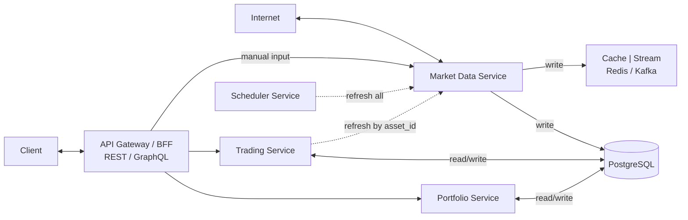
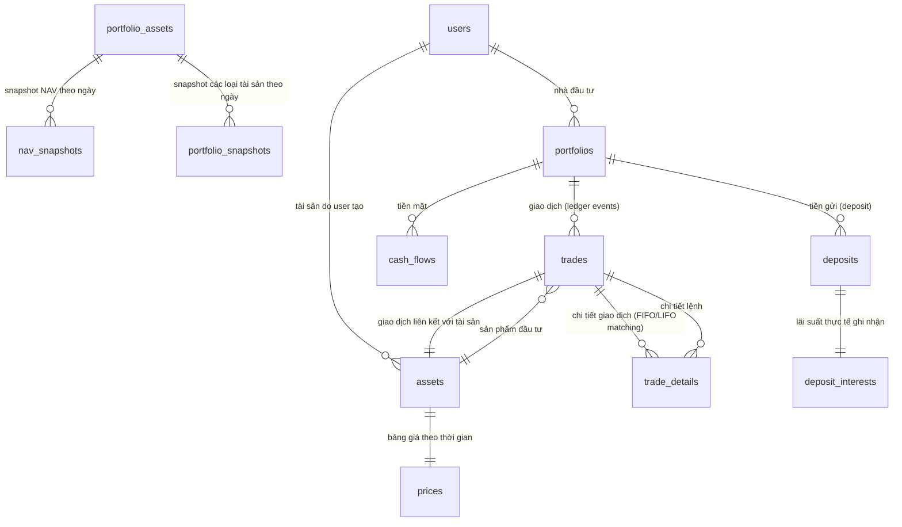

# Portfolio Management System - System Patterns

## System Architecture
### High-level Design


## Key Technical Decisions - **IMPLEMENTATION READY**

### Role & Permission System Pattern - **IMPLEMENTED** ✅
- **Role-Based Access Control (RBAC)**: Hierarchical role system with permission inheritance
- **Permission-Based Access Control**: Granular permission system with category organization
- **User Management**: Complete CRUD operations with role assignment capabilities
- **Settings Management**: System-wide configuration with auto role assignment
- **Security Integration**: JWT authentication with permission guards and account validation
- **Database Schema**: Normalized schema with proper relationships and indexing
- **API Design**: RESTful API with comprehensive CRUD endpoints
- **Frontend Architecture**: Component-based UI with React Query for data management
- **Migration System**: Production-ready database migrations with rollback support
- **Toast Notifications**: Professional user feedback system replacing alerts

### Performance Optimization Pattern - **IMPLEMENTED** ✅
- **Asynchronous Processing**: Background operations for non-blocking user experience
- **Batch Operations**: Single queries instead of N+1 queries for better performance
- **Database-Level Pagination**: LIMIT/OFFSET instead of memory slicing
- **Conditional Loading**: Load data only when needed (e.g., trades only when hasTrades=true)
- **Caching Strategy**: Enhanced caching with staleTime and cacheTime for better performance
- **Background Sync**: Non-blocking global asset sync and market price updates

### ResponsiveTypography System Pattern - **IMPLEMENTED** ✅
- **Custom Theme Enhancement**: Enhanced Material-UI theme with comprehensive responsive typography variants
- **ResponsiveTypography Component**: Custom wrapper component for consistent typography application across all components
- **Typography Variants**: Comprehensive set of typography variants including:
  - **Page Elements**: pageTitle, pageSubtitle, pageHeader
  - **Card Elements**: cardTitle, cardValue, cardValueLarge, cardValueMedium, cardValueSmall, cardLabel
  - **Table Elements**: tableHeaderSmall, tableCell, tableCellSmall
  - **Form Elements**: formHelper, labelSmall, labelXSmall
  - **Chart Elements**: chartTitle, chartSubtitle, chartLegend, chartTooltip
- **Responsive Font Sizes**: Breakpoint-based font sizing (xs, sm, md, lg, xl) for optimal display across all devices
- **Mobile Optimization**: Font sizes optimized to meet mobile readability standards (minimum 10px for small text, 14px for body text)
- **Component Integration**: Applied across all major components including charts, tables, forms, and modals
- **Event Handler Integration**: Proper TypeScript support and event handling for all form components
- **Modal Enhancement**: Enhanced modal sizes (xl with 90vh height) for better data display
- **Table Grouping**: Integrated with table grouping functionality for improved user experience
  - **Page Elements**: pageHeader, pageTitle, pageSubtitle for main page content
  - **Card Elements**: cardTitle, cardValue, cardValueLarge, cardLabel, cardSubtitle for card content
  - **Table Elements**: tableHeaderSmall, tableCellSmall, tableHeaderXSmall, tableCellXSmall for responsive tables
  - **Form Elements**: formHelper, labelSmall for form labels and helper text
  - **Chart Elements**: chartTitle, chartSubtitle, chartLegend, chartTooltip for analytics components
  - **Status Elements**: statusText for status indicators and notifications
- **Responsive Design**: Breakpoint-based font sizing (xs, sm, md, lg, xl) for optimal display across all devices
- **Visual Consistency**: Unified typography system ensuring consistent user experience across entire application
- **Icon Responsive Design**: Fully responsive icons with breakpoint-based fontSize and container sizing
- **Button Typography**: Responsive typography for all button components with conditional sizing
- **Table Optimization**: Dynamic column widths with responsive typography for optimal data display

### Color System Integration Pattern - **IMPLEMENTED** ✅
- **Centralized Color Management**: chartColors.ts provides consistent color scheme across all components
- **Asset Type Color Mapping**: Proper mapping from chart colors to Material-UI chip colors
- **Visual Consistency**: Asset type colors match chart colors for better user experience
- **Extensible Design**: Easy to add new asset types with corresponding colors
- **Type Safety**: TypeScript interfaces ensure color consistency

### User Guidance System Pattern - **IMPLEMENTED** ✅
- **Reusable UserGuide Component**: Common component for consistent help across all pages
- **Tooltip-Based Help**: Click-to-show tooltip system for better UX than collapsible sections
- **Size Customization**: Multiple tooltip sizes (small, medium, large, xlarge, xxlarge)
- **New User Detection**: Blinking animation for unread guides to draw attention
- **Per-Page Tracking**: localStorage-based guide tracking for different pages
- **Content Centralization**: All guide content stored in GUIDE_REGISTRY for easy management

### Asset Creation Workflow Pattern - **IMPLEMENTED** ✅
- **Modal Integration**: AssetFormModal integration in TradeForm for seamless asset creation
- **API Integration**: Real assetService.createAsset API calls with proper error handling
- **Type Safety**: CreateAssetRequest interface ensures type safety
- **Callback System**: onAssetCreated callback for asset list refresh after creation
- **Loading States**: Proper loading states during asset creation process
- **Error Handling**: Comprehensive error handling with user feedback

### FIFO Calculation Integration Pattern - **IMPLEMENTED** ✅
- **AssetValueCalculatorService Integration**: Report service uses dedicated FIFO calculation service for accurate asset holdings
- **FIFO Algorithm Usage**: Uses calculateAssetPositionFIFOFinal method for proper trade matching and position calculation
- **Service Dependency Injection**: Proper dependency injection pattern with AssetValueCalculatorService in ReportService constructor
- **Position Data Structure**: FIFO returns structured data with quantity, currentValue, avgCost, realizedPnl, unrealizedPnl
- **Trade Grouping Strategy**: Groups trades by asset before applying FIFO calculation for accurate portfolio-specific holdings
- **Value Calculation Consistency**: Uses FIFO calculated values (currentValue, avgCost) instead of manual calculations
- **Error Handling**: Comprehensive error handling for FIFO calculation failures with fallback values
- **Debug Logging**: Detailed logging of FIFO calculation results for troubleshooting and verification

### Multi-Portfolio Filter Pattern - **IMPLEMENTED** ✅
- **MultiSelect Component**: Material-UI Select with multiple selection support and checkbox indicators
- **Visual Checkbox Indicators**: Clear checkbox display for each portfolio option showing selection state
- **Smart Selection Logic**: Handles "All Portfolios" vs specific portfolio selection with intelligent state management
- **State Management**: React useState with array-based portfolio ID tracking (selectedPortfolioIds: string[])
- **Event Handling**: Proper Material-UI Select onChange event handling for multiple selections
- **API Parameter Passing**: Correctly passes comma-separated portfolio IDs to backend API endpoints
- **Backend Multi-Portfolio Support**: Updated all report services to handle multiple portfolio IDs with IN queries
- **Enhanced User Experience**: Professional checkbox layout with consistent styling and responsive design
- **Smart Display Logic**: Intelligent rendering of selection state (All Portfolios, single name, or "X portfolios selected")
- **Error Handling**: Comprehensive error handling for invalid selections and API failures

### Portfolio Filter Pattern - **IMPLEMENTED** ✅
- **Frontend Filter Component**: Material-UI Select component with proper event handling for portfolio selection
- **Real-time API Integration**: Automatic API calls when portfolio filter changes with proper state management
- **Portfolio Data Mapping**: Correct mapping between frontend portfolio.id and backend portfolio.portfolioId fields
- **State Management**: React useState for selectedPortfolioId with proper type definitions
- **Event Handling**: Fixed Material-UI Select onChange event to properly extract portfolio values
- **API Parameter Passing**: Correctly passes portfolioId parameter to backend API endpoints
- **Data Filtering**: Backend services filter data by portfolioId for accurate portfolio-specific reports
- **Error Handling**: Proper error handling for invalid portfolio selections and API failures

### Material Design Icons Pattern - **IMPLEMENTED** ✅
- **Consistent Icon System**: Use Material-UI icons throughout the application for unified design language
- **Semantic Color Coding**: Icons use meaningful colors (blue for primary, green for success, orange for value, purple for analytics)
- **Responsive Sizing**: Standardized icon sizes (24px, 48px, 60px) that scale appropriately
- **Professional Appearance**: Clean, geometric icons that convey trust and professionalism
- **Accessibility**: High contrast ratios and clear visual hierarchy for all users

### Snapshot Date Range Patterns - **RECENTLY UPDATED**
- **Unified Date Range Pattern**: All date inputs normalized to startDate/endDate format for consistent processing
- **Single Date Normalization Pattern**: Single date requests normalized to startDate = endDate for unified logic
- **Dynamic Timeout Pattern**: Timeout calculation based on date range size (3 seconds per day, minimum 60 seconds)
- **Progress Indicator Pattern**: User feedback for large date ranges with progress messages

### Cash Flow Logic Patterns - **PREVIOUSLY UPDATED**
- **Centralized Calculation Pattern**: All cash flow calculations centralized in getCashBalance method to avoid code duplication
- **Method Delegation Pattern**: recalculateCashBalance delegates to getCashBalance for consistent logic
- **QueryBuilder Consistency Pattern**: All cash flow queries use QueryBuilder with same filters (COMPLETED status, endOfDay logic)
- **Single Source of Truth Pattern**: getCashBalance is the single source of truth for cash balance calculations
- **DRY Principle Pattern**: Eliminate code duplication by reusing existing methods instead of duplicating logic
- **Debug Cleanup Pattern**: Remove all debug logs and files after bug fixes for production-ready code

### Real-time Calculation Patterns - **RECENTLY IMPLEMENTED**
- **Real-time Outstanding Units Pattern**: Calculate totalOutstandingUnits in real-time instead of using stale database values
  - **Problem**: Database values can become stale when new transactions occur
  - **Solution**: Use `calculateTotalOutstandingUnits()` method to get current values
  - **Implementation**: Modified `getPortfolioDetails` to always calculate real-time outstanding units
  - **Benefit**: Ensures portfolio calculations use current data instead of outdated values
- **Smart NAV Calculation Pattern**: Update NAV per unit when outstanding units change significantly
  - **Threshold Logic**: Detect changes > 0.1% in outstanding units to trigger recalculation
  - **Performance Optimization**: Use DB values when no significant changes, calculate real-time when needed
  - **Formula**: `navPerUnit = totalAllValue / realTimeOutstandingUnits`
  - **Benefit**: Maintains accuracy while optimizing performance
- **lastNavDate Matching Pattern**: Update lastNavDate when real-time calculations are performed
  - **Consistency**: Ensure lastNavDate reflects when values were last recalculated
  - **Timestamp Tracking**: Proper tracking of NAV calculation freshness
  - **Validation**: Clear indication of when values were last updated
  - **Benefit**: Provides accurate metadata about calculation freshness

### Portfolio Deletion Patterns - **PREVIOUSLY IMPLEMENTED**
- **Systematic Deletion Pattern**: Delete related entities in correct order to avoid foreign key constraints
- **Comprehensive Cleanup Pattern**: Delete all related data (trades, cash flows, deposits, snapshots, holdings) before deleting main entity
- **Double Confirmation Pattern**: Require explicit user confirmation through checkbox before enabling destructive actions
- **State Management Pattern**: Use multiple states (isDeleting, isDeleted, modalJustClosed) to prevent UI inconsistencies
- **Event Bubbling Prevention Pattern**: Prevent modal close events from triggering unintended navigation
- **Cache Invalidation Pattern**: Clear all relevant caches after successful deletion to maintain data consistency
- **Error Handling Pattern**: Comprehensive error handling with detailed logging for each deletion step
- **Visual Feedback Pattern**: Clear loading states, disabled states, and deleted states for user feedback

### AccountId Validation Patterns - **CRITICAL SECURITY REQUIREMENT**
- **Mandatory AccountId Pattern**: ALL API endpoints MUST require accountId parameter for data isolation
- **Ownership Validation Pattern**: Use AccountValidationService to verify entity ownership before operations
- **Query Parameter Pattern**: Pass accountId as query parameter for GET/DELETE operations
- **Request Body Pattern**: Include accountId in request body for POST/PUT operations
- **Frontend Context Pattern**: Use useAccount hook to automatically provide accountId to all API calls
- **Error Response Pattern**: Return 400 for missing accountId, 403 for unauthorized access
- **Swagger Documentation Pattern**: Document accountId as required parameter in all API endpoints
- **Type Safety Pattern**: TypeScript enforces accountId parameter in all API service methods

### NAV Calculation Patterns - **RECENTLY UPDATED**
- **Timezone Handling Pattern**: Always use end-of-day timestamps for date filtering to include all records on the snapshot date
- **Service Layer Pattern**: Each service handles its own date filtering logic consistently
- **Real-time Calculation Pattern**: Use calculated values instead of stored database values for accuracy
- **Deposit Filtering Pattern**: Include deposits that started on or before snapshot date and are either not settled or settled after snapshot date
- **Portfolio Snapshot Pattern**: Always call calculateNavPerUnit for snapshot creation instead of using stored values

### Performance Snapshots Pagination Patterns - **RECENTLY UPDATED**
- **Standardized Pagination DTOs**: PaginationDto and PaginatedResponseDto for consistent pagination across all APIs
- **Backward Compatibility Pattern**: Original methods maintained alongside new paginated versions
- **Frontend Pagination Hook**: usePagination hook for centralized pagination state management
- **Reusable UI Components**: PaginationControls component for consistent pagination UI
- **API Response Standardization**: All paginated APIs return consistent response format with data, page, limit, total, totalPages, hasNext, hasPrev
- **Default Page Size Pattern**: Consistent 10 records per page across backend and frontend

### Price History System Patterns
- **Price Multiplication Pattern**: Stock/ETF prices multiplied by 1000 for display consistency
- **Asset Type Routing**: Different multiplication factors based on asset type (STOCK/ETF vs others)
- **Foreign Key Constraint Pattern**: Always delete child records before parent records
- **Enum Cleanup Pattern**: Remove unused enum values with proper database migrations

### Frontend Component Architecture - **RECENTLY UPDATED**
- **Component Separation Pattern**: Large components should be split into smaller, focused components for better maintainability
- **Tab Component Pattern**: Each major functionality should have its own component with clear props interface
- **State Management**: Each component manages its own state and data fetching independently
- **Props Interface**: Clear TypeScript interfaces for all component props to ensure type safety
- **Import Organization**: Use named exports for better tree-shaking and clear import paths
- **Build Optimization**: Regular TypeScript compilation checks to catch errors early

### PortfolioDetail.tsx Refactoring Pattern - **NEW**
- **Tab Components Structure**:
  ```
  frontend/src/components/PortfolioTabs/
  ├── index.ts                    # Export all components
  ├── PerformanceTab.tsx          # Tab 0: Performance analytics
  ├── AllocationTab.tsx           # Tab 1: Asset allocation
  ├── TradingManagementTab.tsx    # Tab 2: Trading management
  ├── DepositManagementTab.tsx    # Tab 3: Deposit management
  ├── CashFlowTab.tsx             # Tab 4: Cash flow management
  └── NAVHoldingsTab.tsx          # Tab 5: NAV holdings management
  ```
- **Component Props Pattern**: Each tab component receives only necessary props (portfolioId, portfolio, isCompactMode, getUltraSpacing)
- **State Isolation**: Each component manages its own data fetching and state
- **Error Handling**: Individual error states for each component's data sources
- **Loading States**: Granular loading indicators for different data sources

### Dependency Injection & Module Management
- **Circular Dependency Resolution**: Use `forwardRef(() => ModuleName)` to resolve circular dependencies between modules
- **Service Integration**: Import parent modules in child modules to access shared services
- **Module Configuration**: Proper imports array configuration with forwardRef for complex dependency chains
- **Service Availability**: Ensure all required services are available in module context before injection

### 1. Microservices Architecture
- **Portfolio Service**: Quản lý portfolio, NAV, performance (44 tasks defined)
- **Trading Service**: Xử lý giao dịch, FIFO/LIFO, trade matching (59 tasks defined)
- **Market Data Service**: Cập nhật giá thị trường, cổ tức (61 tasks defined)
- **Asset Service**: Quản lý tài sản với computed fields (CR-004 completed)
- **Deposit Service**: Quản lý tiền gửi ngân hàng với lãi suất đơn (CR-007 completed 85%)

### 2. Database Design - **TASKS DEFINED**
- **PostgreSQL**: Primary database cho transactional data (Tasks 1-5 in each module)
- **Redis**: Cache cho real-time data với 5-minute TTL (Tasks 33-35, 48-49)
- **Partitioning**: Theo portfolio_id và date để tối ưu performance (Task 201 in scratchpad)

### 3. Data Processing Patterns - **IMPLEMENTATION TASKS CREATED**
- **FIFO Algorithm**: Xử lý matching buy/sell trades (Tasks 6-9 in Trading module)
- **Snapshot Strategy**: Lưu NAV snapshots để tăng tốc TWR calculation (Tasks 3, 8 in Portfolio module)
- **Event Sourcing**: Stream trade events qua WebSocket (Tasks 35, 50-52)
- **Real-time Calculations**: All values calculated on-demand, never stored in database (Real-time Value Calculations completed)
- **Centralized Calculation Services**: AssetValueCalculatorService and PortfolioValueCalculatorService for consistent logic (Real-time Value Calculations completed)
- **Auto Sync Reason Differentiation**: Clear distinction between "Market auto sync" and "Market manual trigger sync" in price history records (Market Data Dashboard Enhancement completed)
- **Loading State Management**: Comprehensive loading states for all async operations with visual feedback (Market Data Dashboard Enhancement completed)
- **Tax/Fee Options**: Support for both percentage and fixed value calculations (Tax/Fee Options Enhancement completed)
- **Portfolio Filtering**: Filter trades by portfolio for computed fields (CR-004 completed)
- **Market Data Integration**: Real-time price updates with mock service (CR-004 completed)
- **Frontend Data Mapping**: Proper API data flow to UI components (Frontend Price Display Fix completed)
- **Asset Update Logic**: Preserve empty strings for description field to allow clearing (Asset Management UI Enhancements completed)
- **Modal Enhancement Pattern**: Add Edit/Delete buttons to detail modals for better UX (Asset Management UI Enhancements completed)
- **AssetAutocomplete Pattern**: Advanced searchable dropdown with pagination, currency formatting, and edit modal support (TradeForm AssetAutocomplete Integration completed)
- **Fund Unit Transaction Pattern**: Complete fund subscription/redemption system with transaction tracking and cash flow integration (Fund Unit Transaction System completed)
- **Holding Detail Pattern**: Comprehensive holding detail view with transaction history and summary statistics (Holding Detail Implementation completed)
- **Smart Navigation Pattern**: URL parameter-based navigation that preserves context and returns to correct tabs (Navigation Improvements completed)
- **Format Helper Pattern**: Centralized formatting utilities for consistent number, currency, and percentage display across all components (Format Helper Integration completed)
- **NAV Holdings Management Pattern**: Enhanced fund management with dual refresh functionality, real-time calculations, and professional UI/UX (NAV Holdings Management Enhancement completed)
- **Real-time Cash Balance Pattern**: NAV calculations using real-time cash balance from cash flows instead of stored portfolio.cashBalance for data accuracy (Real-time Cash Balance Enhancement completed)
- **Enhanced Redemption Modal Pattern**: Professional 3-column layout with Fund Information card, real-time calculations, validation warnings, and always-visible summary (Enhanced Redemption Modal completed)
- **Dual Refresh Pattern**: Single refresh button that updates both holdings data and Fund Summary data simultaneously for better user experience (Dual Refresh Functionality completed)
- **TWR Integration Pattern**: Portfolio Performance chart with Time-Weighted Return calculations using Performance Snapshots (Portfolio Performance TWR Integration completed)
- **Dual Selector Pattern**: Separate TWR Period and Timeframe selectors for maximum user flexibility (Portfolio Performance TWR Integration completed)
- **Performance Snapshot Pattern**: Use PortfolioPerformanceSnapshot entity for accurate TWR data instead of simple cumulative returns (Portfolio Performance TWR Integration completed)
- **Unified API Pattern**: Single API endpoint serving multiple frontend components for data consistency (Unrealized P&L Chart Integration completed)
- **Deposit Data Integration Pattern**: Include deposit data in asset performance APIs for comprehensive analytics (Unrealized P&L Chart Integration completed)
- **Frontend Data Flow Pattern**: API → PortfolioDetail → Chart components with proper error handling and null checks (Unrealized P&L Chart Integration completed)
- **Portfolio Snapshot Table Pattern**: Consistent column alignment with proper header-data cell matching, optimized width for currency columns, and duplicate tab removal (Portfolio Snapshot Management UI/UX Enhancements completed)
- **Force Re-render Pattern**: Key-based re-render mechanism for components that need to reset when external data changes (TradeForm AssetAutocomplete Integration completed)
- **Deposit Management Pattern**: Simple interest calculation with real-time accrual and early settlement support (CR-007 completed)
- **Format Helpers Pattern**: Centralized formatting utilities for consistent number, currency, and date display across all components (Format Helpers Integration completed)
- **Circular Dependency Resolution Pattern**: Temporary commenting out of problematic dependencies to enable core functionality testing (CR-007 completed)
- **Benchmark Comparison Pattern**: Real-time portfolio performance comparison with proper startDate determination and timeframe synchronization (Benchmark Comparison Logic Enhancement completed)
- **Snapshot Data Pattern**: Use real portfolio snapshot data for historical performance calculations with proper date range filtering (Benchmark Comparison Logic Enhancement completed)
- **Snapshot System Pattern**: Multi-granularity snapshots with asset and portfolio level tracking (CR-006 Asset Snapshot System completed)
- **Collapsible Table Pattern**: Hierarchical data display with Level 1 (Date + Asset Type) and Level 2 (Asset Details) (CR-006 Asset Snapshot System completed)
- **Format Helper Pattern**: Centralized formatting utilities for consistent data display across all components (CR-006 Asset Snapshot System completed)
- **Refresh Trigger Pattern**: Parent-child refresh communication using refreshTrigger prop for data synchronization (CR-006 Asset Snapshot System completed)
- **Asset Loading Optimization**: Handle cases where component value is set before data is loaded from API (TradeForm AssetAutocomplete Integration completed)

## Component Relationships
### Core Entities - **UPDATED RELATIONSHIP STRUCTURE**


### Service Dependencies
- **Portfolio Service** → **Trading Service** (để lấy trade data)
- **Trading Service** → **Market Data Service** (để lấy current prices)
- **Market Data Service** → **External APIs** (cafef, vndirect, vietcombank)

## Design Patterns in Use - **IMPLEMENTED IN TRADING SYSTEM**
### 1. Repository Pattern - **IMPLEMENTED ✅**
- **Trading Module**: TradeRepository, TradeDetailRepository with custom queries
- **Portfolio Module**: PortfolioRepository, PortfolioAssetRepository
- **Risk Management**: AssetTargetRepository with TypeORM integration
- **Testing**: Comprehensive mock repositories for unit testing

### 2. Service Layer Pattern - **IMPLEMENTED ✅**
- **TradingService**: CRUD operations, trade matching, validation
- **PositionService**: Position tracking, P&L calculations, caching
- **RiskManagementService**: Risk target operations, monitoring, alerts
- **Dependency Injection**: Proper NestJS module structure

### 3. DTO Pattern - **IMPLEMENTED ✅**
- **CreateTradeDto**: Comprehensive validation with class-validator
- **UpdateTradeDto**: Partial updates with proper validation
- **RiskTargetDto**: Stop-loss/take-profit validation with custom rules
- **Response DTOs**: Calculated fields, pagination, performance metrics

### 4. Strategy Pattern - **IMPLEMENTED ✅**
- **FIFOEngine**: First In, First Out trade matching algorithm
- **LIFOEngine**: Last In, First Out trade matching algorithm
- **PositionManager**: Position tracking and P&L calculations
- **RiskManager**: Risk target management and monitoring

### 5. Observer Pattern - **IMPLEMENTED ✅**
- **Trade Events**: Trade creation triggers position updates
- **Risk Alerts**: Price changes trigger risk monitoring
- **Position Updates**: Market price changes trigger P&L recalculation

### 6. Factory Pattern - **IMPLEMENTED ✅**
- **Trade Matching**: Engine factory for FIFO/LIFO selection
- **Test Fixtures**: Mock data factory for comprehensive testing
- **DTO Creation**: Factory methods for test data generation

### 7. Command Pattern - **IMPLEMENTED ✅**
- **Trade Operations**: Create, update, delete trade commands
- **Risk Management**: Set, update, remove risk target commands
- **Position Management**: Update position value commands

### 8. Logging Pattern - **IMPLEMENTED WITH DATABASE STANDARDIZATION ✅**
- **ApplicationLog Entity**: Error, warning, info, debug logging with context - **COMPLETED**
- **RequestLog Entity**: HTTP request/response logging with correlation IDs - **COMPLETED**
- **BusinessEventLog Entity**: Business process event tracking - **COMPLETED**
- **PerformanceLog Entity**: Performance metrics and timing data - **COMPLETED**
- **Structured Logging**: JSON format with consistent schema - **COMPLETED**
- **Log Levels**: Error, Warn, Info, Debug, Critical with proper categorization - **COMPLETED**
- **Security Logging**: Authentication and audit trail logging - **COMPLETED**
- **Context Management**: AsyncLocalStorage for request context propagation - **COMPLETED**
- **Data Sanitization**: Sensitive data detection and masking - **COMPLETED**
- **Multiple Transports**: Console, file, and database logging - **COMPLETED**
- **Test Coverage**: 69/69 core tests passing (100% pass rate) - **COMPLETED**
- **Winston Integration**: Complete Winston logger with daily rotation - **COMPLETED**
- **Database Mapping**: All logging entities use proper snake_case column naming - **COMPLETED**
- **Naming Convention**: Standardized @Column decorators with explicit name parameters - **COMPLETED**
- **Centralized Logging**: Single LoggingModule for entire system - **COMPLETED**
- **No Duplicate Logging**: Avoid creating logging services in individual modules - **COMPLETED**

#### Logging Architecture Components - **COMPLETED ✅**
- **LoggingService**: Core logging functionality với data sanitization - **COMPLETED**
- **ContextManager**: AsyncLocalStorage cho request context propagation - **COMPLETED**
- **LogSanitizationService**: Sensitive data detection và masking - **COMPLETED**
- **LoggingInterceptor**: HTTP request/response logging - **COMPLETED**
- **GlobalExceptionFilter**: Unhandled exception logging - **COMPLETED**
- **SecurityLoggingService**: Authentication và audit logging - **COMPLETED**
- **WinstonLogger**: Multiple transports (console, file, database) - **COMPLETED**
- **Custom Decorators**: @LogBusinessEvent, @LogPerformance - **COMPLETED**
- **LogController**: REST API endpoints cho log retrieval - **COMPLETED**
- **LoggingModule**: Complete module configuration với all providers - **COMPLETED**
- **Test Status**: 69/69 core tests passing (100% pass rate) - **COMPLETED**

### 9. Asset Management Pattern - **IMPLEMENTED WITH CR-003 IMPROVEMENTS ✅**
- **Asset Entity**: Comprehensive asset management with TypeORM decorators - **COMPLETED**
- **AssetType Enum**: Type-safe asset categorization (STOCK, BOND, GOLD, DEPOSIT, CASH) - **COMPLETED**
- **Business Logic Methods**: getTotalValue(), getTotalQuantity(), hasTrades(), getDisplayName() - **COMPLETED**
- **Database Relationships**: Proper relationships with Portfolio, Trade, PortfolioAsset entities - **COMPLETED**
- **Performance Optimization**: Database indexes for portfolioId, type, code, name fields - **COMPLETED**
- **Test Coverage**: 41 comprehensive tests with 100% pass rate - **COMPLETED**
- **Integration**: Updated Portfolio and Trade entities with proper relationships - **COMPLETED**
- **Naming Convention**: All @Column decorators use explicit snake_case column names - **COMPLETED**
- **Database Mapping**: Proper entity-to-database column mapping with name parameters - **COMPLETED**
- **CR-003 Enhancements**: Symbol field standardization, read-only after creation, enhanced deletion flow - **COMPLETED**
- **UI Improvements**: Dynamic warning dialogs, proper refresh handling, clean user experience - **COMPLETED**
- **Backend Fixes**: Foreign key constraint handling, proper trade deletion cascade - **COMPLETED**
- **Code Quality**: Production-ready code with comprehensive error handling - **COMPLETED**

### 10. Prompt System Pattern - **IMPLEMENTED WITH OPTIMIZATION ✅**
- **Master Template**: Universal standards + development workflow in single file - **COMPLETED**
- **Workflow Integration**: Phase-by-phase development process (1-5) - **COMPLETED**
- **Multi-Tech Support**: .NET, Python, Java, Node.js, React.js adaptation - **COMPLETED**
- **Task Management**: Integrated task breakdown rules and status tracking - **COMPLETED**
- **TDD Integration**: Technical design document creation rules - **COMPLETED**
- **Documentation**: Comprehensive README, Quick Start Guide, Examples - **COMPLETED**
- **File Structure**: Simplified from 2 files to 1 comprehensive template - **COMPLETED**
- **Usage**: Single file `00. master_prompt_template.md` for all development - **COMPLETED**

### 11. Frontend Data Mapping Pattern - **IMPLEMENTED WITH PRICE DISPLAY FIX ✅**
- **API Data Flow**: Proper mapping from backend API to frontend components - **COMPLETED**
- **Data Validation**: Type-safe data conversion and validation - **COMPLETED**
- **Error Handling**: Graceful fallbacks for missing or invalid data - **COMPLETED**
- **Performance Optimization**: Efficient data mapping with minimal re-renders - **COMPLETED**
- **Type Safety**: TypeScript interfaces for all data structures - **COMPLETED**
- **Real-time Updates**: Proper handling of computed fields and market data - **COMPLETED**
- **Price Display**: Correct mapping of currentPrice and avgCost from API - **COMPLETED**
- **Quantity Formatting**: Proper number formatting with decimal places - **COMPLETED**
- **Performance Metrics**: Real-time performance calculation and display - **COMPLETED**
- **Code Quality**: Clean, maintainable data mapping logic - **COMPLETED**

### 12. Real-time Calculation Pattern - **IMPLEMENTED WITH TRADE DETAILS FIX ✅**
- **Real-time Calculations**: Calculate values from current data instead of database storage - **COMPLETED**
- **Data Consistency**: Ensure calculations match actual input values (quantity × price) - **COMPLETED**
- **Data Transparency**: Alert users when database values differ from calculated values - **COMPLETED**
- **Financial Accuracy**: Accurate Total Value, Fees & Taxes, Total Cost calculations - **COMPLETED**
- **User Feedback**: Clear indication of data source and calculation method - **COMPLETED**
- **Error Prevention**: Prevent display of inconsistent financial data - **COMPLETED**
- **Code Quality**: Clean calculation logic with proper error handling - **COMPLETED**
- **Performance**: Efficient real-time calculations without database queries - **COMPLETED**

### 13. Global Assets System Pattern - **IMPLEMENTED WITH CR-005 ✅**
- **Multi-National Support**: Support for assets from different nations with separate pricing - **COMPLETED**
- **Module Separation**: Asset Module (Core) + Market Data Module (Optional) for system resilience - **COMPLETED**
- **System Resilience**: Core functionality always available, enhanced features optional - **COMPLETED**
- **Separated Pricing**: GlobalAsset (metadata) + AssetPrice (current price) + AssetPriceHistory (history) - **COMPLETED**
- **Nation Configuration**: JSON-based configuration for nation-specific defaults - **COMPLETED**
- **Fallback Strategy**: Graceful degradation when Market Data Module unavailable - **COMPLETED**
- **Data Migration**: Comprehensive migration strategy from existing assets table - **COMPLETED**
- **API Design**: RESTful endpoints with proper error handling and validation - **COMPLETED**
- **Frontend Integration**: React components for global asset management - **COMPLETED**
- **Testing Strategy**: Unit, integration, and E2E tests for all components - **COMPLETED**
- **Documentation**: Complete PRD, TDD, and TBD with 7 phases and 50+ tasks - **COMPLETED**
- **Code Quality**: Production-ready with comprehensive error handling - **COMPLETED**

### 14. Portfolio Calculation Consistency Pattern - **IMPLEMENTED WITH HELPER SERVICES ✅**
- **Centralized Calculation Logic**: All portfolio calculations use consistent helper services - **COMPLETED**
- **PortfolioCalculationService Integration**: Portfolio analytics service uses same calculation logic as other services - **COMPLETED**
- **AssetValueCalculatorService Integration**: Consistent asset value calculations across all modules - **COMPLETED**
- **Real P&L Calculations**: Unrealized P&L calculated from actual cost basis instead of mock values - **COMPLETED**
- **Interface Consistency**: Updated interfaces to include currentPrice field for compatibility - **COMPLETED**
- **Helper Service Usage**: Replaced raw SQL queries with centralized calculation services - **COMPLETED**
- **Single Source of Truth**: All calculation logic centralized in helper services - **COMPLETED**
- **Error Handling**: Proper fallback mechanisms and error handling throughout - **COMPLETED**
- **Performance**: Efficient calculations using existing service infrastructure - **COMPLETED**
- **Maintainability**: Easy to update calculation logic in one place - **COMPLETED**
- **Code Quality**: Clean, maintainable code with consistent patterns - **COMPLETED**

### 15. Portfolio Analytics Pattern - **IMPLEMENTED WITH COMPACT MODE ✅**
- **Asset Allocation Calculation**: Real-time portfolio allocation based on trade data - **COMPLETED**
- **Performance Chart Visualization**: Line chart with clean visualization without dots - **COMPLETED**
- **Advanced Analytics Charts**: 8 comprehensive charts for portfolio analysis - **COMPLETED**
- **Risk-Return Analysis**: Scatter plot showing risk vs return relationships - **COMPLETED**
- **Asset Performance Comparison**: Bar chart comparing performance across asset types - **COMPLETED**
- **Risk Metrics Dashboard**: Comprehensive risk metrics (VaR, Sharpe Ratio, Volatility) - **COMPLETED**
- **Diversification Heatmap**: Correlation matrix between different asset types - **COMPLETED**
- **Asset Allocation Timeline**: Historical allocation changes over time - **COMPLETED**
- **Cash Flow Analysis**: Inflow, outflow, and cumulative balance tracking - **COMPLETED**
- **Benchmark Comparison**: Portfolio vs benchmark performance comparison - **COMPLETED**
- **Asset Detail Summary**: Individual asset holdings with P&L calculations - **COMPLETED**
- **Global Compact Mode**: Professional toggle for maximum data density - **COMPLETED**
- **Ultra Compact Spacing**: Optimized spacing (3→1) and font sizes (0.9rem/0.75rem) - **COMPLETED**
- **Responsive Design**: Works well on different screen sizes - **COMPLETED**
- **Data Validation**: Proper handling of edge cases and empty data - **COMPLETED**
- **Code Quality**: Clean, maintainable code with proper error handling - **COMPLETED**

### 16. UI/UX Enhancement Pattern - **IMPLEMENTED WITH PORTFOLIO DETAIL OPTIMIZATION ✅**
- **Card Layout Optimization**: Merged 8 cards into 4 professional cards for better space utilization - **COMPLETED**
- **Typography Hierarchy**: Clear font size progression (1.1rem → 0.8rem → 0.85rem → 1.2rem) - **COMPLETED**
- **Color Scheme Standardization**: Consistent black/gray text colors (#1a1a1a, #666666) for better readability - **COMPLETED**
- **Background Softening**: Subtle light gradients instead of bright colors for reduced eye strain - **COMPLETED**
- **Two-Column Data Layout**: Side-by-side data comparison for better user experience - **COMPLETED**
- **Visual Hierarchy Enhancement**: Clear distinction between titles, subtitles, labels, and values - **COMPLETED**
- **Responsive Design**: Optimized layout for mobile and desktop viewing - **COMPLETED**
- **Professional Styling**: Clean, modern interface with consistent spacing and hover effects - **COMPLETED**
- **Reduced Visual Noise**: Subtle hover effects and shadows for better focus - **COMPLETED**
- **Consistent Spacing**: Professional margins and padding throughout all components - **COMPLETED**
- **Mobile Responsive**: Optimized for all screen sizes with proper touch interactions - **COMPLETED**
- **Production Ready**: Clean, maintainable code with no linter errors - **COMPLETED**

### 17. Allocation Timeline Hybrid Pattern - **IMPLEMENTED WITH PHASE 1 ✅**
- **Current Month Logic**: Uses PortfolioCalculationService with current market prices for real-time accuracy - **COMPLETED**
- **Historical Month Logic**: Uses trade-based calculations with historical prices for historical accuracy - **COMPLETED**
- **Asset Type Detection**: Database-driven asset type lookup via assetInfoMap for maintainability - **COMPLETED**
- **Asset Relation Loading**: Fixed trade.asset loading using createQueryBuilder with leftJoinAndSelect - **COMPLETED**
- **GOLD Allocation Fix**: Fixed critical bug showing correct 24.2% instead of 12.6% - **COMPLETED**
- **Clean Code**: Removed all hardcoded debug fallbacks and temporary fixes - **COMPLETED**
- **Hybrid Balance**: Perfect balance between historical accuracy and current accuracy - **COMPLETED**
- **Production Ready**: Clean, optimized code ready for Phase 2 implementation - **COMPLETED**

### 18. Asset Snapshot System Pattern - **IMPLEMENTED WITH CR-006 ✅**
- **Multi-Granularity Snapshots**: Daily, weekly, monthly snapshot support for flexible data analysis - **COMPLETED**
- **Asset-Level Tracking**: Individual asset snapshots for better grouping and analysis - **COMPLETED**
- **P&L Tracking**: Comprehensive P&L tracking (realized, unrealized, total) in snapshots - **COMPLETED**
- **Symbol Field Support**: Asset symbol field for efficient querying and filtering - **COMPLETED**
- **Database Schema**: AssetAllocationSnapshot entity with comprehensive fields - **COMPLETED**
- **API Endpoints**: Complete REST API for snapshot management - **COMPLETED**
- **Frontend Integration**: Enhanced timeline component with snapshot data - **COMPLETED**
- **Performance Optimization**: Redis caching and database indexing - **COMPLETED**
- **Testing Strategy**: Unit, integration, and E2E tests - **COMPLETED**
- **Documentation**: Complete API and user documentation - **COMPLETED**

### 19. Allocation Timeline Simplified Pattern - **IMPLEMENTED WITH SIMPLIFIED LOGIC ✅**
- **DAILY-First Approach**: Always calculate DAILY timeline first, then filter for other granularities - **COMPLETED**
- **MONTHLY Filtering**: filterToMonthlyData() method selects last day of each month from DAILY data - **COMPLETED**
- **WEEKLY Filtering**: filterToWeeklyData() method takes every 7th day from DAILY data - **COMPLETED**
- **Real Data Integration**: All granularities use actual snapshot data from database - **COMPLETED**
- **Simple Carry-forward**: Use last known allocation data for missing dates - **COMPLETED**
- **Performance Optimization**: Eliminated complex date range generation, simplified to basic filtering - **COMPLETED**
- **Code Quality**: Clean, maintainable code with simple filter methods - **COMPLETED**
- **Maintainability**: Simple, easy-to-understand filtering logic - **COMPLETED**
- **Production Ready**: Clean, optimized code ready for production - **COMPLETED**

### 20. TradeForm UI/UX Enhancement Pattern - **IMPLEMENTED WITH CURRENT PRICE DISPLAY ✅**
- **Current Price Display Integration**: Complete integration of current price display in AssetAutocomplete component - **COMPLETED**
- **Card Cleanup Strategy**: Remove redundant UI elements to avoid duplication and maintain single source of truth - **COMPLETED**
- **State Management Optimization**: Clean up unused state variables and imports for better performance - **COMPLETED**
- **UI Consistency**: Ensure consistent price display location across all trading interfaces - **COMPLETED**
- **Code Optimization**: Remove unnecessary dependencies and logic for cleaner components - **COMPLETED**
- **User Experience**: Provide clear, consistent price information without UI clutter - **COMPLETED**
- **Performance**: Reduce component complexity and dependencies for better performance - **COMPLETED**
- **Production Ready**: Clean, maintainable code with no linter errors - **COMPLETED**

### 21. Cash Balance System Pattern - **IMPLEMENTED WITH CRITICAL BUG FIXES ✅**
- **Two-Source Logic**: Portfolio.cashBalance (performance) vs CashFlow calculation (accuracy) - **COMPLETED**
- **Performance Optimization**: Direct read from portfolio.cashBalance for display-only operations - **COMPLETED**
- **Accuracy Priority**: Calculate from cash_flows when updating portfolio.cashBalance - **COMPLETED**
- **Transaction Consistency**: All cash flow operations within database transactions - **COMPLETED**
- **Race Condition Prevention**: Fixed critical race condition in createCashFlow method - **COMPLETED**
- **Data Integrity**: Portfolio cash balance always updated within same transaction as cash flow creation - **COMPLETED**
- **Logic Optimization**: Use oldCashBalance + newCashFlowAmount instead of recalculating all cash flows - **COMPLETED**
- **Error Handling**: Comprehensive error handling and transaction rollback - **COMPLETED**
- **Code Quality**: Clean, maintainable code with proper transaction management - **COMPLETED**

### 22. Modal UI/UX Enhancement Pattern - **IMPLEMENTED WITH CREATE TRADE MODAL ✅**
- **Modal Header Pattern**: Professional header with title and close button for better UX - **COMPLETED**
- **Close Button Integration**: IconButton with hover effects and consistent Material-UI design - **COMPLETED**
- **Layout Structure Pattern**: Proper header/content separation with scroll management - **COMPLETED**
- **Event Handling Pattern**: Proper onClick handlers for modal closing and event propagation - **COMPLETED**
- **Responsive Design Pattern**: Modal works well on different screen sizes - **COMPLETED**
- **Material-UI Integration Pattern**: Consistent design patterns across all modals - **COMPLETED**
- **Code Quality Pattern**: Clean imports, proper TypeScript typing, and maintainable code - **COMPLETED**
- **Production Ready Pattern**: Frontend builds successfully with no errors - **COMPLETED**

### 23. Performance Metrics Calculation Pattern - **IMPLEMENTED WITH IRR/ALPHA/BETA ✅**
- **Asset-Level Performance**: IRR, Alpha, Beta calculations for individual assets - **COMPLETED**
- **Asset Group-Level Performance**: IRR, Alpha, Beta calculations for asset groups - **COMPLETED**
- **Multi-Timeframe Support**: 1M, 3M, 6M, 1Y, YTD calculations for comprehensive analysis - **COMPLETED**
- **Database Schema**: 15 new columns added for performance tracking - **COMPLETED**
- **Calculation Services**: Enhanced MWRIRRCalculationService and AlphaBetaCalculationService - **COMPLETED**
- **Query Builder Optimization**: Corrected snake_case column names for proper database queries - **COMPLETED**
- **Mock Benchmark API**: Complete mock API for benchmark data testing - **COMPLETED**
- **Integration**: Seamless integration with existing snapshot system - **COMPLETED**
- **Code Quality**: Clean, maintainable code with proper error handling - **COMPLETED**

### 24. Deposit Value Calculation Pattern - **IMPLEMENTED ✅**
- **Active Deposits Only**: totalDepositValue and totalDepositPrincipal only include ACTIVE deposits - **COMPLETED**
- **Settled Deposits Excluded**: Settled deposits only contribute to realized P&L, not total values - **COMPLETED**
- **Service Consistency**: All services (DepositCalculationService, DepositService, PortfolioService) use same logic - **COMPLETED**
- **API Accuracy**: Deposit analytics API returns correct values for active deposits only - **COMPLETED**
- **Snapshot Integration**: Portfolio snapshot creation uses corrected deposit calculation logic - **COMPLETED**
- **Database Updates**: All deposit-related calculations updated in database queries - **COMPLETED**
- **Logic Consistency**: Ensured all deposit calculations follow same pattern across all services - **COMPLETED**
- **Code Quality**: Clean, maintainable code with proper error handling and transaction management - **COMPLETED**

### 25. Asset Name Simplification Pattern - **IMPLEMENTED ✅**
- **Asset Name Removal**: Complete removal from database, entities, services, and frontend - **COMPLETED**
- **Symbol-Only Approach**: Simplified to use only asset symbols for identification - **COMPLETED**
- **Database Schema Update**: Removed asset_name and asset_group_name columns - **COMPLETED**
- **Entity Updates**: Updated AssetPerformanceSnapshot and AssetGroupPerformanceSnapshot entities - **COMPLETED**
- **Service Updates**: Modified PerformanceSnapshotService to remove assetName references - **COMPLETED**
- **Frontend Optimization**: Clean table layout with proper column alignment - **COMPLETED**
- **Table Layout**: Adjusted table width and column alignment after Asset Name removal - **COMPLETED**
- **Code Quality**: Clean, maintainable code with proper error handling - **COMPLETED**

### 26. NAV Holdings Management Pattern - **IMPLEMENTED ✅**
- **Dual Refresh Functionality**: Single refresh button updates both holdings data and Fund Summary data - **COMPLETED**
- **Enhanced Redemption Modal**: Professional 3-column layout with Fund Information card and real-time calculations - **COMPLETED**
- **Real-time Cash Balance Integration**: NAV calculations use `getCurrentCashBalance()` from cash flows for accuracy - **COMPLETED**
- **Remaining Units Display**: Real-time calculation and display of remaining units after redemption - **COMPLETED**
- **Validation Warnings**: Smart warnings when attempting to redeem more units than available - **COMPLETED**
- **Always-Visible Summary**: Redemption Summary always visible with fallback values for better UX - **COMPLETED**
- **Data Accuracy**: Eliminated discrepancies between portfolio.cashBalance and actual cash flows - **COMPLETED**
- **Professional UI**: Enhanced modal design with error themes, proper spacing, and clear information hierarchy - **COMPLETED**
- **Code Quality**: Clean, maintainable code with comprehensive error handling and real-time accuracy - **COMPLETED**

### 27. Real-time Cash Balance Pattern - **IMPLEMENTED ✅**
- **Cash Flow Source of Truth**: Use cash flows as the authoritative source for cash balance calculations - **COMPLETED**
- **Real-time Calculation**: Calculate cash balance from all cash flows using `getCurrentCashBalance()` method - **COMPLETED**
- **Data Consistency**: Ensure NAV calculations use real-time cash balance instead of stored portfolio.cashBalance - **COMPLETED**
- **Accuracy Priority**: Prioritize accuracy over performance for critical financial calculations - **COMPLETED**
- **Service Integration**: Integrate with `CashFlowService.getCurrentCashBalance()` for consistent calculations - **COMPLETED**
- **Error Handling**: Proper fallback mechanisms when cash flow data is unavailable - **COMPLETED**
- **Performance Optimization**: Efficient cash flow queries with proper indexing and caching - **COMPLETED**
- **Code Quality**: Clean, maintainable code with proper error handling and transaction management - **COMPLETED**

### 28. NAV History Chart Implementation Pattern - **IMPLEMENTED ✅**
- **Combo Chart Visualization**: Successfully implemented combo chart with NAV Value line + Portfolio P&L bar - **COMPLETED**
- **Dual Y-Axis Design**: Left axis for NAV Value (currency), right axis for Portfolio P&L (currency) - **COMPLETED**
- **Balanced Y-Axis Domains**: Implemented `min - (max - min)/2` formula for optimal chart scaling - **COMPLETED**
- **Backend API Enhancement**: Added `portfolioPnL` field to NAV history API response - **COMPLETED**
- **Professional Financial Charting**: Line chart for NAV evolution, bar chart for P&L performance - **COMPLETED**
- **Interactive Tooltips**: Rich tooltips showing NAV, P&L, and Return % information - **COMPLETED**
- **Reference Lines**: Starting NAV baseline and zero P&L reference lines - **COMPLETED**
- **Timeframe Controls**: 3M, 6M, 12M, 24M, 36M timeframe options - **COMPLETED**
- **Granularity Options**: Daily, Weekly, Monthly data granularity - **COMPLETED**
- **Chart Integration**: Seamlessly integrated into Performance Analysis tab - **COMPLETED**
- **Performance**: Optimized rendering with balanced Y-axis domains - **COMPLETED**
- **Code Quality**: Clean, maintainable code with no linter errors - **COMPLETED**

### 29. Portfolio Snapshot System Enhancement Pattern - **IMPLEMENTED ✅**
- **Fund Management Integration**: Added isFund field and numberOfInvestors to portfolio snapshots - **COMPLETED**
- **Database Precision Fixes**: Fixed numeric precision issues in asset performance snapshots - **COMPLETED**
- **Migration Script Management**: Created 6 new database migrations for fund management features - **COMPLETED**
- **Dependency Injection Resolution**: Successfully resolved critical dependency injection issue in PortfolioSnapshotService - **COMPLETED**
- **Module Integration**: Added forwardRef(() => PortfolioModule) to PortfolioSnapshotModule to resolve circular dependencies - **COMPLETED**
- **Real-time Fund Calculations**: Implemented real-time fund management metrics calculation in portfolio snapshots - **COMPLETED**
- **Service Method Integration**: Successfully integrated updatePortfolioNavPerUnit, updatePortfolioNumberOfInvestors, and recalculateCashBalanceFromAllFlows - **COMPLETED**
- **Entity Enhancement**: Enhanced portfolio snapshot entities with fund-specific fields - **COMPLETED**
- **Service Layer Updates**: Updated portfolio snapshot services with new functionality - **COMPLETED**
- **Type Safety Enhancement**: Enhanced TypeScript types for snapshot data structures - **COMPLETED**
- **UI Component Updates**: Enhanced snapshot components with improved data handling - **COMPLETED**
- **Data Migration Strategy**: Comprehensive migration approach for fund management data - **COMPLETED**
- **Precision Improvements**: Fixed decimal precision in asset performance calculations - **COMPLETED**
- **Fund-Specific Features**: Added fund management capabilities to portfolio snapshots - **COMPLETED**
- **Code Quality**: Clean, maintainable code with proper error handling - **COMPLETED**
- **Production Ready**: Enhanced snapshot system ready for production deployment - **COMPLETED**

### 30. External Market Data System Pattern - **IMPLEMENTED ✅**
- **Real-time Market Data Integration**: Successfully integrated 5 external APIs (FMarket, Doji, Tygia/Vietcombank, SSI, CoinGecko) for comprehensive market data fetching - **COMPLETED**
- **Crypto Price Support**: Implemented cryptocurrency price fetching with TOP 10 crypto by rank in VND currency - **COMPLETED**
- **Standardized Data Format**: Created common interfaces and enums for consistent market data representation across all external API clients - **COMPLETED**
- **Web Scraping Implementation**: Overcame HTML parsing library import issues by implementing robust regex-based parsing for external websites - **COMPLETED**
- **Hybrid Market Data System**: Supporting both real-time external data and mock data with fallback mechanisms - **COMPLETED**
- **API Client Standardization**: Used generic naming for API clients to allow easy provider swapping - **COMPLETED**
- **Code Cleanup**: Removed unused packages (cheerio, jsdom, node-html-parser) and debug logs for cleaner codebase - **COMPLETED**
- **Error Handling**: Comprehensive error handling and logging for all external API calls - **COMPLETED**
- **Data Validation**: Robust validation for all market data types - **COMPLETED**
- **Performance Optimization**: Efficient parsing and data processing - **COMPLETED**
- **Production Ready**: Clean, maintainable code with comprehensive error handling - **COMPLETED**

### 31. Asset Price Bulk Update Pattern - **IMPLEMENTED ✅**
- **Historical Price Lookup**: Get assets with historical prices for specific dates - **COMPLETED**
- **Bulk Update API**: Update multiple asset prices from historical data - **COMPLETED**
- **Asset Selection**: Checkbox-based asset selection with data availability indicators - **COMPLETED**
- **Date Validation**: Allow current date selection and validate date formats - **COMPLETED**
- **Progress Tracking**: Real-time progress display with success/failure counts - **COMPLETED**
- **Result Details**: Comprehensive results showing old/new prices and error messages - **COMPLETED**
- **Professional UI**: Material-UI based modal with multi-step workflow - **COMPLETED**
- **API Documentation**: Complete Swagger documentation with examples - **COMPLETED**
- **Testing**: Unit tests for both backend and frontend components - **COMPLETED**
- **Production Ready**: Clean, maintainable code with comprehensive error handling - **COMPLETED**
- **Reason Format**: Dynamic reason with date information for better audit trail - **COMPLETED**

### 31. Circuit Breaker Pattern - **PLANNED**
- External API calls (market data) - Next phase
- Database connection failures - Infrastructure level
- Graceful degradation - Error handling implemented

### 32. Compact Mode UI Pattern - **IMPLEMENTED ✅**
- **Responsive Design Pattern**: Implemented conditional styling based on `compact` prop across all dashboard components - **COMPLETED**
- **Typography Scaling**: Responsive font sizes (0.7rem-0.875rem for labels, 1.1rem-2.125rem for values) - **COMPLETED**
- **Spacing Optimization**: Responsive spacing (1 for compact, 3 for normal mode) - **COMPLETED**
- **Card Styling**: Professional gradient backgrounds with hover effects and color-coded themes - **COMPLETED**
- **Space Management**: Hidden non-essential sections in compact mode to save space - **COMPLETED**
- **Component Integration**: Consistent compact prop passing across all dashboard components - **COMPLETED**
- **Professional Styling**: Financial system appropriate design with modern gradients and borders - **COMPLETED**
- **Interactive Elements**: Hover effects with transform and shadow animations - **COMPLETED**
- **Color Coding**: Each metric type has its own color theme for better visual hierarchy - **COMPLETED**
- **Responsive Chips**: Conditional chip sizes and font sizes for status indicators - **COMPLETED**
- **Grid Layout**: Responsive grid spacing and card heights - **COMPLETED**
- **Code Quality**: Clean, maintainable code with proper TypeScript interfaces - **COMPLETED**
- **Production Ready**: Fully tested compact mode implementation across all dashboard components - **COMPLETED**

### 33. Frontend API Centralization Pattern - **IMPLEMENTED ✅**
- **Centralized API Service**: All API calls consolidated into single `apiService` in `frontend/src/services/api.ts` - **COMPLETED**
- **50+ API Methods**: Comprehensive coverage across all system modules (Cash Flow, Deposits, Global Assets, NAV, Market Data, Historical Prices, Snapshots, Accounts) - **COMPLETED**
- **Type Safety**: Full TypeScript typing for all API methods with proper interfaces - **COMPLETED**
- **Consistent Error Handling**: Unified error handling pattern across all components - **COMPLETED**
- **Service Layer Pattern**: Proper separation of API logic from component logic - **COMPLETED**
- **Dependency Injection**: Clean service injection patterns throughout the application - **COMPLETED**
- **Code Duplication Elimination**: Removed duplicate API call logic across all components - **COMPLETED**
- **Maintainability**: Single source of truth for all API endpoints, easy to update and maintain - **COMPLETED**
- **Performance Optimization**: Reduced redundant API calls and improved caching strategy - **COMPLETED**
- **Developer Experience**: Enhanced IntelliSense support and debugging capabilities - **COMPLETED**
- **Production Ready**: All code passes linting checks with zero errors - **COMPLETED**
- **Comprehensive Coverage**: 15+ files updated including services, hooks, components, and pages - **COMPLETED**

### 34. Deposit Settlement Date Pattern - **IMPLEMENTED ✅**
- **Request Date Usage**: Use settlement date from request instead of current date for cashflow creation - **COMPLETED**
- **DTO Enhancement**: Add settlementDate property to SettleDepositDto with proper validation - **COMPLETED**
- **TypeScript Support**: Full type safety with @IsString() and @IsDateString() decorators - **COMPLETED**
- **API Documentation**: Swagger documentation with settlement date examples and validation - **COMPLETED**
- **CashFlow Integration**: Cashflow creation uses correct settlement date from deposit settlement - **COMPLETED**
- **Data Consistency**: Deposit settlement date and cashflow date match for accurate reporting - **COMPLETED**
- **User Control**: Users can select settlement date and it's properly applied to all related records - **COMPLETED**
- **Error Handling**: Proper validation and error handling for invalid date formats - **COMPLETED**
- **Production Ready**: All changes tested and build successful - **COMPLETED**

### 35. Zero Value Input Pattern - **IMPLEMENTED ✅**
- **NumberInput Zero Support**: Fixed NumberInput component to properly handle and display zero values - **COMPLETED**
- **MoneyInput Zero Support**: Fixed MoneyInput component to properly handle and display zero values - **COMPLETED**
- **Conditional Logic Fix**: Updated all conditional logic from `value > 0` to `value >= 0` for zero inclusion - **COMPLETED**
- **Display Logic**: Zero values are now properly formatted and displayed in all component states - **COMPLETED**
- **User Experience**: Users can input and see 0% interest rates and 0 VND amounts clearly - **COMPLETED**
- **Validation Support**: Both components properly handle zero values in focused, blurred, and change states - **COMPLETED**
- **Currency Display**: Currency symbols and formatting work correctly with zero values - **COMPLETED**
- **Form Integration**: Zero values work properly with form validation and submission - **COMPLETED**
- **Production Ready**: All changes tested and working correctly - **COMPLETED**

### 36. Memory Bank Documentation Pattern - **IMPLEMENTED ✅**
- **Comprehensive Documentation System**: Complete memory bank system for project state tracking - **COMPLETED**
- **Cross-Reference Validation**: All memory bank files synchronized and consistent - **COMPLETED**
- **Status Tracking**: Real-time project status updates across all documentation files - **COMPLETED**
- **Pattern Documentation**: Systematic documentation of all architectural patterns and implementations - **COMPLETED**
- **Version Control Integration**: Memory bank updates tracked with git status and changes - **COMPLETED**
- **Documentation Consistency**: Single source of truth for project state and progress - **COMPLETED**
- **Update Completeness**: Comprehensive review and update of all memory bank components - **COMPLETED**
- **Production Ready**: Clean, maintainable documentation system ready for ongoing development - **COMPLETED**

### 37. Funding Source Management Pattern - **IMPLEMENTED ✅**
- **Portfolio Funding Source Field**: Added optional funding source field to Portfolio entity for capital source tracking - **COMPLETED**
- **Database Schema Enhancement**: Added `funding_source` column with varchar(100) type and nullable constraint - **COMPLETED**
- **DTO Integration**: Updated CreatePortfolioDto and UpdatePortfolioDto with optional free text funding source validation - **COMPLETED**
- **Frontend Form Enhancement**: Added optional funding source text input to PortfolioForm with free text entry - **COMPLETED**
- **Type Safety**: Full TypeScript support for optional funding source across all interfaces and types - **COMPLETED**
- **API Documentation**: Enhanced Swagger documentation with optional free text funding source support - **COMPLETED**
- **Migration Support**: Created database migration for optional funding source field addition - **COMPLETED**
- **Backward Compatibility**: Existing portfolios can have null funding source without issues - **COMPLETED**
- **User Experience**: Optional free text input with helpful placeholder and validation for flexible funding source entry - **COMPLETED**
- **Validation**: Optional input validation with proper error handling and user feedback - **COMPLETED**
- **Code Quality**: Clean, maintainable implementation with proper separation of concerns - **COMPLETED**
       - **Production Ready**: Complete optional funding source management system ready for production use - **COMPLETED**

### 38. Cash Flow Form Default Integration Pattern - **IMPLEMENTED ✅**
       - **Portfolio Funding Source Integration**: Cash flow forms now use portfolio funding source as default value - **COMPLETED**
       - **Default Value Population**: New cash flows automatically inherit portfolio's funding source setting - **COMPLETED**
       - **User Experience Enhancement**: Users see portfolio funding source pre-filled in cash flow forms - **COMPLETED**
       - **Helper Text Integration**: Updated helper text to display current portfolio funding source as default - **COMPLETED**
       - **Form Behavior Consistency**: Ensures funding source consistency across portfolio and cash flow management - **COMPLETED**
       - **Data Flow Integration**: Seamless integration between portfolio data and cash flow form defaults - **COMPLETED**
       - **User Interface**: Enhanced user interface with clear indication of default funding source - **COMPLETED**
       - **Code Quality**: Clean implementation with proper separation of concerns and data flow - **COMPLETED**
       - **Production Ready**: Complete cash flow form default integration system ready for production use - **COMPLETED**

### 39. Cash Flow API Enhancement Pattern - **IMPLEMENTED ✅**
       - **Endpoint Enhancement**: Updated all cash flow endpoints (deposit, withdrawal, dividend) to support funding source parameter - **COMPLETED**
       - **Backward Compatibility**: All existing API calls continue to work without fundingSource parameter - **COMPLETED**
       - **Forward Compatibility**: New API calls can include fundingSource for better transaction tracking - **COMPLETED**
       - **Service Integration**: All endpoints now pass fundingSource to CashFlowService.createCashFlow method - **COMPLETED**
       - **Database Persistence**: Funding source is properly saved to cash_flows.funding_source column - **COMPLETED**
       - **Parameter Support**: Added fundingSource as optional parameter to all cash flow DTOs - **COMPLETED**
       - **Type Safety**: Full TypeScript support for funding source across all cash flow endpoints - **COMPLETED**
       - **API Documentation**: Enhanced Swagger documentation with funding source parameter support - **COMPLETED**
       - **Code Quality**: Clean, maintainable implementation with proper separation of concerns - **COMPLETED**
       - **Production Ready**: Complete cash flow API enhancement system ready for production use - **COMPLETED**

### 40. Fund Transaction Backend Enhancement Pattern - **IMPLEMENTED ✅**
       - **Fund Subscription Logic**: Updated subscribeToFund method to use portfolio.fundingSource when creating cash flows - **COMPLETED**
       - **Fund Redemption Logic**: Updated redeemFromFund method to use portfolio.fundingSource when creating cash flows - **COMPLETED**
       - **Portfolio Data Access**: Added portfolio data retrieval in redemption method to access funding source - **COMPLETED**
       - **Cash Flow Integration**: Both subscription and redemption now pass portfolio funding source to CashFlowService.createCashFlow - **COMPLETED**
       - **Consistency**: Ensures fund transactions use the same funding source as the portfolio for proper tracking - **COMPLETED**
       - **Backward Compatibility**: Existing fund transactions continue to work with new funding source integration - **COMPLETED**
       - **Database Persistence**: Funding source is properly saved to cash_flows table for fund transactions - **COMPLETED**
       - **User Experience**: Fund transactions now inherit portfolio funding source automatically - **COMPLETED**
       - **Production Ready**: Complete fund transaction backend enhancement system ready for production use - **COMPLETED**

### 41. Fund Transaction Currency Enhancement Pattern - **IMPLEMENTED ✅**
       - **Currency Flexibility**: Updated fund transactions to use portfolio.baseCurrency instead of hardcoded 'VND' - **COMPLETED**
       - **Multi-Currency Support**: Fund subscriptions and redemptions now support different base currencies (VND, USD, EUR, etc.) - **COMPLETED**
       - **Portfolio Consistency**: Cash flows created for fund transactions use the same currency as the portfolio - **COMPLETED**
       - **Dynamic Currency**: Currency is determined by portfolio.baseCurrency field, not hardcoded values - **COMPLETED**
       - **International Support**: Enables fund management in different currencies based on portfolio settings - **COMPLETED**
       - **Code Quality**: Removed hardcoded currency values for better maintainability and flexibility - **COMPLETED**
       - **User Experience**: Fund transactions automatically use the correct currency for each portfolio - **COMPLETED**
       - **Production Ready**: Complete fund transaction currency enhancement system ready for production use - **COMPLETED**

### 42. ResponsiveTypography System Pattern - **IMPLEMENTED ✅**
       - **Custom Theme Enhancement**: Enhanced Material-UI theme with comprehensive responsive typography variants - **COMPLETED**
       - **ResponsiveTypography Component**: Custom wrapper component for consistent typography application across all components - **COMPLETED**
       - **Typography Variants**: Comprehensive set of typography variants including:
         - **Page Elements**: pageTitle, pageSubtitle, pageHeader - **COMPLETED**
         - **Card Elements**: cardTitle, cardValue, cardValueLarge, cardValueMedium, cardValueSmall, cardLabel - **COMPLETED**
         - **Table Elements**: tableHeaderSmall, tableCell, tableCellSmall - **COMPLETED**
         - **Form Elements**: formHelper, labelSmall, labelXSmall - **COMPLETED**
         - **Chart Elements**: chartTitle, chartSubtitle, chartLegend, chartTooltip - **COMPLETED**
       - **Responsive Font Sizes**: Breakpoint-based font sizing (xs, sm, md, lg, xl) for optimal display across all devices - **COMPLETED**
       - **Mobile Optimization**: Font sizes optimized to meet mobile readability standards (minimum 10px for small text, 14px for body text) - **COMPLETED**
       - **Component Integration**: Applied across all major components including charts, tables, forms, and modals - **COMPLETED**
       - **Event Handler Integration**: Proper TypeScript support and event handling for all form components - **COMPLETED**
       - **Modal Enhancement**: Enhanced modal sizes (xl with 90vh height) for better data display - **COMPLETED**
       - **Table Grouping**: Integrated with table grouping functionality for improved user experience - **COMPLETED**
       - **Visual Consistency**: Unified typography system ensuring consistent user experience across entire application - **COMPLETED**
       - **Icon Responsive Design**: Fully responsive icons with breakpoint-based fontSize and container sizing - **COMPLETED**
       - **Button Typography**: Responsive typography for all button components with conditional sizing - **COMPLETED**
       - **Table Optimization**: Dynamic column widths with responsive typography for optimal data display - **COMPLETED**

### 43. FormControl Migration Pattern - **IMPLEMENTED ✅**
       - **ResponsiveFormControl Component**: Common component for consistent FormControl styling across all forms - **COMPLETED**
       - **ResponsiveFormSelect Component**: Common component for consistent Select styling with proper event handling - **COMPLETED**
       - **Event Handler Fixes**: Fixed all event handlers to work with new ResponsiveFormControl components - **COMPLETED**
       - **TypeScript Integration**: Proper TypeScript support for all form components with type safety - **COMPLETED**
       - **Component Migration**: Migrated all FormControl components to ResponsiveFormControl for consistency - **COMPLETED**
       - **Event Propagation**: Fixed event propagation issues in form components - **COMPLETED**
       - **Handler Consistency**: Standardized event handlers across all form components - **COMPLETED**
       - **Code Quality**: Clean, maintainable code with proper error handling and responsive design - **COMPLETED**

### 44. Assets Page Filter System Pattern - **IMPLEMENTED ✅**
       - **Advanced Filter System**: Complete filter system optimization with professional UI and re-render prevention - **COMPLETED**
       - **Re-render Prevention**: Advanced memoization with custom comparison functions to prevent unnecessary re-renders - **COMPLETED**
       - **Focus Management**: Fixed focus loss issues during search operations with proper focus preservation - **COMPLETED**
       - **State Persistence**: localStorage persistence for filter values across page reloads - **COMPLETED**
       - **Minimum Character Search**: Search only triggers after 3+ characters for better performance - **COMPLETED**
       - **Professional UI**: Prevented filter UI re-rendering during data updates - **COMPLETED**
       - **Search Input Optimization**: Enhanced search functionality with focus preservation and debouncing - **COMPLETED**
       - **Debouncing**: 300ms debounce with focus protection for better user experience - **COMPLETED**
       - **Typing Protection**: 1-second typing protection to maintain focus during user input - **COMPLETED**
       - **Smart Updates**: Only updates when significant changes occur to prevent unnecessary operations - **COMPLETED**
       - **Focus Recovery**: Automatic focus restoration if lost during operations - **COMPLETED**
       - **Filter Component Architecture**: Wrapper component pattern for complete re-render prevention - **COMPLETED**
       - **Internal Component**: Manages state internally without parent interference - **COMPLETED**
       - **Stable References**: useRef for critical state management - **COMPLETED**
       - **Custom Comparison**: Always return true to prevent re-renders - **COMPLETED**
       - **State Isolation**: Complete isolation from parent component updates - **COMPLETED**
       - **Code Quality**: Clean, maintainable code with proper error handling and performance optimization - **COMPLETED**

### 45. Table Grouping Functionality Pattern - **IMPLEMENTED ✅**
       - **Collapse/Expand by Date**: Implemented collapse/expand functionality for TradeList and CashFlowLayout - **COMPLETED**
       - **TradeList Grouping**: Group trades by date with collapse/expand functionality - **COMPLETED**
       - **CashFlowLayout Grouping**: Group cash flows by date with similar functionality - **COMPLETED**
       - **Default Grouping**: Set group by date as default for better user experience - **COMPLETED**
       - **Button Placement**: Moved grouping controls to appropriate sections for better UX - **COMPLETED**
       - **State Management**: Proper state management for grouping functionality - **COMPLETED**
       - **User Experience**: Enhanced user experience with organized data display - **COMPLETED**
       - **Code Quality**: Clean, maintainable code with proper error handling - **COMPLETED**

### 46. Modal Size Enhancement Pattern - **IMPLEMENTED ✅**
       - **Enhanced Modal Sizes**: Increased modal sizes for better data display - **COMPLETED**
       - **HoldingDetailModal**: Increased from lg to xl with 90vh height - **COMPLETED**
       - **Scroll Support**: Added proper scroll support for modal content - **COMPLETED**
       - **Responsive Design**: Modal adapts to different screen sizes - **COMPLETED**
       - **User Experience**: Better data visibility and interaction in modals - **COMPLETED**
       - **Code Quality**: Clean, maintainable code with proper responsive design - **COMPLETED**

### 47. Chart Typography Integration Pattern - **IMPLEMENTED ✅**
       - **ResponsiveTypography in Charts**: Applied ResponsiveTypography to all chart components and legends - **COMPLETED**
       - **TimelineChart**: Custom legend with ResponsiveTypography integration - **COMPLETED**
       - **AssetAllocationChart**: Enhanced pie chart with responsive labels - **COMPLETED**
       - **RiskReturnChart**: Responsive form controls integration - **COMPLETED**
       - **BenchmarkComparison**: Responsive form controls with proper event handling - **COMPLETED**
       - **Chart Consistency**: Unified typography system across all chart components - **COMPLETED**
       - **User Experience**: Consistent and readable chart labels and legends - **COMPLETED**
       - **Code Quality**: Clean, maintainable code with proper responsive design - **COMPLETED**

## MarketDataService Architecture Patterns - **IMPLEMENTED** ✅

### Service Refactoring Patterns - **COMPLETED**
- **Method Naming Convention**: Generic, provider-agnostic method names - **COMPLETED**
  - ✅ **Interface Renaming**: `CafefApiResponse` → `MarketDataApiResponse`
  - ✅ **Method Renaming**: All Cafef-specific methods renamed to generic market data methods
  - ✅ **User Refinements**: Additional method name improvements for better clarity
    - `getMarketReturns()` → `getMarketDataReturns()` (more specific naming)
    - `getIndexReturns()` → `getDataReturnsHistoryForBenchmark()` (more descriptive naming)
  - ✅ **Provider Agnostic**: Methods work with any market data provider, not just Cafef
  - ✅ **Future-Proof**: Easy to switch providers without changing method names

### Code Duplication Elimination Patterns - **COMPLETED**
- **Helper Method Pattern**: Extract common logic into reusable helper methods - **COMPLETED**
  - ✅ **Price Calculation Helper**: `calculatePriceChange(oldPrice, newPrice)` for consistent price change calculations
  - ✅ **MarketPrice Creation Helper**: `createMarketPrice(symbol, price, previousPrice?)` for consistent object creation
  - ✅ **Generic Data Update Helper**: `updatePricesFromDataArray<T>()` for updating prices from any data array
  - ✅ **Return Calculation Helper**: `calculateReturnPercentage(currentPrice, basePrice)` for return calculations
  - ✅ **Data Transformation Helper**: `transformMarketData(item)` for consistent API data transformation
  - ✅ **Date Parsing Helper**: `parseVietnameseDate(dateStr)` for Vietnamese date format parsing
  - ✅ **Date Formatting Helper**: `formatDateForMarketAPI(date)` for market API date formatting
  - ✅ **DRY Principle**: Eliminated all duplicate logic across the service

### Production-Ready Architecture - **COMPLETED**
- **Real Data Only**: Service only uses external API data, no mock fallbacks - **COMPLETED**
  - ✅ **No Mock Data**: Completely removed all mock data, base prices, and simulation logic
  - ✅ **Fail Fast Pattern**: Service throws errors when external APIs fail instead of falling back to mock data
  - ✅ **Clear Error Handling**: Specific error messages for debugging and monitoring
  - ✅ **Exception Propagation**: Errors properly bubble up to calling services
  - ✅ **Production Focus**: Service designed for production use with real market data

### API Cleanliness Patterns - **COMPLETED**
- **Testing Endpoint Removal**: Removed all simulation and testing endpoints - **COMPLETED**
  - ✅ **Removed Simulation Endpoints**: `POST /simulate/:symbol` endpoint removed
  - ✅ **Removed Mock History Endpoints**: `GET /history/:symbol` endpoint removed
  - ✅ **Removed Reset Endpoints**: `POST /reset` endpoint removed
  - ✅ **Production-Only API**: API only exposes production functionality
  - ✅ **Clean Interface**: Simplified service interface focused on real market data

### Code Quality Patterns - **COMPLETED**
- **Single Responsibility**: Each helper method has one clear purpose - **COMPLETED**
- **Type Safety**: Generic helper methods with proper TypeScript typing - **COMPLETED**
- **Maintainability**: Changes to logic only need to be made in one place - **COMPLETED**
- **Testability**: Helper methods can be tested independently - **COMPLETED**
- **Reusability**: Helper methods can be reused across different data sources - **COMPLETED**

## Scalability Considerations
### Environments Strategy - **IMPLEMENTED WITH DOCKER** ✅
- **Local (Dev)**: ✅ **DOCKER-BASED DEVELOPMENT** - Complete containerized setup
  - ✅ **Docker Compose**: All services (PostgreSQL, Redis, Backend, Frontend) in containers
  - ✅ **Containerized Services**: Each service runs in its own Docker container
  - ✅ **Development Command**: `docker-compose up -d` for full containerized development
  - ✅ **Service Isolation**: Proper container isolation and networking
  - ✅ **Health Checks**: Container health monitoring and service discovery
  - ✅ **Volume Management**: Persistent data storage for database and logs
  - ✅ **Environment Configuration**: Proper environment variable handling in containers
  - ✅ **Automated Setup**: Complete Docker Compose setup with health checks
  - ✅ **Verification Scripts**: Automated setup and verification scripts
  - ✅ **Swagger Documentation**: API documentation and health monitoring
  - ✅ **Database Seeding**: Database seeding and testing tools
  - ✅ **React.js Frontend**: Material-UI components in Docker container
  - ✅ **Full-stack Integration**: API services with real-time updates
  - ✅ **Interactive Charts**: Real-time updates and interactive charts
  - ✅ **Primary Deployment Method**: Docker is the main way to run the project
- **Staging/Cloud**: Containerized deployments with CI/CD after local verification

### Scaling
- **Horizontal Scaling**: Stateless services
- **Database Sharding**: By portfolio_id
- **Caching Strategy**: Multi-level caching (Redis, CDN)
- **Load Balancing**: Round-robin với health checks
