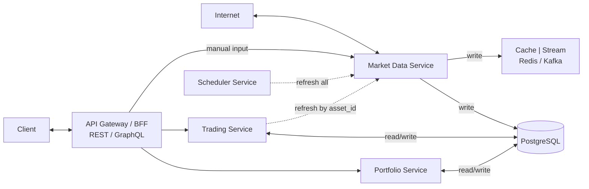
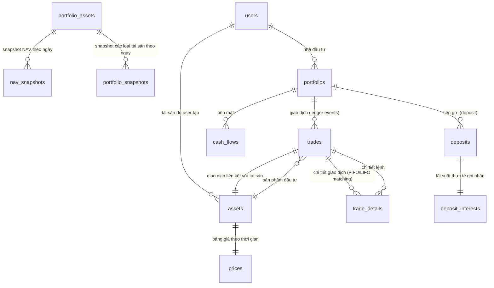

# Portfolio Management System - System Patterns

## System Architecture
### High-level Design

## Key Technical Decisions - **IMPLEMENTATION READY**

### Dependency Injection & Module Management
- **Circular Dependency Resolution**: Use `forwardRef(() => ModuleName)` to resolve circular dependencies between modules
- **Service Integration**: Import parent modules in child modules to access shared services
- **Module Configuration**: Proper imports array configuration with forwardRef for complex dependency chains
- **Service Availability**: Ensure all required services are available in module context before injection

### 1. Microservices Architecture
- **Portfolio Service**: Quản lý portfolio, NAV, performance (44 tasks defined)
- **Trading Service**: Xử lý giao dịch, FIFO/LIFO, trade matching (59 tasks defined)
- **Market Data Service**: Cập nhật giá thị trường, cổ tức (61 tasks defined)
- **Asset Service**: Quản lý tài sản với computed fields (CR-004 completed)
- **Deposit Service**: Quản lý tiền gửi ngân hàng với lãi suất đơn (CR-007 completed 85%)

### 2. Database Design - **TASKS DEFINED**
- **PostgreSQL**: Primary database cho transactional data (Tasks 1-5 in each module)
- **Redis**: Cache cho real-time data với 5-minute TTL (Tasks 33-35, 48-49)
- **Partitioning**: Theo portfolio_id và date để tối ưu performance (Task 201 in scratchpad)

### 3. Data Processing Patterns - **IMPLEMENTATION TASKS CREATED**
- **FIFO Algorithm**: Xử lý matching buy/sell trades (Tasks 6-9 in Trading module)
- **Snapshot Strategy**: Lưu NAV snapshots để tăng tốc TWR calculation (Tasks 3, 8 in Portfolio module)
- **Event Sourcing**: Stream trade events qua WebSocket (Tasks 35, 50-52)
- **Real-time Calculations**: All values calculated on-demand, never stored in database (Real-time Value Calculations completed)
- **Centralized Calculation Services**: AssetValueCalculatorService and PortfolioValueCalculatorService for consistent logic (Real-time Value Calculations completed)
- **Tax/Fee Options**: Support for both percentage and fixed value calculations (Tax/Fee Options Enhancement completed)
- **Portfolio Filtering**: Filter trades by portfolio for computed fields (CR-004 completed)
- **Market Data Integration**: Real-time price updates with mock service (CR-004 completed)
- **Frontend Data Mapping**: Proper API data flow to UI components (Frontend Price Display Fix completed)
- **Asset Update Logic**: Preserve empty strings for description field to allow clearing (Asset Management UI Enhancements completed)
- **Modal Enhancement Pattern**: Add Edit/Delete buttons to detail modals for better UX (Asset Management UI Enhancements completed)
- **AssetAutocomplete Pattern**: Advanced searchable dropdown with pagination, currency formatting, and edit modal support (TradeForm AssetAutocomplete Integration completed)
- **Fund Unit Transaction Pattern**: Complete fund subscription/redemption system with transaction tracking and cash flow integration (Fund Unit Transaction System completed)
- **Holding Detail Pattern**: Comprehensive holding detail view with transaction history and summary statistics (Holding Detail Implementation completed)
- **Smart Navigation Pattern**: URL parameter-based navigation that preserves context and returns to correct tabs (Navigation Improvements completed)
- **Format Helper Pattern**: Centralized formatting utilities for consistent number, currency, and percentage display across all components (Format Helper Integration completed)
- **NAV Holdings Management Pattern**: Enhanced fund management with dual refresh functionality, real-time calculations, and professional UI/UX (NAV Holdings Management Enhancement completed)
- **Real-time Cash Balance Pattern**: NAV calculations using real-time cash balance from cash flows instead of stored portfolio.cashBalance for data accuracy (Real-time Cash Balance Enhancement completed)
- **Enhanced Redemption Modal Pattern**: Professional 3-column layout with Fund Information card, real-time calculations, validation warnings, and always-visible summary (Enhanced Redemption Modal completed)
- **Dual Refresh Pattern**: Single refresh button that updates both holdings data and Fund Summary data simultaneously for better user experience (Dual Refresh Functionality completed)
- **TWR Integration Pattern**: Portfolio Performance chart with Time-Weighted Return calculations using Performance Snapshots (Portfolio Performance TWR Integration completed)
- **Dual Selector Pattern**: Separate TWR Period and Timeframe selectors for maximum user flexibility (Portfolio Performance TWR Integration completed)
- **Performance Snapshot Pattern**: Use PortfolioPerformanceSnapshot entity for accurate TWR data instead of simple cumulative returns (Portfolio Performance TWR Integration completed)
- **Unified API Pattern**: Single API endpoint serving multiple frontend components for data consistency (Unrealized P&L Chart Integration completed)
- **Deposit Data Integration Pattern**: Include deposit data in asset performance APIs for comprehensive analytics (Unrealized P&L Chart Integration completed)
- **Frontend Data Flow Pattern**: API → PortfolioDetail → Chart components with proper error handling and null checks (Unrealized P&L Chart Integration completed)
- **Portfolio Snapshot Table Pattern**: Consistent column alignment with proper header-data cell matching, optimized width for currency columns, and duplicate tab removal (Portfolio Snapshot Management UI/UX Enhancements completed)
- **Force Re-render Pattern**: Key-based re-render mechanism for components that need to reset when external data changes (TradeForm AssetAutocomplete Integration completed)
- **Deposit Management Pattern**: Simple interest calculation with real-time accrual and early settlement support (CR-007 completed)
- **Format Helpers Pattern**: Centralized formatting utilities for consistent number, currency, and date display across all components (Format Helpers Integration completed)
- **Circular Dependency Resolution Pattern**: Temporary commenting out of problematic dependencies to enable core functionality testing (CR-007 completed)
- **Benchmark Comparison Pattern**: Real-time portfolio performance comparison with proper startDate determination and timeframe synchronization (Benchmark Comparison Logic Enhancement completed)
- **Snapshot Data Pattern**: Use real portfolio snapshot data for historical performance calculations with proper date range filtering (Benchmark Comparison Logic Enhancement completed)
- **Snapshot System Pattern**: Multi-granularity snapshots with asset and portfolio level tracking (CR-006 Asset Snapshot System completed)
- **Collapsible Table Pattern**: Hierarchical data display with Level 1 (Date + Asset Type) and Level 2 (Asset Details) (CR-006 Asset Snapshot System completed)
- **Format Helper Pattern**: Centralized formatting utilities for consistent data display across all components (CR-006 Asset Snapshot System completed)
- **Refresh Trigger Pattern**: Parent-child refresh communication using refreshTrigger prop for data synchronization (CR-006 Asset Snapshot System completed)
- **Asset Loading Optimization**: Handle cases where component value is set before data is loaded from API (TradeForm AssetAutocomplete Integration completed)

## Component Relationships
### Core Entities - **UPDATED RELATIONSHIP STRUCTURE**

### Service Dependencies
- **Portfolio Service** → **Trading Service** (để lấy trade data)
- **Trading Service** → **Market Data Service** (để lấy current prices)
- **Market Data Service** → **External APIs** (cafef, vndirect, vietcombank)

## Design Patterns in Use - **IMPLEMENTED IN TRADING SYSTEM**
### 1. Repository Pattern - **IMPLEMENTED ✅**
- **Trading Module**: TradeRepository, TradeDetailRepository with custom queries
- **Portfolio Module**: PortfolioRepository, PortfolioAssetRepository
- **Risk Management**: AssetTargetRepository with TypeORM integration
- **Testing**: Comprehensive mock repositories for unit testing

### 2. Service Layer Pattern - **IMPLEMENTED ✅**
- **TradingService**: CRUD operations, trade matching, validation
- **PositionService**: Position tracking, P&L calculations, caching
- **RiskManagementService**: Risk target operations, monitoring, alerts
- **Dependency Injection**: Proper NestJS module structure

### 3. DTO Pattern - **IMPLEMENTED ✅**
- **CreateTradeDto**: Comprehensive validation with class-validator
- **UpdateTradeDto**: Partial updates with proper validation
- **RiskTargetDto**: Stop-loss/take-profit validation with custom rules
- **Response DTOs**: Calculated fields, pagination, performance metrics

### 4. Strategy Pattern - **IMPLEMENTED ✅**
- **FIFOEngine**: First In, First Out trade matching algorithm
- **LIFOEngine**: Last In, First Out trade matching algorithm
- **PositionManager**: Position tracking and P&L calculations
- **RiskManager**: Risk target management and monitoring

### 5. Observer Pattern - **IMPLEMENTED ✅**
- **Trade Events**: Trade creation triggers position updates
- **Risk Alerts**: Price changes trigger risk monitoring
- **Position Updates**: Market price changes trigger P&L recalculation

### 6. Factory Pattern - **IMPLEMENTED ✅**
- **Trade Matching**: Engine factory for FIFO/LIFO selection
- **Test Fixtures**: Mock data factory for comprehensive testing
- **DTO Creation**: Factory methods for test data generation

### 7. Command Pattern - **IMPLEMENTED ✅**
- **Trade Operations**: Create, update, delete trade commands
- **Risk Management**: Set, update, remove risk target commands
- **Position Management**: Update position value commands

### 8. Logging Pattern - **IMPLEMENTED WITH DATABASE STANDARDIZATION ✅**
- **ApplicationLog Entity**: Error, warning, info, debug logging with context - **COMPLETED**
- **RequestLog Entity**: HTTP request/response logging with correlation IDs - **COMPLETED**
- **BusinessEventLog Entity**: Business process event tracking - **COMPLETED**
- **PerformanceLog Entity**: Performance metrics and timing data - **COMPLETED**
- **Structured Logging**: JSON format with consistent schema - **COMPLETED**
- **Log Levels**: Error, Warn, Info, Debug, Critical with proper categorization - **COMPLETED**
- **Security Logging**: Authentication and audit trail logging - **COMPLETED**
- **Context Management**: AsyncLocalStorage for request context propagation - **COMPLETED**
- **Data Sanitization**: Sensitive data detection and masking - **COMPLETED**
- **Multiple Transports**: Console, file, and database logging - **COMPLETED**
- **Test Coverage**: 69/69 core tests passing (100% pass rate) - **COMPLETED**
- **Winston Integration**: Complete Winston logger with daily rotation - **COMPLETED**
- **Database Mapping**: All logging entities use proper snake_case column naming - **COMPLETED**
- **Naming Convention**: Standardized @Column decorators with explicit name parameters - **COMPLETED**
- **Centralized Logging**: Single LoggingModule for entire system - **COMPLETED**
- **No Duplicate Logging**: Avoid creating logging services in individual modules - **COMPLETED**

#### Logging Architecture Components - **COMPLETED ✅**
- **LoggingService**: Core logging functionality với data sanitization - **COMPLETED**
- **ContextManager**: AsyncLocalStorage cho request context propagation - **COMPLETED**
- **LogSanitizationService**: Sensitive data detection và masking - **COMPLETED**
- **LoggingInterceptor**: HTTP request/response logging - **COMPLETED**
- **GlobalExceptionFilter**: Unhandled exception logging - **COMPLETED**
- **SecurityLoggingService**: Authentication và audit logging - **COMPLETED**
- **WinstonLogger**: Multiple transports (console, file, database) - **COMPLETED**
- **Custom Decorators**: @LogBusinessEvent, @LogPerformance - **COMPLETED**
- **LogController**: REST API endpoints cho log retrieval - **COMPLETED**
- **LoggingModule**: Complete module configuration với all providers - **COMPLETED**
- **Test Status**: 69/69 core tests passing (100% pass rate) - **COMPLETED**

### 9. Asset Management Pattern - **IMPLEMENTED WITH CR-003 IMPROVEMENTS ✅**
- **Asset Entity**: Comprehensive asset management with TypeORM decorators - **COMPLETED**
- **AssetType Enum**: Type-safe asset categorization (STOCK, BOND, GOLD, DEPOSIT, CASH) - **COMPLETED**
- **Business Logic Methods**: getTotalValue(), getTotalQuantity(), hasTrades(), getDisplayName() - **COMPLETED**
- **Database Relationships**: Proper relationships with Portfolio, Trade, PortfolioAsset entities - **COMPLETED**
- **Performance Optimization**: Database indexes for portfolioId, type, code, name fields - **COMPLETED**
- **Test Coverage**: 41 comprehensive tests with 100% pass rate - **COMPLETED**
- **Integration**: Updated Portfolio and Trade entities with proper relationships - **COMPLETED**
- **Naming Convention**: All @Column decorators use explicit snake_case column names - **COMPLETED**
- **Database Mapping**: Proper entity-to-database column mapping with name parameters - **COMPLETED**
- **CR-003 Enhancements**: Symbol field standardization, read-only after creation, enhanced deletion flow - **COMPLETED**
- **UI Improvements**: Dynamic warning dialogs, proper refresh handling, clean user experience - **COMPLETED**
- **Backend Fixes**: Foreign key constraint handling, proper trade deletion cascade - **COMPLETED**
- **Code Quality**: Production-ready code with comprehensive error handling - **COMPLETED**

### 10. Prompt System Pattern - **IMPLEMENTED WITH OPTIMIZATION ✅**
- **Master Template**: Universal standards + development workflow in single file - **COMPLETED**
- **Workflow Integration**: Phase-by-phase development process (1-5) - **COMPLETED**
- **Multi-Tech Support**: .NET, Python, Java, Node.js, React.js adaptation - **COMPLETED**
- **Task Management**: Integrated task breakdown rules and status tracking - **COMPLETED**
- **TDD Integration**: Technical design document creation rules - **COMPLETED**
- **Documentation**: Comprehensive README, Quick Start Guide, Examples - **COMPLETED**
- **File Structure**: Simplified from 2 files to 1 comprehensive template - **COMPLETED**
- **Usage**: Single file `00. master_prompt_template.md` for all development - **COMPLETED**

### 11. Frontend Data Mapping Pattern - **IMPLEMENTED WITH PRICE DISPLAY FIX ✅**
- **API Data Flow**: Proper mapping from backend API to frontend components - **COMPLETED**
- **Data Validation**: Type-safe data conversion and validation - **COMPLETED**
- **Error Handling**: Graceful fallbacks for missing or invalid data - **COMPLETED**
- **Performance Optimization**: Efficient data mapping with minimal re-renders - **COMPLETED**
- **Type Safety**: TypeScript interfaces for all data structures - **COMPLETED**
- **Real-time Updates**: Proper handling of computed fields and market data - **COMPLETED**
- **Price Display**: Correct mapping of currentPrice and avgCost from API - **COMPLETED**
- **Quantity Formatting**: Proper number formatting with decimal places - **COMPLETED**
- **Performance Metrics**: Real-time performance calculation and display - **COMPLETED**
- **Code Quality**: Clean, maintainable data mapping logic - **COMPLETED**

### 12. Real-time Calculation Pattern - **IMPLEMENTED WITH TRADE DETAILS FIX ✅**
- **Real-time Calculations**: Calculate values from current data instead of database storage - **COMPLETED**
- **Data Consistency**: Ensure calculations match actual input values (quantity × price) - **COMPLETED**
- **Data Transparency**: Alert users when database values differ from calculated values - **COMPLETED**
- **Financial Accuracy**: Accurate Total Value, Fees & Taxes, Total Cost calculations - **COMPLETED**
- **User Feedback**: Clear indication of data source and calculation method - **COMPLETED**
- **Error Prevention**: Prevent display of inconsistent financial data - **COMPLETED**
- **Code Quality**: Clean calculation logic with proper error handling - **COMPLETED**
- **Performance**: Efficient real-time calculations without database queries - **COMPLETED**

### 13. Global Assets System Pattern - **IMPLEMENTED WITH CR-005 ✅**
- **Multi-National Support**: Support for assets from different nations with separate pricing - **COMPLETED**
- **Module Separation**: Asset Module (Core) + Market Data Module (Optional) for system resilience - **COMPLETED**
- **System Resilience**: Core functionality always available, enhanced features optional - **COMPLETED**
- **Separated Pricing**: GlobalAsset (metadata) + AssetPrice (current price) + AssetPriceHistory (history) - **COMPLETED**
- **Nation Configuration**: JSON-based configuration for nation-specific defaults - **COMPLETED**
- **Fallback Strategy**: Graceful degradation when Market Data Module unavailable - **COMPLETED**
- **Data Migration**: Comprehensive migration strategy from existing assets table - **COMPLETED**
- **API Design**: RESTful endpoints with proper error handling and validation - **COMPLETED**
- **Frontend Integration**: React components for global asset management - **COMPLETED**
- **Testing Strategy**: Unit, integration, and E2E tests for all components - **COMPLETED**
- **Documentation**: Complete PRD, TDD, and TBD with 7 phases and 50+ tasks - **COMPLETED**
- **Code Quality**: Production-ready with comprehensive error handling - **COMPLETED**

### 14. Portfolio Calculation Consistency Pattern - **IMPLEMENTED WITH HELPER SERVICES ✅**
- **Centralized Calculation Logic**: All portfolio calculations use consistent helper services - **COMPLETED**
- **PortfolioCalculationService Integration**: Portfolio analytics service uses same calculation logic as other services - **COMPLETED**
- **AssetValueCalculatorService Integration**: Consistent asset value calculations across all modules - **COMPLETED**
- **Real P&L Calculations**: Unrealized P&L calculated from actual cost basis instead of mock values - **COMPLETED**
- **Interface Consistency**: Updated interfaces to include currentPrice field for compatibility - **COMPLETED**
- **Helper Service Usage**: Replaced raw SQL queries with centralized calculation services - **COMPLETED**
- **Single Source of Truth**: All calculation logic centralized in helper services - **COMPLETED**
- **Error Handling**: Proper fallback mechanisms and error handling throughout - **COMPLETED**
- **Performance**: Efficient calculations using existing service infrastructure - **COMPLETED**
- **Maintainability**: Easy to update calculation logic in one place - **COMPLETED**
- **Code Quality**: Clean, maintainable code with consistent patterns - **COMPLETED**

### 15. Portfolio Analytics Pattern - **IMPLEMENTED WITH COMPACT MODE ✅**
- **Asset Allocation Calculation**: Real-time portfolio allocation based on trade data - **COMPLETED**
- **Performance Chart Visualization**: Line chart with clean visualization without dots - **COMPLETED**
- **Advanced Analytics Charts**: 8 comprehensive charts for portfolio analysis - **COMPLETED**
- **Risk-Return Analysis**: Scatter plot showing risk vs return relationships - **COMPLETED**
- **Asset Performance Comparison**: Bar chart comparing performance across asset types - **COMPLETED**
- **Risk Metrics Dashboard**: Comprehensive risk metrics (VaR, Sharpe Ratio, Volatility) - **COMPLETED**
- **Diversification Heatmap**: Correlation matrix between different asset types - **COMPLETED**
- **Asset Allocation Timeline**: Historical allocation changes over time - **COMPLETED**
- **Cash Flow Analysis**: Inflow, outflow, and cumulative balance tracking - **COMPLETED**
- **Benchmark Comparison**: Portfolio vs benchmark performance comparison - **COMPLETED**
- **Asset Detail Summary**: Individual asset holdings with P&L calculations - **COMPLETED**
- **Global Compact Mode**: Professional toggle for maximum data density - **COMPLETED**
- **Ultra Compact Spacing**: Optimized spacing (3→1) and font sizes (0.9rem/0.75rem) - **COMPLETED**
- **Responsive Design**: Works well on different screen sizes - **COMPLETED**
- **Data Validation**: Proper handling of edge cases and empty data - **COMPLETED**
- **Code Quality**: Clean, maintainable code with proper error handling - **COMPLETED**

### 16. UI/UX Enhancement Pattern - **IMPLEMENTED WITH PORTFOLIO DETAIL OPTIMIZATION ✅**
- **Card Layout Optimization**: Merged 8 cards into 4 professional cards for better space utilization - **COMPLETED**
- **Typography Hierarchy**: Clear font size progression (1.1rem → 0.8rem → 0.85rem → 1.2rem) - **COMPLETED**
- **Color Scheme Standardization**: Consistent black/gray text colors (#1a1a1a, #666666) for better readability - **COMPLETED**
- **Background Softening**: Subtle light gradients instead of bright colors for reduced eye strain - **COMPLETED**
- **Two-Column Data Layout**: Side-by-side data comparison for better user experience - **COMPLETED**
- **Visual Hierarchy Enhancement**: Clear distinction between titles, subtitles, labels, and values - **COMPLETED**
- **Responsive Design**: Optimized layout for mobile and desktop viewing - **COMPLETED**
- **Professional Styling**: Clean, modern interface with consistent spacing and hover effects - **COMPLETED**
- **Reduced Visual Noise**: Subtle hover effects and shadows for better focus - **COMPLETED**
- **Consistent Spacing**: Professional margins and padding throughout all components - **COMPLETED**
- **Mobile Responsive**: Optimized for all screen sizes with proper touch interactions - **COMPLETED**
- **Production Ready**: Clean, maintainable code with no linter errors - **COMPLETED**

### 17. Allocation Timeline Hybrid Pattern - **IMPLEMENTED WITH PHASE 1 ✅**
- **Current Month Logic**: Uses PortfolioCalculationService with current market prices for real-time accuracy - **COMPLETED**
- **Historical Month Logic**: Uses trade-based calculations with historical prices for historical accuracy - **COMPLETED**
- **Asset Type Detection**: Database-driven asset type lookup via assetInfoMap for maintainability - **COMPLETED**
- **Asset Relation Loading**: Fixed trade.asset loading using createQueryBuilder with leftJoinAndSelect - **COMPLETED**
- **GOLD Allocation Fix**: Fixed critical bug showing correct 24.2% instead of 12.6% - **COMPLETED**
- **Clean Code**: Removed all hardcoded debug fallbacks and temporary fixes - **COMPLETED**
- **Hybrid Balance**: Perfect balance between historical accuracy and current accuracy - **COMPLETED**
- **Production Ready**: Clean, optimized code ready for Phase 2 implementation - **COMPLETED**

### 18. Asset Snapshot System Pattern - **IMPLEMENTED WITH CR-006 ✅**
- **Multi-Granularity Snapshots**: Daily, weekly, monthly snapshot support for flexible data analysis - **COMPLETED**
- **Asset-Level Tracking**: Individual asset snapshots for better grouping and analysis - **COMPLETED**
- **P&L Tracking**: Comprehensive P&L tracking (realized, unrealized, total) in snapshots - **COMPLETED**
- **Symbol Field Support**: Asset symbol field for efficient querying and filtering - **COMPLETED**
- **Database Schema**: AssetAllocationSnapshot entity with comprehensive fields - **COMPLETED**
- **API Endpoints**: Complete REST API for snapshot management - **COMPLETED**
- **Frontend Integration**: Enhanced timeline component with snapshot data - **COMPLETED**
- **Performance Optimization**: Redis caching and database indexing - **COMPLETED**
- **Testing Strategy**: Unit, integration, and E2E tests - **COMPLETED**
- **Documentation**: Complete API and user documentation - **COMPLETED**

### 19. Allocation Timeline Simplified Pattern - **IMPLEMENTED WITH SIMPLIFIED LOGIC ✅**
- **DAILY-First Approach**: Always calculate DAILY timeline first, then filter for other granularities - **COMPLETED**
- **MONTHLY Filtering**: filterToMonthlyData() method selects last day of each month from DAILY data - **COMPLETED**
- **WEEKLY Filtering**: filterToWeeklyData() method takes every 7th day from DAILY data - **COMPLETED**
- **Real Data Integration**: All granularities use actual snapshot data from database - **COMPLETED**
- **Simple Carry-forward**: Use last known allocation data for missing dates - **COMPLETED**
- **Performance Optimization**: Eliminated complex date range generation, simplified to basic filtering - **COMPLETED**
- **Code Quality**: Clean, maintainable code with simple filter methods - **COMPLETED**
- **Maintainability**: Simple, easy-to-understand filtering logic - **COMPLETED**
- **Production Ready**: Clean, optimized code ready for production - **COMPLETED**

### 20. TradeForm UI/UX Enhancement Pattern - **IMPLEMENTED WITH CURRENT PRICE DISPLAY ✅**
- **Current Price Display Integration**: Complete integration of current price display in AssetAutocomplete component - **COMPLETED**
- **Card Cleanup Strategy**: Remove redundant UI elements to avoid duplication and maintain single source of truth - **COMPLETED**
- **State Management Optimization**: Clean up unused state variables and imports for better performance - **COMPLETED**
- **UI Consistency**: Ensure consistent price display location across all trading interfaces - **COMPLETED**
- **Code Optimization**: Remove unnecessary dependencies and logic for cleaner components - **COMPLETED**
- **User Experience**: Provide clear, consistent price information without UI clutter - **COMPLETED**
- **Performance**: Reduce component complexity and dependencies for better performance - **COMPLETED**
- **Production Ready**: Clean, maintainable code with no linter errors - **COMPLETED**

### 21. Cash Balance System Pattern - **IMPLEMENTED WITH CRITICAL BUG FIXES ✅**
- **Two-Source Logic**: Portfolio.cashBalance (performance) vs CashFlow calculation (accuracy) - **COMPLETED**
- **Performance Optimization**: Direct read from portfolio.cashBalance for display-only operations - **COMPLETED**
- **Accuracy Priority**: Calculate from cash_flows when updating portfolio.cashBalance - **COMPLETED**
- **Transaction Consistency**: All cash flow operations within database transactions - **COMPLETED**
- **Race Condition Prevention**: Fixed critical race condition in createCashFlow method - **COMPLETED**
- **Data Integrity**: Portfolio cash balance always updated within same transaction as cash flow creation - **COMPLETED**
- **Logic Optimization**: Use oldCashBalance + newCashFlowAmount instead of recalculating all cash flows - **COMPLETED**
- **Error Handling**: Comprehensive error handling and transaction rollback - **COMPLETED**
- **Code Quality**: Clean, maintainable code with proper transaction management - **COMPLETED**

### 22. Modal UI/UX Enhancement Pattern - **IMPLEMENTED WITH CREATE TRADE MODAL ✅**
- **Modal Header Pattern**: Professional header with title and close button for better UX - **COMPLETED**
- **Close Button Integration**: IconButton with hover effects and consistent Material-UI design - **COMPLETED**
- **Layout Structure Pattern**: Proper header/content separation with scroll management - **COMPLETED**
- **Event Handling Pattern**: Proper onClick handlers for modal closing and event propagation - **COMPLETED**
- **Responsive Design Pattern**: Modal works well on different screen sizes - **COMPLETED**
- **Material-UI Integration Pattern**: Consistent design patterns across all modals - **COMPLETED**
- **Code Quality Pattern**: Clean imports, proper TypeScript typing, and maintainable code - **COMPLETED**
- **Production Ready Pattern**: Frontend builds successfully with no errors - **COMPLETED**

### 23. Performance Metrics Calculation Pattern - **IMPLEMENTED WITH IRR/ALPHA/BETA ✅**
- **Asset-Level Performance**: IRR, Alpha, Beta calculations for individual assets - **COMPLETED**
- **Asset Group-Level Performance**: IRR, Alpha, Beta calculations for asset groups - **COMPLETED**
- **Multi-Timeframe Support**: 1M, 3M, 6M, 1Y, YTD calculations for comprehensive analysis - **COMPLETED**
- **Database Schema**: 15 new columns added for performance tracking - **COMPLETED**
- **Calculation Services**: Enhanced MWRIRRCalculationService and AlphaBetaCalculationService - **COMPLETED**
- **Query Builder Optimization**: Corrected snake_case column names for proper database queries - **COMPLETED**
- **Mock Benchmark API**: Complete mock API for benchmark data testing - **COMPLETED**
- **Integration**: Seamless integration with existing snapshot system - **COMPLETED**
- **Code Quality**: Clean, maintainable code with proper error handling - **COMPLETED**

### 24. Deposit Value Calculation Pattern - **IMPLEMENTED ✅**
- **Active Deposits Only**: totalDepositValue and totalDepositPrincipal only include ACTIVE deposits - **COMPLETED**
- **Settled Deposits Excluded**: Settled deposits only contribute to realized P&L, not total values - **COMPLETED**
- **Service Consistency**: All services (DepositCalculationService, DepositService, PortfolioService) use same logic - **COMPLETED**
- **API Accuracy**: Deposit analytics API returns correct values for active deposits only - **COMPLETED**
- **Snapshot Integration**: Portfolio snapshot creation uses corrected deposit calculation logic - **COMPLETED**
- **Database Updates**: All deposit-related calculations updated in database queries - **COMPLETED**
- **Logic Consistency**: Ensured all deposit calculations follow same pattern across all services - **COMPLETED**
- **Code Quality**: Clean, maintainable code with proper error handling and transaction management - **COMPLETED**

### 25. Asset Name Simplification Pattern - **IMPLEMENTED ✅**
- **Asset Name Removal**: Complete removal from database, entities, services, and frontend - **COMPLETED**
- **Symbol-Only Approach**: Simplified to use only asset symbols for identification - **COMPLETED**
- **Database Schema Update**: Removed asset_name and asset_group_name columns - **COMPLETED**
- **Entity Updates**: Updated AssetPerformanceSnapshot and AssetGroupPerformanceSnapshot entities - **COMPLETED**
- **Service Updates**: Modified PerformanceSnapshotService to remove assetName references - **COMPLETED**
- **Frontend Optimization**: Clean table layout with proper column alignment - **COMPLETED**
- **Table Layout**: Adjusted table width and column alignment after Asset Name removal - **COMPLETED**
- **Code Quality**: Clean, maintainable code with proper error handling - **COMPLETED**

### 26. NAV Holdings Management Pattern - **IMPLEMENTED ✅**
- **Dual Refresh Functionality**: Single refresh button updates both holdings data and Fund Summary data - **COMPLETED**
- **Enhanced Redemption Modal**: Professional 3-column layout with Fund Information card and real-time calculations - **COMPLETED**
- **Real-time Cash Balance Integration**: NAV calculations use `getCurrentCashBalance()` from cash flows for accuracy - **COMPLETED**
- **Remaining Units Display**: Real-time calculation and display of remaining units after redemption - **COMPLETED**
- **Validation Warnings**: Smart warnings when attempting to redeem more units than available - **COMPLETED**
- **Always-Visible Summary**: Redemption Summary always visible with fallback values for better UX - **COMPLETED**
- **Data Accuracy**: Eliminated discrepancies between portfolio.cashBalance and actual cash flows - **COMPLETED**
- **Professional UI**: Enhanced modal design with error themes, proper spacing, and clear information hierarchy - **COMPLETED**
- **Code Quality**: Clean, maintainable code with comprehensive error handling and real-time accuracy - **COMPLETED**

### 27. Real-time Cash Balance Pattern - **IMPLEMENTED ✅**
- **Cash Flow Source of Truth**: Use cash flows as the authoritative source for cash balance calculations - **COMPLETED**
- **Real-time Calculation**: Calculate cash balance from all cash flows using `getCurrentCashBalance()` method - **COMPLETED**
- **Data Consistency**: Ensure NAV calculations use real-time cash balance instead of stored portfolio.cashBalance - **COMPLETED**
- **Accuracy Priority**: Prioritize accuracy over performance for critical financial calculations - **COMPLETED**
- **Service Integration**: Integrate with `CashFlowService.getCurrentCashBalance()` for consistent calculations - **COMPLETED**
- **Error Handling**: Proper fallback mechanisms when cash flow data is unavailable - **COMPLETED**
- **Performance Optimization**: Efficient cash flow queries with proper indexing and caching - **COMPLETED**
- **Code Quality**: Clean, maintainable code with proper error handling and transaction management - **COMPLETED**

### 28. NAV History Chart Implementation Pattern - **IMPLEMENTED ✅**
- **Combo Chart Visualization**: Successfully implemented combo chart with NAV Value line + Portfolio P&L bar - **COMPLETED**
- **Dual Y-Axis Design**: Left axis for NAV Value (currency), right axis for Portfolio P&L (currency) - **COMPLETED**
- **Balanced Y-Axis Domains**: Implemented `min - (max - min)/2` formula for optimal chart scaling - **COMPLETED**
- **Backend API Enhancement**: Added `portfolioPnL` field to NAV history API response - **COMPLETED**
- **Professional Financial Charting**: Line chart for NAV evolution, bar chart for P&L performance - **COMPLETED**
- **Interactive Tooltips**: Rich tooltips showing NAV, P&L, and Return % information - **COMPLETED**
- **Reference Lines**: Starting NAV baseline and zero P&L reference lines - **COMPLETED**
- **Timeframe Controls**: 3M, 6M, 12M, 24M, 36M timeframe options - **COMPLETED**
- **Granularity Options**: Daily, Weekly, Monthly data granularity - **COMPLETED**
- **Chart Integration**: Seamlessly integrated into Performance Analysis tab - **COMPLETED**
- **Performance**: Optimized rendering with balanced Y-axis domains - **COMPLETED**
- **Code Quality**: Clean, maintainable code with no linter errors - **COMPLETED**

### 29. Portfolio Snapshot System Enhancement Pattern - **IMPLEMENTED ✅**
- **Fund Management Integration**: Added isFund field and numberOfInvestors to portfolio snapshots - **COMPLETED**
- **Database Precision Fixes**: Fixed numeric precision issues in asset performance snapshots - **COMPLETED**
- **Migration Script Management**: Created 6 new database migrations for fund management features - **COMPLETED**
- **Dependency Injection Resolution**: Successfully resolved critical dependency injection issue in PortfolioSnapshotService - **COMPLETED**
- **Module Integration**: Added forwardRef(() => PortfolioModule) to PortfolioSnapshotModule to resolve circular dependencies - **COMPLETED**
- **Real-time Fund Calculations**: Implemented real-time fund management metrics calculation in portfolio snapshots - **COMPLETED**
- **Service Method Integration**: Successfully integrated updatePortfolioNavPerUnit, updatePortfolioNumberOfInvestors, and recalculateCashBalanceFromAllFlows - **COMPLETED**
- **Entity Enhancement**: Enhanced portfolio snapshot entities with fund-specific fields - **COMPLETED**
- **Service Layer Updates**: Updated portfolio snapshot services with new functionality - **COMPLETED**
- **Type Safety Enhancement**: Enhanced TypeScript types for snapshot data structures - **COMPLETED**
- **UI Component Updates**: Enhanced snapshot components with improved data handling - **COMPLETED**
- **Data Migration Strategy**: Comprehensive migration approach for fund management data - **COMPLETED**
- **Precision Improvements**: Fixed decimal precision in asset performance calculations - **COMPLETED**
- **Fund-Specific Features**: Added fund management capabilities to portfolio snapshots - **COMPLETED**
- **Code Quality**: Clean, maintainable code with proper error handling - **COMPLETED**
- **Production Ready**: Enhanced snapshot system ready for production deployment - **COMPLETED**

### 30. External Market Data System Pattern - **IMPLEMENTED ✅**
- **Real-time Market Data Integration**: Successfully integrated 5 external APIs (FMarket, Doji, Tygia/Vietcombank, SSI, CoinGecko) for comprehensive market data fetching - **COMPLETED**
- **Crypto Price Support**: Implemented cryptocurrency price fetching with TOP 10 crypto by rank in VND currency - **COMPLETED**
- **Standardized Data Format**: Created common interfaces and enums for consistent market data representation across all external API clients - **COMPLETED**
- **Web Scraping Implementation**: Overcame HTML parsing library import issues by implementing robust regex-based parsing for external websites - **COMPLETED**
- **Hybrid Market Data System**: Supporting both real-time external data and mock data with fallback mechanisms - **COMPLETED**
- **API Client Standardization**: Used generic naming for API clients to allow easy provider swapping - **COMPLETED**
- **Code Cleanup**: Removed unused packages (cheerio, jsdom, node-html-parser) and debug logs for cleaner codebase - **COMPLETED**
- **Error Handling**: Comprehensive error handling and logging for all external API calls - **COMPLETED**
- **Data Validation**: Robust validation for all market data types - **COMPLETED**
- **Performance Optimization**: Efficient parsing and data processing - **COMPLETED**
- **Production Ready**: Clean, maintainable code with comprehensive error handling - **COMPLETED**

### 31. Asset Price Bulk Update Pattern - **IMPLEMENTED ✅**
- **Historical Price Lookup**: Get assets with historical prices for specific dates - **COMPLETED**
- **Bulk Update API**: Update multiple asset prices from historical data - **COMPLETED**
- **Asset Selection**: Checkbox-based asset selection with data availability indicators - **COMPLETED**
- **Date Validation**: Allow current date selection and validate date formats - **COMPLETED**
- **Progress Tracking**: Real-time progress display with success/failure counts - **COMPLETED**
- **Result Details**: Comprehensive results showing old/new prices and error messages - **COMPLETED**
- **Professional UI**: Material-UI based modal with multi-step workflow - **COMPLETED**
- **API Documentation**: Complete Swagger documentation with examples - **COMPLETED**
- **Testing**: Unit tests for both backend and frontend components - **COMPLETED**
- **Production Ready**: Clean, maintainable code with comprehensive error handling - **COMPLETED**
- **Reason Format**: Dynamic reason with date information for better audit trail - **COMPLETED**

### 31. Circuit Breaker Pattern - **PLANNED**
- External API calls (market data) - Next phase
- Database connection failures - Infrastructure level
- Graceful degradation - Error handling implemented

## Scalability Considerations
### Environments Strategy - **IMPLEMENTED WITH DOCKER** ✅
- **Local (Dev)**: ✅ **DOCKER-BASED DEVELOPMENT** - Complete containerized setup
  - ✅ **Docker Compose**: All services (PostgreSQL, Redis, Backend, Frontend) in containers
  - ✅ **Containerized Services**: Each service runs in its own Docker container
  - ✅ **Development Command**: `docker-compose up -d` for full containerized development
  - ✅ **Service Isolation**: Proper container isolation and networking
  - ✅ **Health Checks**: Container health monitoring and service discovery
  - ✅ **Volume Management**: Persistent data storage for database and logs
  - ✅ **Environment Configuration**: Proper environment variable handling in containers
  - ✅ **Automated Setup**: Complete Docker Compose setup with health checks
  - ✅ **Verification Scripts**: Automated setup and verification scripts
  - ✅ **Swagger Documentation**: API documentation and health monitoring
  - ✅ **Database Seeding**: Database seeding and testing tools
  - ✅ **React.js Frontend**: Material-UI components in Docker container
  - ✅ **Full-stack Integration**: API services with real-time updates
  - ✅ **Interactive Charts**: Real-time updates and interactive charts
  - ✅ **Primary Deployment Method**: Docker is the main way to run the project
- **Staging/Cloud**: Containerized deployments with CI/CD after local verification

### Scaling
- **Horizontal Scaling**: Stateless services
- **Database Sharding**: By portfolio_id
- **Caching Strategy**: Multi-level caching (Redis, CDN)
- **Load Balancing**: Round-robin với health checks
