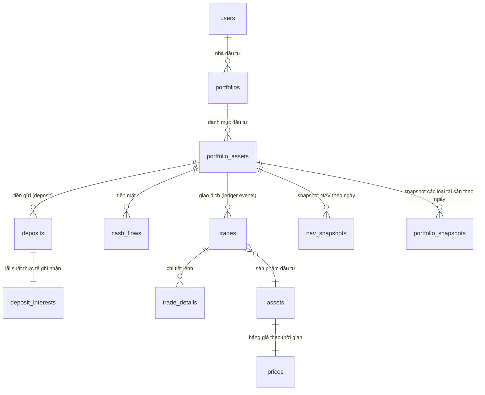
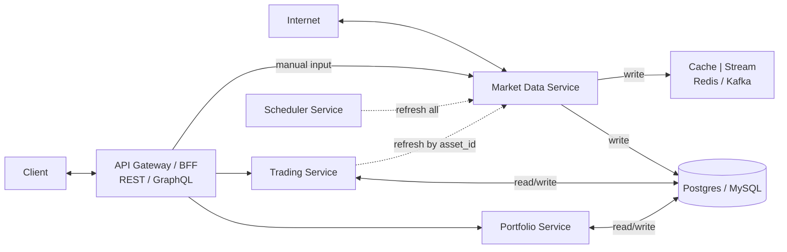

# Portfolio Management System - draft ideas

## Technology Stack
### Frontend Stack
    - Reactjs
    - TypeScript

### Backend Stack    
    - Nestjs
    - PostgreSQL (use local memory storage first and will be changed to database later)
    - Redis

### Infrastructure & DevOps
    - Docker
    - CI/CD
    - GIT
    - Cloud ("Local implementation and run" stage before cloud deployment)

---

## High-level design

**Data schema**

### Deposits
**Gửi tiền**: Đồng thời ghi 1 dòng `cash_flows` âm (tiền ra khỏi tài khoản tiền mặt)
**Tất toán**: `status='CLOSED'` đồng thời ghi 1 dòng `cash_flow` dương

### Trades: Xử lý cổ tức tiền và cổ phiếu
**Cổ tức tiền**:
- A. Thu nhập tiền mặt `"DIVIDEND_CASH"`
- B. Tái đầu tư (giả sử cổ phiếu giá 25,000) `"DIVIDEND_REINVEST"`

**Cổ tức cổ phiếu**:
- A. Giá vốn điều chỉnh (thêm số lượng, giá = 0) `"DIVIDEND_STOCK"`
- B. Ghi nhận vốn mới (giá thị trường 25,000) `"DIVIDEND_STOCK_FAIRVALUE"`

- Schema nên lưu `trade_type` chi tiết (`DIVIDEND_CASH`, `DIVIDEND_REINVEST`, `DIVIDEND_STOCK`, `DIVIDEND_STOCK_FAIRVALUE`)
- Trong report engine, cho phép user chọn phương pháp tính (Income basis / Reinvestment basis)

**Ứng dụng trong báo cáo**:
- Báo cáo hiệu quả vốn (TWR, IRR): thường dùng phương pháp (B) để phản ánh chính xác tác động của dòng tiền
- Báo cáo thu nhập/lãi lỗ cho thuế: thường dùng phương pháp (A) vì sát với tiền mặt thực nhận

### Trade_details: 
**Thuật toán FIFO** (ý tưởng)
- Lấy tất cả BUY trades của 1 mã, sắp xếp theo `trade_date ASC`
- Lấy SELL trades, cũng sắp xếp `trade_date ASC`
- Khi gặp 1 lệnh bán, "rút" số lượng từ các BUY còn dư theo thứ tự FIFO
- Mỗi lần rút, tạo một record trong `trade_details`

### market prices: bảng giá theo thời gian
- **Stock**: lấy dữ liệu từ cafef hoặc công ty chứng khoán như vndirect, ssi. Có thể cập nhật sau.
- **Gold**: lấy dữ liệu từ cafef. Có thể cập nhật sau.
- **Tỷ giá**: lấy dữ liệu từ vietcombank. Có thể cập nhật sau.

---

## Deep dives

### Notes:
**Trading Service:** ghi nhận giao dịch, xử lý FIFO/LIFO, khớp lệnh, trade_details.
**Redis:** cache giá real-time.
**Kafka:** streaming trade events, market data feed
**Market Data Service:** cập nhật giá thị trường, cổ tức, tỷ giá.
**RDBMS (Postgres/MySQL)** để lưu investors, portfolios, trades, assets, dividends. Hỗ trợ Partition + Index để tăng tốc.

---

## APIs & interface
### **Portfolio service**
    - Portfolios
        POST /api/v1/portfolios {"name": "Danh mục tăng trưởng", "currency": "VND"} -> { "portfolio_id": 101, "name": "Danh mục tăng trưởng", "currency": "VND", "created_at": "..." }
        GET /api/v1/portfolios -> [ { "portfolio_id": 101, "name": "Danh mục tăng trưởng", "total_value": 150000000, "unrealized_pl_pct": 12.5 } ]
        GET /api/v1/portfolios/:id ?filter="assettype=all&assetname=all" -> { "portfolio_id": 101, "name": "Danh mục tăng trưởng", "total_value": 150000000, "unrealized_pl_pct": 12.5 },
                                                                                            "assets": [ { "asset_id": 1, "symbol": "HPG", "quantity": 2000, "avg_cost": 27000, "market_price": 31000, "unrealized_pl": 8000000 } ], 
                                                                                            "cash": [{ "source":"VCbank", "currency": "VND", "balance": 50000000 }],
                                                                                            "deposit":[{"name":"tiết kiệm", "source":"HSBC", "currency": "VND", "capital": 5000, "interest_rate":0.5, "from":"...", "to":"..."}] 
                                                                                         }
    
        GET /api/v1/portfolios/:id/allocation?groupby="type|name" -> { "equities": 65, "bonds": 20, "gold": 10, "cash": 5 }
        GET /api/v1/portfolios/:id/allocation?groupby="type|name"&period=3m -> [{ "equities": 65, "bonds": 20, "gold": 10, "cash": 5, "created_at":"..." }]
    
    
        GET /api/v1/portfolios/:id/assets -> [ {"asset_id":1, "symbol":"HPG", "asset_type":"STOCK", "quantity":100, "avg_cost": 27000, "market_price": 31000, 
                                                            "total_value":3100000, "unrealized_pl": 400000, "stoploss":27000, "take_profit":33000} 
                                                        ]
        GET /api/portfolios/:id/assets/performance -> [{"asset_id":1, "symbol":"HPG", "holding_days":10, "monthlyReturn":0.15, "dod_change":0.01, "pct_history":[]}
        
        GET /api/v1/portfolios/:id/trades -> [ { "trade_id": 555, "symbol": "HPG", "source":"VnDirect", "type": "BUY", "quantity": 1000, "price": 28000, "pnl": 2000000, "trade_date":"..." } ]
       
    - Positions
        GET /api/v1/portfolios/:id/positions -> [ { "asset_id": 1, "symbol": "HPG", "quantity": 2000, "avg_cost": 27000, "market_price": 31000, "unrealized_pl": 8000000 } ]    
      
    - NAV & PnL
        GET /api/v1/portfolios/:id/nav -> { "portfolio_id": 101, "total_value": 150000000, "cash": 50000000, "unrealized_pl": 8000000, "realized_pl": 2000000 }
        GET /api/v1/portfolios/:id/nav?period=all -> [{ "portfolio_id": 101, "total_value": 150000000, "cash": 50000000, "unrealized_pl": 8000000, "realized_pl": 2000000, "created_at":"..." }]
    
    - TWR/XIRR
        GET /api/v1/portfolios/:id/performance?period="3m|6m|12m" -> [{ "period": "3m", "twr": 0.12, "irr": 0.11 }, { "period": "6m", "twr": 0.20, "irr": 0.1 }]
        GET /api/v1/portfolios/:id/performance?fromdate=""&todate="" -> { "twr": 0.12, "irr": 0.11, "report_date": "..." }
    
        GET /api/v1/portfolios/:id/wow?fromdate=""&todate="" -> [ {"created_at":"2025-08-25", "changePct":0.1} ]

### **Trade service**
    - Trades
        POST /api/v1/trades { "portfolio_id": 101, "asset_name": "HPG", "asset_type": "stock", "source":"VnDirect", "type": "BUY", 
                                        "quantity": 1000, "price": 28000, 
                                        "trade_type":"normal", "trade_date": "2025-08-25" 
                                    } 
                                    -> { "trade_id": 555, "asset_id":1, "status": "recorded" }
        
    - Assets
        POST /api/v1/assets/:id/target {"stoploss":27000, "take_profit":33000} -> {"status":"recorded"}
        GET /api/v1/assets/:id/target -> {"asset_id":1, "stoploss":27000, "take_profit":33000}

    - Dividends
        POST /api/v1/dividends/cash { "portfolio_id": 101, "asset_id": 1, "amount": 2000000, "ex_date": "2025-08-01" } -> { "dividend_id": 888, "status": "applied" }
        POST /api/v1/dividends/stock { "portfolio_id": 101, "asset_id": 1, "ratio": 0.1, "ex_date": "2025-08-01" } -> { "dividend_id": 889, "added_shares": 200 }
  

### **Market data service**
    - Manual input data
        POST /api/v1/market/{"asset_name": "DOJI", "price": 19000, "apply_date":"..."} -> {true/false}
        POST /api/v1/market/:asset_id {"asset_name": "DOJI", "price": 20000, "apply_date":"..."} -> {true/false}
    
    - Auto crawl data    
        GET /api/v1/market/refresh?id={:id | null}

### **Realtime NAV**
    expose WebSocket hoặc gRPC stream /api/v1/stream/portfolio/:id

## DataBase scripts
**-- Tài khoản nhà đầu tư**
CREATE TABLE accounts (
    account_id      UUID PRIMARY KEY,
    name            TEXT NOT NULL,
    base_currency   TEXT NOT NULL DEFAULT 'USD'
);

**-- Danh mục**
CREATE TABLE portfolios (
    portfolio_id    UUID PRIMARY KEY,
    account_id      UUID NOT NULL REFERENCES accounts(account_id),
    name            TEXT NOT NULL,
    base_currency   TEXT NOT NULL DEFAULT 'USD'
);

**-- Sản phẩm đầu tư (Cổ phiếu, Trái phiếu, ETF, Vàng…)**
CREATE TABLE assets (
    asset_id   UUID PRIMARY KEY,
    symbol          TEXT NOT NULL,
    type            TEXT NOT NULL,      -- STOCK, BOND, ETF, GOLD...
    asset_class     TEXT NOT NULL,      -- Equities, FixedIncome, Commodities...
    currency        TEXT NOT NULL
);

**-- Tiền gửi (deposit)**
CREATE TABLE deposits (
    deposit_id      UUID PRIMARY KEY,
    portfolio_id    UUID NOT NULL REFERENCES portfolios(portfolio_id),
    currency        TEXT NOT NULL,
    principal       NUMERIC(20,2) NOT NULL,
    interest_rate   NUMERIC(5,2) NOT NULL,   -- %/năm
    start_date      DATE NOT NULL,
    maturity_date   DATE NOT NULL,
    compounding     TEXT NOT NULL DEFAULT 'SIMPLE',
    status          TEXT NOT NULL DEFAULT 'ACTIVE' -- ACTIVE / CLOSED
);

**-- Giao dịch chứng khoán / trái phiếu**
CREATE TABLE trades (
    trade_id        UUID PRIMARY KEY,
    portfolio_id    UUID NOT NULL REFERENCES portfolios(portfolio_id),
    asset_id   UUID NOT NULL REFERENCES assets(asset_id),
    trade_date      TIMESTAMP NOT NULL,
    side            TEXT NOT NULL CHECK (side IN ('BUY','SELL')),
    quantity        NUMERIC(20,6) NOT NULL,
    price           NUMERIC(20,6) NOT NULL,
    fee             NUMERIC(20,6) DEFAULT 0,
    tax             NUMERIC(20,6) DEFAULT 0,
    trade_type VARCHAR(20) DEFAULT 'NORMAL'; -- NORMAL, DIVIDEND_CASH, DIVIDEND_REINV, DIVIDEND_STOCK, DIVIDEND_STOCK_FV
);

**-- Giá thị trường**
CREATE TABLE prices (
    asset_id   UUID NOT NULL REFERENCES assets(asset_id),
    price_date      TIMESTAMP NOT NULL,
    price           NUMERIC(20,6) NOT NULL,
    PRIMARY KEY (asset_id, price_date)
);

**-- Lãi định kỳ của tiền gửi**
CREATE TABLE deposit_interests (
    deposit_id      UUID NOT NULL REFERENCES deposits(deposit_id),
    interest_date   DATE NOT NULL,
    interest_amount NUMERIC(20,2) NOT NULL,
    PRIMARY KEY (deposit_id, interest_date)
);

**-- Tiền mặt & dòng tiền (nạp, rút, phí, lãi...)**
CREATE TABLE cash_flows (
    cashflow_id     UUID PRIMARY KEY,
    portfolio_id    UUID NOT NULL REFERENCES portfolios(portfolio_id),
    flow_date       TIMESTAMP NOT NULL,
    amount          NUMERIC(20,2) NOT NULL,  -- >0 nạp tiền, <0 rút tiền
    currency        TEXT NOT NULL,
    type            TEXT NOT NULL            -- DEPOSIT, WITHDRAW, INTEREST, FEE...
);

**-- Lưu chi tiết từng lệnh bán khớp với lệnh mua nào**
CREATE TABLE trade_details (
    detail_id      BIGSERIAL PRIMARY KEY,
    sell_trade_id  UUID NOT NULL REFERENCES trades(trade_id),
    buy_trade_id   UUID NOT NULL REFERENCES trades(trade_id),
    asset_id  UUID NOT NULL REFERENCES assets(asset_id),
    matched_qty    NUMERIC(20,6) NOT NULL,
    buy_price      NUMERIC(20,6) NOT NULL,
    sell_price     NUMERIC(20,6) NOT NULL,
    fee_tax        NUMERIC(20,6) DEFAULT 0, -- phí/thuế phân bổ theo qty
    pnl            NUMERIC(20,6) NOT NULL   -- lãi/lỗ đã thực hiện
);

**-- Snapshot NAV theo ngày (tùy chọn, để tăng tốc TWR)**
CREATE TABLE nav_snapshots (
    portfolio_id    UUID NOT NULL REFERENCES portfolios(portfolio_id),
    nav_date        DATE NOT NULL,
    nav_value       NUMERIC(20,6) NOT NULL,
    PRIMARY KEY (portfolio_id, nav_date)
);

**-- Lưu tổng sẵn trạng thái hiện tại**
CREATE TABLE portfolio_assets (
    portfolio_id    BIGINT NOT NULL,
    asset_id   BIGINT NOT NULL,
    quantity        NUMERIC(30,10) NOT NULL DEFAULT 0,   -- số lượng còn lại
    avg_cost        NUMERIC(18,6) NOT NULL DEFAULT 0,    -- giá vốn bình quân hoặc theo FIFO
    market_value    NUMERIC(18,6),                       -- giá trị thị trường hiện tại
    unrealized_pl   NUMERIC(18,6),                       -- lãi/lỗ chưa thực hiện
    updated_at      TIMESTAMP NOT NULL DEFAULT NOW(),
    PRIMARY KEY (portfolio_id, asset_id)
);

**-- Snapshot theo ngày để tối tốc độ tải**
CREATE TABLE portfolio_asset_snapshots (
    portfolio_id    BIGINT NOT NULL,
    asset_id   BIGINT NOT NULL,
    quantity        NUMERIC(30,10) NOT NULL DEFAULT 0,   -- số lượng còn lại
    avg_cost        NUMERIC(18,6) NOT NULL DEFAULT 0,    -- giá vốn bình quân hoặc theo FIFO
    market_value    NUMERIC(18,6),                       -- giá trị thị trường hiện tại
    unrealized_pl   NUMERIC(18,6),                       -- lãi/lỗ chưa thực hiện
    updated_at      TIMESTAMP NOT NULL DEFAULT NOW(),
    PRIMARY KEY (portfolio_id, asset_id)
);

