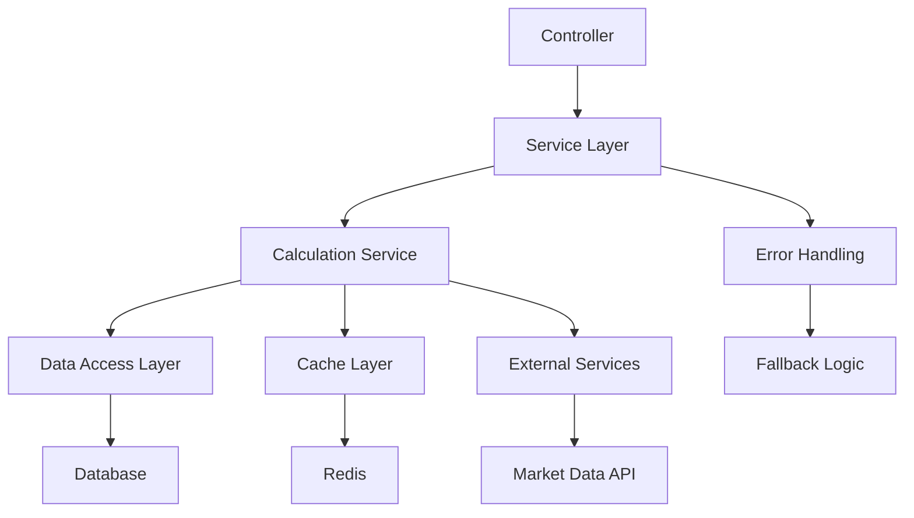
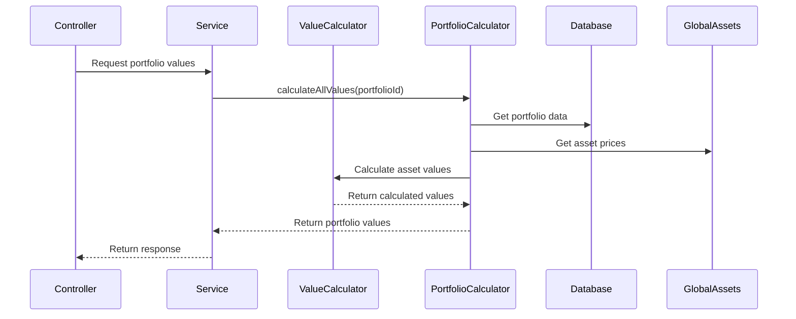

# Calculation Architecture Patterns

## Overview
This document defines the architectural patterns and design principles for calculation services in the Portfolio Management System.

## Architecture Principles

### 1. Separation of Concerns
- **Calculation Logic**: Isolated in dedicated services
- **Data Access**: Handled by repositories
- **Business Logic**: Managed by domain services
- **Presentation**: Handled by controllers and DTOs

### 2. Real-time Calculations
- **Never store calculated values** in database
- **Always calculate on-demand** when needed
- **Use caching** for performance optimization
- **Implement fallbacks** for data availability

### 3. Centralized Logic
- **Single source of truth** for each calculation type
- **Consistent interfaces** across all services
- **Easy to modify** and extend
- **Comprehensive testing** coverage

## Service Architecture

### Core Calculation Services

#### AssetValueCalculatorService
**Purpose**: Centralized asset value calculations
**Responsibilities**:
- Calculate current value with various deductions
- Support percentage and fixed value options
- Provide detailed calculation breakdowns
- Handle edge cases and error scenarios

**Interface**:
```typescript
interface AssetValueCalculatorService {
  calculateCurrentValue(quantity: number, currentPrice: number, options?: AssetValueCalculationOptions): number;
  calculateCurrentValueWithBreakdown(quantity: number, currentPrice: number, options?: AssetValueCalculationOptions): CalculationBreakdown;
  calculateTotalCurrentValue(assets: AssetPosition[]): number;
  calculateUnrealizedPL(quantity: number, currentPrice: number, avgCost: number, options?: AssetValueCalculationOptions): number;
}
```

#### PortfolioValueCalculatorService
**Purpose**: Centralized portfolio value calculations
**Responsibilities**:
- Calculate total portfolio value
- Calculate realized and unrealized P&L
- Provide performance metrics
- Handle portfolio-level calculations

**Interface**:
```typescript
interface PortfolioValueCalculatorService {
  calculateTotalValue(portfolioId: string): Promise<number>;
  calculateRealizedPL(portfolioId: string): Promise<number>;
  calculateUnrealizedPL(portfolioId: string): Promise<number>;
  calculateAllValues(portfolioId: string): Promise<PortfolioValues>;
  calculatePerformanceMetrics(portfolioId: string): Promise<PerformanceMetrics>;
}
```

### Data Flow Architecture



### Calculation Flow



## Design Patterns

### 1. Strategy Pattern
**Use Case**: Different calculation strategies for different asset types
**Implementation**:
```typescript
interface CalculationStrategy {
  calculate(asset: Asset, options: CalculationOptions): number;
}

class StockCalculationStrategy implements CalculationStrategy {
  calculate(asset: Asset, options: CalculationOptions): number {
    // Stock-specific calculation logic
  }
}

class BondCalculationStrategy implements CalculationStrategy {
  calculate(asset: Asset, options: CalculationOptions): number {
    // Bond-specific calculation logic
  }
}
```

### 2. Factory Pattern
**Use Case**: Create appropriate calculation options
**Implementation**:
```typescript
class CalculationOptionsFactory {
  static createStockOptions(): AssetValueCalculationOptions {
    return {
      commission: { type: 'percentage', value: 0.1 },
      tax: { type: 'percentage', value: 15 }
    };
  }
  
  static createBondOptions(): AssetValueCalculationOptions {
    return {
      commission: { type: 'fixed', value: 500 },
      tax: { type: 'percentage', value: 5 }
    };
  }
}
```

### 3. Builder Pattern
**Use Case**: Complex calculation option construction
**Implementation**:
```typescript
class CalculationOptionsBuilder {
  private options: AssetValueCalculationOptions = {};
  
  withTax(type: 'percentage' | 'fixed', value: number): this {
    this.options.tax = { type, value };
    return this;
  }
  
  withFee(type: 'percentage' | 'fixed', value: number): this {
    this.options.fee = { type, value };
    return this;
  }
  
  build(): AssetValueCalculationOptions {
    return this.options;
  }
}
```

### 4. Observer Pattern
**Use Case**: Notify when calculations change
**Implementation**:
```typescript
interface CalculationObserver {
  onCalculationChanged(assetId: string, newValue: number): void;
}

class CalculationService {
  private observers: CalculationObserver[] = [];
  
  addObserver(observer: CalculationObserver): void {
    this.observers.push(observer);
  }
  
  private notifyObservers(assetId: string, newValue: number): void {
    this.observers.forEach(observer => 
      observer.onCalculationChanged(assetId, newValue)
    );
  }
}
```

## Error Handling Architecture

### Error Hierarchy
```typescript
abstract class CalculationError extends Error {
  abstract readonly code: string;
  abstract readonly statusCode: number;
}

class InvalidInputError extends CalculationError {
  readonly code = 'INVALID_INPUT';
  readonly statusCode = 400;
}

class CalculationTimeoutError extends CalculationError {
  readonly code = 'CALCULATION_TIMEOUT';
  readonly statusCode = 408;
}

class DataUnavailableError extends CalculationError {
  readonly code = 'DATA_UNAVAILABLE';
  readonly statusCode = 503;
}
```

### Fallback Strategy
```typescript
class CalculationService {
  async calculateWithFallback(assetId: string): Promise<number> {
    try {
      // Try primary calculation method
      return await this.primaryCalculation(assetId);
    } catch (error) {
      if (error instanceof DataUnavailableError) {
        // Try fallback method
        return await this.fallbackCalculation(assetId);
      }
      throw error;
    }
  }
}
```

## Caching Architecture

### Cache Strategy
```typescript
interface CacheStrategy {
  get(key: string): Promise<any>;
  set(key: string, value: any, ttl?: number): Promise<void>;
  invalidate(key: string): Promise<void>;
  invalidatePattern(pattern: string): Promise<void>;
}

class CalculationCacheService {
  constructor(
    private cache: CacheStrategy,
    private ttl: number = 300000 // 5 minutes
  ) {}
  
  async getOrCalculate<T>(
    key: string,
    calculator: () => Promise<T>
  ): Promise<T> {
    const cached = await this.cache.get(key);
    if (cached) {
      return cached;
    }
    
    const result = await calculator();
    await this.cache.set(key, result, this.ttl);
    return result;
  }
}
```

### Cache Invalidation
```typescript
class CacheInvalidationService {
  async invalidateAssetCalculations(assetId: string): Promise<void> {
    const patterns = [
      `asset:${assetId}:*`,
      `portfolio:*:asset:${assetId}:*`,
      `calculation:*:asset:${assetId}:*`
    ];
    
    await Promise.all(
      patterns.map(pattern => this.cache.invalidatePattern(pattern))
    );
  }
}
```

## Performance Optimization

### Batch Processing
```typescript
class BatchCalculationService {
  async calculateMultipleAssets(assetIds: string[]): Promise<Map<string, number>> {
    // Group by portfolio to minimize database queries
    const portfolioGroups = await this.groupAssetsByPortfolio(assetIds);
    
    const results = new Map<string, number>();
    
    for (const [portfolioId, assets] of portfolioGroups) {
      const portfolioResults = await this.calculatePortfolioAssets(portfolioId, assets);
      portfolioResults.forEach((value, assetId) => {
        results.set(assetId, value);
      });
    }
    
    return results;
  }
}
```

### Database Optimization
```typescript
// Use joins instead of multiple queries
const query = `
  SELECT 
    a.id,
    a.current_quantity,
    COALESCE(ap.current_price, 0) as current_price,
    ga.symbol
  FROM assets a
  LEFT JOIN global_assets ga ON a.symbol = ga.symbol
  LEFT JOIN asset_prices ap ON ga.id = ap.asset_id
  WHERE a.id IN (${assetIds.join(',')})
`;
```

## Testing Architecture

### Test Structure
```
tests/
├── unit/
│   ├── asset-value-calculator.service.spec.ts
│   ├── portfolio-value-calculator.service.spec.ts
│   └── calculation-options.spec.ts
├── integration/
│   ├── calculation-flow.spec.ts
│   └── cache-integration.spec.ts
└── e2e/
    ├── portfolio-calculations.spec.ts
    └── asset-calculations.spec.ts
```

### Test Data Management
```typescript
class CalculationTestDataBuilder {
  static createAsset(overrides: Partial<Asset> = {}): Asset {
    return {
      id: 'test-asset-1',
      symbol: 'TEST',
      currentQuantity: 100,
      currentPrice: 1000,
      ...overrides
    };
  }
  
  static createCalculationOptions(overrides: Partial<AssetValueCalculationOptions> = {}): AssetValueCalculationOptions {
    return {
      tax: { type: 'percentage', value: 10 },
      fee: { type: 'fixed', value: 500 },
      ...overrides
    };
  }
}
```

## Monitoring and Observability

### Metrics Collection
```typescript
class CalculationMetricsService {
  private calculationCounter = new Counter({
    name: 'calculations_total',
    help: 'Total number of calculations performed',
    labelNames: ['type', 'status']
  });
  
  private calculationDuration = new Histogram({
    name: 'calculation_duration_seconds',
    help: 'Duration of calculations in seconds',
    labelNames: ['type']
  });
  
  recordCalculation(type: string, duration: number, status: 'success' | 'error'): void {
    this.calculationCounter.inc({ type, status });
    this.calculationDuration.observe({ type }, duration);
  }
}
```

### Logging Strategy
```typescript
class CalculationLogger {
  logCalculationStart(assetId: string, options: AssetValueCalculationOptions): void {
    this.logger.debug('Starting calculation', {
      assetId,
      options,
      timestamp: new Date().toISOString()
    });
  }
  
  logCalculationResult(assetId: string, result: number, duration: number): void {
    this.logger.info('Calculation completed', {
      assetId,
      result,
      duration,
      timestamp: new Date().toISOString()
    });
  }
}
```

## Security Considerations

### Input Validation
```typescript
class CalculationInputValidator {
  validateQuantity(quantity: number): void {
    if (quantity < 0) {
      throw new InvalidInputError('Quantity cannot be negative');
    }
    if (quantity > 1000000) {
      throw new InvalidInputError('Quantity too large');
    }
  }
  
  validatePrice(price: number): void {
    if (price < 0) {
      throw new InvalidInputError('Price cannot be negative');
    }
    if (price > 1000000) {
      throw new InvalidInputError('Price too large');
    }
  }
}
```

### Data Sanitization
```typescript
class CalculationDataSanitizer {
  sanitizeOptions(options: AssetValueCalculationOptions): AssetValueCalculationOptions {
    return {
      tax: this.sanitizeTaxFeeOption(options.tax),
      fee: this.sanitizeTaxFeeOption(options.fee),
      commission: this.sanitizeTaxFeeOption(options.commission),
      otherDeductions: this.sanitizeTaxFeeOption(options.otherDeductions),
      discount: this.sanitizeTaxFeeOption(options.discount)
    };
  }
  
  private sanitizeTaxFeeOption(option: TaxFeeOption | number | undefined): TaxFeeOption | number | undefined {
    if (!option) return undefined;
    
    if (typeof option === 'number') {
      return Math.max(0, Math.min(option, 1000000));
    }
    
    return {
      type: option.type,
      value: Math.max(0, Math.min(option.value, 1000000))
    };
  }
}
```

## Conclusion

This architecture provides a robust, scalable, and maintainable foundation for calculation services. It ensures consistency, performance, and reliability while being flexible enough to accommodate future requirements.

Key benefits:
- **Consistency**: All calculations follow the same patterns
- **Performance**: Optimized for real-time calculations
- **Maintainability**: Clear separation of concerns
- **Testability**: Comprehensive testing strategies
- **Scalability**: Designed for growth and expansion
