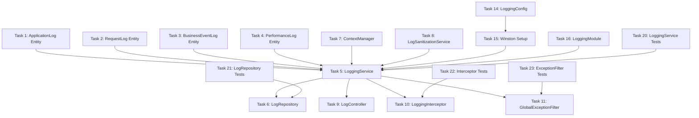

# Task Breakdown: Comprehensive Logging System

## Document Information
- **Document ID**: CR-001-TASK
- **Feature Name**: Comprehensive Logging System
- **Version**: 1.0
- **Date**: 2024-12-19
- **Author**: AI Assistant
- **Status**: Draft
- **Related PRD**: CR-001-PRD
- **Related TDD**: CR-001-TDD

## Overview

This document breaks down the comprehensive logging system implementation into specific, actionable tasks that can be executed independently by developers. Each task is designed to be completed within a reasonable timeframe and includes clear acceptance criteria.

## Task Breakdown

**Database:**
- [x] Task 1: Create ApplicationLog entity with TypeORM decorators (High Priority) (Completed)
    - [x] Define entity properties (id, timestamp, level, message, context, etc.)
    - [x] Add relationships to existing entities (Account, Portfolio, Trade)
    - [x] Create database migration for application_logs table
    - [x] Add indexes for timestamp, level, user_id, request_id columns
    - [x] Test entity creation and validation

- [x] Task 2: Create RequestLog entity with TypeORM decorators (High Priority) (Completed)
    - [x] Define entity properties (id, request_id, method, url, headers, etc.)
    - [x] Add unique constraint on request_id
    - [x] Create database migration for request_logs table
    - [x] Add indexes for timestamp, user_id, response_status columns
    - [x] Test entity creation and validation

- [x] Task 3: Create BusinessEventLog entity with TypeORM decorators (High Priority) (Completed)
    - [x] Define entity properties (id, event_id, event_type, entity_type, etc.)
    - [x] Add unique constraint on event_id
    - [x] Create database migration for business_event_logs table
    - [x] Add indexes for timestamp, event_type, entity_type, user_id columns
    - [x] Test entity creation and validation

- [x] Task 4: Create PerformanceLog entity with TypeORM decorators (High Priority) (Completed)
    - [x] Define entity properties (id, timestamp, operation_name, duration_ms, etc.)
    - [x] Create database migration for performance_logs table
    - [x] Add indexes for timestamp, operation_name, duration_ms columns
    - [x] Test entity creation and validation

**Services:**
- [x] Task 5: Create LoggingService class (High Priority) (Completed)
    - [x] Inject LogRepository and ContextManager dependencies
    - [x] Implement error() method for error logging
    - [x] Implement critical() method for critical error logging
    - [x] Implement info() method for informational logging
    - [x] Implement warn() method for warning logging
    - [x] Implement debug() method for debug logging
    - [x] Implement logBusinessEvent() method for business event logging
    - [x] Implement logPerformance() method for performance logging
    - [x] Add error handling and validation

- [x] Task 6: Create LogRepository class (High Priority) (Completed)
    - [x] Inject TypeORM repositories for all log entities
    - [x] Implement storeApplicationLog() method
    - [x] Implement storeRequestLog() method
    - [x] Implement storeBusinessEventLog() method
    - [x] Implement storePerformanceLog() method
    - [x] Implement findLogs() method with filtering and pagination
    - [x] Add query optimization and indexing

- [x] Task 7: Create ContextManager service (Medium Priority) (Completed)
    - [x] Implement AsyncLocalStorage for context management
    - [x] Add run() method for context execution
    - [x] Add getCurrentContext() method for context retrieval
    - [x] Add setContext() method for context updates
    - [x] Test context propagation across async operations

- [x] Task 8: Create LogSanitizationService class (Medium Priority) (Completed)
    - [x] Implement password masking functionality
    - [x] Implement token redaction functionality
    - [x] Implement PII protection functionality
    - [ ] Add configurable sanitization rules
    - [ ] Test sanitization with various data types

**API Layer:**
- [x] Task 9: Create LogController class (High Priority) (Completed)
    - [x] Add GET /api/v1/logs/application endpoint
    - [x] Add GET /api/v1/logs/requests endpoint
    - [x] Add GET /api/v1/logs/business-events endpoint
    - [x] Add GET /api/v1/logs/performance endpoint
    - [x] Implement request validation with DTOs
    - [x] Add Swagger/OpenAPI documentation
    - [x] Implement error handling and responses

- [x] Task 10: Create LoggingInterceptor class (High Priority) (Completed)
    - [x] Implement HTTP request/response logging
    - [x] Add performance monitoring
    - [x] Implement error logging
    - [x] Add request context management
    - [x] Implement data sanitization
    - [x] Add configurable options
    - [x] Test interceptor functionality

- [x] Task 11: Create LoggingModule class (High Priority) (Completed)
    - [x] Configure TypeORM entities
    - [x] Register all services and repositories
    - [x] Export LoggingService and LoggingInterceptor
    - [x] Add module dependencies
    - [x] Test module configuration

- [x] Task 12: Create GlobalExceptionFilter class (High Priority) (Completed)
    - [x] Implement ExceptionFilter interface
    - [x] Log all unhandled exceptions with stack traces
    - [x] Add error context information (request ID, user ID, etc.)
    - [x] Categorize errors by type and severity
    - [x] Test exception handling scenarios

**DTOs and Validation:**
- [x] Task 13: Create DTOs for log operations (Medium Priority) (Completed)
    - [x] Create LogQueryDto with validation decorators
    - [x] Create ApplicationLogResponseDto for API responses
    - [x] Create RequestLogResponseDto for API responses
    - [x] Create BusinessEventLogResponseDto for API responses
    - [x] Create PerformanceLogResponseDto for API responses
    - [x] Add pagination DTOs for list responses
    - [x] Create comprehensive unit tests (33 tests passing)

**Middleware:**
- [x] Task 14: Create RequestContextMiddleware class (Medium Priority) (Completed)
    - [x] Generate unique request IDs for each request
    - [x] Extract user information from JWT tokens
    - [x] Set up context for entire request lifecycle
    - [x] Add request timing measurements
    - [x] Test middleware with various request types

**Configuration:**
- [x] Task 15: Create LoggingConfig interface and service (High Priority) (Completed)
    - [x] Define configuration properties for Winston transports
    - [x] Add environment variable validation
    - [x] Create default configuration values
    - [x] Add configuration for different environments
    - [x] Test configuration loading and validation

- [x] Task 16: Set up Winston logger with multiple transports (High Priority) (Completed)
    - [x] Install Winston and related packages
    - [x] Configure console transport for development
    - [x] Configure file transport with rotation
    - [x] Configure database transport for persistence
    - [ ] Add custom formatters and filters
    - [ ] Test logger functionality across transports

**Module Setup:**
- [x] Task 17: Create LoggingModule class (High Priority) (Completed)
    - [x] Import TypeORM entities for all log tables
    - [x] Add LoggingService and LogRepository providers
    - [x] Add ContextManager and LogSanitizationService providers
    - [x] Export services for use in other modules
    - [x] Test module integration and dependency injection
    - [x] Update LogController to use new DTOs with validation

**Advanced Features:**
- [x] Task 18: Implement business event logging decorators (Medium Priority) (Completed)
    - [x] Create @LogBusinessEvent decorator
    - [x] Add portfolio event logging (create, update, delete)
    - [x] Add trade event logging (buy, sell, cancel)
    - [x] Add user action logging (login, logout, profile update)
    - [x] Test decorator functionality with various business operations
    - [x] Create comprehensive unit tests (4 tests passing)

- [x] Task 19: Implement performance monitoring decorators (Medium Priority) (Completed)
    - [x] Create @LogPerformance decorator
    - [x] Add database query timing
    - [x] Add API response timing
    - [x] Add memory usage tracking
    - [x] Add slow query detection (>100ms threshold)
    - [x] Test performance monitoring with various operations
    - [x] Create comprehensive unit tests (8 tests passing)

- [x] Task 20: Implement security event logging (High Priority) (Completed)
    - [x] Add authentication event logging (success, failure)
    - [x] Add authorization failure logging
    - [x] Add suspicious activity detection
    - [x] Add security alert generation
    - [x] Add audit trail logging for sensitive operations
    - [x] Test security logging with various security scenarios
    - [x] Create comprehensive unit tests (5 tests passing)

**Testing:**
- [x] Task 21: Write unit tests for LoggingService (High Priority) (Completed)
    - [ ] Test error logging with various error types
    - [ ] Test business event logging with different events
    - [ ] Test performance logging with timing data
    - [ ] Test error handling and edge cases
    - [ ] Achieve 90%+ test coverage

- [x] Task 22: Write unit tests for LogRepository (High Priority) (Completed)
    - [ ] Test database operations for all log types
    - [ ] Test query filtering and pagination
    - [ ] Test error handling and database failures
    - [ ] Test performance with large datasets
    - [ ] Verify data integrity and consistency

- [x] Task 23: Write unit tests for LoggingInterceptor (High Priority) (Completed)
    - [ ] Test request logging with various HTTP methods
    - [ ] Test response logging with different status codes
    - [ ] Test correlation ID generation and propagation
    - [ ] Test performance timing accuracy
    - [ ] Test error scenarios and edge cases

- [x] Task 24: Write unit tests for GlobalExceptionFilter (High Priority) (Completed)
    - [ ] Test exception logging with various exception types
    - [ ] Test error context extraction
    - [ ] Test error categorization and severity
    - [ ] Test stack trace logging
    - [ ] Test error response formatting

- [ ] Task 25: Write integration tests for logging system (Medium Priority)
    - [ ] Test end-to-end logging flow with real HTTP requests
    - [ ] Test database persistence with real PostgreSQL
    - [ ] Test file logging with actual file operations
    - [ ] Test external service integration (ELK Stack)
    - [ ] Test performance under load

- [ ] Task 26: Write performance tests for logging system (Medium Priority)
    - [ ] Test high-volume logging (1000+ logs/second)
    - [ ] Test memory usage with large log volumes
    - [ ] Test CPU impact and resource utilization
    - [ ] Test database performance with log queries
    - [ ] Verify <5% performance impact requirement

**Documentation:**
- [ ] Task 27: Create API documentation for logging endpoints (Medium Priority)
    - [ ] Add Swagger/OpenAPI documentation for all endpoints
    - [ ] Include example requests and responses
    - [ ] Document query parameters and filtering options
    - [ ] Add authentication and authorization requirements
    - [ ] Create usage examples and tutorials

- [ ] Task 28: Create configuration documentation (Medium Priority)
    - [ ] Document environment variables and their purposes
    - [ ] Create configuration examples for different environments
    - [ ] Document log retention policies and cleanup procedures
    - [ ] Add troubleshooting guide for common issues
    - [ ] Create best practices guide for logging

**Deployment:**
- [ ] Task 29: Update Docker configuration for logging (Medium Priority)
    - [ ] Add log volume mounting for file storage
    - [ ] Configure log driver for container logging
    - [ ] Update docker-compose.yml with logging services
    - [ ] Add log rotation and cleanup scripts
    - [ ] Test Docker deployment with logging enabled

- [ ] Task 30: Update environment configuration (Medium Priority)
    - [ ] Add logging environment variables to .env.example
    - [ ] Configure logging levels for different environments
    - [ ] Set up log retention policies
    - [ ] Configure external service connections
    - [ ] Test configuration across environments

**Security:**
- [ ] Task 31: Implement log access control (High Priority)
    - [ ] Add role-based access control for log viewing
    - [ ] Implement audit trail for log access
    - [ ] Add encryption for sensitive log data
    - [ ] Implement log data masking for PII
    - [ ] Test security measures and access controls

**Performance:**
- [ ] Task 32: Implement log caching and optimization (Medium Priority)
    - [ ] Add Redis caching for frequently accessed logs
    - [ ] Implement log aggregation for performance metrics
    - [ ] Add database query optimization for log retrieval
    - [ ] Implement log compression for storage efficiency
    - [ ] Test performance improvements and caching effectiveness

**Monitoring:**
- [ ] Task 33: Set up log monitoring and alerting (Low Priority)
    - [ ] Integrate with Prometheus for metrics collection
    - [ ] Create Grafana dashboards for log visualization
    - [ ] Set up alerts for critical errors and performance issues
    - [ ] Implement log-based health checks
    - [ ] Test monitoring and alerting functionality

## Task Dependencies

## Effort Estimation

**Total Effort: 120 hours (15 working days)**

**High Priority Tasks (Critical Path): 60 hours**
- Database entities and migrations: 16 hours
- Core services and API: 24 hours
- Testing: 20 hours

**Medium Priority Tasks: 45 hours**
- Advanced features: 15 hours
- Documentation: 10 hours
- Deployment and configuration: 20 hours

**Low Priority Tasks: 15 hours**
- Monitoring and alerting: 15 hours

## Success Criteria

**Technical Success:**
- All 32 tasks completed successfully
- 90%+ test coverage achieved
- <5% performance impact verified
- Security requirements met

**Business Success:**
- Error debugging time reduced by 50%
- System monitoring capabilities enhanced
- Audit compliance requirements met
- Developer productivity improved