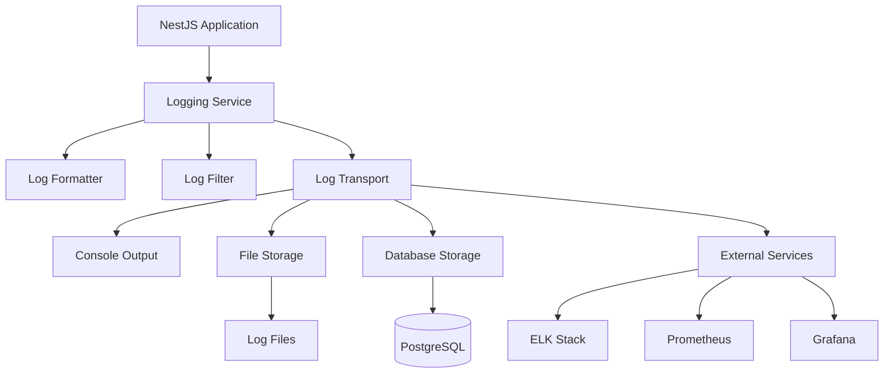
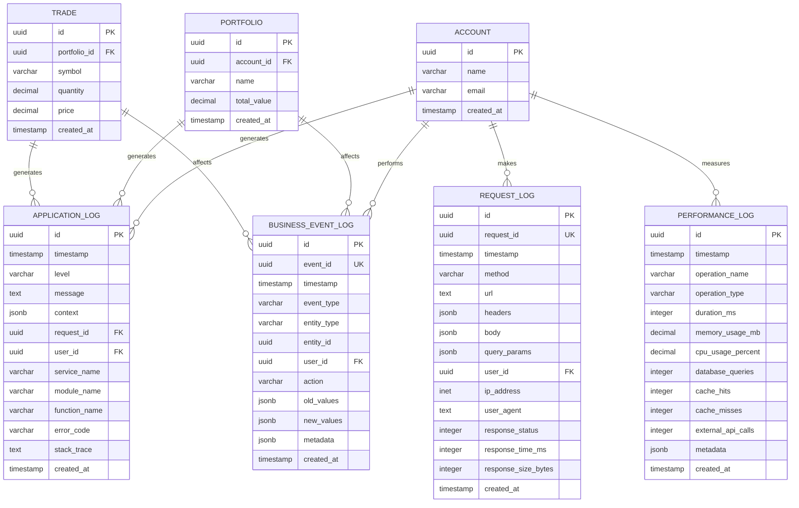
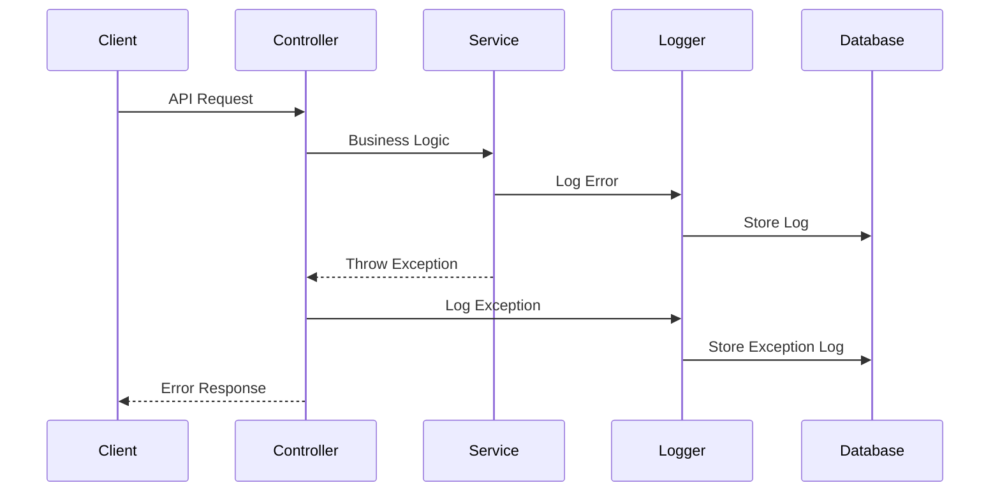
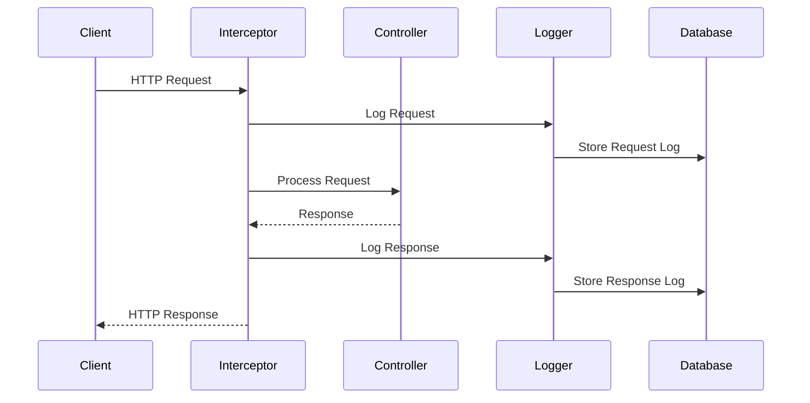
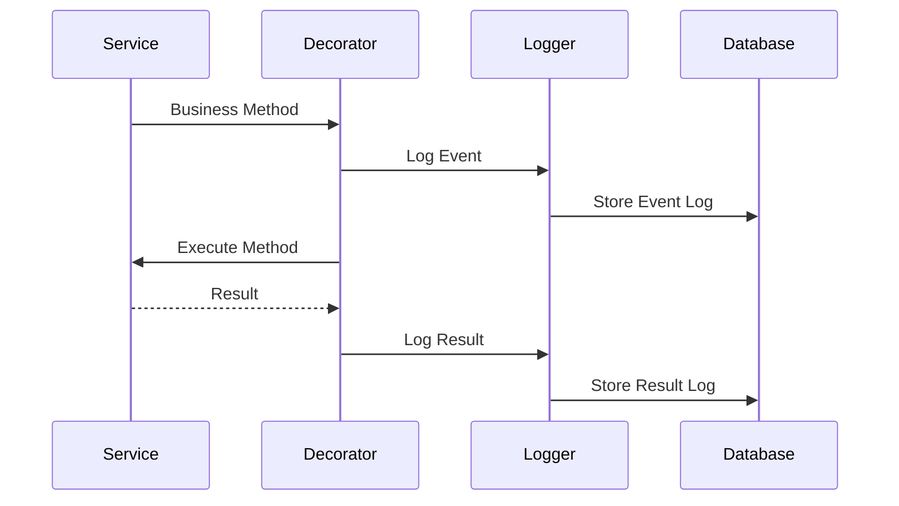
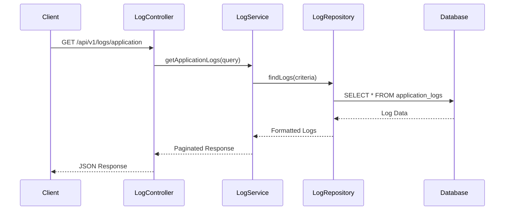

# Technical Design Document: Comprehensive Logging System

## Document Information
- **Document ID**: CR-001-TDD
- **Feature Name**: Comprehensive Logging System
- **Version**: 1.0
- **Date**: 2024-12-19
- **Author**: AI Assistant
- **Status**: Draft
- **Related PRD**: CR-001-PRD

## 1. Overview

This document outlines the technical design for implementing a comprehensive logging system in the Portfolio Management System. The logging system will provide structured error tracking, performance monitoring, and audit trails to help developers quickly understand and fix bugs, monitor system health, and maintain compliance.

The system will integrate seamlessly with the existing NestJS architecture, following established patterns and maintaining consistency with the current codebase structure.

## 2. Requirements

### 2.1 Functional Requirements

- **FR-001**: As a developer, I want all application errors to be logged with stack traces and context so that I can quickly identify and fix bugs
- **FR-002**: As a system administrator, I want to monitor HTTP requests and responses so that I can track API usage and performance
- **FR-003**: As a business analyst, I want business events to be logged so that I can track user actions and system behavior
- **FR-004**: As a performance engineer, I want performance metrics to be logged so that I can optimize system performance
- **FR-005**: As a security analyst, I want security events to be logged so that I can detect and respond to threats
- **FR-006**: As a compliance officer, I want audit trails to be maintained so that I can meet regulatory requirements

### 2.2 Non-Functional Requirements

- **NFR-001**: The logging system should not impact application performance by more than 5%
- **NFR-002**: All API endpoints must respond within 500ms including logging overhead
- **NFR-003**: The system should handle 1000+ concurrent users with logging enabled
- **NFR-004**: Logs should be searchable within 1 second for queries under 1 million records
- **NFR-005**: Sensitive data must be masked or excluded from logs
- **NFR-006**: Logs must be encrypted at rest and in transit
- **NFR-007**: The system should support log retention policies (30 days default)
- **NFR-008**: Log processing should be asynchronous to prevent blocking operations

## 3. Technical Design

### High-Level Architecture

The logging system will be integrated into the existing NestJS microservices architecture as a cross-cutting concern. It will provide centralized logging capabilities across all modules while maintaining performance and scalability.



### 3.1. Data Model Changes

The logging system will introduce four new entities to the existing PostgreSQL database. These entities will be integrated with the existing portfolio management system entities:



#### ApplicationLog Entity
```typescript
@Entity('application_logs')
export class ApplicationLog {
  @PrimaryGeneratedColumn('uuid')
  id: string;

  @Column({ type: 'timestamp with time zone', default: () => 'CURRENT_TIMESTAMP' })
  timestamp: Date;

  @Column({ type: 'varchar', length: 20 })
  level: string;

  @Column({ type: 'text' })
  message: string;

  @Column({ type: 'jsonb', nullable: true })
  context: Record<string, any>;

  @Column({ type: 'uuid', nullable: true })
  requestId: string;

  @Column({ type: 'uuid', nullable: true })
  userId: string;

  @Column({ type: 'varchar', length: 100 })
  serviceName: string;

  @Column({ type: 'varchar', length: 100, nullable: true })
  moduleName: string;

  @Column({ type: 'varchar', length: 100, nullable: true })
  functionName: string;

  @Column({ type: 'varchar', length: 50, nullable: true })
  errorCode: string;

  @Column({ type: 'text', nullable: true })
  stackTrace: string;

  @CreateDateColumn()
  createdAt: Date;
}
```

#### RequestLog Entity
```typescript
@Entity('request_logs')
export class RequestLog {
  @PrimaryGeneratedColumn('uuid')
  id: string;

  @Column({ type: 'uuid', unique: true })
  requestId: string;

  @Column({ type: 'timestamp with time zone', default: () => 'CURRENT_TIMESTAMP' })
  timestamp: Date;

  @Column({ type: 'varchar', length: 10 })
  method: string;

  @Column({ type: 'text' })
  url: string;

  @Column({ type: 'jsonb', nullable: true })
  headers: Record<string, any>;

  @Column({ type: 'jsonb', nullable: true })
  body: Record<string, any>;

  @Column({ type: 'jsonb', nullable: true })
  queryParams: Record<string, any>;

  @Column({ type: 'uuid', nullable: true })
  userId: string;

  @Column({ type: 'inet', nullable: true })
  ipAddress: string;

  @Column({ type: 'text', nullable: true })
  userAgent: string;

  @Column({ type: 'integer', nullable: true })
  responseStatus: number;

  @Column({ type: 'integer', nullable: true })
  responseTimeMs: number;

  @Column({ type: 'integer', nullable: true })
  responseSizeBytes: number;

  @CreateDateColumn()
  createdAt: Date;
}
```

#### BusinessEventLog Entity
```typescript
@Entity('business_event_logs')
export class BusinessEventLog {
  @PrimaryGeneratedColumn('uuid')
  id: string;

  @Column({ type: 'uuid', unique: true })
  eventId: string;

  @Column({ type: 'timestamp with time zone', default: () => 'CURRENT_TIMESTAMP' })
  timestamp: Date;

  @Column({ type: 'varchar', length: 100 })
  eventType: string;

  @Column({ type: 'varchar', length: 100 })
  entityType: string;

  @Column({ type: 'uuid' })
  entityId: string;

  @Column({ type: 'uuid', nullable: true })
  userId: string;

  @Column({ type: 'varchar', length: 50 })
  action: string;

  @Column({ type: 'jsonb', nullable: true })
  oldValues: Record<string, any>;

  @Column({ type: 'jsonb', nullable: true })
  newValues: Record<string, any>;

  @Column({ type: 'jsonb', nullable: true })
  metadata: Record<string, any>;

  @CreateDateColumn()
  createdAt: Date;
}
```

#### PerformanceLog Entity
```typescript
@Entity('performance_logs')
export class PerformanceLog {
  @PrimaryGeneratedColumn('uuid')
  id: string;

  @Column({ type: 'timestamp with time zone', default: () => 'CURRENT_TIMESTAMP' })
  timestamp: Date;

  @Column({ type: 'varchar', length: 100 })
  operationName: string;

  @Column({ type: 'varchar', length: 50 })
  operationType: string;

  @Column({ type: 'integer' })
  durationMs: number;

  @Column({ type: 'decimal', precision: 10, scale: 2, nullable: true })
  memoryUsageMb: number;

  @Column({ type: 'decimal', precision: 5, scale: 2, nullable: true })
  cpuUsagePercent: number;

  @Column({ type: 'integer', nullable: true })
  databaseQueries: number;

  @Column({ type: 'integer', nullable: true })
  cacheHits: number;

  @Column({ type: 'integer', nullable: true })
  cacheMisses: number;

  @Column({ type: 'integer', nullable: true })
  externalApiCalls: number;

  @Column({ type: 'jsonb', nullable: true })
  metadata: Record<string, any>;

  @CreateDateColumn()
  createdAt: Date;
}
```

### 3.2. API Changes

#### New Logging Module
A new `LoggingModule` will be created in `src/modules/logging/` following the existing module structure:

```typescript
// src/modules/logging/logging.module.ts
@Module({
  imports: [
    TypeOrmModule.forFeature([
      ApplicationLog,
      RequestLog,
      BusinessEventLog,
      PerformanceLog,
    ]),
  ],
  controllers: [LogController],
  providers: [
    LoggingService,
    LogRepository,
    ContextManager,
    LogSanitizationService,
  ],
  exports: [LoggingService, LogRepository],
})
export class LoggingModule {}
```

#### New API Endpoints

**LogController** will be created with the following endpoints:

- **GET** `/api/v1/logs/application` - Retrieve application logs with filtering and pagination
- **GET** `/api/v1/logs/requests` - Retrieve request logs with filtering and pagination  
- **GET** `/api/v1/logs/business-events` - Retrieve business event logs with filtering and pagination
- **GET** `/api/v1/logs/performance` - Retrieve performance logs with filtering and pagination

**Request Format:**
```json
{
  "page": 1,
  "limit": 50,
  "level": "error",
  "startDate": "2024-12-01T00:00:00Z",
  "endDate": "2024-12-31T23:59:59Z",
  "userId": "uuid",
  "module": "portfolio"
}
```

**Response Format:**
```json
{
  "data": [
    {
      "id": "uuid",
      "timestamp": "2024-12-19T10:30:00Z",
      "level": "error",
      "message": "Database connection failed",
      "context": {
        "requestId": "uuid",
        "userId": "uuid",
        "module": "portfolio"
      },
      "errorCode": "DB_CONNECTION_ERROR",
      "stackTrace": "Error: Connection timeout..."
    }
  ],
  "pagination": {
    "page": 1,
    "limit": 50,
    "total": 150,
    "totalPages": 3
  }
}
```

#### Global Exception Filter
```typescript
// src/filters/global-exception.filter.ts
@Catch()
export class GlobalExceptionFilter implements ExceptionFilter {
  constructor(private readonly loggingService: LoggingService) {}

  catch(exception: unknown, host: ArgumentsHost): void {
    // Log all unhandled exceptions with context
  }
}
```

#### Logging Interceptor
```typescript
// src/interceptors/logging.interceptor.ts
@Injectable()
export class LoggingInterceptor implements NestInterceptor {
  constructor(private readonly loggingService: LoggingService) {}

  intercept(context: ExecutionContext, next: CallHandler): Observable<any> {
    // Log HTTP requests and responses
  }
}
```

### 3.3. UI/Frontend Changes

No immediate frontend changes are required for the logging system implementation. However, future enhancements may include:

- **Log Dashboard**: A dedicated admin interface for viewing and analyzing logs
- **Real-time Log Streaming**: WebSocket-based log streaming for real-time monitoring
- **Log Search Interface**: Advanced search and filtering capabilities for logs

### 3.4. Logic Flow

The logging system will follow a consistent flow pattern across different types of logging operations. Here are the main flows:

#### Error Logging Flow


#### Request Logging Flow


#### Business Event Logging Flow


#### Log Retrieval Flow


### 3.5. Dependencies

#### New NPM Packages
The following packages will be added to support the logging system:

- **winston**: Primary logging library for Node.js applications
- **winston-daily-rotate-file**: File rotation for log management
- **morgan**: HTTP request logger middleware
- **cls-hooked**: Context management for request tracking
- **uuid**: UUID generation for request and event IDs

```json
{
  "dependencies": {
    "winston": "^3.11.0",
    "winston-daily-rotate-file": "^4.7.1",
    "morgan": "^1.10.0",
    "cls-hooked": "^4.2.2",
    "uuid": "^9.0.1"
  },
  "devDependencies": {
    "@types/morgan": "^1.9.9",
    "@types/uuid": "^9.0.7"
  }
}
```

#### Existing Dependencies
The logging system will leverage existing project dependencies:

- **@nestjs/common**: For decorators and dependency injection
- **@nestjs/typeorm**: For database operations with log entities
- **@nestjs/cache-manager**: For caching log data and performance optimization
- **class-validator**: For DTO validation of log queries
- **class-transformer**: For data transformation and serialization

### 3.6. Security Considerations

The logging system will implement comprehensive security measures to protect sensitive data and ensure system integrity:

- **Data Sanitization**: All sensitive data (passwords, tokens, PII) will be masked using the `LogSanitizationService` to prevent data leakage
- **Access Control**: Log access will be restricted to authorized users only with role-based permissions
- **Encryption**: Logs will be encrypted at rest using database encryption and in transit using TLS
- **Audit Trail**: All log access will be tracked and logged to maintain security compliance
- **Input Validation**: All log data will be validated using class-validator to prevent injection attacks
- **SQL Injection Prevention**: All database queries will use parameterized statements through TypeORM

### 3.7. Performance Considerations

The logging system will be designed to minimize performance impact while providing comprehensive logging capabilities:

- **Asynchronous Logging**: All log operations will be asynchronous to prevent blocking the main application thread
- **Log Buffering**: Winston will buffer logs to reduce database writes and improve performance
- **Database Indexing**: Proper indexes will be created for efficient log queries (timestamp, level, user_id, request_id)
- **Connection Pooling**: Database connections will be pooled for better performance and resource utilization
- **Memory Management**: Log rotation will prevent memory issues and disk space problems
- **Caching Strategy**: Frequently accessed log metadata will be cached using Redis
- **Performance Monitoring**: The system will monitor its own performance to ensure <5% impact requirement

## 4. Testing Plan

The logging system will be thoroughly tested using a comprehensive testing strategy that covers all aspects of functionality, performance, and security.

### Unit Tests
Unit tests will be written for all new components using Jest testing framework:

- Test `LoggingService` methods with mocked dependencies to ensure proper log creation and formatting
- Test `LogRepository` operations with in-memory database to verify data persistence and retrieval
- Test `ContextManager` functionality with async local storage to ensure proper context propagation
- Test log formatters and sanitizers to verify data transformation and security measures
- Test exception filter and interceptor behavior to ensure proper error handling and request logging

### Integration Tests
Integration tests will verify the interaction between different components:

- Test database logging with real PostgreSQL instance to ensure proper data persistence
- Test file logging with temporary files to verify log rotation and file management
- Test external service integration (ELK Stack) to ensure proper log aggregation
- Test end-to-end logging flow with real HTTP requests to verify complete logging pipeline

### Performance Tests
Performance tests will ensure the logging system meets performance requirements:

- Test logging performance under high load to verify system stability
- Test memory usage with large log volumes to ensure no memory leaks
- Test database performance with log queries to verify query optimization
- Verify <5% performance impact requirement through load testing

## 5. Open Questions

The following questions require further clarification before implementation:

1. **Log Compression**: Should we implement log compression for long-term storage to reduce storage costs?
2. **Retention Policy**: What is the preferred log retention policy for different log types (application logs vs. performance logs)?
3. **Real-time Streaming**: Should we implement real-time log streaming via WebSocket for live monitoring?
4. **External Monitoring**: Do we need integration with external monitoring services (Prometheus, Grafana) for advanced analytics?
5. **Alerting System**: Should we implement log-based alerting for critical errors and performance issues?
6. **Log Aggregation**: Should we implement log aggregation and summarization for better performance?
7. **Multi-tenancy**: How should we handle log isolation in a multi-tenant environment?

## 6. Alternatives Considered

Several alternative approaches were considered during the design phase:

### Alternative 1: Pino Logger
**Pros**: Higher performance, smaller footprint, faster JSON serialization
**Cons**: Less feature-rich, smaller ecosystem, limited transport options
**Decision**: Rejected in favor of Winston for better feature set and ecosystem support

### Alternative 2: ELK Stack Only
**Pros**: Powerful search and analytics capabilities, real-time processing, scalable architecture
**Cons**: Additional infrastructure complexity, higher operational costs, learning curve
**Decision**: Rejected in favor of hybrid approach (database + optional ELK) for better cost-effectiveness

### Alternative 3: File-Only Logging
**Pros**: Simple implementation, no database overhead, easy to set up
**Cons**: Poor searchability, no structured queries, difficult to correlate across services
**Decision**: Rejected in favor of database storage for better query capabilities and system integration

### Alternative 4: Cloud-based Logging (AWS CloudWatch, Azure Monitor)
**Pros**: Managed service, automatic scaling, built-in analytics
**Cons**: Vendor lock-in, higher costs, limited customization
**Decision**: Rejected in favor of self-hosted solution for better control and cost management

