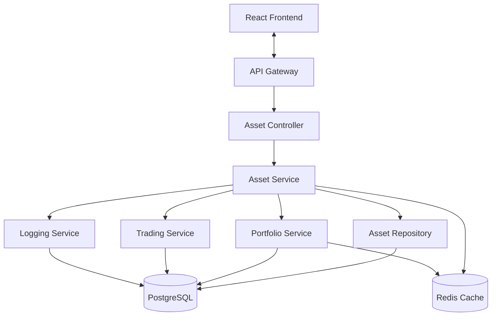
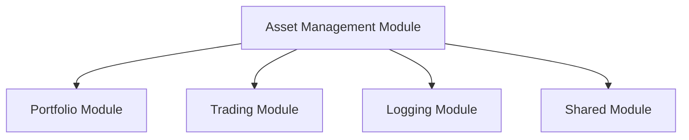

# Technical Design Document (TDD) - Asset Management Module

## 1. Tổng quan kiến trúc

### 1.1 Mục tiêu
Thiết kế kiến trúc kỹ thuật cho module quản lý tài sản (Asset Management) trong hệ thống Portfolio Management System, đảm bảo tính mở rộng, bảo trì và tích hợp tốt với các module hiện có.

### 1.2 Phạm vi kỹ thuật
- **Backend**: NestJS services, controllers, repositories, entities
- **Frontend**: React.js components, hooks, services
- **Database**: PostgreSQL schema updates, migrations
- **Integration**: API endpoints, validation, error handling

## 2. Kiến trúc hệ thống

### 2.1 High-level Architecture


### 2.2 Module Dependencies


## 3. Database Design

### 3.1 Asset Entity Schema
```typescript
@Entity('assets')
export class Asset {
  @PrimaryGeneratedColumn('uuid')
  id: string;

  @Column({ type: 'uuid' })
  portfolioId: string;

  @Column({ type: 'varchar', length: 255 })
  name: string;

  @Column({ type: 'varchar', length: 50, nullable: true })
  code?: string;

  @Column({ 
    type: 'enum', 
    enum: AssetType,
    default: AssetType.STOCK 
  })
  type: AssetType;

  @Column({ type: 'text', nullable: true })
  description?: string;

  @Column({ type: 'decimal', precision: 15, scale: 2 })
  initialValue: number;

  @Column({ type: 'decimal', precision: 15, scale: 4 })
  initialQuantity: number;

  @Column({ type: 'decimal', precision: 15, scale: 2, nullable: true })
  currentValue?: number;

  @Column({ type: 'decimal', precision: 15, scale: 4, nullable: true })
  currentQuantity?: number;

  @Column({ type: 'timestamp', default: () => 'CURRENT_TIMESTAMP' })
  createdAt: Date;

  @Column({ type: 'timestamp', default: () => 'CURRENT_TIMESTAMP' })
  updatedAt: Date;

  @Column({ type: 'uuid' })
  createdBy: string;

  @Column({ type: 'uuid' })
  updatedBy: string;

  // Relationships
  @ManyToOne(() => Portfolio, portfolio => portfolio.assets)
  @JoinColumn({ name: 'portfolioId' })
  portfolio: Portfolio;

  @OneToMany(() => Trade, trade => trade.asset)
  trades: Trade[];

  @OneToMany(() => PortfolioAsset, portfolioAsset => portfolioAsset.asset)
  portfolioAssets: PortfolioAsset[];
}
```

### 3.2 Asset Type Enum
```typescript
export enum AssetType {
  STOCK = 'STOCK',
  BOND = 'BOND',
  GOLD = 'GOLD',
  DEPOSIT = 'DEPOSIT',
  CASH = 'CASH'
}
```

### 3.3 Database Migration
```typescript
export class CreateAssetTable1234567890000 implements MigrationInterface {
  public async up(queryRunner: QueryRunner): Promise<void> {
    await queryRunner.createTable(
      new Table({
        name: 'assets',
        columns: [
          {
            name: 'id',
            type: 'uuid',
            isPrimary: true,
            generationStrategy: 'uuid',
            default: 'uuid_generate_v4()',
          },
          {
            name: 'portfolioId',
            type: 'uuid',
            isNullable: false,
          },
          {
            name: 'name',
            type: 'varchar',
            length: '255',
            isNullable: false,
          },
          {
            name: 'code',
            type: 'varchar',
            length: '50',
            isNullable: true,
          },
          {
            name: 'type',
            type: 'enum',
            enum: ['STOCK', 'BOND', 'GOLD', 'DEPOSIT', 'CASH'],
            default: "'STOCK'",
          },
          {
            name: 'description',
            type: 'text',
            isNullable: true,
          },
          {
            name: 'initialValue',
            type: 'decimal',
            precision: 15,
            scale: 2,
            isNullable: false,
          },
          {
            name: 'initialQuantity',
            type: 'decimal',
            precision: 15,
            scale: 4,
            isNullable: false,
          },
          {
            name: 'currentValue',
            type: 'decimal',
            precision: 15,
            scale: 2,
            isNullable: true,
          },
          {
            name: 'currentQuantity',
            type: 'decimal',
            precision: 15,
            scale: 4,
            isNullable: true,
          },
          {
            name: 'createdAt',
            type: 'timestamp',
            default: 'CURRENT_TIMESTAMP',
          },
          {
            name: 'updatedAt',
            type: 'timestamp',
            default: 'CURRENT_TIMESTAMP',
          },
          {
            name: 'createdBy',
            type: 'uuid',
            isNullable: false,
          },
          {
            name: 'updatedBy',
            type: 'uuid',
            isNullable: false,
          },
        ],
      }),
      true,
    );

    // Add indexes
    await queryRunner.createIndex('assets', new Index('IDX_ASSET_PORTFOLIO_ID', ['portfolioId']));
    await queryRunner.createIndex('assets', new Index('IDX_ASSET_TYPE', ['type']));
    await queryRunner.createIndex('assets', new Index('IDX_ASSET_CODE', ['code']));
    await queryRunner.createIndex('assets', new Index('IDX_ASSET_NAME', ['name']));

    // Add foreign key constraints
    await queryRunner.createForeignKey(
      'assets',
      new ForeignKey({
        columnNames: ['portfolioId'],
        referencedColumnNames: ['id'],
        referencedTableName: 'portfolios',
        onDelete: 'CASCADE',
      }),
    );
  }

  public async down(queryRunner: QueryRunner): Promise<void> {
    await queryRunner.dropTable('assets');
  }
}
```

## 4. Backend Implementation

### 4.1 Asset Repository
```typescript
@Injectable()
export class AssetRepository {
  constructor(
    @InjectRepository(Asset)
    private readonly assetRepository: Repository<Asset>,
  ) {}

  async create(createAssetDto: CreateAssetDto): Promise<Asset> {
    const asset = this.assetRepository.create(createAssetDto);
    return await this.assetRepository.save(asset);
  }

  async findAll(filters: AssetFiltersDto): Promise<[Asset[], number]> {
    const queryBuilder = this.assetRepository
      .createQueryBuilder('asset')
      .leftJoinAndSelect('asset.portfolio', 'portfolio')
      .leftJoinAndSelect('asset.trades', 'trades');

    if (filters.portfolioId) {
      queryBuilder.andWhere('asset.portfolioId = :portfolioId', { portfolioId: filters.portfolioId });
    }

    if (filters.type) {
      queryBuilder.andWhere('asset.type = :type', { type: filters.type });
    }

    if (filters.search) {
      queryBuilder.andWhere(
        '(asset.name ILIKE :search OR asset.code ILIKE :search OR asset.description ILIKE :search)',
        { search: `%${filters.search}%` }
      );
    }

    if (filters.sortBy) {
      queryBuilder.orderBy(`asset.${filters.sortBy}`, filters.sortOrder || 'ASC');
    }

    if (filters.limit) {
      queryBuilder.limit(filters.limit);
    }

    if (filters.offset) {
      queryBuilder.offset(filters.offset);
    }

    return await queryBuilder.getManyAndCount();
  }

  async findById(id: string): Promise<Asset | null> {
    return await this.assetRepository.findOne({
      where: { id },
      relations: ['portfolio', 'trades', 'portfolioAssets'],
    });
  }

  async update(id: string, updateAssetDto: UpdateAssetDto): Promise<Asset> {
    await this.assetRepository.update(id, updateAssetDto);
    return await this.findById(id);
  }

  async delete(id: string): Promise<void> {
    await this.assetRepository.delete(id);
  }

  async findByPortfolioId(portfolioId: string): Promise<Asset[]> {
    return await this.assetRepository.find({
      where: { portfolioId },
      relations: ['trades'],
    });
  }

  async checkAssetHasTrades(id: string): Promise<boolean> {
    const count = await this.assetRepository
      .createQueryBuilder('asset')
      .leftJoin('asset.trades', 'trade')
      .where('asset.id = :id', { id })
      .andWhere('trade.id IS NOT NULL')
      .getCount();
    
    return count > 0;
  }

  async validateAssetNameUnique(portfolioId: string, name: string, excludeId?: string): Promise<boolean> {
    const queryBuilder = this.assetRepository
      .createQueryBuilder('asset')
      .where('asset.portfolioId = :portfolioId', { portfolioId })
      .andWhere('asset.name = :name', { name });

    if (excludeId) {
      queryBuilder.andWhere('asset.id != :excludeId', { excludeId });
    }

    const count = await queryBuilder.getCount();
    return count === 0;
  }
}
```

### 4.2 Asset Service
```typescript
@Injectable()
export class AssetService {
  constructor(
    private readonly assetRepository: AssetRepository,
    private readonly portfolioService: PortfolioService,
    private readonly tradingService: TradingService,
    private readonly loggingService: LoggingService,
  ) {}

  async create(createAssetDto: CreateAssetDto, userId: string): Promise<Asset> {
    // Validate business rules
    await this.validateAssetCreation(createAssetDto);

    // Create asset
    const asset = await this.assetRepository.create({
      ...createAssetDto,
      createdBy: userId,
      updatedBy: userId,
    });

    // Log creation
    await this.loggingService.logBusinessEvent('ASSET_CREATED', {
      assetId: asset.id,
      portfolioId: asset.portfolioId,
      userId,
    });

    // Update portfolio value
    await this.updatePortfolioValue(asset.portfolioId);

    return asset;
  }

  async findAll(filters: AssetFiltersDto): Promise<PaginatedResponse<Asset>> {
    const [assets, total] = await this.assetRepository.findAll(filters);
    
    return {
      data: assets,
      total,
      page: Math.floor((filters.offset || 0) / (filters.limit || 10)) + 1,
      limit: filters.limit || 10,
    };
  }

  async findById(id: string): Promise<Asset> {
    const asset = await this.assetRepository.findById(id);
    if (!asset) {
      throw new NotFoundException(`Asset with ID ${id} not found`);
    }
    return asset;
  }

  async update(id: string, updateAssetDto: UpdateAssetDto, userId: string): Promise<Asset> {
    const existingAsset = await this.findById(id);
    
    // Validate update rules
    await this.validateAssetUpdate(existingAsset, updateAssetDto);

    // Update asset
    const updatedAsset = await this.assetRepository.update(id, {
      ...updateAssetDto,
      updatedBy: userId,
    });

    // Log update
    await this.loggingService.logBusinessEvent('ASSET_UPDATED', {
      assetId: id,
      portfolioId: existingAsset.portfolioId,
      userId,
      changes: updateAssetDto,
    });

    // Update portfolio value
    await this.updatePortfolioValue(existingAsset.portfolioId);

    return updatedAsset;
  }

  async delete(id: string, userId: string): Promise<void> {
    const asset = await this.findById(id);
    
    // Validate deletion rules
    await this.validateAssetDeletion(id);

    // Delete asset
    await this.assetRepository.delete(id);

    // Log deletion
    await this.loggingService.logBusinessEvent('ASSET_DELETED', {
      assetId: id,
      portfolioId: asset.portfolioId,
      userId,
    });

    // Update portfolio value
    await this.updatePortfolioValue(asset.portfolioId);
  }

  private async validateAssetCreation(dto: CreateAssetDto): Promise<void> {
    // Check portfolio exists
    const portfolio = await this.portfolioService.findById(dto.portfolioId);
    if (!portfolio) {
      throw new BadRequestException('Portfolio not found');
    }

    // Check asset name unique
    const isNameUnique = await this.assetRepository.validateAssetNameUnique(
      dto.portfolioId,
      dto.name
    );
    if (!isNameUnique) {
      throw new BadRequestException('Asset name must be unique within portfolio');
    }

    // Check portfolio asset limit
    const existingAssets = await this.assetRepository.findByPortfolioId(dto.portfolioId);
    if (existingAssets.length >= 50) {
      throw new BadRequestException('Portfolio cannot have more than 50 assets');
    }
  }

  private async validateAssetUpdate(existingAsset: Asset, dto: UpdateAssetDto): Promise<void> {
    // Check if asset has trades
    const hasTrades = await this.assetRepository.checkAssetHasTrades(existingAsset.id);
    
    if (hasTrades) {
      // Cannot change type or code if has trades
      if (dto.type && dto.type !== existingAsset.type) {
        throw new BadRequestException('Cannot change asset type when trades exist');
      }
      if (dto.code && dto.code !== existingAsset.code) {
        throw new BadRequestException('Cannot change asset code when trades exist');
      }
    }

    // Check name uniqueness if changing name
    if (dto.name && dto.name !== existingAsset.name) {
      const isNameUnique = await this.assetRepository.validateAssetNameUnique(
        existingAsset.portfolioId,
        dto.name,
        existingAsset.id
      );
      if (!isNameUnique) {
        throw new BadRequestException('Asset name must be unique within portfolio');
      }
    }
  }

  private async validateAssetDeletion(assetId: string): Promise<void> {
    const hasTrades = await this.assetRepository.checkAssetHasTrades(assetId);
    if (hasTrades) {
      throw new BadRequestException('Cannot delete asset with existing trades');
    }
  }

  private async updatePortfolioValue(portfolioId: string): Promise<void> {
    // Trigger portfolio value recalculation
    await this.portfolioService.recalculatePortfolioValue(portfolioId);
  }
}
```

### 4.3 Asset Controller
```typescript
@Controller('api/v1/assets')
@ApiTags('Assets')
export class AssetController {
  constructor(private readonly assetService: AssetService) {}

  @Post()
  @ApiOperation({ summary: 'Create a new asset' })
  @ApiResponse({ status: 201, description: 'Asset created successfully', type: AssetResponseDto })
  @ApiResponse({ status: 400, description: 'Bad request' })
  async create(
    @Body() createAssetDto: CreateAssetDto,
    @Req() req: Request,
  ): Promise<AssetResponseDto> {
    const userId = req.user?.id || 'system';
    const asset = await this.assetService.create(createAssetDto, userId);
    return this.mapToResponseDto(asset);
  }

  @Get()
  @ApiOperation({ summary: 'Get all assets with filtering and pagination' })
  @ApiResponse({ status: 200, description: 'Assets retrieved successfully', type: PaginatedAssetResponseDto })
  async findAll(@Query() filters: AssetFiltersDto): Promise<PaginatedAssetResponseDto> {
    return await this.assetService.findAll(filters);
  }

  @Get(':id')
  @ApiOperation({ summary: 'Get asset by ID' })
  @ApiResponse({ status: 200, description: 'Asset retrieved successfully', type: AssetResponseDto })
  @ApiResponse({ status: 404, description: 'Asset not found' })
  async findOne(@Param('id') id: string): Promise<AssetResponseDto> {
    const asset = await this.assetService.findById(id);
    return this.mapToResponseDto(asset);
  }

  @Put(':id')
  @ApiOperation({ summary: 'Update asset' })
  @ApiResponse({ status: 200, description: 'Asset updated successfully', type: AssetResponseDto })
  @ApiResponse({ status: 400, description: 'Bad request' })
  @ApiResponse({ status: 404, description: 'Asset not found' })
  async update(
    @Param('id') id: string,
    @Body() updateAssetDto: UpdateAssetDto,
    @Req() req: Request,
  ): Promise<AssetResponseDto> {
    const userId = req.user?.id || 'system';
    const asset = await this.assetService.update(id, updateAssetDto, userId);
    return this.mapToResponseDto(asset);
  }

  @Delete(':id')
  @ApiOperation({ summary: 'Delete asset' })
  @ApiResponse({ status: 200, description: 'Asset deleted successfully' })
  @ApiResponse({ status: 400, description: 'Bad request' })
  @ApiResponse({ status: 404, description: 'Asset not found' })
  async remove(
    @Param('id') id: string,
    @Req() req: Request,
  ): Promise<{ message: string }> {
    const userId = req.user?.id || 'system';
    await this.assetService.delete(id, userId);
    return { message: 'Asset deleted successfully' };
  }

  private mapToResponseDto(asset: Asset): AssetResponseDto {
    return {
      id: asset.id,
      portfolioId: asset.portfolioId,
      name: asset.name,
      code: asset.code,
      type: asset.type,
      description: asset.description,
      initialValue: asset.initialValue,
      initialQuantity: asset.initialQuantity,
      currentValue: asset.currentValue,
      currentQuantity: asset.currentQuantity,
      createdAt: asset.createdAt,
      updatedAt: asset.updatedAt,
      createdBy: asset.createdBy,
      updatedBy: asset.updatedBy,
    };
  }
}
```

## 5. DTOs và Validation

### 5.1 Create Asset DTO
```typescript
export class CreateAssetDto {
  @ApiProperty({ description: 'Portfolio ID' })
  @IsUUID()
  @IsNotEmpty()
  portfolioId: string;

  @ApiProperty({ description: 'Asset name' })
  @IsString()
  @IsNotEmpty()
  @Length(1, 255)
  name: string;

  @ApiProperty({ description: 'Asset code', required: false })
  @IsOptional()
  @IsString()
  @Length(1, 50)
  code?: string;

  @ApiProperty({ description: 'Asset type', enum: AssetType })
  @IsEnum(AssetType)
  type: AssetType;

  @ApiProperty({ description: 'Asset description', required: false })
  @IsOptional()
  @IsString()
  @Length(0, 1000)
  description?: string;

  @ApiProperty({ description: 'Initial value' })
  @IsNumber()
  @Min(0)
  initialValue: number;

  @ApiProperty({ description: 'Initial quantity' })
  @IsNumber()
  @Min(0)
  initialQuantity: number;
}
```

### 5.2 Update Asset DTO
```typescript
export class UpdateAssetDto extends PartialType(CreateAssetDto) {
  @ApiProperty({ description: 'Asset name', required: false })
  @IsOptional()
  @IsString()
  @Length(1, 255)
  name?: string;

  @ApiProperty({ description: 'Asset code', required: false })
  @IsOptional()
  @IsString()
  @Length(1, 50)
  code?: string;

  @ApiProperty({ description: 'Asset type', enum: AssetType, required: false })
  @IsOptional()
  @IsEnum(AssetType)
  type?: AssetType;

  @ApiProperty({ description: 'Asset description', required: false })
  @IsOptional()
  @IsString()
  @Length(0, 1000)
  description?: string;

  @ApiProperty({ description: 'Initial value', required: false })
  @IsOptional()
  @IsNumber()
  @Min(0)
  initialValue?: number;

  @ApiProperty({ description: 'Initial quantity', required: false })
  @IsOptional()
  @IsNumber()
  @Min(0)
  initialQuantity?: number;
}
```

### 5.3 Asset Filters DTO
```typescript
export class AssetFiltersDto {
  @ApiProperty({ description: 'Portfolio ID', required: false })
  @IsOptional()
  @IsUUID()
  portfolioId?: string;

  @ApiProperty({ description: 'Asset type', enum: AssetType, required: false })
  @IsOptional()
  @IsEnum(AssetType)
  type?: AssetType;

  @ApiProperty({ description: 'Search term', required: false })
  @IsOptional()
  @IsString()
  search?: string;

  @ApiProperty({ description: 'Sort by field', required: false })
  @IsOptional()
  @IsString()
  @IsIn(['name', 'type', 'initialValue', 'createdAt'])
  sortBy?: string;

  @ApiProperty({ description: 'Sort order', required: false })
  @IsOptional()
  @IsString()
  @IsIn(['ASC', 'DESC'])
  sortOrder?: 'ASC' | 'DESC';

  @ApiProperty({ description: 'Page limit', required: false })
  @IsOptional()
  @IsNumber()
  @Min(1)
  @Max(100)
  limit?: number;

  @ApiProperty({ description: 'Page offset', required: false })
  @IsOptional()
  @IsNumber()
  @Min(0)
  offset?: number;
}
```

## 6. Frontend Implementation

### 6.1 Asset Service
```typescript
@Injectable()
export class AssetService {
  private readonly baseUrl = '/api/v1/assets';

  constructor(private http: HttpClient) {}

  createAsset(asset: CreateAssetDto): Observable<Asset> {
    return this.http.post<Asset>(this.baseUrl, asset);
  }

  getAssets(filters: AssetFilters): Observable<PaginatedResponse<Asset>> {
    const params = new HttpParams({ fromObject: filters as any });
    return this.http.get<PaginatedResponse<Asset>>(this.baseUrl, { params });
  }

  getAsset(id: string): Observable<Asset> {
    return this.http.get<Asset>(`${this.baseUrl}/${id}`);
  }

  updateAsset(id: string, asset: UpdateAssetDto): Observable<Asset> {
    return this.http.put<Asset>(`${this.baseUrl}/${id}`, asset);
  }

  deleteAsset(id: string): Observable<void> {
    return this.http.delete<void>(`${this.baseUrl}/${id}`);
  }
}
```

### 6.2 Asset Management Component
```typescript
@Component({
  selector: 'app-asset-management',
  templateUrl: './asset-management.component.html',
  styleUrls: ['./asset-management.component.scss']
})
export class AssetManagementComponent implements OnInit {
  assets: Asset[] = [];
  loading = false;
  filters: AssetFilters = {};
  totalCount = 0;
  currentPage = 1;
  pageSize = 10;

  constructor(
    private assetService: AssetService,
    private dialog: MatDialog,
    private snackBar: MatSnackBar
  ) {}

  ngOnInit(): void {
    this.loadAssets();
  }

  loadAssets(): void {
    this.loading = true;
    this.assetService.getAssets({
      ...this.filters,
      limit: this.pageSize,
      offset: (this.currentPage - 1) * this.pageSize
    }).subscribe({
      next: (response) => {
        this.assets = response.data;
        this.totalCount = response.total;
        this.loading = false;
      },
      error: (error) => {
        this.snackBar.open('Error loading assets', 'Close', { duration: 3000 });
        this.loading = false;
      }
    });
  }

  openCreateDialog(): void {
    const dialogRef = this.dialog.open(AssetFormComponent, {
      width: '600px',
      data: { mode: 'create' }
    });

    dialogRef.afterClosed().subscribe(result => {
      if (result) {
        this.loadAssets();
      }
    });
  }

  openEditDialog(asset: Asset): void {
    const dialogRef = this.dialog.open(AssetFormComponent, {
      width: '600px',
      data: { mode: 'edit', asset }
    });

    dialogRef.afterClosed().subscribe(result => {
      if (result) {
        this.loadAssets();
      }
    });
  }

  deleteAsset(asset: Asset): void {
    const dialogRef = this.dialog.open(ConfirmDialogComponent, {
      width: '400px',
      data: {
        title: 'Delete Asset',
        message: `Are you sure you want to delete "${asset.name}"?`,
        confirmText: 'Delete',
        cancelText: 'Cancel'
      }
    });

    dialogRef.afterClosed().subscribe(confirmed => {
      if (confirmed) {
        this.assetService.deleteAsset(asset.id).subscribe({
          next: () => {
            this.snackBar.open('Asset deleted successfully', 'Close', { duration: 3000 });
            this.loadAssets();
          },
          error: (error) => {
            this.snackBar.open('Error deleting asset', 'Close', { duration: 3000 });
          }
        });
      }
    });
  }

  onFiltersChange(filters: AssetFilters): void {
    this.filters = filters;
    this.currentPage = 1;
    this.loadAssets();
  }

  onPageChange(page: number): void {
    this.currentPage = page;
    this.loadAssets();
  }
}
```

## 7. Error Handling

### 7.1 Custom Exceptions
```typescript
export class AssetNotFoundException extends NotFoundException {
  constructor(assetId: string) {
    super(`Asset with ID ${assetId} not found`);
  }
}

export class AssetValidationException extends BadRequestException {
  constructor(message: string) {
    super(message);
  }
}

export class AssetDeletionException extends BadRequestException {
  constructor(message: string) {
    super(message);
  }
}
```

### 7.2 Global Exception Filter
```typescript
@Catch()
export class AssetExceptionFilter implements ExceptionFilter {
  catch(exception: unknown, host: ArgumentsHost) {
    const ctx = host.switchToHttp();
    const response = ctx.getResponse<Response>();
    const request = ctx.getRequest<Request>();

    let status = HttpStatus.INTERNAL_SERVER_ERROR;
    let message = 'Internal server error';

    if (exception instanceof AssetNotFoundException) {
      status = HttpStatus.NOT_FOUND;
      message = exception.message;
    } else if (exception instanceof AssetValidationException) {
      status = HttpStatus.BAD_REQUEST;
      message = exception.message;
    } else if (exception instanceof AssetDeletionException) {
      status = HttpStatus.BAD_REQUEST;
      message = exception.message;
    }

    response.status(status).json({
      statusCode: status,
      timestamp: new Date().toISOString(),
      path: request.url,
      message,
    });
  }
}
```

## 8. Testing Strategy

### 8.1 Unit Tests
- AssetService business logic testing
- AssetRepository data access testing
- AssetController API endpoint testing
- DTO validation testing

### 8.2 Integration Tests
- Database operations testing
- API endpoint integration testing
- Service integration testing

### 8.3 E2E Tests
- Complete user workflow testing
- Frontend-backend integration testing

## 9. Performance Considerations

### 9.1 Database Optimization
- Proper indexing on frequently queried fields
- Query optimization for large datasets
- Connection pooling configuration

### 9.2 Caching Strategy
- Redis caching for frequently accessed assets
- Portfolio value caching
- Asset list caching with TTL

### 9.3 API Optimization
- Pagination for large asset lists
- Response compression
- Request/response logging

## 10. Security Considerations

### 10.1 Input Validation
- Comprehensive DTO validation
- SQL injection prevention
- XSS protection

### 10.2 Authorization
- User-based asset access control
- Portfolio ownership validation
- Audit trail for all operations

### 10.3 Data Protection
- Sensitive data encryption
- Secure data transmission
- Data retention policies

## 11. Monitoring và Logging

### 11.1 Business Event Logging
- Asset creation, update, deletion events
- Portfolio value change events
- User action tracking

### 11.2 Performance Monitoring
- API response time monitoring
- Database query performance
- Error rate tracking

### 11.3 Audit Trail
- Complete operation history
- User action tracking
- Data change tracking

## 12. Deployment Considerations

### 12.1 Database Migration
- Safe migration scripts
- Rollback procedures
- Data integrity checks

### 12.2 API Versioning
- Backward compatibility
- Version management
- Deprecation strategy

### 12.3 Configuration Management
- Environment-specific configurations
- Feature flags
- Runtime configuration updates
