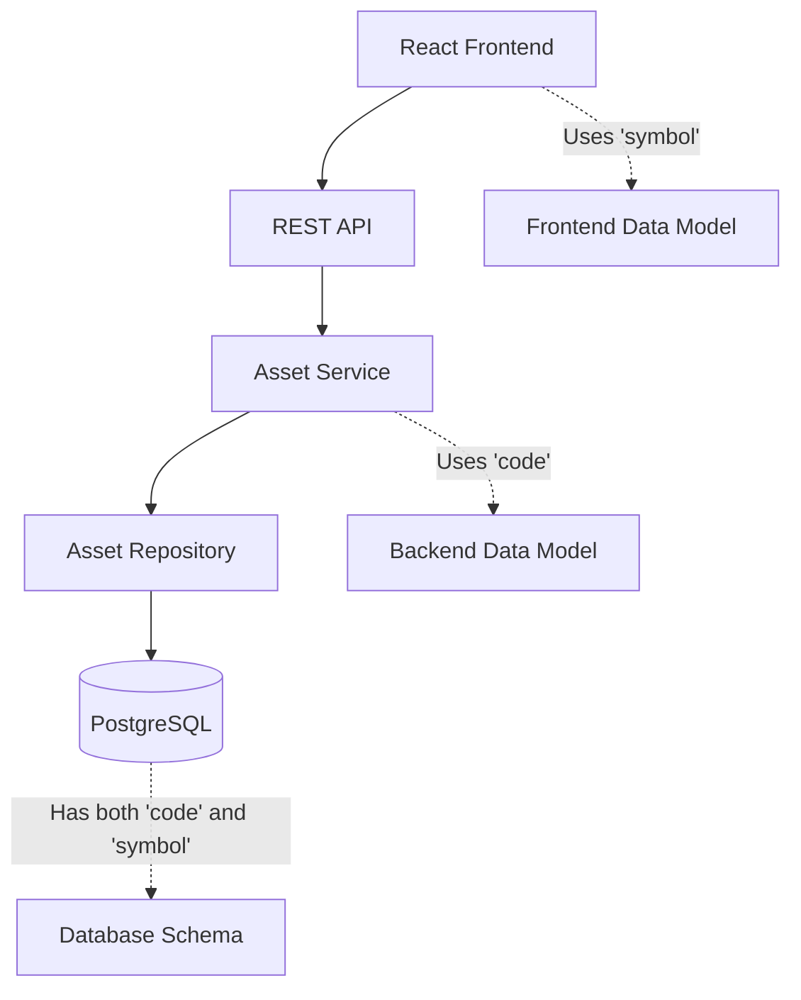
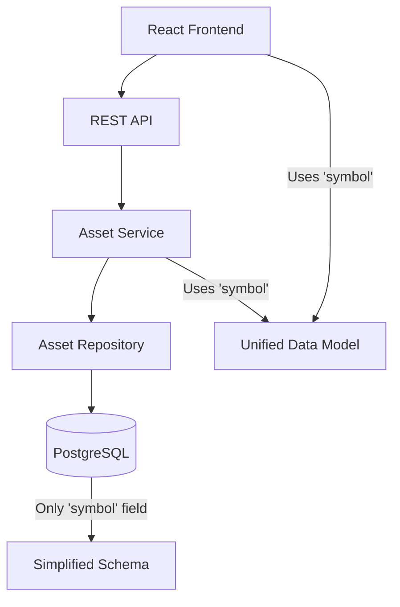

# Asset Management Improvements - Technical Design Document

## Document Information
**Document Type**: Technical Design Document (TDD)  
**CR Number**: CR-003  
**Version**: 1.0  
**Date**: September 15, 2025  
**Author**: System Architect  
**Status**: Ready for Review  
**Related PRD**: cr_003_prd_asset_management_improvements.md

## Executive Summary
This TDD provides detailed technical specifications for implementing the Asset Management improvements outlined in the PRD. The design covers database schema changes, API modifications, service layer updates, and frontend changes required to standardize on symbol field, implement flexible naming, add read-only constraints, and enhance deletion workflow.

## System Architecture

### Current Architecture


### Target Architecture


## Database Design

### Current Schema
```sql
CREATE TABLE assets (
    id UUID PRIMARY KEY,
    name VARCHAR(255) NOT NULL,
    code VARCHAR(50),           -- ❌ To be removed
    symbol VARCHAR(50),         -- ✅ Primary field
    type asset_type_enum,
    description TEXT,
    created_by UUID,
    updated_by UUID,
    created_at TIMESTAMP,
    updated_at TIMESTAMP
);

-- Current constraints
CREATE UNIQUE INDEX UQ_ASSET_NAME ON assets (name);           -- ❌ To be removed
CREATE INDEX IDX_ASSET_CODE ON assets (code);                -- ❌ To be removed
CREATE INDEX IDX_ASSET_SYMBOL ON assets (symbol);            -- ✅ Keep
```

### Target Schema
```sql
CREATE TABLE assets (
    id UUID PRIMARY KEY,
    name VARCHAR(255) NOT NULL,
    symbol VARCHAR(50) NOT NULL,  -- ✅ Required field
    type asset_type_enum,
    description TEXT,
    created_by UUID,
    updated_by UUID,
    created_at TIMESTAMP,
    updated_at TIMESTAMP
);

-- New constraints
CREATE UNIQUE INDEX UQ_ASSET_USER_SYMBOL ON assets (created_by, symbol);  -- ✅ User-scoped uniqueness
CREATE INDEX IDX_ASSET_SYMBOL ON assets (symbol);                         -- ✅ Keep
CREATE INDEX IDX_ASSET_USER_NAME ON assets (created_by, name);            -- ✅ User-scoped name index
```

### Migration Script
```sql
-- Step 1: Add migration tracking
ALTER TABLE assets ADD COLUMN migration_status VARCHAR(20) DEFAULT 'pending';

-- Step 2: Migrate code to symbol where symbol is null
UPDATE assets 
SET symbol = code, 
    migration_status = 'migrated_from_code'
WHERE code IS NOT NULL AND symbol IS NULL;

-- Step 3: Generate symbols for assets with neither code nor symbol
UPDATE assets 
SET symbol = UPPER(SUBSTRING(REPLACE(name, ' ', ''), 1, 10)), 
    migration_status = 'generated_from_name'
WHERE code IS NULL AND symbol IS NULL;

-- Step 4: Validate migration
UPDATE assets 
SET migration_status = 'validated'
WHERE symbol IS NOT NULL;

-- Step 5: Remove code column and old constraints
ALTER TABLE assets DROP COLUMN code;
ALTER TABLE assets DROP COLUMN migration_status;
DROP INDEX IF EXISTS UQ_ASSET_NAME;
DROP INDEX IF EXISTS IDX_ASSET_CODE;

-- Step 6: Add new constraints
CREATE UNIQUE INDEX UQ_ASSET_USER_SYMBOL ON assets (created_by, symbol);
CREATE INDEX IDX_ASSET_USER_NAME ON assets (created_by, name);
```

## API Design

### Current API Endpoints
```typescript
// Current endpoints (to be updated)
GET    /api/v1/assets                    // List assets
POST   /api/v1/assets                    // Create asset
GET    /api/v1/assets/:id                // Get asset by ID
PUT    /api/v1/assets/:id                // Update asset
DELETE /api/v1/assets/:id                // Delete asset
GET    /api/v1/assets/:id/trades/count   // Get trade count
DELETE /api/v1/assets/:id/trades         // Delete all trades
DELETE /api/v1/assets/:id/force          // Force delete asset
```

### Updated API Specifications

#### 1. Create Asset
```typescript
POST /api/v1/assets
Content-Type: application/json

{
  "name": "Apple Inc.",
  "symbol": "AAPL",           // ✅ Required field
  "type": "STOCK",
  "description": "Technology company",
  "createdBy": "user-uuid",
  "updatedBy": "user-uuid"
}

Response 201:
{
  "id": "asset-uuid",
  "name": "Apple Inc.",
  "symbol": "AAPL",           // ✅ Consistent field usage
  "type": "STOCK",
  "description": "Technology company",
  "createdAt": "2025-09-15T10:30:00Z",
  "updatedAt": "2025-09-15T10:30:00Z"
}
```

#### 2. Update Asset
```typescript
PUT /api/v1/assets/:id
Content-Type: application/json

{
  "name": "Apple Inc. Updated",
  // symbol field removed - read-only after creation
  "type": "STOCK",
  "description": "Updated description",
  "updatedBy": "user-uuid"
}

Response 200:
{
  "id": "asset-uuid",
  "name": "Apple Inc. Updated",
  "symbol": "AAPL",           // ✅ Unchanged from creation
  "type": "STOCK",
  "description": "Updated description",
  "updatedAt": "2025-09-15T11:00:00Z"
}
```

#### 3. Enhanced Delete Asset
```typescript
DELETE /api/v1/assets/:id

// If asset has trades
Response 400:
{
  "error": "Asset has associated trades",
  "tradeCount": 5,
  "message": "This asset has 5 associated trades. Deleting will remove all trades first.",
  "options": {
    "cancel": "Cancel deletion",
    "force": "Delete asset and all trades"
  }
}

// If no trades
Response 204: No Content
```

#### 4. Force Delete Asset
```typescript
DELETE /api/v1/assets/:id/force

Response 200:
{
  "success": true,
  "deletedAsset": {
    "id": "asset-uuid",
    "name": "Apple Inc.",
    "symbol": "AAPL"
  },
  "deletedTradesCount": 5,
  "message": "Asset and 5 associated trades deleted successfully"
}
```

## Service Layer Design

### Asset Entity Updates
```typescript
@Entity('assets')
export class Asset {
  @PrimaryGeneratedColumn('uuid')
  id: string;

  @Column({ type: 'varchar', length: 255, name: 'name' })
  name: string;

  @Column({ 
    type: 'varchar', 
    length: 50, 
    nullable: false,  // ✅ Now required
    name: 'symbol' 
  })
  symbol: string;  // ✅ Primary field, no code field

  @Column({ 
    type: 'enum', 
    enum: AssetType,
    name: 'type'
  })
  type: AssetType;

  // ... other fields

  // ✅ Updated validation methods
  getDisplayName(): string {
    return `${this.name} (${this.symbol})`;
  }
}
```

### DTO Updates
```typescript
// CreateAssetDto - Updated
export class CreateAssetDto {
  @IsString()
  @MaxLength(255)
  name: string;

  @IsString()
  @MaxLength(50)
  symbol: string;  // ✅ Required field

  @IsEnum(AssetType)
  type: AssetType;

  @IsOptional()
  @IsString()
  @MaxLength(1000)
  description?: string;

  @IsString()
  createdBy: string;

  @IsString()
  updatedBy: string;
}

// UpdateAssetDto - Updated
export class UpdateAssetDto {
  @IsOptional()
  @IsString()
  @MaxLength(255)
  name?: string;

  // symbol field removed - read-only after creation

  @IsOptional()
  @IsEnum(AssetType)
  type?: AssetType;

  @IsOptional()
  @IsString()
  @MaxLength(1000)
  description?: string;

  @IsString()
  updatedBy: string;
}
```

### Validation Service Updates
```typescript
@Injectable()
export class AssetValidationService {
  // ✅ Updated validation for user-scoped uniqueness
  async validateAssetCreation(createAssetDto: CreateAssetDto): Promise<void> {
    // Validate symbol uniqueness per user
    const isSymbolUnique = await this.assetRepository.isSymbolUniqueForUser(
      createAssetDto.symbol,
      createAssetDto.createdBy
    );

    if (!isSymbolUnique) {
      throw new ConflictException('Asset symbol must be unique within your account');
    }

    // Name uniqueness no longer required
  }

  // ✅ Updated validation for updates
  async validateAssetUpdate(id: string, updateAssetDto: UpdateAssetDto): Promise<void> {
    // Reject symbol updates
    if (updateAssetDto.symbol !== undefined) {
      throw new BadRequestException('Symbol cannot be updated after asset creation');
    }

    // Other validations...
  }

  // ✅ Enhanced deletion validation
  async validateAssetDeletion(id: string): Promise<{ canDelete: boolean; tradeCount: number }> {
    const tradeCount = await this.assetRepository.getTradeCount(id);
    
    return {
      canDelete: tradeCount === 0,
      tradeCount
    };
  }
}
```

### Repository Updates
```typescript
@Injectable()
export class AssetRepository {
  // ✅ Updated uniqueness check for user-scoped symbols
  async isSymbolUniqueForUser(symbol: string, userId: string, excludeId?: string): Promise<boolean> {
    const query = this.repository
      .createQueryBuilder('asset')
      .where('asset.symbol = :symbol', { symbol })
      .andWhere('asset.createdBy = :userId', { userId });

    if (excludeId) {
      query.andWhere('asset.id != :excludeId', { excludeId });
    }

    const count = await query.getCount();
    return count === 0;
  }

  // ✅ Updated search to use symbol field
  async search(query: string, userId?: string): Promise<Asset[]> {
    return this.repository
      .createQueryBuilder('asset')
      .where('(asset.name ILIKE :search OR asset.symbol ILIKE :search)', { 
        search: `%${query}%` 
      })
      .andWhere(userId ? 'asset.createdBy = :userId' : '1=1', { userId })
      .getMany();
  }
}
```

## Frontend Design

### Component Updates

#### AssetForm Component
```typescript
interface AssetFormProps {
  mode: 'create' | 'edit';
  asset?: Asset;
  onSubmit: (data: AssetFormData) => void;
}

interface AssetFormData {
  name: string;
  symbol: string;  // ✅ Always included
  type: AssetType;
  description?: string;
}

const AssetForm: React.FC<AssetFormProps> = ({ mode, asset, onSubmit }) => {
  const [formData, setFormData] = useState<AssetFormData>({
    name: asset?.name || '',
    symbol: asset?.symbol || '',  // ✅ Always editable in create mode
    type: asset?.type || AssetType.STOCK,
    description: asset?.description || ''
  });

  // ✅ Hide symbol field in edit mode
  if (mode === 'edit') {
    return (
      <form>
        <TextField name="name" value={formData.name} />
        <TextField 
          name="symbol" 
          value={formData.symbol} 
          disabled 
          helperText="Symbol cannot be changed after creation"
        />
        <Select name="type" value={formData.type} />
        <TextField name="description" value={formData.description} />
      </form>
    );
  }

  // Create mode - show all fields
  return (
    <form>
      <TextField name="name" value={formData.name} />
      <TextField name="symbol" value={formData.symbol} />
      <Select name="type" value={formData.type} />
      <TextField name="description" value={formData.description} />
    </form>
  );
};
```

#### AssetDeletionDialog Component
```typescript
interface AssetDeletionDialogProps {
  asset: Asset;
  open: boolean;
  onClose: () => void;
  onConfirm: () => void;
  tradeCount: number;
}

const AssetDeletionDialog: React.FC<AssetDeletionDialogProps> = ({
  asset,
  open,
  onClose,
  onConfirm,
  tradeCount
}) => {
  return (
    <Dialog open={open} onClose={onClose}>
      <DialogTitle>Delete Asset</DialogTitle>
      <DialogContent>
        <Typography>
          Are you sure you want to delete "{asset.name} ({asset.symbol})"?
        </Typography>
        {tradeCount > 0 && (
          <Alert severity="warning">
            This asset has {tradeCount} associated trades. 
            Deleting will remove all trades first.
          </Alert>
        )}
      </DialogContent>
      <DialogActions>
        <Button onClick={onClose}>Cancel</Button>
        <Button onClick={onConfirm} color="error">
          Delete Asset{tradeCount > 0 ? ' & Trades' : ''}
        </Button>
      </DialogActions>
    </Dialog>
  );
};
```

### API Service Updates
```typescript
class AssetService {
  // ✅ Updated to use symbol field consistently
  async createAsset(data: CreateAssetRequest): Promise<Asset> {
    const response = await api.post('/api/v1/assets', {
      name: data.name,
      symbol: data.symbol,  // ✅ Use symbol field
      type: data.type,
      description: data.description,
      createdBy: data.createdBy,
      updatedBy: data.updatedBy
    });
    return response.data;
  }

  // ✅ Enhanced deletion with warning
  async deleteAsset(id: string): Promise<{ canDelete: boolean; tradeCount: number }> {
    try {
      await api.delete(`/api/v1/assets/${id}`);
      return { canDelete: true, tradeCount: 0 };
    } catch (error) {
      if (error.response?.status === 400) {
        return {
          canDelete: false,
          tradeCount: error.response.data.tradeCount
        };
      }
      throw error;
    }
  }

  // ✅ Force delete with confirmation
  async forceDeleteAsset(id: string): Promise<{ deletedTradesCount: number }> {
    const response = await api.delete(`/api/v1/assets/${id}/force`);
    return response.data;
  }
}
```

## Implementation Plan

### Phase 1: Data Migration (Day 1-2)
1. **Create Migration Service**
   ```typescript
   @Injectable()
   export class AssetMigrationService {
     async migrateCodeToSymbol(): Promise<MigrationResult> {
       // Implementation details
     }
   }
   ```

2. **Test Migration on Development**
   - Create test data with both code and symbol fields
   - Run migration script
   - Verify data integrity

3. **Backup Production Database**
   - Full database backup
   - Verify backup integrity

4. **Run Migration in Production**
   - Schedule maintenance window
   - Execute migration script
   - Verify results

### Phase 2: Backend Updates (Day 3-4)
1. **Update Asset Entity**
   - Remove code field
   - Update constraints
   - Update validation methods

2. **Update DTOs and Services**
   - Update CreateAssetDto
   - Update UpdateAssetDto (remove symbol)
   - Update validation service
   - Update repository methods

3. **Update API Endpoints**
   - Update all endpoints to use symbol
   - Update error messages
   - Update Swagger documentation

### Phase 3: Frontend Updates (Day 5-6)
1. **Update Components**
   - Update AssetForm component
   - Update AssetList component
   - Create AssetDeletionDialog component

2. **Update API Services**
   - Update all API calls to use symbol
   - Update error handling
   - Update type definitions

3. **Update Validation**
   - Update form validation
   - Update error messages
   - Update user feedback

### Phase 4: Testing and Deployment (Day 7-8)
1. **Comprehensive Testing**
   - Unit tests for all changes
   - Integration tests
   - End-to-end tests

2. **Deployment**
   - Deploy backend changes
   - Deploy frontend changes
   - Monitor system health

## Risk Mitigation

### Data Migration Risks
- **Risk**: Data loss during migration
- **Mitigation**: Full backup, transaction-based migration, rollback plan

### System Downtime Risks
- **Risk**: Extended downtime during migration
- **Mitigation**: Efficient migration script, maintenance window

### Integration Risks
- **Risk**: Breaking existing integrations
- **Mitigation**: API versioning, comprehensive testing

## Testing Strategy

### Unit Tests
- Asset entity validation
- DTO validation
- Service layer methods
- Repository methods

### Integration Tests
- API endpoint testing
- Database migration testing
- Service integration testing

### End-to-End Tests
- Complete user workflows
- Frontend-backend integration
- Error handling scenarios

## Performance Considerations

### Database Performance
- New indexes for user-scoped queries
- Optimized search queries
- Efficient migration script

### API Performance
- Maintained response times
- Efficient validation
- Optimized queries

## Security Considerations

### Data Validation
- Input sanitization
- SQL injection prevention
- XSS prevention

### Access Control
- User-scoped data access
- Proper authorization checks
- Audit logging

## Monitoring and Logging

### Migration Monitoring
- Migration progress tracking
- Error logging
- Rollback procedures

### System Monitoring
- Performance metrics
- Error rates
- User activity

## Conclusion

This technical design provides a comprehensive approach to implementing the Asset Management improvements. The design ensures data consistency, improves user experience, and maintains system reliability while minimizing risks through careful planning and testing.

---

**Document Status**: Ready for Implementation  
**Next Step**: Create Task Breakdown Document (TBD)
