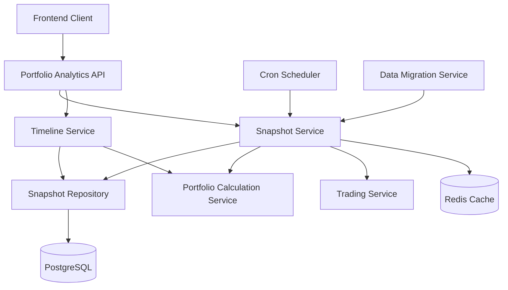
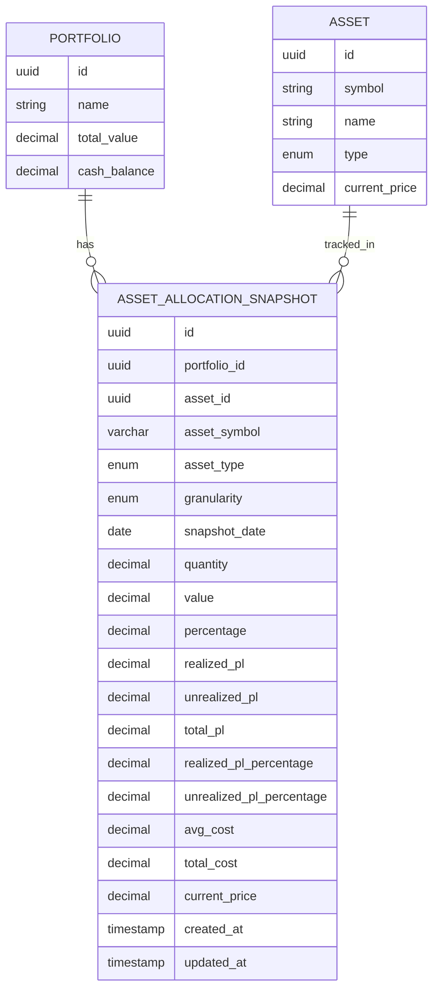
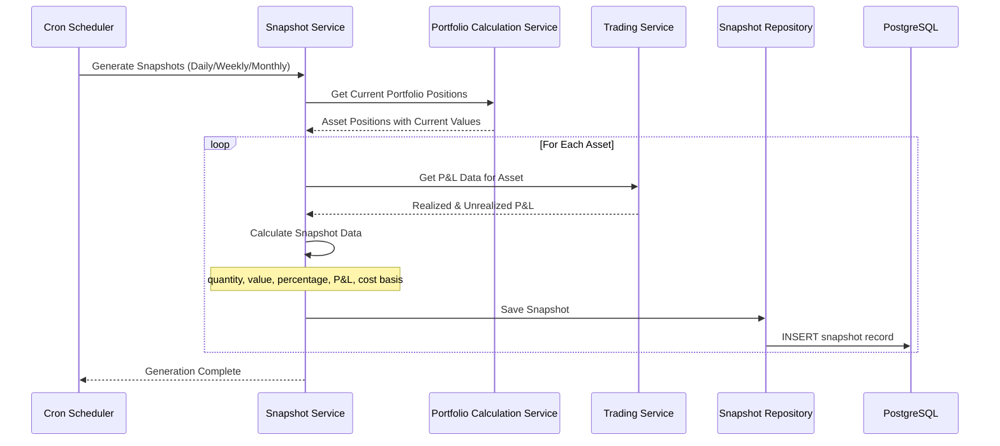
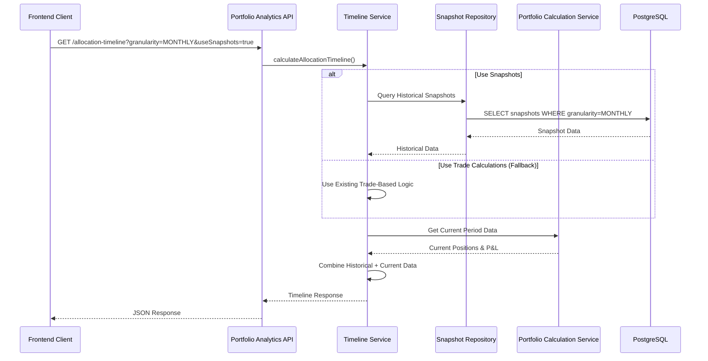

# Technical Design Document: Asset-Level Multi-Granularity Snapshot System with P&L Tracking

## Document Information
- **Document ID**: CR-006-TDD
- **Feature Name**: Asset-Level Multi-Granularity Snapshot System with P&L Tracking
- **Version**: 1.0
- **Date**: December 19, 2024
- **Author**: System Architect
- **Status**: Draft
- **Related PRD**: CR-006-PRD Asset-Level Multi-Granularity Snapshot System with P&L Tracking

## 1. Overview

This document describes the technical design for implementing a comprehensive asset-level snapshot system that captures portfolio allocation and P&L data at multiple granularities (daily, weekly, monthly). The system will replace current trade-based historical calculations in the Allocation Timeline feature, providing more accurate historical data and enabling flexible analysis capabilities.

The implementation will be built on the existing NestJS + TypeORM + PostgreSQL + Redis technology stack, following established patterns and conventions.

## 2. Requirements

### 2.1 Functional Requirements

- **FR-001**: Store individual asset snapshots with complete position and P&L data
- **FR-002**: Support daily, weekly, and monthly snapshot granularities
- **FR-003**: Track realized and unrealized P&L for each asset over time
- **FR-004**: Enable flexible querying by asset, asset type, granularity, and date range
- **FR-005**: Integrate snapshots with existing Allocation Timeline feature
- **FR-006**: Provide automated and manual snapshot generation
- **FR-007**: Migrate existing trade data to snapshot format
- **FR-008**: Enhance UI with granularity controls and P&L visualization

### 2.2 Non-Functional Requirements

- **NFR-001**: Timeline queries complete in <200ms (vs current 2-5s)
- **NFR-002**: Support for 100+ assets per portfolio and 5+ years of historical data
- **NFR-003**: Snapshot data accuracy of 99.9% match with real-time calculations
- **NFR-004**: Efficient storage with compression for old data
- **NFR-005**: 99.9% uptime for snapshot operations

## 3. Technical Design

### High-Level Architecture



### 3.1. Data Model Changes

#### New Entity: AssetAllocationSnapshot

```typescript
@Entity('asset_allocation_snapshots')
export class AssetAllocationSnapshot {
  @PrimaryGeneratedColumn('uuid')
  id: string;

  @Column('uuid')
  portfolioId: string;

  @Column('uuid')
  assetId: string;

  @Column({
    type: 'varchar',
    length: 50,
    name: 'asset_symbol'
  })
  assetSymbol: string;

  @Column({
    type: 'enum',
    enum: AssetType,
    name: 'asset_type'
  })
  assetType: AssetType;

  @Column({
    type: 'enum',
    enum: SnapshotGranularity,
    name: 'granularity'
  })
  granularity: SnapshotGranularity;

  @Column({
    type: 'date',
    name: 'snapshot_date'
  })
  snapshotDate: Date;

  // Position Data
  @Column({
    type: 'decimal',
    precision: 15,
    scale: 4,
    name: 'quantity'
  })
  quantity: number;

  @Column({
    type: 'decimal',
    precision: 15,
    scale: 2,
    name: 'value'
  })
  value: number;

  @Column({
    type: 'decimal',
    precision: 5,
    scale: 2,
    name: 'percentage'
  })
  percentage: number;

  // P&L Data
  @Column({
    type: 'decimal',
    precision: 15,
    scale: 2,
    name: 'realized_pl'
  })
  realizedPl: number;

  @Column({
    type: 'decimal',
    precision: 15,
    scale: 2,
    name: 'unrealized_pl'
  })
  unrealizedPl: number;

  @Column({
    type: 'decimal',
    precision: 15,
    scale: 2,
    name: 'total_pl'
  })
  totalPl: number;

  @Column({
    type: 'decimal',
    precision: 5,
    scale: 2,
    name: 'realized_pl_percentage'
  })
  realizedPlPercentage: number;

  @Column({
    type: 'decimal',
    precision: 5,
    scale: 2,
    name: 'unrealized_pl_percentage'
  })
  unrealizedPlPercentage: number;

  // Cost Basis Data
  @Column({
    type: 'decimal',
    precision: 15,
    scale: 4,
    name: 'avg_cost'
  })
  avgCost: number;

  @Column({
    type: 'decimal',
    precision: 15,
    scale: 2,
    name: 'total_cost'
  })
  totalCost: number;

  @Column({
    type: 'decimal',
    precision: 15,
    scale: 4,
    name: 'current_price'
  })
  currentPrice: number;

  // Metadata
  @CreateDateColumn({
    name: 'created_at'
  })
  createdAt: Date;

  @UpdateDateColumn({
    name: 'updated_at'
  })
  updatedAt: Date;

  // Relationships
  @ManyToOne(() => Portfolio, portfolio => portfolio.snapshots)
  @JoinColumn({ name: 'portfolio_id' })
  portfolio: Portfolio;

  @ManyToOne(() => Asset, asset => asset.snapshots)
  @JoinColumn({ name: 'asset_id' })
  asset: Asset;
}

export enum SnapshotGranularity {
  DAILY = 'DAILY',
  WEEKLY = 'WEEKLY',
  MONTHLY = 'MONTHLY'
}
```

#### Database Indexes

```sql
-- Primary index for efficient queries
CREATE INDEX idx_asset_snapshots_portfolio_asset_date 
ON asset_allocation_snapshots (portfolio_id, asset_id, snapshot_date);

-- Asset symbol queries
CREATE INDEX idx_asset_snapshots_portfolio_symbol_date 
ON asset_allocation_snapshots (portfolio_id, asset_symbol, snapshot_date);

-- Asset type queries
CREATE INDEX idx_asset_snapshots_portfolio_type_date 
ON asset_allocation_snapshots (portfolio_id, asset_type, snapshot_date);

-- Granularity queries
CREATE INDEX idx_asset_snapshots_portfolio_granularity_date 
ON asset_allocation_snapshots (portfolio_id, granularity, snapshot_date);

-- Date range queries
CREATE INDEX idx_asset_snapshots_date_portfolio 
ON asset_allocation_snapshots (snapshot_date, portfolio_id);

-- P&L analysis queries
CREATE INDEX idx_asset_snapshots_pl_analysis 
ON asset_allocation_snapshots (portfolio_id, total_pl, snapshot_date);
```

#### Entity Relationship Diagram



### 3.2. API Changes

#### New Controller: SnapshotController

```typescript
@Controller('api/v1/portfolios/:portfolioId/snapshots')
export class SnapshotController {
  constructor(
    private readonly snapshotService: SnapshotService,
    private readonly snapshotRepository: SnapshotRepository
  ) {}

  @Get()
  @ApiOperation({ summary: 'Get portfolio snapshots with filtering' })
  @ApiQuery({ name: 'granularity', enum: SnapshotGranularity, required: false })
  @ApiQuery({ name: 'assetId', type: 'string', required: false })
  @ApiQuery({ name: 'assetSymbol', type: 'string', required: false })
  @ApiQuery({ name: 'assetType', enum: AssetType, required: false })
  @ApiQuery({ name: 'startDate', type: 'string', required: false })
  @ApiQuery({ name: 'endDate', type: 'string', required: false })
  @ApiQuery({ name: 'page', type: 'number', required: false })
  @ApiQuery({ name: 'limit', type: 'number', required: false })
  async getSnapshots(
    @Param('portfolioId') portfolioId: string,
    @Query() query: GetSnapshotsQueryDto
  ): Promise<PaginatedSnapshotResponseDto> {
    return this.snapshotService.getSnapshots(portfolioId, query);
  }

  @Post('generate')
  @ApiOperation({ summary: 'Generate snapshots for portfolio' })
  @ApiBody({ type: GenerateSnapshotsDto })
  async generateSnapshots(
    @Param('portfolioId') portfolioId: string,
    @Body() generateDto: GenerateSnapshotsDto
  ): Promise<GenerateSnapshotsResponseDto> {
    return this.snapshotService.generateSnapshots(portfolioId, generateDto);
  }

  @Get('assets/:assetId')
  @ApiOperation({ summary: 'Get snapshots for specific asset' })
  async getAssetSnapshots(
    @Param('portfolioId') portfolioId: string,
    @Param('assetId') assetId: string,
    @Query() query: GetSnapshotsQueryDto
  ): Promise<PaginatedSnapshotResponseDto> {
    return this.snapshotService.getAssetSnapshots(portfolioId, assetId, query);
  }

  @Get('symbols/:assetSymbol')
  @ApiOperation({ summary: 'Get snapshots by asset symbol' })
  async getSnapshotsBySymbol(
    @Param('portfolioId') portfolioId: string,
    @Param('assetSymbol') assetSymbol: string,
    @Query() query: GetSnapshotsQueryDto
  ): Promise<PaginatedSnapshotResponseDto> {
    return this.snapshotService.getSnapshotsBySymbol(portfolioId, assetSymbol, query);
  }

  @Get('types/:assetType')
  @ApiOperation({ summary: 'Get snapshots by asset type' })
  async getSnapshotsByType(
    @Param('portfolioId') portfolioId: string,
    @Param('assetType') assetType: AssetType,
    @Query() query: GetSnapshotsQueryDto
  ): Promise<PaginatedSnapshotResponseDto> {
    return this.snapshotService.getSnapshotsByType(portfolioId, assetType, query);
  }
}
```

#### Enhanced Timeline Controller

```typescript
@Controller('api/v1/portfolios/:portfolioId/analytics')
export class PortfolioAnalyticsController {
  // ... existing methods ...

  @Get('allocation-timeline')
  @ApiOperation({ summary: 'Get allocation timeline with snapshot support' })
  @ApiQuery({ name: 'months', type: 'number', required: false })
  @ApiQuery({ name: 'granularity', enum: SnapshotGranularity, required: false })
  @ApiQuery({ name: 'useSnapshots', type: 'boolean', required: false })
  async getAllocationTimeline(
    @Param('portfolioId') portfolioId: string,
    @Query() query: AllocationTimelineQueryDto
  ): Promise<AllocationTimelineResponseDto> {
    return this.portfolioAnalyticsService.calculateAllocationTimeline(
      portfolioId, 
      query.months, 
      query.granularity,
      query.useSnapshots
    );
  }

  @Get('performance-timeline')
  @ApiOperation({ summary: 'Get P&L performance timeline' })
  @ApiQuery({ name: 'months', type: 'number', required: false })
  @ApiQuery({ name: 'granularity', enum: SnapshotGranularity, required: false })
  async getPerformanceTimeline(
    @Param('portfolioId') portfolioId: string,
    @Query() query: PerformanceTimelineQueryDto
  ): Promise<PerformanceTimelineResponseDto> {
    return this.portfolioAnalyticsService.calculatePerformanceTimeline(
      portfolioId, 
      query.months, 
      query.granularity
    );
  }
}
```

#### DTOs

```typescript
export class GetSnapshotsQueryDto {
  @IsOptional()
  @IsEnum(SnapshotGranularity)
  granularity?: SnapshotGranularity;

  @IsOptional()
  @IsUUID()
  assetId?: string;

  @IsOptional()
  @IsString()
  @MaxLength(50)
  assetSymbol?: string;

  @IsOptional()
  @IsEnum(AssetType)
  assetType?: AssetType;

  @IsOptional()
  @IsDateString()
  startDate?: string;

  @IsOptional()
  @IsDateString()
  endDate?: string;

  @IsOptional()
  @IsNumber()
  @Min(1)
  page?: number = 1;

  @IsOptional()
  @IsNumber()
  @Min(1)
  @Max(100)
  limit?: number = 20;
}

export class GenerateSnapshotsDto {
  @IsEnum(SnapshotGranularity)
  granularity: SnapshotGranularity;

  @IsOptional()
  @IsDateString()
  startDate?: string;

  @IsOptional()
  @IsDateString()
  endDate?: string;

  @IsOptional()
  @IsArray()
  @IsUUID(4, { each: true })
  assetIds?: string[];
}

export class SnapshotResponseDto {
  id: string;
  portfolioId: string;
  assetId: string;
  assetSymbol: string;
  assetType: AssetType;
  granularity: SnapshotGranularity;
  snapshotDate: string;
  quantity: number;
  value: number;
  percentage: number;
  realizedPl: number;
  unrealizedPl: number;
  totalPl: number;
  realizedPlPercentage: number;
  unrealizedPlPercentage: number;
  avgCost: number;
  totalCost: number;
  currentPrice: number;
  createdAt: string;
  updatedAt: string;
}
```

### 3.3. UI/Frontend Changes

#### Enhanced Timeline Component

```typescript
interface TimelineControlsProps {
  granularity: SnapshotGranularity;
  onGranularityChange: (granularity: SnapshotGranularity) => void;
  assetFilter: string | null;
  onAssetFilterChange: (assetId: string | null) => void;
  assetTypeFilter: AssetType | null;
  onAssetTypeFilterChange: (assetType: AssetType | null) => void;
  useSnapshots: boolean;
  onUseSnapshotsChange: (useSnapshots: boolean) => void;
}

const TimelineControls: React.FC<TimelineControlsProps> = ({
  granularity,
  onGranularityChange,
  assetFilter,
  onAssetFilterChange,
  assetTypeFilter,
  onAssetTypeFilterChange,
  useSnapshots,
  onUseSnapshotsChange
}) => {
  return (
    <Box sx={{ display: 'flex', gap: 2, mb: 2, flexWrap: 'wrap' }}>
      <FormControl size="small" sx={{ minWidth: 120 }}>
        <InputLabel>Granularity</InputLabel>
        <Select
          value={granularity}
          onChange={(e) => onGranularityChange(e.target.value as SnapshotGranularity)}
        >
          <MenuItem value={SnapshotGranularity.DAILY}>Daily</MenuItem>
          <MenuItem value={SnapshotGranularity.WEEKLY}>Weekly</MenuItem>
          <MenuItem value={SnapshotGranularity.MONTHLY}>Monthly</MenuItem>
        </Select>
      </FormControl>

      <FormControl size="small" sx={{ minWidth: 150 }}>
        <InputLabel>Asset Type</InputLabel>
        <Select
          value={assetTypeFilter || ''}
          onChange={(e) => onAssetTypeFilterChange(e.target.value as AssetType || null)}
        >
          <MenuItem value="">All Types</MenuItem>
          <MenuItem value={AssetType.STOCK}>Stock</MenuItem>
          <MenuItem value={AssetType.BOND}>Bond</MenuItem>
          <MenuItem value={AssetType.GOLD}>Gold</MenuItem>
        </Select>
      </FormControl>

      <FormControlLabel
        control={
          <Switch
            checked={useSnapshots}
            onChange={(e) => onUseSnapshotsChange(e.target.checked)}
          />
        }
        label="Use Snapshots"
      />
    </Box>
  );
};
```

#### New Performance Timeline Component

```typescript
interface PerformanceTimelineProps {
  portfolioId: string;
  granularity: SnapshotGranularity;
  assetTypeFilter?: AssetType;
}

const PerformanceTimeline: React.FC<PerformanceTimelineProps> = ({
  portfolioId,
  granularity,
  assetTypeFilter
}) => {
  const { data: performanceData, isLoading } = usePerformanceTimeline(
    portfolioId,
    granularity,
    assetTypeFilter
  );

  if (isLoading) return <CircularProgress />;

  return (
    <Box>
      <Typography variant="h6" gutterBottom>
        P&L Performance Timeline
      </Typography>
      <ResponsiveContainer width="100%" height={400}>
        <LineChart data={performanceData}>
          <CartesianGrid strokeDasharray="3 3" />
          <XAxis dataKey="date" />
          <YAxis />
          <Tooltip />
          <Legend />
          <Line 
            type="monotone" 
            dataKey="totalPl" 
            stroke="#8884d8" 
            name="Total P&L"
          />
          <Line 
            type="monotone" 
            dataKey="realizedPl" 
            stroke="#82ca9d" 
            name="Realized P&L"
          />
          <Line 
            type="monotone" 
            dataKey="unrealizedPl" 
            stroke="#ffc658" 
            name="Unrealized P&L"
          />
        </LineChart>
      </ResponsiveContainer>
    </Box>
  );
};
```

### 3.4. Logic Flow

#### Snapshot Generation Flow



#### Timeline Query Flow



### 3.5. Dependencies

#### New Dependencies
- **@nestjs/schedule**: For cron job scheduling
- **@nestjs/cache-manager**: For Redis caching (already implemented)
- **date-fns**: For date manipulation and granularity calculations

#### Existing Dependencies (Reused)
- **TypeORM**: For database operations and entity management
- **class-validator**: For DTO validation
- **class-transformer**: For data transformation
- **PortfolioCalculationService**: For current period calculations
- **TradingService**: For P&L calculations
- **AssetService**: For asset information

### 3.6. Security Considerations

- **Input Validation**: All query parameters validated using class-validator decorators
- **SQL Injection Prevention**: TypeORM query builder prevents SQL injection
- **Data Access Control**: Portfolio-based access control (users can only access their portfolios)
- **Rate Limiting**: Snapshot generation endpoints protected with rate limiting
- **Data Encryption**: Sensitive P&L data encrypted at rest using database encryption

### 3.7. Performance Considerations

#### Caching Strategy
```typescript
@Injectable()
export class SnapshotService {
  constructor(
    @Inject(CACHE_MANAGER) private cacheManager: Cache,
    private snapshotRepository: SnapshotRepository
  ) {}

  async getSnapshots(portfolioId: string, query: GetSnapshotsQueryDto) {
    const cacheKey = `snapshots:${portfolioId}:${JSON.stringify(query)}`;
    
    // Try cache first
    const cached = await this.cacheManager.get(cacheKey);
    if (cached) return cached;

    // Query database
    const snapshots = await this.snapshotRepository.findSnapshots(portfolioId, query);
    
    // Cache for 5 minutes
    await this.cacheManager.set(cacheKey, snapshots, 300000);
    
    return snapshots;
  }
}
```

#### Database Optimization
- **Indexing**: Comprehensive indexing strategy for fast queries
- **Pagination**: Efficient pagination using TypeORM skip/take
- **Query Optimization**: Optimized queries with proper joins and filtering
- **Data Compression**: Old daily snapshots compressed after 1 year

#### Batch Processing
```typescript
@Injectable()
export class SnapshotGenerationService {
  async generateSnapshots(portfolioId: string, granularity: SnapshotGranularity) {
    const assets = await this.assetService.getPortfolioAssets(portfolioId);
    
    // Process in batches of 10 assets
    const batchSize = 10;
    for (let i = 0; i < assets.length; i += batchSize) {
      const batch = assets.slice(i, i + batchSize);
      await Promise.all(
        batch.map(asset => this.generateAssetSnapshot(portfolioId, asset.id, granularity))
      );
    }
  }
}
```

## 4. Testing Plan

### 4.1. Unit Tests
- **SnapshotService**: Test snapshot generation, querying, and P&L calculations
- **SnapshotRepository**: Test database operations and query building
- **SnapshotController**: Test API endpoints and validation
- **TimelineService**: Test timeline integration with snapshots

### 4.2. Integration Tests
- **Snapshot Generation**: Test end-to-end snapshot generation process
- **Timeline Integration**: Test timeline queries with snapshot data
- **Data Migration**: Test migration from trade data to snapshots
- **API Endpoints**: Test all new API endpoints with various scenarios

### 4.3. Performance Tests
- **Query Performance**: Test timeline query response times (<200ms target)
- **Snapshot Generation**: Test batch generation performance
- **Concurrent Access**: Test system under concurrent snapshot generation
- **Memory Usage**: Test memory usage with large datasets

### 4.4. User Acceptance Tests
- **Timeline Controls**: Test granularity switching and filtering
- **P&L Visualization**: Test P&L charts and performance metrics
- **Data Accuracy**: Verify snapshot data matches real-time calculations
- **User Experience**: Test overall user experience and responsiveness

## 5. Open Questions

1. **Data Retention Policy**: What is the optimal retention policy for different granularities?
   - Daily snapshots: Keep uncompressed for 1 year, compressed for 5 years?
   - Weekly snapshots: Keep for 10 years?
   - Monthly snapshots: Keep indefinitely?

2. **Snapshot Generation Timing**: What is the optimal time for automated snapshot generation?
   - Daily: End of trading day (e.g., 4:00 PM)?
   - Weekly: Sunday midnight?
   - Monthly: Last day of month?

3. **Error Handling**: How should we handle snapshot generation failures?
   - Retry mechanism with exponential backoff?
   - Manual intervention required?
   - Fallback to trade-based calculations?

4. **Data Validation**: What validation rules should be applied to snapshot data?
   - P&L consistency checks?
   - Percentage sum validation?
   - Data integrity verification?

## 6. Alternatives Considered

### Alternative 1: Real-time Calculation with Caching
**Description**: Keep current trade-based calculations but add aggressive caching
**Rejected Because**: 
- Still less accurate than snapshots
- Complex caching invalidation logic
- Performance improvements limited

### Alternative 2: Event Sourcing with Snapshots
**Description**: Use event sourcing pattern with periodic snapshots
**Rejected Because**:
- Over-engineering for current needs
- Complex implementation
- Not aligned with existing architecture

### Alternative 3: External Time Series Database
**Description**: Use specialized time series database (e.g., InfluxDB)
**Rejected Because**:
- Additional infrastructure complexity
- Data consistency challenges
- Not aligned with current PostgreSQL-based architecture

## Implementation Timeline

### Phase 1: Foundation (Week 1-2)
- [ ] Create AssetAllocationSnapshot entity
- [ ] Implement SnapshotRepository
- [ ] Create database migration
- [ ] Basic SnapshotService implementation

### Phase 2: Core Features (Week 3-4)
- [ ] Multi-granularity support
- [ ] P&L calculation integration
- [ ] SnapshotController and API endpoints
- [ ] Basic query capabilities

### Phase 3: Integration (Week 5-6)
- [ ] Timeline integration
- [ ] Data migration service
- [ ] Cron job scheduling
- [ ] Caching implementation

### Phase 4: Enhancement (Week 7-8)
- [ ] Frontend UI enhancements
- [ ] Performance optimization
- [ ] Comprehensive testing
- [ ] Documentation and deployment

## Conclusion

This technical design provides a comprehensive solution for implementing asset-level multi-granularity snapshots with P&L tracking. The design leverages existing technology stack and patterns while introducing new capabilities for enhanced portfolio analysis and performance tracking.

The implementation will be phased to ensure minimal disruption to existing functionality while delivering maximum value to users through improved accuracy, performance, and analysis capabilities.
