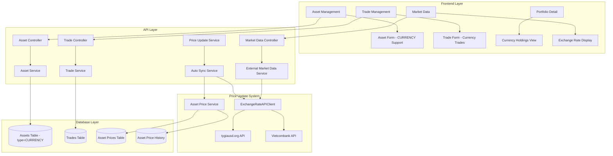
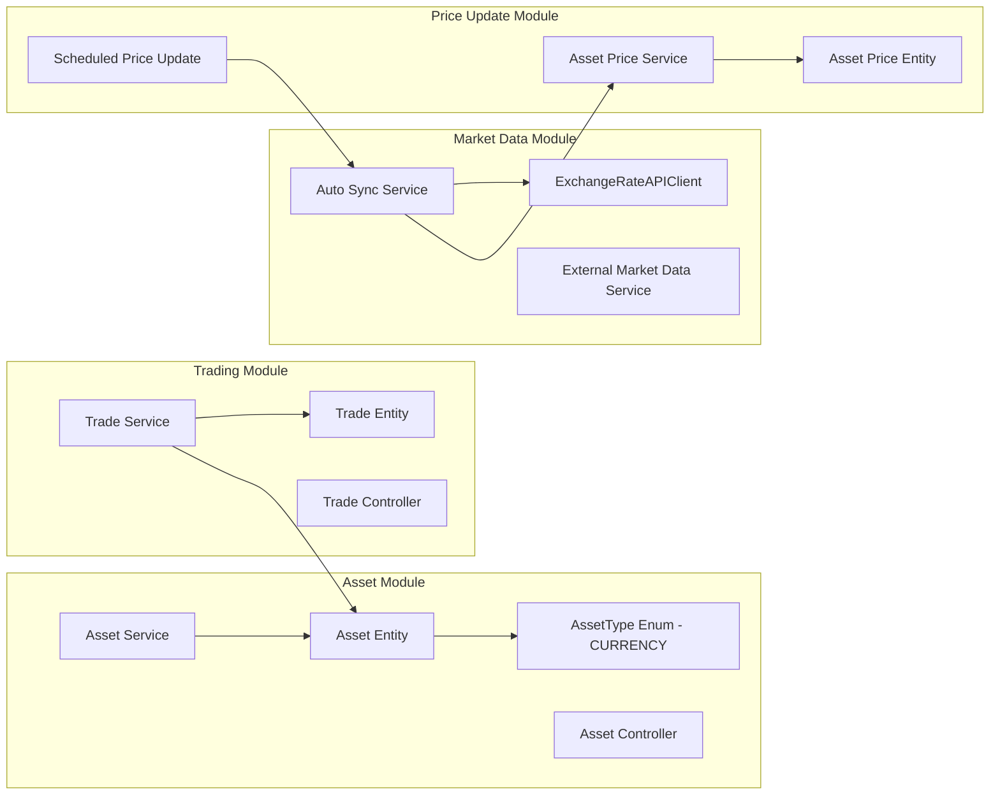

# CR-008: Currency Investment System - Technical Design Document

## 1. Overview

### 1.1 Purpose
This document provides the technical design for implementing the Currency Investment System within the existing Portfolio Management System. The design follows the established architecture patterns where Currency is implemented as a new AssetType (CURRENCY), leveraging existing Asset and Trade entities rather than creating separate currency-specific entities.

### 1.2 Scope
- Database schema update: Add CURRENCY to AssetType enum
- Integration with existing Asset and Trade systems
- Exchange rate price update integration
- Frontend component enhancements for CURRENCY asset type
- API enhancements for currency-specific operations
- Performance and security considerations

### 1.3 Technology Stack
- **Backend:** NestJS with TypeORM
- **Database:** PostgreSQL
- **Frontend:** React.js with TypeScript
- **UI Framework:** Material-UI
- **State Management:** React Query
- **Price Update:** Existing scheduled price update system
- **Exchange Rate API:** ExchangeRateAPIClient (tygiausd.org, Vietcombank)

### 1.4 Design Philosophy
**Key Design Decision:** Currency is implemented as AssetType.CURRENCY, using existing Asset and Trade entities. This approach:
- Reuses all existing infrastructure (Trade matching, P&L calculation, portfolio integration)
- Maintains consistency with other asset types (STOCK, BOND, GOLD, etc.)
- Minimizes code changes (only enum update + price update integration)
- Provides consistent user experience

## 2. System Architecture

### 2.1 High-Level Architecture



### 2.2 Module Integration



## 3. Database Design

### 3.1 AssetType Enum Update

**Current Enum:**
```typescript
export enum AssetType {
  STOCK = 'STOCK',
  BOND = 'BOND',
  GOLD = 'GOLD',
  CRYPTO = 'CRYPTO',
  COMMODITY = 'COMMODITY',
  REALESTATE = 'REALESTATE',
  OTHER = 'OTHER',
}
```

**Updated Enum:**
```typescript
export enum AssetType {
  STOCK = 'STOCK',
  BOND = 'BOND',
  GOLD = 'GOLD',
  CRYPTO = 'CRYPTO',
  COMMODITY = 'COMMODITY',
  REALESTATE = 'REALESTATE',
  CURRENCY = 'CURRENCY',  // NEW
  OTHER = 'OTHER',
}
```

**Asset Type Labels:**
```typescript
export const AssetTypeLabels: Record<AssetType, string> = {
  [AssetType.STOCK]: 'Cổ phiếu',
  [AssetType.BOND]: 'Trái phiếu',
  [AssetType.GOLD]: 'Vàng',
  [AssetType.CRYPTO]: 'Tài sản số',
  [AssetType.COMMODITY]: 'Hàng hóa',
  [AssetType.REALESTATE]: 'Bất động sản',
  [AssetType.CURRENCY]: 'Tiền tệ',  // NEW
  [AssetType.OTHER]: 'Khác',
};
```

**Asset Type Descriptions:**
```typescript
export const AssetTypeDescriptions: Record<AssetType, string> = {
  [AssetType.STOCK]: 'Cổ phiếu của các công ty niêm yết và quỹ hoán đổi danh mục',
  [AssetType.BOND]: 'Trái phiếu chính phủ và doanh nghiệp',
  [AssetType.GOLD]: 'Vàng và kim loại quý',
  [AssetType.CRYPTO]: 'Tài sản số',
  [AssetType.COMMODITY]: 'Hàng hóa và nguyên liệu thô',
  [AssetType.REALESTATE]: 'Bất động sản và các khoản đầu tư liên quan',
  [AssetType.CURRENCY]: 'Tiền tệ ngoại hối (USD, GBP, EUR, JPY, etc.)',  // NEW
  [AssetType.OTHER]: 'Các loại tài sản khác không thuộc các danh mục trên',
};
```

### 3.2 Asset Entity (No Changes Required)

The existing Asset entity already supports all asset types through the `type` field:

```typescript
@Entity('assets')
export class Asset {
  @PrimaryGeneratedColumn('uuid')
  id: string;

  @Column({ type: 'varchar', length: 255 })
  name: string;

  @Column({ type: 'varchar', length: 50 })
  symbol: string;  // For currency: USD, GBP, EUR, etc.

  @Column({ 
    type: 'enum', 
    enum: AssetType,
    default: AssetType.STOCK
  })
  type: AssetType;  // Can be CURRENCY

  @Column({ 
    type: 'enum', 
    enum: PriceMode,
    default: PriceMode.AUTOMATIC
  })
  priceMode: PriceMode;  // AUTOMATIC for exchange rate updates

  @Column({ type: 'varchar', length: 3, default: 'VND' })
  currency: string;  // Currency code (USD, GBP, etc.)

  // ... other fields ...
}
```

**Currency Asset Example:**
- `symbol`: "USD"
- `name`: "US Dollar"
- `type`: AssetType.CURRENCY
- `currency`: "USD"
- `priceMode`: PriceMode.AUTOMATIC

### 3.3 Trade Entity (No Changes Required)

The existing Trade entity already supports currency trades:

```typescript
@Entity('trades')
export class Trade {
  @PrimaryGeneratedColumn('uuid', { name: 'trade_id' })
  tradeId: string;

  @Column('uuid', { name: 'portfolio_id' })
  portfolioId: string;

  @Column('uuid', { name: 'asset_id' })
  assetId: string;  // Points to Currency Asset

  @Column('timestamp', { name: 'trade_date' })
  tradeDate: Date;

  @Column({
    type: 'enum',
    enum: TradeSide,
    name: 'side'
  })
  side: TradeSide;  // BUY or SELL

  @Column('decimal', { precision: 18, scale: 8, name: 'quantity' })
  quantity: number;  // Currency units

  @Column('decimal', { precision: 18, scale: 8, name: 'price' })
  price: number;  // Exchange rate

  // ... other fields ...
}
```

**Currency Trade Example:**
- `assetId`: Points to USD Asset (type=CURRENCY)
- `side`: TradeSide.BUY
- `quantity`: 1000 (USD units)
- `price`: 24500 (VND/USD exchange rate)

### 3.4 Asset Price Entity (No Changes Required)

Exchange rates are stored as asset prices:

```typescript
@Entity('asset_prices')
export class AssetPrice {
  @PrimaryGeneratedColumn('uuid')
  id: string;

  @Column('uuid', { name: 'asset_id' })
  assetId: string;  // Points to Currency Asset

  @Column('decimal', { precision: 20, scale: 8, name: 'current_price' })
  currentPrice: number;  // Exchange rate

  @Column({
    type: 'enum',
    enum: PriceType,
    name: 'price_type'
  })
  priceType: PriceType;  // EXTERNAL for exchange rates

  @Column({
    type: 'enum',
    enum: PriceSource,
    name: 'price_source'
  })
  priceSource: PriceSource;  // EXTERNAL_API

  @Column('timestamp', { name: 'last_price_update' })
  lastPriceUpdate: Date;

  // ... other fields ...
}
```

### 3.5 Database Migration

**Migration Script:**
```typescript
import { MigrationInterface, QueryRunner } from 'typeorm';

export class AddCurrencyToAssetType1735123456789 implements MigrationInterface {
  public async up(queryRunner: QueryRunner): Promise<void> {
    // Add CURRENCY to asset_type enum
    await queryRunner.query(`
      ALTER TYPE asset_type_enum ADD VALUE IF NOT EXISTS 'CURRENCY';
    `);
  }

  public async down(queryRunner: QueryRunner): Promise<void> {
    // Note: PostgreSQL does not support removing enum values directly
    // This would require recreating the enum type, which is complex
    // For safety, we'll leave the enum value in place
    // If removal is absolutely necessary, a more complex migration is needed
    this.logger.warn('Cannot remove enum value CURRENCY. Manual intervention required if needed.');
  }
}
```

**SQL Migration:**
```sql
-- Add CURRENCY to asset_type enum
ALTER TYPE asset_type_enum ADD VALUE IF NOT EXISTS 'CURRENCY';
```

## 4. API Design

### 4.1 Asset Controller (Enhanced)

**Existing endpoints work with CURRENCY type - no changes needed:**
```typescript
@Controller('api/v1/assets')
export class AssetController {
  // All existing endpoints support CURRENCY type automatically
  // POST /api/v1/assets - Create currency asset
  // GET /api/v1/assets?type=CURRENCY - Get currency assets
  // GET /api/v1/assets/:id - Get currency asset details
  // PUT /api/v1/assets/:id - Update currency asset
  // DELETE /api/v1/assets/:id - Delete currency asset
}
```

**New DTOs (Optional - for currency-specific validation):**
```typescript
export class CreateCurrencyAssetDto extends CreateAssetDto {
  @IsEnum(AssetType)
  @IsIn([AssetType.CURRENCY])
  type: AssetType.CURRENCY;

  @IsString()
  @Length(3, 3)
  @Matches(/^[A-Z]{3}$/)
  @ApiProperty({ description: 'Currency code (USD, GBP, EUR, etc.)' })
  symbol: string;  // Must be 3-letter currency code

  @IsString()
  @ApiProperty({ description: 'Currency name' })
  name: string;  // e.g., "US Dollar", "British Pound"

  @IsEnum(PriceMode)
  @IsIn([PriceMode.AUTOMATIC])
  priceMode: PriceMode.AUTOMATIC;  // Currency prices should be automatic
}
```

### 4.2 Trade Controller (No Changes Required)

**Existing endpoints work with currency trades:**
```typescript
@Controller('api/v1/portfolios/:portfolioId/trades')
export class TradeController {
  // POST /api/v1/portfolios/:portfolioId/trades
  // - Create currency trade (BUY/SELL)
  // - Asset type = CURRENCY
  // - Price = Exchange rate
  
  // GET /api/v1/portfolios/:portfolioId/trades?assetType=CURRENCY
  // - Get currency trades
}
```

### 4.3 Market Data Controller (Enhanced)

**New endpoints for exchange rate operations:**
```typescript
@Controller('api/v1/market-data')
export class MarketDataController {
  constructor(
    private readonly externalMarketDataService: ExternalMarketDataService,
    private readonly exchangeRateAPIClient: ExchangeRateAPIClient
  ) {}

  @Get('exchange-rates')
  @ApiOperation({ summary: 'Get all exchange rates' })
  async getExchangeRates(
    @Query('bank') bank: string = 'vietcombank'
  ): Promise<ExchangeRateData[]> {
    const result = await this.exchangeRateAPIClient.getExchangeRates(bank);
    return result.data;
  }

  @Get('exchange-rates/:currencyCode')
  @ApiOperation({ summary: 'Get exchange rate for specific currency' })
  async getExchangeRateByCurrency(
    @Param('currencyCode') currencyCode: string,
    @Query('bank') bank: string = 'vietcombank'
  ): Promise<ExchangeRateData | null> {
    return await this.exchangeRateAPIClient.getExchangeRateBySymbol(currencyCode, bank);
  }

  @Post('exchange-rates/refresh')
  @ApiOperation({ summary: 'Manually refresh exchange rates' })
  async refreshExchangeRates(
    @Body() refreshDto: RefreshExchangeRatesDto
  ): Promise<{ success: boolean; updated: number }> {
    // Trigger price update for all CURRENCY assets
    // Implementation in Price Update Service
  }
}
```

### 4.4 Price Update Service (Enhanced)

**Integration with ExchangeRateAPIClient:**
```typescript
@Injectable()
export class ScheduledPriceUpdateService {
  constructor(
    private readonly assetRepository: Repository<Asset>,
    private readonly assetPriceService: AssetPriceService,
    private readonly exchangeRateAPIClient: ExchangeRateAPIClient,
    private readonly autoSyncService: AutoSyncService
  ) {}

  /**
   * Update prices for CURRENCY assets
   */
  async updateCurrencyPrices(): Promise<PriceUpdateResult[]> {
    // Get all CURRENCY assets with AUTOMATIC price mode
    const currencyAssets = await this.assetRepository.find({
      where: {
        type: AssetType.CURRENCY,
        priceMode: PriceMode.AUTOMATIC
      },
      relations: ['assetPrice']
    });

    const results: PriceUpdateResult[] = [];

    for (const asset of currencyAssets) {
      try {
        // Get exchange rate from API
        const exchangeRateData = await this.exchangeRateAPIClient.getExchangeRateBySymbol(
          asset.symbol,
          'vietcombank'
        );

        if (exchangeRateData && exchangeRateData.sellPrice > 0) {
          // Use sell price as exchange rate (price to buy currency)
          const exchangeRate = exchangeRateData.sellPrice;

          // Update asset price
          await this.assetPriceService.updateByAssetId(asset.id, {
            currentPrice: exchangeRate,
            priceType: PriceType.EXTERNAL,
            priceSource: PriceSource.EXTERNAL_API,
            lastPriceUpdate: new Date()
          });

          // Save to price history
          await this.assetPriceService.addPriceHistory(asset.id, {
            price: exchangeRate,
            priceType: PriceType.EXTERNAL,
            priceSource: PriceSource.EXTERNAL_API,
            changeReason: `Exchange rate update from ${exchangeRateData.source || 'API'}`,
            metadata: {
              source: exchangeRateData.source || 'unknown',
              bank: exchangeRateData.bank || 'vietcombank'
            }
          });

          results.push({
            assetId: asset.id,
            symbol: asset.symbol,
            success: true,
            newPrice: exchangeRate,
            timestamp: new Date()
          });
        } else {
          results.push({
            assetId: asset.id,
            symbol: asset.symbol,
            success: false,
            error: 'Exchange rate not available',
            timestamp: new Date()
          });
        }
      } catch (error) {
        results.push({
          assetId: asset.id,
          symbol: asset.symbol,
          success: false,
          error: error.message,
          timestamp: new Date()
        });
      }
    }

    return results;
  }
}
```

### 4.5 Auto Sync Service (Enhanced)

**Integration with ExchangeRateAPIClient:**
```typescript
@Injectable()
export class AutoSyncService {
  // ... existing code ...

  /**
   * Enhanced performSync to handle CURRENCY assets
   */
  private async performSync(syncId: string, marketDataResult?: any, isManual: boolean = false): Promise<{
    successfulUpdates: number;
    failedUpdates: number;
    failedSymbols: string[];
  }> {
    // ... existing code for other asset types ...

    // Handle CURRENCY assets separately
    const currencyAssets = globalAssets.filter(asset => asset.type === AssetType.CURRENCY);

    for (const asset of currencyAssets) {
      try {
        // Get exchange rate from ExchangeRateAPIClient
        const exchangeRateData = await this.exchangeRateAPIClient.getExchangeRateBySymbol(
          asset.symbol,
          'vietcombank'
        );

        if (exchangeRateData && exchangeRateData.sellPrice > 0) {
          const exchangeRate = exchangeRateData.sellPrice;
          const now = new Date();
          const changeReason = isManual 
            ? `Exchange rate manual sync ${now.toLocaleDateString('vi-VN')}`
            : `Exchange rate auto sync ${now.toLocaleDateString('vi-VN')}`;

          // Update asset price
          if (asset.assetPrice) {
            await this.assetPriceRepository.update(asset.assetPrice.id, {
              currentPrice: exchangeRate,
              priceType: PriceType.EXTERNAL,
              priceSource: PriceSource.EXTERNAL_API,
              lastPriceUpdate: now,
            });
          } else {
            const newAssetPrice = this.assetPriceRepository.create({
              assetId: asset.id,
              currentPrice: exchangeRate,
              priceType: PriceType.EXTERNAL,
              priceSource: PriceSource.EXTERNAL_API,
              lastPriceUpdate: now,
            });
            await this.assetPriceRepository.save(newAssetPrice);
          }

          // Save to price history
          const priceHistory = this.assetPriceHistoryRepository.create({
            assetId: asset.id,
            price: exchangeRate,
            priceType: PriceType.EXTERNAL,
            priceSource: PriceSource.EXTERNAL_API,
            changeReason: changeReason,
            createdAt: now,
            metadata: {
              source: exchangeRateData.source || 'unknown',
              bank: exchangeRateData.bank || 'vietcombank',
              syncId: syncId
            }
          });
          await this.assetPriceHistoryRepository.save(priceHistory);

          successCount++;
        } else {
          errorCount++;
          failedSymbols.push(asset.symbol);
        }
      } catch (error) {
        errorCount++;
        failedSymbols.push(asset.symbol);
        this.logger.error(`Failed to update exchange rate for ${asset.symbol}: ${error.message}`);
      }
    }

    // ... return results ...
  }
}
```

## 5. Service Layer Design

### 5.1 Asset Service (No Changes Required)

The existing AssetService already supports all asset types:

```typescript
@Injectable()
export class AssetService {
  // All existing methods work with CURRENCY type:
  // - createAsset() - Create currency asset
  // - getAssets() - Filter by type=CURRENCY
  // - getAssetById() - Get currency asset
  // - updateAsset() - Update currency asset
  // - deleteAsset() - Delete currency asset
}
```

### 5.2 Trade Service (No Changes Required)

The existing TradeService already supports currency trades:

```typescript
@Injectable()
export class TradeService {
  // All existing methods work with currency trades:
  // - createTrade() - Create currency trade (BUY/SELL)
  // - getTrades() - Filter by assetType=CURRENCY
  // - FIFO/LIFO matching works automatically
  // - P&L calculation works automatically
}
```

### 5.3 Exchange Rate Helper Service (New)

**New service for currency-specific operations:**
```typescript
@Injectable()
export class CurrencyHelperService {
  constructor(
    private readonly exchangeRateAPIClient: ExchangeRateAPIClient,
    private readonly assetService: AssetService
  ) {}

  /**
   * Get or create currency asset
   */
  async getOrCreateCurrencyAsset(currencyCode: string, userId: string): Promise<Asset> {
    // Check if currency asset exists
    const existingAsset = await this.assetService.findBySymbolAndUser(currencyCode, userId);
    
    if (existingAsset && existingAsset.type === AssetType.CURRENCY) {
      return existingAsset;
    }

    // Get currency name from exchange rate API
    const exchangeRateData = await this.exchangeRateAPIClient.getExchangeRateBySymbol(currencyCode);
    const currencyName = exchangeRateData?.currencyName || currencyCode;

    // Create new currency asset
    return await this.assetService.createAsset({
      symbol: currencyCode,
      name: currencyName,
      type: AssetType.CURRENCY,
      currency: currencyCode,
      priceMode: PriceMode.AUTOMATIC,
      createdBy: userId
    });
  }

  /**
   * Get current exchange rate for currency
   */
  async getCurrentExchangeRate(currencyCode: string): Promise<number | null> {
    const exchangeRateData = await this.exchangeRateAPIClient.getExchangeRateBySymbol(currencyCode);
    return exchangeRateData?.sellPrice || null;
  }

  /**
   * Validate currency code
   */
  isValidCurrencyCode(code: string): boolean {
    return /^[A-Z]{3}$/.test(code);
  }
}
```

## 6. Frontend Component Design

### 6.1 Asset Form (Enhanced)

**Support for CURRENCY asset type:**
```typescript
// AssetForm.tsx
const AssetForm: React.FC<AssetFormProps> = ({ asset, onSubmit, onCancel }) => {
  const [assetType, setAssetType] = useState<AssetType>(asset?.type || AssetType.STOCK);
  const [currencyCode, setCurrencyCode] = useState<string>('');

  // When CURRENCY type is selected
  useEffect(() => {
    if (assetType === AssetType.CURRENCY) {
      // Auto-fill currency code suggestions
      // Validate currency code format (3 letters)
      // Fetch exchange rate preview
    }
  }, [assetType]);

  return (
    <Form>
      <Select
        label="Asset Type"
        value={assetType}
        onChange={(e) => setAssetType(e.target.value as AssetType)}
        options={[
          { value: AssetType.STOCK, label: 'Cổ phiếu' },
          { value: AssetType.BOND, label: 'Trái phiếu' },
          { value: AssetType.GOLD, label: 'Vàng' },
          { value: AssetType.CRYPTO, label: 'Tài sản số' },
          { value: AssetType.COMMODITY, label: 'Hàng hóa' },
          { value: AssetType.REALESTATE, label: 'Bất động sản' },
          { value: AssetType.CURRENCY, label: 'Tiền tệ' },  // NEW
          { value: AssetType.OTHER, label: 'Khác' },
        ]}
      />

      {assetType === AssetType.CURRENCY && (
        <>
          <Select
            label="Currency Code"
            value={currencyCode}
            onChange={(e) => setCurrencyCode(e.target.value)}
            options={[
              { value: 'USD', label: 'USD - US Dollar' },
              { value: 'GBP', label: 'GBP - British Pound' },
              { value: 'EUR', label: 'EUR - Euro' },
              { value: 'JPY', label: 'JPY - Japanese Yen' },
              { value: 'CNY', label: 'CNY - Chinese Yuan' },
              { value: 'KRW', label: 'KRW - Korean Won' },
              { value: 'SGD', label: 'SGD - Singapore Dollar' },
              { value: 'THB', label: 'THB - Thai Baht' },
            ]}
          />
          <TextField
            label="Currency Name"
            value={currencyName}
            onChange={(e) => setCurrencyName(e.target.value)}
            helperText="e.g., US Dollar, British Pound"
          />
          <ExchangeRatePreview currencyCode={currencyCode} />
        </>
      )}

      {/* Other fields */}
    </Form>
  );
};
```

### 6.2 Trade Form (No Changes Required)

**Existing TradeForm works with currency trades:**
```typescript
// TradeForm.tsx - No changes needed
// When asset type is CURRENCY:
// - Price field shows "Exchange Rate"
// - Quantity field shows "Currency Units"
// - All validation and calculations work automatically
```

### 6.3 Asset List (Enhanced)

**Filter by CURRENCY type:**
```typescript
// Assets.tsx
const Assets: React.FC = () => {
  const [assetTypeFilter, setAssetTypeFilter] = useState<AssetType | 'ALL'>('ALL');

  const { data: assets } = useQuery({
    queryKey: ['assets', assetTypeFilter],
    queryFn: () => assetService.getAssets({
      type: assetTypeFilter !== 'ALL' ? assetTypeFilter : undefined
    })
  });

  return (
    <>
      <Select
        label="Filter by Type"
        value={assetTypeFilter}
        onChange={(e) => setAssetTypeFilter(e.target.value)}
        options={[
          { value: 'ALL', label: 'All Types' },
          { value: AssetType.STOCK, label: 'Stocks' },
          { value: AssetType.BOND, label: 'Bonds' },
          { value: AssetType.GOLD, label: 'Gold' },
          { value: AssetType.CRYPTO, label: 'Crypto' },
          { value: AssetType.COMMODITY, label: 'Commodities' },
          { value: AssetType.REALESTATE, label: 'Real Estate' },
          { value: AssetType.CURRENCY, label: 'Currencies' },  // NEW
          { value: AssetType.OTHER, label: 'Other' },
        ]}
      />
      <AssetList assets={assets} />
    </>
  );
};
```

### 6.4 Exchange Rate Display Component (New)

**Component to display current exchange rates:**
```typescript
// ExchangeRateDisplay.tsx
const ExchangeRateDisplay: React.FC<{ currencyCode: string }> = ({ currencyCode }) => {
  const { data: exchangeRate, isLoading } = useQuery({
    queryKey: ['exchangeRate', currencyCode],
    queryFn: () => marketDataService.getExchangeRateByCurrency(currencyCode),
    refetchInterval: 60000 // Refresh every minute
  });

  if (isLoading) return <CircularProgress />;

  return (
    <Card>
      <CardContent>
        <Typography variant="h6">{currencyCode} Exchange Rate</Typography>
        <Typography variant="h4">
          {formatCurrency(exchangeRate?.sellPrice || 0, 'VND')}
        </Typography>
        <Typography variant="caption">
          Source: {exchangeRate?.source || 'N/A'}
          {exchangeRate?.lastUpdate && ` • Updated: ${formatDate(exchangeRate.lastUpdate)}`}
        </Typography>
      </CardContent>
    </Card>
  );
};
```

### 6.5 Currency Management Component (New)

**Wrapper component for currency-specific management:**
```typescript
// CurrencyManagement.tsx
const CurrencyManagement: React.FC = () => {
  const { data: currencyAssets } = useQuery({
    queryKey: ['assets', AssetType.CURRENCY],
    queryFn: () => assetService.getAssets({ type: AssetType.CURRENCY })
  });

  return (
    <Container>
      <Typography variant="h4">Currency Investment</Typography>
      
      <Grid container spacing={3}>
        <Grid item xs={12} md={8}>
          <AssetList assets={currencyAssets} />
        </Grid>
        <Grid item xs={12} md={4}>
          <ExchangeRateSummary />
        </Grid>
      </Grid>
    </Container>
  );
};
```

## 7. Integration Points

### 7.1 Price Update System Integration

**Scheduled Price Updates:**
- CURRENCY assets included in scheduled price updates
- Exchange rates fetched from ExchangeRateAPIClient
- Updates stored in AssetPrice and AssetPriceHistory
- Same update frequency as other assets

**Manual Price Refresh:**
- Users can manually refresh exchange rates
- API endpoint: `POST /api/v1/market-data/exchange-rates/refresh`
- Updates all CURRENCY assets with AUTOMATIC price mode

### 7.2 Portfolio Integration

**Automatic Integration:**
- Currency assets included in portfolio total value
- Currency trades included in portfolio P&L
- Currency holdings shown in asset allocation
- All existing portfolio calculations work automatically

### 7.3 Trading System Integration

**Trade Processing:**
- Currency trades use existing Trade entity
- FIFO/LIFO matching works automatically
- Realized P&L calculated automatically
- Cash flow entries created automatically

## 8. Security Considerations

### 8.1 Data Validation
- Currency code validation (3-letter uppercase)
- Exchange rate validation (positive numbers)
- Trade quantity validation (positive numbers)
- User permission checks (same as other assets)

### 8.2 API Security
- Exchange rate API calls with circuit breaker
- Rate limiting for exchange rate API
- Error handling and fallback mechanisms
- Data source verification

## 9. Performance Considerations

### 9.1 Caching
- Exchange rate data cached (same as other market data)
- Cache TTL: 5 minutes (exchange rates change frequently)
- Cache invalidation on manual refresh

### 9.2 Database Optimization
- Index on `assets.type` for filtering
- Index on `assets.symbol` for currency lookup
- Index on `asset_prices.asset_id` for price queries

### 9.3 API Optimization
- Batch exchange rate updates
- Parallel API calls for multiple currencies
- Circuit breaker to prevent API overload

## 10. Testing Strategy

### 10.1 Unit Tests
- AssetType enum includes CURRENCY
- Currency asset creation/update/delete
- Exchange rate fetching and validation
- Price update service for currencies

### 10.2 Integration Tests
- Currency trade creation (BUY/SELL)
- Portfolio value calculation with currencies
- P&L calculation for currency trades
- Price update integration

### 10.3 E2E Tests
- Create currency asset
- Purchase currency (BUY trade)
- Sell currency (SELL trade)
- View currency holdings
- Exchange rate updates

## 11. Migration Plan

### 11.1 Database Migration
1. Run migration to add CURRENCY to enum
2. Verify enum update successful
3. Test asset creation with CURRENCY type

### 11.2 Backend Deployment
1. Deploy updated AssetType enum
2. Deploy enhanced price update service
3. Deploy new exchange rate endpoints
4. Test exchange rate API integration

### 11.3 Frontend Deployment
1. Deploy updated AssetForm with CURRENCY support
2. Deploy updated AssetList with CURRENCY filter
3. Deploy ExchangeRateDisplay component
4. Deploy CurrencyManagement component

### 11.4 Rollback Plan
- Enum value cannot be removed easily (PostgreSQL limitation)
- Keep CURRENCY enum value but disable in UI if needed
- Remove exchange rate API integration if issues occur

## 12. Future Enhancements

### 12.1 Phase 2 Features
- Currency conversion between different currencies
- Multi-currency portfolio support
- Currency hedging strategies
- Currency correlation analysis

### 12.2 Advanced Features
- Real-time exchange rate updates (WebSocket)
- Currency options and derivatives
- International money transfer integration
- Currency risk management metrics

---

**Document Version:** 1.0  
**Created Date:** November 27, 2025  
**Author:** AI Assistant  
**Status:** Draft  
**Next Review:** After Task Breakdown completion

