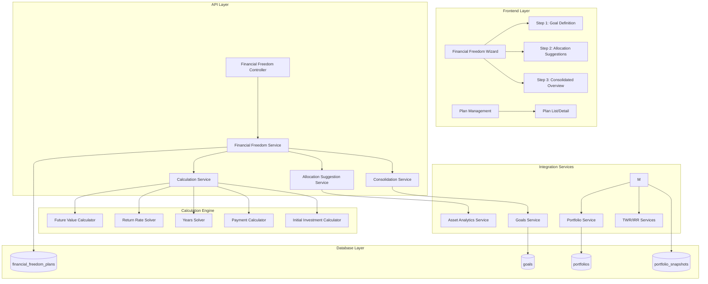
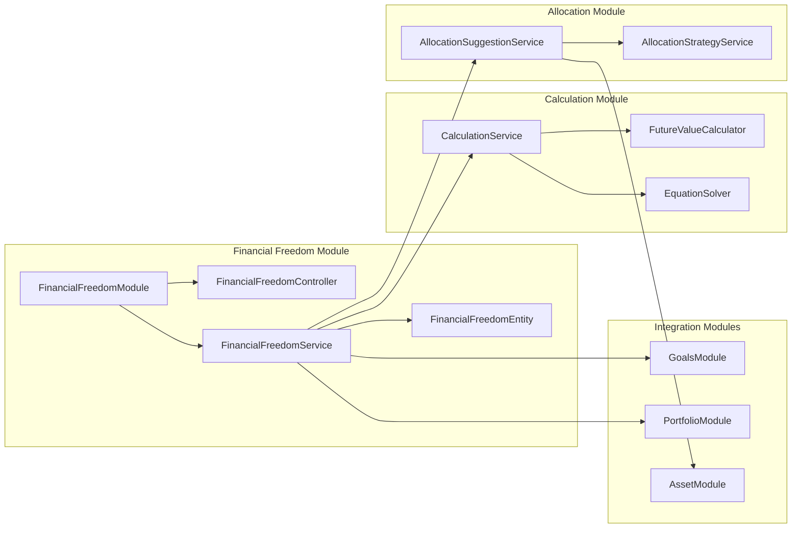
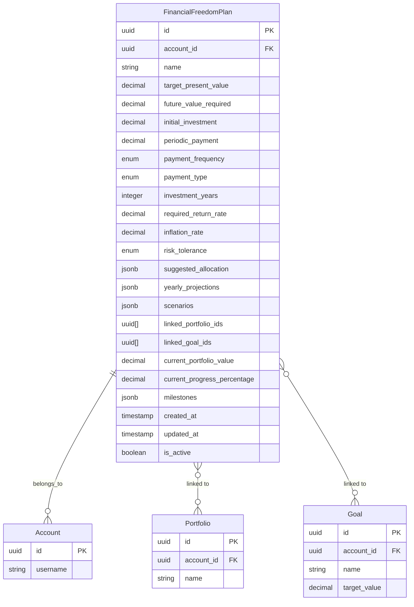

# CR-009: Financial Freedom Planning System - Technical Design Document

## 1. Overview

### 1.1 Purpose
This document provides the technical design for implementing the Financial Freedom Planning System within the existing Portfolio Management System. The system enables users to plan their path to financial freedom through a 3-step workflow: goal definition, asset allocation suggestions, and consolidated plan overview.

### 1.2 Scope
- Database schema: New `financial_freedom_plans` table and related entities
- Backend services: Calculation engine, allocation suggestion service, consolidation service
- API endpoints: CRUD operations, calculation endpoints
- Frontend components: 3-step wizard UI, calculation forms, charts and visualizations
- Integration: Goals Management System, Portfolio System, Asset Analytics Service

### 1.3 Technology Stack
- **Backend:** NestJS with TypeORM
- **Database:** PostgreSQL
- **Frontend:** React.js with TypeScript
- **UI Framework:** Material-UI
- **State Management:** React Query
- **Charts:** Recharts
- **Calculations:** Decimal.js (for precision)
- **Numerical Methods:** Custom implementation for solving equations

### 1.4 Design Philosophy
**Key Design Decisions:**
1. **Flexible Calculation Engine**: Can calculate any missing variable (RRR, years, payment, FV, initial investment)
2. **4-Step Workflow**: Clear separation of concerns, user-friendly progression
3. **Integration First**: Leverage existing Goals, Portfolio, and Analytics systems
4. **Precision Matters**: Use Decimal.js for all financial calculations
5. **Real-time Tracking**: Link plans to portfolios for live progress updates

## 2. System Architecture

### 2.1 High-Level Architecture



### 2.2 Module Structure



## 3. Database Design

### 3.1 Financial Freedom Plan Entity

```typescript
@Entity('financial_freedom_plans')
export class FinancialFreedomPlan {
  @PrimaryGeneratedColumn('uuid')
  id: string;

  @Column({ type: 'uuid' })
  accountId: string;

  @Column({ type: 'varchar', length: 255 })
  name: string;

  // Step 1: Goals & Investment Info
  @Column({ type: 'decimal', precision: 15, scale: 2 })
  targetPresentValue: number; // Số tiền cần có (hiện tại)

  @Column({ type: 'decimal', precision: 15, scale: 2 })
  futureValueRequired: number; // Sau lạm phát

  @Column({ type: 'decimal', precision: 15, scale: 2, nullable: true })
  initialInvestment: number;

  @Column({ type: 'decimal', precision: 15, scale: 2, nullable: true })
  periodicPayment: number;

  @Column({ 
    type: 'enum', 
    enum: ['monthly', 'quarterly', 'yearly'],
    default: 'monthly'
  })
  paymentFrequency: 'monthly' | 'quarterly' | 'yearly';

  @Column({ 
    type: 'enum', 
    enum: ['contribution', 'withdrawal'],
    default: 'contribution'
  })
  paymentType: 'contribution' | 'withdrawal';

  @Column({ type: 'integer', nullable: true })
  investmentYears: number;

  @Column({ type: 'decimal', precision: 5, scale: 2, nullable: true })
  requiredReturnRate: number; // RRR (calculated or input)

  @Column({ type: 'decimal', precision: 5, scale: 2, default: 3.5 })
  inflationRate: number;

  @Column({ 
    type: 'enum', 
    enum: ['conservative', 'moderate', 'aggressive'],
    default: 'moderate'
  })
  riskTolerance: 'conservative' | 'moderate' | 'aggressive';

  // Step 2: Asset Allocation
  @Column({ type: 'jsonb', nullable: true })
  suggestedAllocation: {
    stocks: number;
    bonds: number;
    gold: number;
    realEstate: number;
    cash: number;
  };

  // Step 3: Consolidated Plan (JSONB for flexibility)
  @Column({ type: 'jsonb', nullable: true })
  yearlyProjections: Array<{
    year: number;
    portfolioValue: number;
    contributions: number;
    returns: number;
    cumulativeValue: number;
    progressToGoal: number;
  }>;

  @Column({ type: 'jsonb', nullable: true })
  scenarios: {
    conservative: {
      finalValue: number;
      yearsToGoal: number;
      progressPercentage: number;
    };
    moderate: {
      finalValue: number;
      yearsToGoal: number;
      progressPercentage: number;
    };
    aggressive: {
      finalValue: number;
      yearsToGoal: number;
      progressPercentage: number;
    };
  };

  // Step 4: Tracking
  @Column({ type: 'uuid', array: true, default: [] })
  linkedPortfolioIds: string[];

  @Column({ type: 'uuid', array: true, default: [] })
  linkedGoalIds: string[]; // Link to Goals system

  @Column({ type: 'decimal', precision: 15, scale: 2, nullable: true })
  currentPortfolioValue: number;

  @Column({ type: 'decimal', precision: 5, scale: 2, nullable: true })
  currentProgressPercentage: number;

  @Column({ type: 'jsonb', nullable: true })
  milestones: Array<{
    year: number;
    description: string;
    targetValue: number;
    achieved: boolean;
    achievedAt?: Date;
  }>;

  @Column({ type: 'timestamp', default: () => 'CURRENT_TIMESTAMP' })
  createdAt: Date;

  @Column({ type: 'timestamp', default: () => 'CURRENT_TIMESTAMP' })
  updatedAt: Date;

  @Column({ type: 'boolean', default: true })
  isActive: boolean;

  // Relations
  @ManyToOne(() => Account, { onDelete: 'CASCADE' })
  @JoinColumn({ name: 'accountId' })
  account: Account;
}
```

### 3.2 Database Migration

```typescript
// Migration: CreateFinancialFreedomPlansTable
export class CreateFinancialFreedomPlansTable1234567890123 implements MigrationInterface {
  public async up(queryRunner: QueryRunner): Promise<void> {
    await queryRunner.createTable(
      new Table({
        name: 'financial_freedom_plans',
        columns: [
          {
            name: 'id',
            type: 'uuid',
            isPrimary: true,
            generationStrategy: 'uuid',
            default: 'uuid_generate_v4()',
          },
          {
            name: 'account_id',
            type: 'uuid',
            isNullable: false,
          },
          {
            name: 'name',
            type: 'varchar',
            length: '255',
            isNullable: false,
          },
          {
            name: 'target_present_value',
            type: 'decimal',
            precision: 15,
            scale: 2,
            isNullable: false,
          },
          {
            name: 'future_value_required',
            type: 'decimal',
            precision: 15,
            scale: 2,
            isNullable: false,
          },
          {
            name: 'initial_investment',
            type: 'decimal',
            precision: 15,
            scale: 2,
            isNullable: true,
          },
          {
            name: 'periodic_payment',
            type: 'decimal',
            precision: 15,
            scale: 2,
            isNullable: true,
          },
          {
            name: 'payment_frequency',
            type: 'enum',
            enum: ['monthly', 'quarterly', 'yearly'],
            default: "'monthly'",
          },
          {
            name: 'payment_type',
            type: 'enum',
            enum: ['contribution', 'withdrawal'],
            default: "'contribution'",
          },
          {
            name: 'investment_years',
            type: 'integer',
            isNullable: true,
          },
          {
            name: 'required_return_rate',
            type: 'decimal',
            precision: 5,
            scale: 2,
            isNullable: true,
          },
          {
            name: 'inflation_rate',
            type: 'decimal',
            precision: 5,
            scale: 2,
            default: 3.5,
          },
          {
            name: 'risk_tolerance',
            type: 'enum',
            enum: ['conservative', 'moderate', 'aggressive'],
            default: "'moderate'",
          },
          {
            name: 'suggested_allocation',
            type: 'jsonb',
            isNullable: true,
          },
          {
            name: 'yearly_projections',
            type: 'jsonb',
            isNullable: true,
          },
          {
            name: 'scenarios',
            type: 'jsonb',
            isNullable: true,
          },
          {
            name: 'linked_portfolio_ids',
            type: 'uuid[]',
            default: "'{}'",
          },
          {
            name: 'linked_goal_ids',
            type: 'uuid[]',
            default: "'{}'",
          },
          {
            name: 'current_portfolio_value',
            type: 'decimal',
            precision: 15,
            scale: 2,
            isNullable: true,
          },
          {
            name: 'current_progress_percentage',
            type: 'decimal',
            precision: 5,
            scale: 2,
            isNullable: true,
          },
          {
            name: 'milestones',
            type: 'jsonb',
            isNullable: true,
          },
          {
            name: 'created_at',
            type: 'timestamp',
            default: 'CURRENT_TIMESTAMP',
          },
          {
            name: 'updated_at',
            type: 'timestamp',
            default: 'CURRENT_TIMESTAMP',
          },
          {
            name: 'is_active',
            type: 'boolean',
            default: true,
          },
        ],
      }),
    );

    // Foreign key
    await queryRunner.createForeignKey(
      'financial_freedom_plans',
      new TableForeignKey({
        columnNames: ['account_id'],
        referencedColumnNames: ['id'],
        referencedTableName: 'accounts',
        onDelete: 'CASCADE',
      }),
    );

    // Indexes
    await queryRunner.createIndex('financial_freedom_plans', {
      name: 'IDX_financial_freedom_plans_account_id',
      columnNames: ['account_id'],
    });

    await queryRunner.createIndex('financial_freedom_plans', {
      name: 'IDX_financial_freedom_plans_is_active',
      columnNames: ['is_active'],
    });
  }

  public async down(queryRunner: QueryRunner): Promise<void> {
    await queryRunner.dropTable('financial_freedom_plans');
  }
}
```

### 3.3 Entity Relationships



## 4. API Design

### 4.1 Calculation Endpoint

#### POST /api/v1/financial-freedom/calculate
Calculate missing financial variable based on inputs.

**Request Body:**
```typescript
interface CalculateRequest {
  // Target amount (one of these)
  targetPresentValue?: number;
  monthlyExpenses?: number;
  withdrawalRate?: number; // Default: 0.04 (4%)
  
  // Investment parameters (leave one empty to calculate)
  initialInvestment?: number;
  periodicPayment?: number;
  investmentYears?: number;
  expectedReturnRate?: number;
  
  // Required
  paymentFrequency: 'monthly' | 'quarterly' | 'yearly';
  paymentType: 'contribution' | 'withdrawal';
  inflationRate: number;
  riskTolerance: 'conservative' | 'moderate' | 'aggressive';
}
```

**Response:**
```typescript
interface CalculateResponse {
  calculatedVariable: {
    type: 'returnRate' | 'years' | 'periodicPayment' | 'futureValue' | 'initialInvestment';
    value: number;
    label: string;
    formula?: string; // Optional: show calculation formula
  };
  futureValueRequired: number;
  targetPresentValue: number;
  isFeasible: boolean;
  warnings: string[];
  suggestions?: string[];
}
```

**Example Request:**
```json
{
  "targetPresentValue": 5000000000,
  "initialInvestment": 500000000,
  "periodicPayment": 10000000,
  "investmentYears": 15,
  "paymentFrequency": "monthly",
  "paymentType": "contribution",
  "inflationRate": 3.5,
  "riskTolerance": "moderate"
}
```

**Example Response:**
```json
{
  "calculatedVariable": {
    "type": "returnRate",
    "value": 12.5,
    "label": "Required Return Rate",
    "formula": "FV = PV₀(1+r)^n + PMT[((1+r)^n-1)/r]"
  },
  "futureValueRequired": 8370000000,
  "targetPresentValue": 5000000000,
  "isFeasible": true,
  "warnings": [],
  "suggestions": [
    "Consider increasing monthly contribution to reduce required return rate",
    "Suggested allocation: 65% stocks, 25% bonds, 5% gold, 5% real estate"
  ]
}
```

### 4.2 Allocation Suggestion Endpoint

#### POST /api/v1/financial-freedom/suggest-allocation
Get asset allocation suggestions based on required return rate.

**Request Body:**
```typescript
interface SuggestAllocationRequest {
  requiredReturnRate: number;
  riskTolerance: 'conservative' | 'moderate' | 'aggressive';
  investmentYears: number;
  currentAllocation?: Record<AssetType, number>; // Optional: for comparison
  portfolioId?: string; // Optional: fetch current allocation from portfolio
}
```

**Response:**
```typescript
interface SuggestAllocationResponse {
  suggestedAllocation: {
    stocks: number;
    bonds: number;
    gold: number;
    realEstate: number;
    cash: number;
  };
  expectedReturn: number;
  isAligned: boolean;
  adjustments?: {
    stocks: number; // +/- percentage
    bonds: number;
    gold: number;
    realEstate: number;
    cash: number;
  };
  recommendations: string[];
}
```

### 4.3 Consolidation Endpoint

#### POST /api/v1/financial-freedom/consolidate
Consolidate multiple plans and goals into unified view.

**Request Body:**
```typescript
interface ConsolidateRequest {
  planIds: string[];
  goalIds?: string[]; // Optional: include goals from Goals system
}
```

**Response:**
```typescript
interface ConsolidateResponse {
  totalTargetValue: number;
  weightedAverageRRR: number;
  combinedAllocation: Record<AssetType, number>;
  yearlyProjections: Array<{
    year: number;
    portfolioValue: number;
    contributions: number;
    returns: number;
    cumulativeValue: number;
    progressToGoal: number;
  }>;
  scenarios: {
    conservative: ScenarioResult;
    moderate: ScenarioResult;
    aggressive: ScenarioResult;
  };
  milestones: Array<{
    year: number;
    description: string;
    value: number;
  }>;
  riskAssessment: {
    overallRisk: 'low' | 'medium' | 'high';
    diversificationScore: number;
    recommendations: string[];
  };
}
```

### 4.4 Progress Tracking Endpoint

#### GET /api/v1/financial-freedom/plans/:id/progress
Get current progress for a plan.

**Response:**
```typescript
interface ProgressResponse {
  planId: string;
  currentValue: number;
  targetValue: number;
  progressPercentage: number;
  remainingAmount: number;
  remainingYears: number;
  currentReturnRate: number;
  requiredReturnRate: number;
  gap: number; // requiredReturnRate - currentReturnRate
  milestones: Array<{
    year: number;
    description: string;
    targetValue: number;
    achieved: boolean;
    achievedAt?: Date;
  }>;
  alerts: Array<{
    type: 'rebalancing' | 'performance' | 'milestone';
    severity: 'info' | 'warning' | 'error';
    message: string;
    action?: string;
  }>;
  yearlyComparison: Array<{
    year: number;
    targetValue: number;
    actualValue: number;
    difference: number;
  }>;
}
```

### 4.5 Template Endpoints

#### GET /api/v1/financial-freedom/templates
Get all available planning templates.

**Response:**
```typescript
interface TemplatesResponse {
  templates: PlanningTemplate[];
}
```

**Example Response:**
```json
{
  "templates": [
    {
      "id": "savings-investment",
      "name": "Tiết kiệm và đầu tư",
      "nameEn": "Savings & Investment",
      "description": "Dành cho người đang làm việc...",
      "icon": "savings",
      "category": "savings",
      "defaults": {
        "targetMethod": "fromExpenses",
        "monthlyExpenses": 50000000,
        "withdrawalRate": 0.04,
        "initialInvestment": 500000000,
        "periodicPayment": 10000000,
        "paymentFrequency": "monthly",
        "paymentType": "contribution",
        "investmentYears": 15,
        "expectedReturnRate": null,
        "inflationRate": 3.5,
        "riskTolerance": "moderate"
      },
      "calculateVariable": "returnRate",
      "guidance": "Template này phù hợp cho người đang làm việc...",
      "tips": ["Điều chỉnh chi phí sinh hoạt...", "..."]
    }
  ]
}
```

#### GET /api/v1/financial-freedom/templates/:id
Get template by ID.

**Response:**
```typescript
interface TemplateResponse {
  template: PlanningTemplate;
}
```

### 4.6 Plan CRUD Endpoints

#### POST /api/v1/financial-freedom/plans
Create new plan.

**Request Body:**
```typescript
interface CreatePlanRequest {
  name: string;
  templateId?: string; // Optional: if created from template
  // ... all plan fields
}
```

#### GET /api/v1/financial-freedom/plans
Get all plans for current user.

#### GET /api/v1/financial-freedom/plans/:id
Get plan by ID.

#### PUT /api/v1/financial-freedom/plans/:id
Update plan.

#### DELETE /api/v1/financial-freedom/plans/:id
Delete plan.

#### POST /api/v1/financial-freedom/plans/:id/duplicate
Duplicate plan.

## 5. Service Layer Design

### 5.1 Calculation Service

```typescript
@Injectable()
export class FinancialFreedomCalculationService {
  /**
   * Detect which variable is missing and calculate it
   */
  async calculateMissingVariable(
    inputs: CalculationInputs
  ): Promise<CalculationResult> {
    // Detect missing variable
    const missingVar = this.detectMissingVariable(inputs);
    
    // Calculate based on missing variable type
    switch (missingVar) {
      case 'returnRate':
        return this.calculateReturnRate(inputs);
      case 'years':
        return this.calculateYears(inputs);
      case 'periodicPayment':
        return this.calculatePeriodicPayment(inputs);
      case 'futureValue':
        return this.calculateFutureValue(inputs);
      case 'initialInvestment':
        return this.calculateInitialInvestment(inputs);
    }
  }

  /**
   * Calculate Required Return Rate using Newton-Raphson method
   */
  private calculateReturnRate(inputs: CalculationInputs): CalculationResult {
    const { initialInvestment, periodicPayment, futureValue, investmentYears, paymentFrequency } = inputs;
    
    // Convert to periods
    const periodsPerYear = this.getPeriodsPerYear(paymentFrequency);
    const totalPeriods = investmentYears * periodsPerYear;
    
    // Use Newton-Raphson to solve: FV = PV₀(1+r)^n + PMT[((1+r)^n-1)/r]
    const rate = this.solveReturnRate(
      initialInvestment,
      periodicPayment,
      futureValue,
      totalPeriods
    );
    
    // Convert to annual rate
    const annualRate = rate * periodsPerYear;
    
    return {
      calculatedVariable: {
        type: 'returnRate',
        value: annualRate,
        label: 'Required Return Rate',
      },
      isFeasible: annualRate >= 0 && annualRate <= 0.5,
      warnings: this.generateWarnings(annualRate, 'returnRate'),
    };
  }

  /**
   * Solve equation using Newton-Raphson method
   */
  private solveReturnRate(
    pv0: Decimal,
    pmt: Decimal,
    fv: Decimal,
    n: number
  ): Decimal {
    // Initial guess: 0.01 (1% per period)
    let rate = new Decimal(0.01);
    const tolerance = new Decimal(0.000001);
    const maxIterations = 100;

    for (let i = 0; i < maxIterations; i++) {
      const f = this.futureValueFunction(pv0, pmt, fv, n, rate);
      const fPrime = this.futureValueDerivative(pv0, pmt, n, rate);

      if (fPrime.abs().lessThan(tolerance)) {
        throw new Error('Cannot solve: derivative too small');
      }

      const newRate = rate.minus(f.dividedBy(fPrime));

      if (newRate.minus(rate).abs().lessThan(tolerance)) {
        return newRate;
      }

      rate = newRate;
    }

    throw new Error('Max iterations reached');
  }

  /**
   * Future Value function: FV = PV₀(1+r)^n + PMT[((1+r)^n-1)/r]
   */
  private futureValueFunction(
    pv0: Decimal,
    pmt: Decimal,
    targetFv: Decimal,
    n: number,
    r: Decimal
  ): Decimal {
    const onePlusR = new Decimal(1).plus(r);
    const onePlusRToN = onePlusR.pow(n);
    
    const pv0Part = pv0.times(onePlusRToN);
    
    let pmtPart: Decimal;
    if (r.equals(0)) {
      pmtPart = pmt.times(n);
    } else {
      pmtPart = pmt.times(onePlusRToN.minus(1).dividedBy(r));
    }
    
    return pv0Part.plus(pmtPart).minus(targetFv);
  }

  /**
   * Derivative of Future Value function
   */
  private futureValueDerivative(
    pv0: Decimal,
    pmt: Decimal,
    n: number,
    r: Decimal
  ): Decimal {
    const onePlusR = new Decimal(1).plus(r);
    const onePlusRToN = onePlusR.pow(n);
    
    const pv0Derivative = pv0.times(n).times(onePlusRToN).dividedBy(onePlusR);
    
    let pmtDerivative: Decimal;
    if (r.equals(0)) {
      pmtDerivative = pmt.times(n).times(n + 1).dividedBy(2);
    } else {
      const numerator = onePlusRToN.minus(1).dividedBy(r);
      const derivative = n.times(onePlusRToN).dividedBy(onePlusR).minus(numerator).dividedBy(r);
      pmtDerivative = pmt.times(derivative);
    }
    
    return pv0Derivative.plus(pmtDerivative);
  }

  /**
   * Calculate Future Value with inflation
   */
  calculateFutureValueWithInflation(
    presentValue: number,
    inflationRate: number,
    years: number
  ): number {
    const pv = new Decimal(presentValue);
    const inflation = new Decimal(inflationRate).dividedBy(100);
    const fv = pv.times(new Decimal(1).plus(inflation).pow(years));
    return fv.toNumber();
  }
}
```

### 5.2 Allocation Suggestion Service

```typescript
@Injectable()
export class AllocationSuggestionService {
  constructor(
    private readonly assetAnalyticsService: AssetAnalyticsService,
  ) {}

  /**
   * Suggest asset allocation based on RRR and risk tolerance
   */
  async suggestAllocation(
    requiredReturnRate: number,
    riskTolerance: 'conservative' | 'moderate' | 'aggressive',
    investmentYears: number
  ): Promise<AllocationSuggestion> {
    // Base allocation by risk tolerance
    let baseAllocation = this.getBaseAllocation(riskTolerance);
    
    // Adjust if RRR is higher than expected return
    const expectedReturn = this.calculateExpectedReturn(baseAllocation);
    
    if (requiredReturnRate > expectedReturn) {
      baseAllocation = this.adjustForHigherReturn(
        baseAllocation,
        requiredReturnRate,
        expectedReturn
      );
    }
    
    return {
      suggestedAllocation: baseAllocation,
      expectedReturn: this.calculateExpectedReturn(baseAllocation),
      isAligned: Math.abs(requiredReturnRate - this.calculateExpectedReturn(baseAllocation)) < 1,
    };
  }

  private getBaseAllocation(
    riskTolerance: 'conservative' | 'moderate' | 'aggressive'
  ): AssetAllocation {
    const strategies = {
      conservative: {
        stocks: 35,
        bonds: 45,
        gold: 12,
        realEstate: 5,
        cash: 3,
        expectedReturn: 7,
      },
      moderate: {
        stocks: 65,
        bonds: 25,
        gold: 5,
        realEstate: 5,
        cash: 0,
        expectedReturn: 10,
      },
      aggressive: {
        stocks: 75,
        bonds: 15,
        gold: 5,
        realEstate: 5,
        cash: 0,
        expectedReturn: 13,
      },
    };
    
    return strategies[riskTolerance];
  }

  private calculateExpectedReturn(allocation: AssetAllocation): number {
    // Expected returns by asset type (historical averages)
    const expectedReturns = {
      stocks: 12, // 12% per year
      bonds: 6,   // 6% per year
      gold: 5,    // 5% per year
      realEstate: 8, // 8% per year
      cash: 2,    // 2% per year
    };
    
    return (
      allocation.stocks * expectedReturns.stocks +
      allocation.bonds * expectedReturns.bonds +
      allocation.gold * expectedReturns.gold +
      allocation.realEstate * expectedReturns.realEstate +
      allocation.cash * expectedReturns.cash
    ) / 100;
  }
}
```

### 5.3 Progress Tracking Service

```typescript
@Injectable()
export class ProgressTrackingService {
  constructor(
    private readonly portfolioService: PortfolioService,
    private readonly twrCalculationService: TWRCalculationService,
  ) {}

  /**
   * Calculate current progress for a plan
   */
  async calculateProgress(planId: string): Promise<ProgressResult> {
    const plan = await this.planRepository.findOne({ where: { id: planId } });
    
    // Get current portfolio value
    const currentValue = await this.getCurrentPortfolioValue(plan.linkedPortfolioIds);
    
    // Get actual return rate
    const actualReturnRate = await this.getActualReturnRate(plan.linkedPortfolioIds);
    
    // Calculate progress
    const progressPercentage = (currentValue / plan.futureValueRequired) * 100;
    
    // Calculate remaining years
    const remainingYears = this.calculateRemainingYears(
      currentValue,
      plan.futureValueRequired,
      plan.periodicPayment,
      plan.paymentFrequency,
      actualReturnRate
    );
    
    // Check milestones
    const milestones = this.checkMilestones(plan, currentValue);
    
    // Generate alerts
    const alerts = await this.generateAlerts(plan, currentValue, actualReturnRate);
    
    return {
      currentValue,
      targetValue: plan.futureValueRequired,
      progressPercentage,
      remainingYears,
      currentReturnRate: actualReturnRate,
      requiredReturnRate: plan.requiredReturnRate,
      gap: plan.requiredReturnRate - actualReturnRate,
      milestones,
      alerts,
    };
  }

  private async getCurrentPortfolioValue(portfolioIds: string[]): Promise<number> {
    let totalValue = 0;
    for (const portfolioId of portfolioIds) {
      const value = await this.portfolioService.calculatePortfolioValue(portfolioId);
      totalValue += value;
    }
    return totalValue;
  }

  private async getActualReturnRate(portfolioIds: string[]): Promise<number> {
    // Calculate weighted average TWR across portfolios
    let totalValue = 0;
    let weightedReturn = 0;
    
    for (const portfolioId of portfolioIds) {
      const value = await this.portfolioService.calculatePortfolioValue(portfolioId);
      const twr = await this.twrCalculationService.calculatePortfolioTWR(portfolioId, {
        startDate: new Date(Date.now() - 365 * 24 * 60 * 60 * 1000), // 1 year ago
        endDate: new Date(),
      });
      
      totalValue += value;
      weightedReturn += value * twr.twr;
    }
    
    return totalValue > 0 ? weightedReturn / totalValue : 0;
  }
}
```

## 6. Template System Design

### 6.1 Template Configuration

```typescript
// templates/financial-freedom-templates.ts
export const FINANCIAL_FREEDOM_TEMPLATES: PlanningTemplate[] = [
  {
    id: 'savings-investment',
    name: 'Tiết kiệm và đầu tư',
    nameEn: 'Savings & Investment',
    description: 'Dành cho người đang làm việc, muốn tích lũy và đầu tư để đạt mục tiêu tài chính trong tương lai.',
    descriptionEn: 'For working individuals who want to save and invest to achieve financial goals in the future.',
    icon: 'savings',
    category: 'savings',
    defaults: {
      targetMethod: 'fromExpenses',
      monthlyExpenses: 50000000,
      withdrawalRate: 0.04,
      initialInvestment: 500000000,
      periodicPayment: 10000000,
      paymentFrequency: 'monthly',
      paymentType: 'contribution',
      investmentYears: 15,
      expectedReturnRate: undefined, // To be calculated
      inflationRate: 3.5,
      riskTolerance: 'moderate',
    },
    calculateVariable: 'returnRate',
    guidance: 'Template này phù hợp cho người đang làm việc, có thu nhập ổn định, muốn tích lũy để tự do tài chính.',
    guidanceEn: 'This template is suitable for working individuals with stable income who want to accumulate wealth for financial freedom.',
    tips: [
      'Điều chỉnh chi phí sinh hoạt theo tình hình thực tế của bạn',
      'Tăng tiền bổ sung hàng tháng sẽ giảm tỉ suất lợi nhuận yêu cầu',
      'Có thể kéo dài thời gian đầu tư để giảm áp lực về lợi nhuận',
    ],
    tipsEn: [
      'Adjust monthly expenses according to your actual situation',
      'Increasing monthly contributions will reduce required return rate',
      'You can extend investment period to reduce return rate pressure',
    ],
  },
  {
    id: 'retirement-withdrawal',
    name: 'Đã nghỉ hưu, rút tiền',
    nameEn: 'Retirement Withdrawal',
    description: 'Dành cho người đã nghỉ hưu, có khoản tiết kiệm và muốn rút tiền định kỳ để chi tiêu.',
    descriptionEn: 'For retired individuals who have savings and want to withdraw money periodically for expenses.',
    icon: 'retirement',
    category: 'retirement',
    defaults: {
      targetMethod: 'fromExpenses',
      monthlyExpenses: 30000000,
      withdrawalRate: 0.04,
      initialInvestment: 10000000000,
      periodicPayment: -30000000, // Negative for withdrawal
      paymentFrequency: 'monthly',
      paymentType: 'withdrawal',
      investmentYears: 25,
      expectedReturnRate: undefined, // To be calculated
      inflationRate: 3.5,
      riskTolerance: 'conservative',
    },
    calculateVariable: 'returnRate',
    guidance: 'Template này phù hợp cho người đã nghỉ hưu, cần rút tiền hàng tháng để chi tiêu.',
    guidanceEn: 'This template is suitable for retired individuals who need to withdraw money monthly for expenses.',
    tips: [
      'Tỷ lệ rút 4% là an toàn cho hầu hết trường hợp',
      'Nên đầu tư an toàn để bảo toàn vốn',
      'Theo dõi portfolio thường xuyên để đảm bảo không cạn kiệt',
    ],
    tipsEn: [
      '4% withdrawal rate is safe for most cases',
      'Invest conservatively to preserve capital',
      'Monitor portfolio regularly to ensure it doesn\'t deplete',
    ],
  },
  {
    id: 'early-retirement',
    name: 'Tự do tài chính sớm',
    nameEn: 'Early Retirement (FIRE)',
    description: 'Dành cho người muốn nghỉ hưu sớm (trước 50 tuổi), cần tích lũy nhanh để đạt tự do tài chính.',
    descriptionEn: 'For individuals who want to retire early (before 50), need to accumulate quickly for financial freedom.',
    icon: 'fire',
    category: 'retirement',
    defaults: {
      targetMethod: 'fromExpenses',
      monthlyExpenses: 40000000,
      withdrawalRate: 0.035, // Safer for longer period
      initialInvestment: 1000000000,
      periodicPayment: 20000000,
      paymentFrequency: 'monthly',
      paymentType: 'contribution',
      investmentYears: undefined, // To be calculated
      expectedReturnRate: 12,
      inflationRate: 3.5,
      riskTolerance: 'aggressive',
    },
    calculateVariable: 'years',
    guidance: 'Template này phù hợp cho người muốn nghỉ hưu sớm, sẵn sàng đầu tư mạnh và chấp nhận rủi ro cao.',
    guidanceEn: 'This template is suitable for early retirement seekers who are willing to invest aggressively and accept higher risk.',
    tips: [
      'FIRE yêu cầu tiết kiệm và đầu tư mạnh mẽ',
      'Cần chấp nhận rủi ro cao để đạt lợi nhuận cao',
      'Cân nhắc giảm chi tiêu để tăng tốc độ tích lũy',
    ],
    tipsEn: [
      'FIRE requires aggressive saving and investing',
      'Need to accept higher risk for higher returns',
      'Consider reducing expenses to accelerate accumulation',
    ],
  },
  {
    id: 'home-purchase',
    name: 'Mua nhà',
    nameEn: 'Home Purchase',
    description: 'Dành cho người muốn tích lũy để mua nhà trong tương lai.',
    descriptionEn: 'For individuals who want to save to buy a home in the future.',
    icon: 'home',
    category: 'purchase',
    defaults: {
      targetMethod: 'direct',
      targetPresentValue: 3000000000,
      initialInvestment: 200000000,
      periodicPayment: 15000000,
      paymentFrequency: 'monthly',
      paymentType: 'contribution',
      investmentYears: 5,
      expectedReturnRate: undefined, // To be calculated
      inflationRate: 3.5,
      riskTolerance: 'moderate',
    },
    calculateVariable: 'returnRate',
    guidance: 'Template này phù hợp cho người muốn mua nhà trong 5 năm.',
    guidanceEn: 'This template is suitable for individuals who want to buy a home in 5 years.',
    tips: [
      'Thời gian ngắn (5 năm) nên đầu tư cân bằng, không quá rủi ro',
      'Có thể tăng tiền bổ sung hàng tháng để giảm áp lực lợi nhuận',
      'Theo dõi giá nhà để điều chỉnh mục tiêu nếu cần',
    ],
    tipsEn: [
      'Short time horizon (5 years) requires balanced, not too risky investment',
      'Can increase monthly contributions to reduce return rate pressure',
      'Monitor house prices to adjust target if needed',
    ],
  },
  {
    id: 'education-fund',
    name: 'Quỹ giáo dục',
    nameEn: 'Education Fund',
    description: 'Dành cho phụ huynh muốn tích lũy cho con cái đi học đại học hoặc du học.',
    descriptionEn: 'For parents who want to save for their children\'s university or study abroad.',
    icon: 'school',
    category: 'education',
    defaults: {
      targetMethod: 'direct',
      targetPresentValue: 2000000000,
      initialInvestment: 100000000,
      periodicPayment: 8000000,
      paymentFrequency: 'monthly',
      paymentType: 'contribution',
      investmentYears: undefined, // To be calculated
      expectedReturnRate: 10,
      inflationRate: 3.5,
      riskTolerance: 'moderate',
    },
    calculateVariable: 'years',
    guidance: 'Template này phù hợp cho phụ huynh muốn tích lũy cho con cái.',
    guidanceEn: 'This template is suitable for parents who want to save for their children.',
    tips: [
      'Bắt đầu sớm sẽ giúp giảm áp lực tích lũy',
      'Có thể tăng tiền bổ sung khi thu nhập tăng',
      'Theo dõi chi phí giáo dục để điều chỉnh mục tiêu',
    ],
    tipsEn: [
      'Starting early will reduce accumulation pressure',
      'Can increase contributions when income increases',
      'Monitor education costs to adjust target',
    ],
  },
  {
    id: 'emergency-fund',
    name: 'Quỹ khẩn cấp',
    nameEn: 'Emergency Fund',
    description: 'Dành cho người muốn xây dựng quỹ khẩn cấp để đối phó với các tình huống bất ngờ.',
    descriptionEn: 'For individuals who want to build an emergency fund to handle unexpected situations.',
    icon: 'emergency',
    category: 'emergency',
    defaults: {
      targetMethod: 'fromExpenses',
      monthlyExpenses: 30000000,
      monthsToSustain: 6, // Emergency fund standard
      // Calculate: monthlyExpenses * monthsToSustain
      targetPresentValue: 180000000, // 30M * 6 months
      initialInvestment: 50000000,
      periodicPayment: 10000000,
      paymentFrequency: 'monthly',
      paymentType: 'contribution',
      investmentYears: undefined, // To be calculated
      expectedReturnRate: 5, // Safe, liquid
      inflationRate: 3.5,
      riskTolerance: 'conservative',
    },
    calculateVariable: 'years',
    guidance: 'Template này phù hợp cho người muốn xây dựng quỹ khẩn cấp. Quỹ khẩn cấp nên được đầu tư an toàn, thanh khoản cao.',
    guidanceEn: 'This template is suitable for building an emergency fund. Emergency funds should be invested safely with high liquidity.',
    tips: [
      'Quỹ khẩn cấp nên bằng 3-6 tháng chi phí sinh hoạt',
      'Ưu tiên an toàn và thanh khoản hơn lợi nhuận',
      'Không nên đầu tư quỹ khẩn cấp vào tài sản rủi ro cao',
    ],
    tipsEn: [
      'Emergency fund should equal 3-6 months of expenses',
      'Prioritize safety and liquidity over returns',
      'Do not invest emergency fund in high-risk assets',
    ],
  },
  {
    id: 'children-future',
    name: 'Tích lũy cho con cái',
    nameEn: 'Children\'s Future Fund',
    description: 'Dành cho phụ huynh muốn tích lũy dài hạn cho con cái (18-20 năm).',
    descriptionEn: 'For parents who want to save long-term for their children (18-20 years).',
    icon: 'child',
    category: 'education',
    defaults: {
      targetMethod: 'direct',
      targetPresentValue: 5000000000,
      initialInvestment: 50000000,
      periodicPayment: 10000000,
      paymentFrequency: 'monthly',
      paymentType: 'contribution',
      investmentYears: 18,
      expectedReturnRate: undefined, // To be calculated
      inflationRate: 3.5,
      riskTolerance: 'moderate', // Can be aggressive with long time horizon
    },
    calculateVariable: 'returnRate',
    guidance: 'Template này phù hợp cho phụ huynh muốn tích lũy dài hạn cho con cái. Với thời gian dài (18 năm), có thể đầu tư mạnh hơn.',
    guidanceEn: 'This template is suitable for parents saving long-term for children. With long time horizon (18 years), can invest more aggressively.',
    tips: [
      'Thời gian dài cho phép chấp nhận rủi ro cao hơn',
      'Có thể tăng % cổ phiếu để tối đa hóa lợi nhuận',
      'Bắt đầu sớm sẽ giúp giảm áp lực tích lũy',
    ],
    tipsEn: [
      'Long time horizon allows accepting higher risk',
      'Can increase stock percentage to maximize returns',
      'Starting early will reduce accumulation pressure',
    ],
  },
];
```

### 6.2 Template Service

```typescript
@Injectable()
export class PlanningTemplateService {
  /**
   * Get all available templates
   */
  async getTemplates(): Promise<PlanningTemplate[]> {
    return FINANCIAL_FREEDOM_TEMPLATES;
  }

  /**
   * Get template by ID
   */
  async getTemplateById(templateId: string): Promise<PlanningTemplate | null> {
    return FINANCIAL_FREEDOM_TEMPLATES.find(t => t.id === templateId) || null;
  }

  /**
   * Apply template to calculation inputs
   */
  applyTemplate(
    template: PlanningTemplate,
    customizations?: Partial<CalculationInputs>
  ): CalculationInputs {
    const inputs: CalculationInputs = {
      targetMethod: template.defaults.targetMethod,
      monthlyExpenses: template.defaults.monthlyExpenses,
      withdrawalRate: template.defaults.withdrawalRate,
      targetPresentValue: template.defaults.targetPresentValue,
      initialInvestment: template.defaults.initialInvestment,
      periodicPayment: template.defaults.periodicPayment,
      paymentFrequency: template.defaults.paymentFrequency,
      paymentType: template.defaults.paymentType,
      investmentYears: template.defaults.investmentYears,
      expectedReturnRate: template.defaults.expectedReturnRate,
      inflationRate: template.defaults.inflationRate,
      riskTolerance: template.defaults.riskTolerance,
    };

    // Apply customizations
    if (customizations) {
      Object.assign(inputs, customizations);
    }

    return inputs;
  }
}
```

### 6.3 Template Selection UI Component

```typescript
// TemplateSelection.tsx
export const TemplateSelection: React.FC<TemplateSelectionProps> = ({
  onSelectTemplate,
  onSkip,
}) => {
  const { t } = useTranslation();
  const [templates, setTemplates] = useState<PlanningTemplate[]>([]);

  useEffect(() => {
    // Fetch templates
    financialFreedomService.getTemplates().then(setTemplates);
  }, []);

  return (
    <Box>
      <ResponsiveTypography variant="h5" sx={{ mb: 3 }}>
        {t('financialFreedom.templates.title')}
      </ResponsiveTypography>

      <ResponsiveTypography variant="body1" sx={{ mb: 3, color: 'text.secondary' }}>
        {t('financialFreedom.templates.subtitle')}
      </ResponsiveTypography>

      <Grid container spacing={3}>
        {templates.map((template) => (
          <Grid item xs={12} sm={6} md={4} key={template.id}>
            <Card
              sx={{
                height: '100%',
                cursor: 'pointer',
                '&:hover': {
                  boxShadow: 4,
                },
              }}
              onClick={() => onSelectTemplate(template)}
            >
              <CardContent>
                <Box sx={{ display: 'flex', alignItems: 'center', mb: 2 }}>
                  <Icon sx={{ fontSize: 40, mr: 2, color: 'primary.main' }}>
                    {getTemplateIcon(template.icon)}
                  </Icon>
                  <Box>
                    <ResponsiveTypography variant="h6">
                      {template.name}
                    </ResponsiveTypography>
                    <Chip
                      label={t(`financialFreedom.templates.categories.${template.category}`)}
                      size="small"
                      sx={{ mt: 0.5 }}
                    />
                  </Box>
                </Box>

                <ResponsiveTypography variant="body2" color="text.secondary" sx={{ mb: 2 }}>
                  {template.description}
                </ResponsiveTypography>

                <Box sx={{ mt: 2 }}>
                  <ResponsiveTypography variant="caption" color="text.secondary">
                    {t('financialFreedom.templates.willCalculate')}:{' '}
                    {t(`financialFreedom.calculatedVariables.${template.calculateVariable}`)}
                  </ResponsiveTypography>
                </Box>
              </CardContent>
            </Card>
          </Grid>
        ))}
      </Grid>

      <Box sx={{ mt: 4, textAlign: 'center' }}>
        <Button variant="outlined" onClick={onSkip}>
          {t('financialFreedom.templates.skip')}
        </Button>
      </Box>
    </Box>
  );
};
```

## 7. Frontend Design

### 7.1 Component Structure

```
frontend/src/
├── components/
│   └── FinancialFreedom/
│       ├── FinancialFreedomWizard.tsx          # Main wizard component
│       ├── TemplateSelection.tsx                # Template selection screen
│       ├── TemplateCard.tsx                    # Individual template card
│       ├── Step1GoalDefinition.tsx              # Step 1: Goal definition
│       ├── Step2AllocationSuggestions.tsx       # Step 2: Allocation
│       ├── Step3ConsolidatedOverview.tsx        # Step 3: Overview
│       ├── Step4ProgressTracking.tsx            # Step 4: Tracking
│       ├── CalculationForm.tsx                  # Reusable calculation form
│       ├── AllocationChart.tsx                   # Pie chart for allocation
│       ├── ProgressChart.tsx                     # Line chart for progress
│       ├── ScenarioComparison.tsx                # Scenario analysis
│       └── PlanCard.tsx                          # Plan list item
│
├── pages/
│   └── FinancialFreedom.tsx                     # Main page
│
├── services/
│   └── financialFreedom.service.ts             # API service
│
├── hooks/
│   ├── useFinancialFreedomPlans.ts              # Plans data hook
│   ├── useFinancialFreedomCalculation.ts        # Calculation hook
│   ├── useProgressTracking.ts                   # Progress tracking hook
│   └── usePlanningTemplates.ts                  # Templates hook
│
├── types/
│   └── financialFreedom.types.ts                # TypeScript types
│
└── config/
    └── planningTemplates.ts                    # Template definitions
```

### 6.2 Wizard Component

```typescript
// FinancialFreedomWizard.tsx
export const FinancialFreedomWizard: React.FC = () => {
  const [activeStep, setActiveStep] = useState(0);
  const [planData, setPlanData] = useState<PlanData>({
    step1: {},
    step2: {},
    step3: {},
    step4: {},
  });

  const steps = [
    { label: 'Mục tiêu & Gia tốc', component: Step1GoalDefinition },
    { label: 'Phân bổ danh mục', component: Step2AllocationSuggestions },
    { label: 'Tổng quan kế hoạch', component: Step3ConsolidatedOverview },
    { label: 'Theo dõi tiến độ', component: Step4ProgressTracking },
  ];

  return (
    <Box>
      <Stepper activeStep={activeStep}>
        {steps.map((step) => (
          <Step key={step.label}>
            <StepLabel>{step.label}</StepLabel>
          </Step>
        ))}
      </Stepper>
      
      <Box sx={{ mt: 4 }}>
        {React.createElement(steps[activeStep].component, {
          data: planData,
          onUpdate: (stepData) => {
            setPlanData(prev => ({
              ...prev,
              [`step${activeStep + 1}`]: stepData,
            }));
          },
          onNext: () => setActiveStep(prev => prev + 1),
          onBack: () => setActiveStep(prev => prev - 1),
        })}
      </Box>
    </Box>
  );
};
```

### 6.3 Calculation Form Component

```typescript
// CalculationForm.tsx
export const CalculationForm: React.FC<CalculationFormProps> = ({
  onSubmit,
  initialData,
}) => {
  const [inputs, setInputs] = useState<CalculationInputs>({
    targetPresentValue: initialData?.targetPresentValue,
    initialInvestment: initialData?.initialInvestment,
    periodicPayment: initialData?.periodicPayment,
    investmentYears: initialData?.investmentYears,
    expectedReturnRate: initialData?.expectedReturnRate,
    paymentFrequency: 'monthly',
    paymentType: 'contribution',
    inflationRate: 3.5,
    riskTolerance: 'moderate',
  });

  const [calculatedResult, setCalculatedResult] = useState<CalculationResult | null>(null);
  const [isCalculating, setIsCalculating] = useState(false);

  const handleCalculate = async () => {
    setIsCalculating(true);
    try {
      const result = await financialFreedomService.calculate(inputs);
      setCalculatedResult(result);
    } catch (error) {
      // Handle error
    } finally {
      setIsCalculating(false);
    }
  };

  return (
    <Box>
      {/* Input fields */}
      <Grid container spacing={2}>
        <Grid item xs={12} md={6}>
          <TextField
            label="Số tiền cần có (hiện tại)"
            value={inputs.targetPresentValue || ''}
            onChange={(e) => setInputs(prev => ({
              ...prev,
              targetPresentValue: parseFloat(e.target.value) || undefined,
            }))}
            fullWidth
          />
        </Grid>
        {/* More fields... */}
      </Grid>

      {/* Calculate button */}
      <Button
        variant="contained"
        onClick={handleCalculate}
        disabled={isCalculating}
        sx={{ mt: 2 }}
      >
        {isCalculating ? 'Đang tính...' : 'Tính toán'}
      </Button>

      {/* Results */}
      {calculatedResult && (
        <CalculationResultDisplay result={calculatedResult} />
      )}
    </Box>
  );
};
```

## 7. Integration Points

### 7.1 Goals Management Integration

```typescript
// In FinancialFreedomService
async linkToGoal(planId: string, goalId: string): Promise<void> {
  const plan = await this.planRepository.findOne({ where: { id: planId } });
  if (!plan.linkedGoalIds.includes(goalId)) {
    plan.linkedGoalIds.push(goalId);
    await this.planRepository.save(plan);
  }
}

async autoCreateGoal(planId: string): Promise<string> {
  const plan = await this.planRepository.findOne({ where: { id: planId } });
  
  const goal = await this.goalsService.create({
    name: plan.name,
    targetValue: plan.futureValueRequired,
    targetDate: new Date(Date.now() + plan.investmentYears * 365 * 24 * 60 * 60 * 1000),
    priority: 'high',
    status: 'active',
  });
  
  await this.linkToGoal(planId, goal.id);
  return goal.id;
}
```

### 7.2 Portfolio Integration

```typescript
// In ProgressTrackingService
async linkPortfolio(planId: string, portfolioId: string): Promise<void> {
  // Verify portfolio access
  await this.permissionCheckService.checkPortfolioAccess(
    portfolioId,
    'VIEW'
  );
  
  const plan = await this.planRepository.findOne({ where: { id: planId } });
  if (!plan.linkedPortfolioIds.includes(portfolioId)) {
    plan.linkedPortfolioIds.push(portfolioId);
    await this.planRepository.save(plan);
  }
}
```

### 7.3 Asset Analytics Integration

```typescript
// In AllocationSuggestionService
async compareWithCurrentAllocation(
  portfolioId: string,
  suggestedAllocation: AssetAllocation
): Promise<AllocationComparison> {
  const currentAllocation = await this.assetAnalyticsService.calculateAssetAllocation(portfolioId);
  
  return {
    current: currentAllocation,
    suggested: suggestedAllocation,
    adjustments: {
      stocks: suggestedAllocation.stocks - (currentAllocation.STOCK || 0),
      bonds: suggestedAllocation.bonds - (currentAllocation.BOND || 0),
      // ...
    },
  };
}
```

## 8. Testing Strategy

### 8.1 Unit Tests

```typescript
describe('FinancialFreedomCalculationService', () => {
  describe('calculateReturnRate', () => {
    it('should calculate RRR correctly for standard inputs', () => {
      const inputs = {
        initialInvestment: 500000000,
        periodicPayment: 10000000,
        futureValue: 8370000000,
        investmentYears: 15,
        paymentFrequency: 'monthly',
        paymentType: 'contribution',
        inflationRate: 3.5,
      };
      
      const result = service.calculateReturnRate(inputs);
      
      expect(result.calculatedVariable.value).toBeCloseTo(12.5, 1);
      expect(result.isFeasible).toBe(true);
    });

    it('should warn if RRR > 50%', () => {
      // Test unrealistic scenario
    });

    it('should handle PMT = 0 (only initial investment)', () => {
      // Test edge case
    });
  });
});
```

### 8.2 Integration Tests

```typescript
describe('FinancialFreedomController', () => {
  it('POST /calculate should return calculation result', async () => {
    const response = await request(app.getHttpServer())
      .post('/api/v1/financial-freedom/calculate')
      .send({
        targetPresentValue: 5000000000,
        initialInvestment: 500000000,
        periodicPayment: 10000000,
        investmentYears: 15,
        paymentFrequency: 'monthly',
        paymentType: 'contribution',
        inflationRate: 3.5,
        riskTolerance: 'moderate',
      });
    
    expect(response.status).toBe(200);
    expect(response.body.calculatedVariable.type).toBe('returnRate');
    expect(response.body.calculatedVariable.value).toBeCloseTo(12.5, 1);
  });
});
```

## 9. Deployment Considerations

### 9.1 Database Migration
- Migration must run before deployment
- Backup database before migration
- Test migration on staging first

### 9.2 Environment Variables
```env
# Financial Freedom Planning
FINANCIAL_FREEDOM_ENABLED=true
DEFAULT_INFLATION_RATE=3.5
DEFAULT_WITHDRAWAL_RATE=0.04
MAX_CALCULATION_ITERATIONS=100
CALCULATION_TOLERANCE=0.000001
```

### 9.3 Performance Optimization
- Cache allocation suggestions (5 minutes TTL)
- Cache consolidation results (1 minute TTL)
- Use database indexes on accountId, isActive
- Optimize progress tracking queries

## 10. Security Considerations

### 10.1 Access Control
- Plans are account-specific (users can only access their own)
- Portfolio linking respects permission system
- All calculations validated server-side

### 10.2 Data Validation
- Validate all inputs (positive numbers, reasonable ranges)
- Sanitize user inputs
- Prevent SQL injection (using TypeORM)
- Prevent calculation abuse (rate limiting)

## 11. Future Enhancements

### 11.1 Advanced Features
- Monte Carlo simulation
- Sensitivity analysis
- Tax optimization
- Multiple currency support
- Plan templates

### 11.2 Integration Enhancements
- Email notifications for milestones
- Mobile app support
- Export to Excel/PDF
- Share plans with advisors

---

**Document Status**: Draft  
**Version**: 1.0  
**Last Updated**: November 27, 2025  
**Related PRD**: CR-009-PRD-Financial-Freedom-Planning

