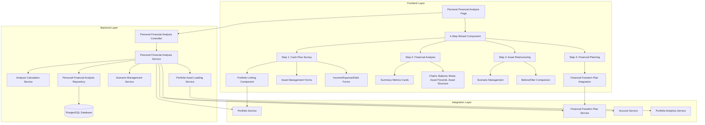
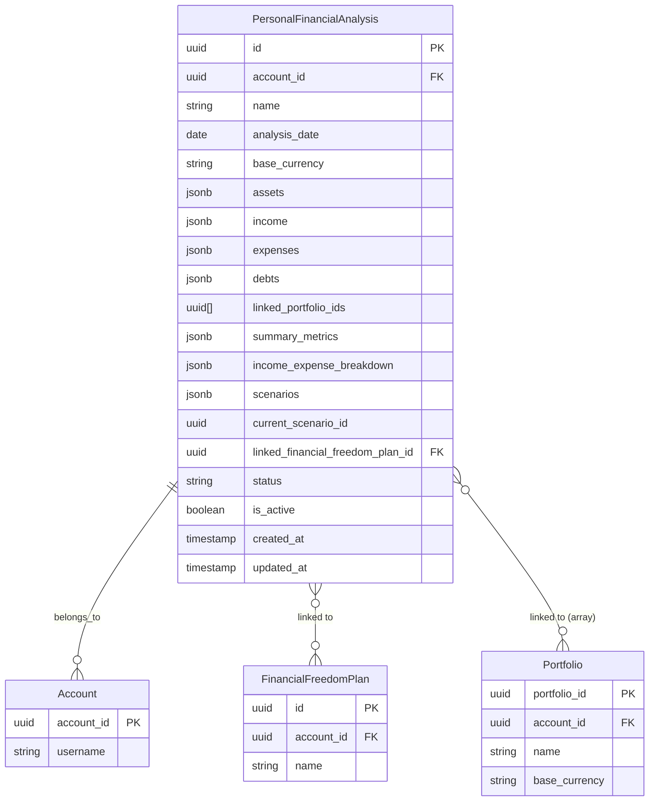
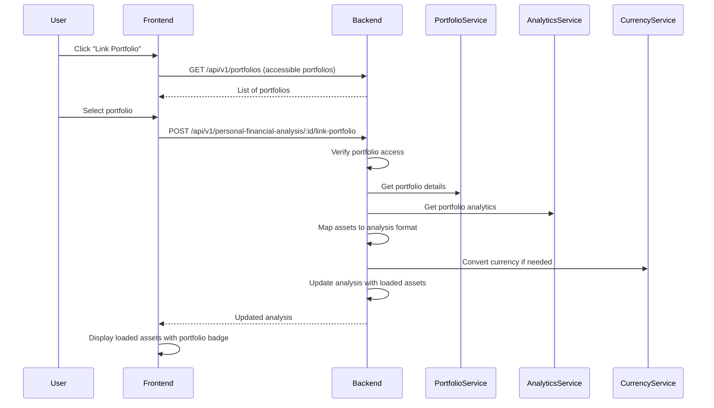
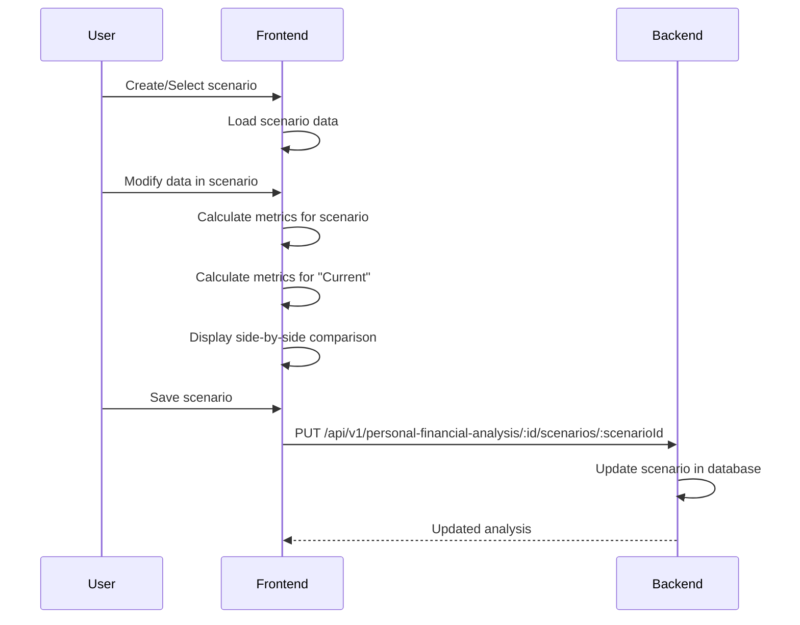
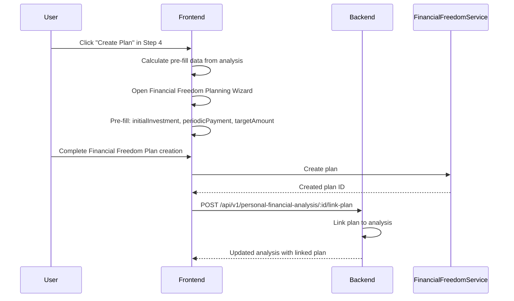

# CR-010: Personal Financial Analysis System - Technical Design Document

## Document Information
- **Document ID**: CR-010-TDD
- **Feature Name**: Personal Financial Analysis System
- **Version**: 1.0
- **Date**: December 2024
- **Author**: System Architect
- **Status**: Draft - Pending Approval
- **Related PRD**: `cr_010_prd_personal_financial_analysis.md`

## 1. Overview

### 1.1 Purpose
This document provides the technical design for implementing the Personal Financial Analysis System within the existing Portfolio Management System. The system enables users to conduct a complete financial health assessment through a 4-step workflow: cash flow survey, financial analysis, asset restructuring, and financial planning.

### 1.2 Scope
- Database schema: New `personal_financial_analyses` table with JSONB fields for flexible data storage
- Backend services: Analysis calculation service, scenario management service, portfolio asset loading service
- API endpoints: CRUD operations, portfolio linking, asset loading, scenario management
- Frontend components: 4-step wizard UI, data input forms, charts and visualizations, scenario comparison
- Integration: Financial Freedom Planning System (CR-009), Portfolio Management System, AccountContext

### 1.3 Technology Stack
- **Backend:** NestJS with TypeORM
- **Database:** PostgreSQL with JSONB support
- **Frontend:** React.js with TypeScript
- **UI Framework:** Material-UI
- **State Management:** React Query
- **Charts:** Recharts
- **Calculations:** Client-side calculations with Decimal.js for precision

### 1.4 Design Philosophy
**Key Design Decisions:**
1. **JSONB for Flexibility**: Use JSONB fields to store complex nested data (assets, income, expenses, debts, scenarios)
2. **Portfolio Integration**: Leverage existing Portfolio system for asset loading and value calculation
3. **Scenario-Based Analysis**: Support multiple "what-if" scenarios for financial restructuring
4. **Real-time Calculations**: Client-side calculations for responsive user experience
5. **Integration First**: Seamless integration with Financial Freedom Planning System

## 2. Requirements

### 2.1 Functional Requirements
- [FR-1] Users can input and manage personal financial data (assets, income, expenses, debts)
- [FR-2] System can load assets from linked Portfolios automatically
- [FR-3] System provides comprehensive financial analysis with key metrics and visualizations
- [FR-4] System supports multiple restructuring scenarios for "what-if" analysis
- [FR-5] System integrates with Financial Freedom Planning System for goal setting
- [FR-6] All analysis data is persisted in database for historical tracking

### 2.2 Non-Functional Requirements
- [NFR-1] Page load time < 2 seconds for analysis with 100+ entries
- [NFR-2] Chart rendering time < 1 second
- [NFR-3] Database queries optimized with proper indexes
- [NFR-4] All API endpoints require authentication
- [NFR-5] Data access restricted by accountId (users see only their data)
- [NFR-6] Responsive design for mobile, tablet, and desktop
- [NFR-7] Multi-language support (Vietnamese and English)

## 3. Technical Design

### 3.1 High-Level Architecture



### 3.2 Data Model Changes

#### 3.2.1 Database Schema

**New Table: `personal_financial_analyses`**

```sql
CREATE TABLE "personal_financial_analyses" (
  "id" uuid NOT NULL DEFAULT gen_random_uuid(),
  "account_id" uuid NOT NULL,
  "name" character varying(255),
  "analysis_date" date NOT NULL DEFAULT CURRENT_DATE,
  "base_currency" character varying(10) NOT NULL DEFAULT 'VND',
  
  -- Step 1: Cash Flow Survey Data (JSONB)
  "assets" jsonb NOT NULL DEFAULT '[]',
  "income" jsonb NOT NULL DEFAULT '[]',
  "expenses" jsonb NOT NULL DEFAULT '[]',
  "debts" jsonb NOT NULL DEFAULT '[]',
  "linked_portfolio_ids" uuid[] NOT NULL DEFAULT '{}',
  
  -- Step 2: Calculated Metrics (JSONB for flexibility, can be recalculated)
  "summary_metrics" jsonb,
  "income_expense_breakdown" jsonb,
  
  -- Step 3: Scenarios (JSONB)
  "scenarios" jsonb NOT NULL DEFAULT '[]',
  "current_scenario_id" uuid,
  
  -- Step 4: Financial Planning Integration
  "linked_financial_freedom_plan_id" uuid,
  
  -- Status
  "status" varchar(20) NOT NULL DEFAULT 'draft', -- 'draft', 'final'
  "is_active" boolean NOT NULL DEFAULT true,
  
  -- Timestamps
  "created_at" TIMESTAMP NOT NULL DEFAULT now(),
  "updated_at" TIMESTAMP NOT NULL DEFAULT now(),
  
  CONSTRAINT "PK_personal_financial_analyses" PRIMARY KEY ("id"),
  CONSTRAINT "FK_personal_financial_analyses_account" FOREIGN KEY ("account_id") 
    REFERENCES "accounts"("account_id") ON DELETE CASCADE,
  CONSTRAINT "FK_personal_financial_analyses_plan" FOREIGN KEY ("linked_financial_freedom_plan_id") 
    REFERENCES "financial_freedom_plans"("id") ON DELETE SET NULL
);

-- Indexes
CREATE INDEX "IDX_personal_financial_analyses_account" ON "personal_financial_analyses"("account_id");
CREATE INDEX "IDX_personal_financial_analyses_account_active" ON "personal_financial_analyses"("account_id", "is_active");
CREATE INDEX "IDX_personal_financial_analyses_date" ON "personal_financial_analyses"("analysis_date");
CREATE INDEX "IDX_personal_financial_analyses_portfolios" ON "personal_financial_analyses" USING GIN("linked_portfolio_ids");
```

#### 3.2.2 JSONB Data Structures

**Assets Structure:**
```typescript
interface AnalysisAsset {
  id: string; // UUID for frontend tracking
  name: string;
  value: number;
  category: 'consumer' | 'business' | 'financial';
  source: 'custom' | 'portfolio';
  portfolioId?: string; // If loaded from portfolio
  portfolioName?: string; // For display
  assetId?: string; // Portfolio asset ID if from portfolio
  assetType?: string; // STOCK, BOND, etc. if from portfolio
  symbol?: string; // Asset symbol if from portfolio
}
```

**Income Structure:**
```typescript
interface AnalysisIncome {
  id: string;
  name: string;
  monthlyValue: number;
  category: 'family' | 'business' | 'other';
}
```

**Expenses Structure:**
```typescript
interface AnalysisExpense {
  id: string;
  name: string;
  monthlyValue: number;
  category: 'living' | 'education' | 'insurance' | 'other';
}
```

**Debts Structure:**
```typescript
interface AnalysisDebt {
  id: string;
  name: string;
  principalAmount: number;
  interestRate: number; // Percentage (e.g., 12 for 12%)
  term: number; // Months
  monthlyPayment: number;
  remainingBalance?: number; // Optional
}
```

**Scenarios Structure:**
```typescript
interface AnalysisScenario {
  id: string;
  name: string;
  description?: string;
  assets: AnalysisAsset[];
  income: AnalysisIncome[];
  expenses: AnalysisExpense[];
  debts: AnalysisDebt[];
  createdAt: string;
  updatedAt: string;
}
```

**Summary Metrics Structure:**
```typescript
interface SummaryMetrics {
  totalFamilyIncome: number;
  totalBusinessIncome: number;
  totalOtherIncome: number;
  totalLivingExpenses: number;
  totalEducationExpenses: number;
  totalInsuranceExpenses: number;
  totalOtherExpenses: number;
  totalConsumerAssets: number;
  totalBusinessAssets: number;
  totalFinancialAssets: number;
  totalAssets: number;
  emergencyFund: number;
  emergencyFundRecommended: number;
  totalDebt: number;
  debtToAssetRatio: number; // Percentage
  netWorth: number;
}
```

#### 3.2.3 Entity Relationships



### 3.3 API Changes

#### 3.3.1 Controller Structure

**File:** `backend/src/modules/personal-financial-analysis/controllers/personal-financial-analysis.controller.ts`

```typescript
@Controller('api/v1/personal-financial-analysis')
@UseGuards(JwtAuthGuard)
export class PersonalFinancialAnalysisController {
  // GET /api/v1/personal-financial-analysis
  // Get all analyses for current user
  @Get()
  async findAll(@CurrentUser() user: User): Promise<AnalysisResponseDto[]>
  
  // GET /api/v1/personal-financial-analysis/:id
  // Get analysis by ID
  @Get(':id')
  async findOne(@Param('id') id: string, @CurrentUser() user: User): Promise<AnalysisResponseDto>
  
  // POST /api/v1/personal-financial-analysis
  // Create new analysis
  @Post()
  async create(@Body() createDto: CreateAnalysisDto, @CurrentUser() user: User): Promise<AnalysisResponseDto>
  
  // PUT /api/v1/personal-financial-analysis/:id
  // Update analysis
  @Put(':id')
  async update(@Param('id') id: string, @Body() updateDto: UpdateAnalysisDto, @CurrentUser() user: User): Promise<AnalysisResponseDto>
  
  // DELETE /api/v1/personal-financial-analysis/:id
  // Delete analysis
  @Delete(':id')
  async remove(@Param('id') id: string, @CurrentUser() user: User): Promise<void>
  
  // POST /api/v1/personal-financial-analysis/:id/link-portfolio
  // Link portfolio and load assets
  @Post(':id/link-portfolio')
  async linkPortfolio(@Param('id') id: string, @Body() linkDto: LinkPortfolioDto, @CurrentUser() user: User): Promise<AnalysisResponseDto>
  
  // DELETE /api/v1/personal-financial-analysis/:id/unlink-portfolio/:portfolioId
  // Unlink portfolio
  @Delete(':id/unlink-portfolio/:portfolioId')
  async unlinkPortfolio(@Param('id') id: string, @Param('portfolioId') portfolioId: string, @CurrentUser() user: User): Promise<AnalysisResponseDto>
  
  // POST /api/v1/personal-financial-analysis/:id/scenarios
  // Create new scenario
  @Post(':id/scenarios')
  async createScenario(@Param('id') id: string, @Body() scenarioDto: CreateScenarioDto, @CurrentUser() user: User): Promise<AnalysisResponseDto>
  
  // PUT /api/v1/personal-financial-analysis/:id/scenarios/:scenarioId
  // Update scenario
  @Put(':id/scenarios/:scenarioId')
  async updateScenario(@Param('id') id: string, @Param('scenarioId') scenarioId: string, @Body() scenarioDto: UpdateScenarioDto, @CurrentUser() user: User): Promise<AnalysisResponseDto>
  
  // DELETE /api/v1/personal-financial-analysis/:id/scenarios/:scenarioId
  // Delete scenario
  @Delete(':id/scenarios/:scenarioId')
  async deleteScenario(@Param('id') id: string, @Param('scenarioId') scenarioId: string, @CurrentUser() user: User): Promise<AnalysisResponseDto>
  
  // POST /api/v1/personal-financial-analysis/:id/link-plan
  // Link Financial Freedom Plan
  @Post(':id/link-plan')
  async linkPlan(@Param('id') id: string, @Body() linkPlanDto: LinkPlanDto, @CurrentUser() user: User): Promise<AnalysisResponseDto>
  
  // DELETE /api/v1/personal-financial-analysis/:id/unlink-plan
  // Unlink Financial Freedom Plan
  @Delete(':id/unlink-plan')
  async unlinkPlan(@Param('id') id: string, @CurrentUser() user: User): Promise<AnalysisResponseDto>
  
  // GET /api/v1/personal-financial-analysis/:id/calculate-metrics
  // Calculate summary metrics (for real-time updates)
  @Get(':id/calculate-metrics')
  async calculateMetrics(@Param('id') id: string, @CurrentUser() user: User): Promise<SummaryMetricsDto>
}
```

#### 3.3.2 DTOs

**CreateAnalysisDto:**
```typescript
export class CreateAnalysisDto {
  @IsOptional()
  @IsString()
  @MaxLength(255)
  name?: string;
  
  @IsOptional()
  @IsDateString()
  analysisDate?: string;
  
  @IsOptional()
  @IsString()
  @MaxLength(10)
  baseCurrency?: string;
  
  @IsOptional()
  @IsArray()
  @ValidateNested({ each: true })
  @Type(() => AssetDto)
  assets?: AssetDto[];
  
  @IsOptional()
  @IsArray()
  @ValidateNested({ each: true })
  @Type(() => IncomeDto)
  income?: IncomeDto[];
  
  @IsOptional()
  @IsArray()
  @ValidateNested({ each: true })
  @Type(() => ExpenseDto)
  expenses?: ExpenseDto[];
  
  @IsOptional()
  @IsArray()
  @ValidateNested({ each: true })
  @Type(() => DebtDto)
  debts?: DebtDto[];
}
```

**LinkPortfolioDto:**
```typescript
export class LinkPortfolioDto {
  @IsUUID()
  portfolioId: string;
}
```

**AnalysisResponseDto:**
```typescript
export class AnalysisResponseDto {
  id: string;
  accountId: string;
  name?: string;
  analysisDate: string;
  baseCurrency: string;
  assets: AnalysisAsset[];
  income: AnalysisIncome[];
  expenses: AnalysisExpense[];
  debts: AnalysisDebt[];
  linkedPortfolioIds: string[];
  summaryMetrics?: SummaryMetrics;
  incomeExpenseBreakdown?: IncomeExpenseBreakdown;
  scenarios: AnalysisScenario[];
  currentScenarioId?: string;
  linkedFinancialFreedomPlanId?: string;
  status: 'draft' | 'final';
  isActive: boolean;
  createdAt: string;
  updatedAt: string;
}
```

#### 3.3.3 Service Layer

**File:** `backend/src/modules/personal-financial-analysis/services/personal-financial-analysis.service.ts`

**Key Methods:**
```typescript
@Injectable()
export class PersonalFinancialAnalysisService {
  // CRUD Operations
  async findAll(accountId: string): Promise<PersonalFinancialAnalysis[]>
  async findOne(id: string, accountId: string): Promise<PersonalFinancialAnalysis>
  async create(createDto: CreateAnalysisDto, accountId: string): Promise<PersonalFinancialAnalysis>
  async update(id: string, updateDto: UpdateAnalysisDto, accountId: string): Promise<PersonalFinancialAnalysis>
  async remove(id: string, accountId: string): Promise<void>
  
  // Portfolio Linking
  async linkPortfolio(id: string, portfolioId: string, accountId: string): Promise<PersonalFinancialAnalysis>
  async unlinkPortfolio(id: string, portfolioId: string, accountId: string): Promise<PersonalFinancialAnalysis>
  async loadAssetsFromPortfolio(portfolioId: string, baseCurrency: string, accountId: string): Promise<AnalysisAsset[]>
  
  // Scenario Management
  async createScenario(id: string, scenarioDto: CreateScenarioDto, accountId: string): Promise<PersonalFinancialAnalysis>
  async updateScenario(id: string, scenarioId: string, scenarioDto: UpdateScenarioDto, accountId: string): Promise<PersonalFinancialAnalysis>
  async deleteScenario(id: string, scenarioId: string, accountId: string): Promise<PersonalFinancialAnalysis>
  async duplicateScenario(id: string, scenarioId: string, accountId: string): Promise<PersonalFinancialAnalysis>
  
  // Financial Planning Integration
  async linkFinancialFreedomPlan(id: string, planId: string, accountId: string): Promise<PersonalFinancialAnalysis>
  async unlinkFinancialFreedomPlan(id: string, accountId: string): Promise<PersonalFinancialAnalysis>
  
  // Calculations
  async calculateSummaryMetrics(analysis: PersonalFinancialAnalysis): Promise<SummaryMetrics>
  async calculateIncomeExpenseBreakdown(analysis: PersonalFinancialAnalysis): Promise<IncomeExpenseBreakdown>
}
```

**Portfolio Asset Loading Logic:**
```typescript
async loadAssetsFromPortfolio(portfolioId: string, baseCurrency: string, accountId: string): Promise<AnalysisAsset[]> {
  // 1. Verify portfolio access (VIEW permission or higher)
  const hasAccess = await this.permissionCheckService.hasPortfolioAccess(portfolioId, accountId, 'VIEW');
  if (!hasAccess) {
    throw new ForbiddenException('No access to portfolio');
  }
  
  // 2. Get portfolio with assets
  const portfolio = await this.portfolioService.findOne(portfolioId, accountId);
  
  // 3. Get portfolio analytics for current values
  const analytics = await this.portfolioAnalyticsService.getPortfolioAnalytics(portfolioId);
  
  // 4. Map portfolio assets to analysis assets
  const analysisAssets: AnalysisAsset[] = portfolio.portfolioAssets.map(pa => {
    const assetValue = analytics.assetsByType[pa.asset.type]?.totalValue || 0;
    
    // Currency conversion if needed
    let convertedValue = assetValue;
    if (portfolio.baseCurrency !== baseCurrency) {
      convertedValue = await this.currencyService.convert(
        assetValue,
        portfolio.baseCurrency,
        baseCurrency
      );
    }
    
    // Map asset type to category
    let category: 'consumer' | 'business' | 'financial';
    if (['STOCK', 'BOND', 'GOLD', 'CRYPTO', 'COMMODITY', 'CURRENCY', 'DEPOSITS'].includes(pa.asset.type)) {
      category = 'financial';
    } else if (pa.asset.type === 'REALESTATE') {
      // User will choose, default to 'consumer'
      category = 'consumer';
    } else {
      // OTHER - user must choose
      category = 'financial'; // Default, user can change
    }
    
    return {
      id: uuidv4(),
      name: pa.asset.name,
      value: convertedValue,
      category,
      source: 'portfolio',
      portfolioId,
      portfolioName: portfolio.name,
      assetId: pa.asset.assetId,
      assetType: pa.asset.type,
      symbol: pa.asset.symbol,
    };
  });
  
  return analysisAssets;
}
```

### 3.4 UI/Frontend Changes

#### 3.4.1 Component Structure

```
frontend/src/
├── pages/
│   └── PersonalFinancialAnalysis.tsx (Main page with analysis list)
├── components/
│   └── PersonalFinancialAnalysis/
│       ├── PersonalFinancialAnalysisWizard.tsx (Main 4-step wizard)
│       ├── Step1CashFlowSurvey.tsx
│       │   ├── PortfolioLinkingSection.tsx
│       │   ├── AssetManagementSection.tsx
│       │   ├── IncomeManagementSection.tsx
│       │   ├── ExpenseManagementSection.tsx
│       │   └── DebtManagementSection.tsx
│       ├── Step2FinancialAnalysis.tsx
│       │   ├── SummaryMetricsCards.tsx
│       │   ├── IncomeExpenseTable.tsx
│       │   ├── BalanceSheetChart.tsx
│       │   ├── AssetPyramidChart.tsx
│       │   └── AssetStructureChart.tsx
│       ├── Step3AssetRestructuring.tsx
│       │   ├── ScenarioManagement.tsx
│       │   ├── ScenarioComparison.tsx
│       │   └── SystemSuggestions.tsx (Optional)
│       └── Step4FinancialPlanning.tsx
│           ├── FinancialFreedomPlanIntegration.tsx
│           └── PlanSelectionModal.tsx
├── services/
│   └── api.personal-financial-analysis.ts
├── hooks/
│   ├── usePersonalFinancialAnalysis.ts
│   └── useAnalysisCalculations.ts
└── types/
    └── personalFinancialAnalysis.types.ts
```

#### 3.4.2 Key Components

**PersonalFinancialAnalysisWizard.tsx:**
- Material-UI Stepper for 4-step navigation
- State management for all steps
- Auto-save on step change
- Validation before allowing next step
- Integration with React Query for data persistence

**Step1CashFlowSurvey.tsx:**
- Portfolio linking section with portfolio selector
- Asset management with add/edit/delete
- Income/Expense/Debt management sections
- Real-time totals calculation
- Visual distinction for portfolio-loaded assets

**Step2FinancialAnalysis.tsx:**
- Summary metrics cards layout
- Income/Expense breakdown table
- Recharts components for visualizations
- Responsive design for mobile/tablet/desktop

**Step3AssetRestructuring.tsx:**
- Scenario dropdown/selector
- Scenario CRUD operations
- Side-by-side comparison view
- Visual indicators for improvements

**Step4FinancialPlanning.tsx:**
- Integration with Financial Freedom Planning Wizard
- Plan selection modal
- Pre-fill data from analysis
- Link/unlink functionality

#### 3.4.3 Calculation Logic (Client-Side)

**File:** `frontend/src/utils/personalFinancialAnalysisCalculations.ts`

```typescript
export function calculateSummaryMetrics(data: {
  assets: AnalysisAsset[];
  income: AnalysisIncome[];
  expenses: AnalysisExpense[];
  debts: AnalysisDebt[];
}): SummaryMetrics {
  // Calculate totals by category
  const totalFamilyIncome = data.income
    .filter(i => i.category === 'family')
    .reduce((sum, i) => sum + i.monthlyValue * 12, 0);
  
  const totalBusinessIncome = data.income
    .filter(i => i.category === 'business')
    .reduce((sum, i) => sum + i.monthlyValue * 12, 0);
  
  // ... similar calculations for expenses, assets, debts
  
  const totalAssets = data.assets.reduce((sum, a) => sum + a.value, 0);
  const totalDebt = data.debts.reduce((sum, d) => sum + (d.remainingBalance || d.principalAmount), 0);
  
  return {
    totalFamilyIncome,
    totalBusinessIncome,
    // ... other metrics
    totalAssets,
    totalDebt,
    debtToAssetRatio: totalAssets > 0 ? (totalDebt / totalAssets) * 100 : 0,
    netWorth: totalAssets - totalDebt,
    emergencyFundRecommended: calculateEmergencyFund(data.expenses),
  };
}
```

### 3.5 Logic Flow

#### 3.5.1 Portfolio Linking and Asset Loading Flow



#### 3.5.2 Scenario Comparison Flow



#### 3.5.3 Financial Freedom Plan Integration Flow



### 3.6 Dependencies

#### 3.6.1 Internal Dependencies
- **Financial Freedom Planning System (CR-009)**: Required for Step 4 integration
  - `FinancialFreedomPlanService` for plan linking
  - `FinancialFreedomWizard` component for plan creation
- **Portfolio Management System**: Required for portfolio linking
  - `PortfolioService` for portfolio access
  - `PortfolioAnalyticsService` for asset values
  - `PermissionCheckService` for access control
- **AccountContext**: Required for baseCurrency and accountId
- **Currency Service**: Required for currency conversion (if exists)

#### 3.6.2 External Dependencies
- **React 18+**: Frontend framework
- **NestJS**: Backend framework
- **PostgreSQL**: Database with JSONB support
- **TypeORM**: ORM for database operations
- **Recharts**: Chart library for visualizations
- **Material-UI**: UI component library
- **React Query**: State management and data fetching
- **Decimal.js**: For precise financial calculations (optional, can use native JS)

### 3.7 Security Considerations

1. **Authentication**: All API endpoints require JWT authentication via `@UseGuards(JwtAuthGuard)`
2. **Authorization**: Data access restricted by `accountId` - users can only access their own analyses
3. **Input Validation**: 
   - Use `class-validator` decorators on all DTOs
   - Validate monetary values (positive numbers, reasonable ranges)
   - Validate percentages (0-100%)
   - Validate dates and UUIDs
4. **SQL Injection Prevention**: 
   - Use TypeORM parameterized queries
   - No raw SQL with user input
5. **XSS Prevention**: 
   - Sanitize user input on frontend
   - Use React's built-in XSS protection
6. **Portfolio Access Control**: 
   - Verify portfolio access before linking
   - Use `PermissionCheckService` to check VIEW permission or higher

### 3.8 Performance Considerations

1. **Database Optimization**:
   - Index on `account_id` and `(account_id, is_active)` for fast queries
   - GIN index on `linked_portfolio_ids` array for portfolio filtering
   - Index on `analysis_date` for date-based queries
2. **Client-Side Calculations**:
   - Perform calculations on frontend for responsiveness
   - Use `useMemo` for expensive calculations
   - Debounce auto-save operations
3. **Chart Rendering**:
   - Lazy load charts (only render when step is active)
   - Use `React.memo` for chart components
   - Limit data points for large datasets
4. **Data Loading**:
   - Load analysis data on demand
   - Cache portfolio data for asset loading
   - Use React Query for automatic caching and refetching

## 4. Testing Plan

### 4.1 Unit Tests

**Backend:**
- `PersonalFinancialAnalysisService` unit tests
  - Test CRUD operations
  - Test portfolio linking and asset loading
  - Test scenario management
  - Test calculation methods
- `PersonalFinancialAnalysisController` unit tests
  - Test all endpoints
  - Test authentication and authorization
  - Test input validation

**Frontend:**
- Calculation utility tests
  - Test summary metrics calculation
  - Test income/expense breakdown
  - Test debt calculations
- Component unit tests
  - Test form validation
  - Test data display
  - Test user interactions

### 4.2 Integration Tests

- Test portfolio linking end-to-end
- Test asset loading from portfolio
- Test scenario creation and comparison
- Test Financial Freedom Plan integration
- Test currency conversion (if applicable)

### 4.3 E2E Tests

- Complete 4-step wizard flow
- Portfolio linking and asset loading
- Scenario creation and comparison
- Financial Freedom Plan creation and linking
- Data persistence and retrieval

## 5. Open Questions

1. **Currency Conversion**: Do we have a currency conversion service, or should we implement one?
2. **Asset Pyramid Calculation**: How do we categorize assets into the 4 pyramid layers (Risk, Growth, Income Generation, Protection)? This may require additional asset metadata.
3. **System Suggestions**: What specific algorithms/rules should we use for generating restructuring suggestions?
4. **Historical Analysis**: Should we support comparing analyses over time in Phase 1, or defer to Phase 2?
5. **Emergency Fund Source**: Where does the current emergency fund value come from? Is it a separate input or calculated from assets?

## 6. Alternatives Considered

### 6.1 Database Schema Alternatives

**Alternative 1: Normalized Tables**
- **Approach**: Separate tables for assets, income, expenses, debts, scenarios
- **Rejected Because**: Too complex, many joins, harder to maintain, less flexible for future changes

**Alternative 2: JSONB (Chosen)**
- **Approach**: Store all data in JSONB fields
- **Accepted Because**: Flexible, easy to extend, simpler queries, matches existing Financial Freedom Planning pattern

### 6.2 Calculation Location Alternatives

**Alternative 1: Server-Side Only**
- **Approach**: All calculations on backend
- **Rejected Because**: Slower user experience, more API calls, less responsive

**Alternative 2: Client-Side (Chosen)**
- **Approach**: Calculations on frontend with server-side validation
- **Accepted Because**: Faster, more responsive, better UX, reduces server load

### 6.3 Portfolio Asset Loading Alternatives

**Alternative 1: Manual Entry Only**
- **Approach**: Users must enter all assets manually
- **Rejected Because**: Poor UX, duplicate work, error-prone

**Alternative 2: Automatic Loading (Chosen)**
- **Approach**: Load assets from linked portfolios automatically
- **Accepted Because**: Better UX, reduces errors, leverages existing data

---

## Document Approval

- **Status**: Draft
- **Next Steps**: 
  1. Review and approval from stakeholders
  2. Create Task Breakdown Document
  3. Begin implementation

---

**End of Document**

