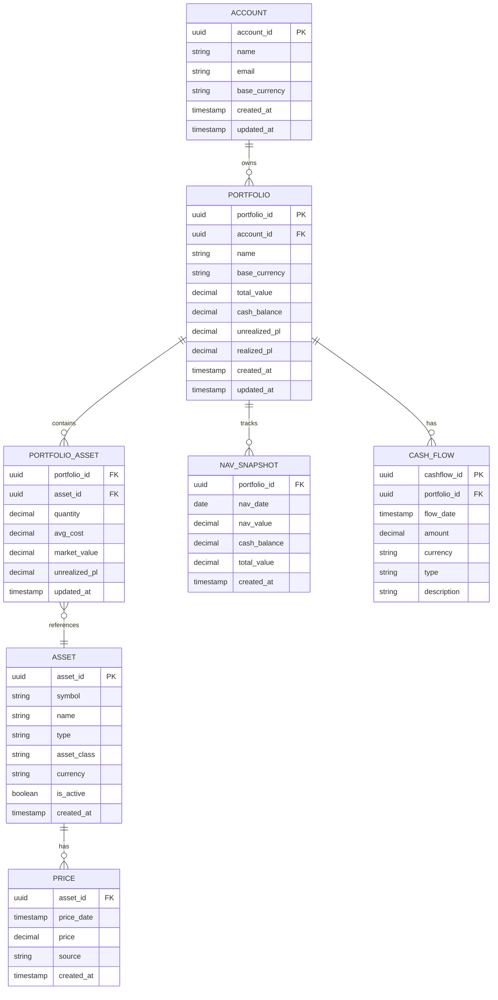
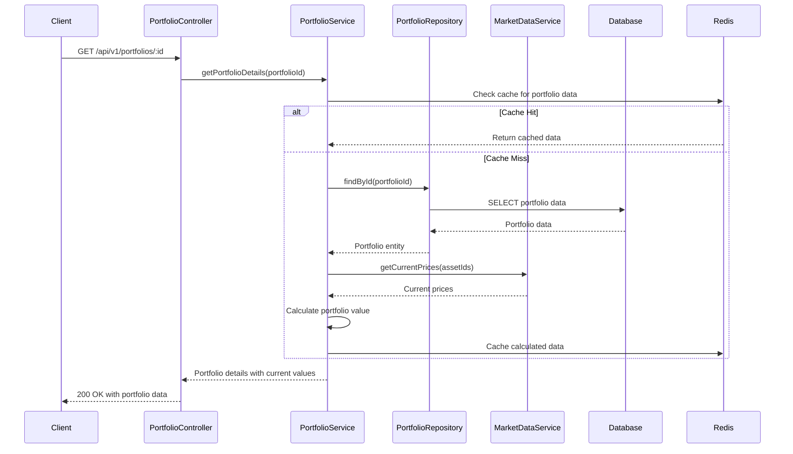

# Technical Design Document: Portfolio Management Module

## 1. Overview

The Portfolio Management module is the core component of the Portfolio Management System, responsible for managing investment portfolios, tracking portfolio values, calculating performance metrics, and providing real-time portfolio analytics. This module handles the complete lifecycle of portfolio management from creation to performance analysis.

## 2. Requirements

### 2.1 Functional Requirements

* **Portfolio CRUD Operations**
  * As a portfolio manager, I want to create a new portfolio so that I can organize my investment assets
  * As a portfolio manager, I want to view my portfolio details so that I can see current holdings and performance
  * As a portfolio manager, I want to update portfolio information so that I can keep it current
  * As a portfolio manager, I want to delete a portfolio so that I can remove unused portfolios

* **Portfolio Value Calculation**
  * As a portfolio manager, I want to see the current total value of my portfolio so that I can track my wealth
  * As a portfolio manager, I want to see the unrealized P&L for each asset so that I can understand performance
  * As a portfolio manager, I want to see the realized P&L from completed trades so that I can track trading performance

* **Asset Allocation Tracking**
  * As a portfolio manager, I want to see the percentage allocation by asset type so that I can understand diversification
  * As a portfolio manager, I want to see the percentage allocation by asset name so that I can track individual holdings
  * As a portfolio manager, I want to filter allocations by asset type so that I can focus on specific categories

* **Performance Analytics**
  * As a portfolio manager, I want to see NAV history so that I can track portfolio growth over time
  * As a portfolio manager, I want to see ROE history with month filtering so that I can analyze returns
  * As a portfolio manager, I want to see week-on-week change percentage so that I can track short-term performance
  * As a portfolio manager, I want to see portfolio return history by asset group so that I can compare performance

### 2.2 Non-Functional Requirements

* **Performance**: API response time must be less than 500ms for portfolio queries
* **Scalability**: The system should handle 1000+ concurrent users accessing portfolios
* **Data Consistency**: Portfolio values must be calculated consistently across all users
* **Real-time Updates**: Portfolio values should update within 5 minutes of market data changes
* **Availability**: Portfolio data should be available 99.9% of the time

## 3. Technical Design

### 3.1. Data Model Changes

The Portfolio Management module will use the following entities:



### 3.2. API Changes

#### Portfolio Controller Endpoints

```typescript
// Portfolio CRUD Operations
GET    /api/v1/portfolios                    // List all portfolios
POST   /api/v1/portfolios                    // Create new portfolio
GET    /api/v1/portfolios/:id                // Get portfolio details
PUT    /api/v1/portfolios/:id                // Update portfolio
DELETE /api/v1/portfolios/:id                // Delete portfolio

// Portfolio Analytics
GET    /api/v1/portfolios/:id/nav            // Get current NAV
GET    /api/v1/portfolios/:id/nav/history    // Get NAV history
GET    /api/v1/portfolios/:id/performance    // Get performance metrics
GET    /api/v1/portfolios/:id/allocation     // Get asset allocation
GET    /api/v1/portfolios/:id/positions      // Get current positions
```

#### Example API Requests and Responses

**Create Portfolio:**
```json
POST /api/v1/portfolios
{
  "name": "Growth Portfolio",
  "base_currency": "VND",
  "description": "Long-term growth focused portfolio"
}

Response:
{
  "portfolio_id": "123e4567-e89b-12d3-a456-426614174000",
  "name": "Growth Portfolio",
  "base_currency": "VND",
  "total_value": 0,
  "cash_balance": 0,
  "created_at": "2024-12-19T10:00:00Z"
}
```

**Get Portfolio Details:**
```json
GET /api/v1/portfolios/123e4567-e89b-12d3-a456-426614174000

Response:
{
  "portfolio_id": "123e4567-e89b-12d3-a456-426614174000",
  "name": "Growth Portfolio",
  "base_currency": "VND",
  "total_value": 150000000,
  "cash_balance": 50000000,
  "unrealized_pl": 8000000,
  "realized_pl": 2000000,
  "assets": [
    {
      "asset_id": "456e7890-e89b-12d3-a456-426614174001",
      "symbol": "HPG",
      "name": "Hoa Phat Group",
      "quantity": 2000,
      "avg_cost": 27000,
      "market_price": 31000,
      "market_value": 62000000,
      "unrealized_pl": 8000000
    }
  ],
  "created_at": "2024-12-19T10:00:00Z",
  "updated_at": "2024-12-19T15:30:00Z"
}
```

**Get Asset Allocation:**
```json
GET /api/v1/portfolios/123e4567-e89b-12d3-a456-426614174000/allocation?groupby=type

Response:
{
  "portfolio_id": "123e4567-e89b-12d3-a456-426614174000",
  "allocation": {
    "equities": 65.0,
    "bonds": 20.0,
    "gold": 10.0,
    "cash": 5.0
  },
  "total_value": 150000000,
  "calculated_at": "2024-12-19T15:30:00Z"
}
```

### 3.3. UI Changes

#### Frontend Components (React.js)

**Portfolio Dashboard:**
- `PortfolioDashboard.tsx`: Main dashboard showing portfolio overview
- `PortfolioCard.tsx`: Individual portfolio summary card
- `AssetAllocationChart.tsx`: Pie chart showing asset allocation
- `PerformanceChart.tsx`: Line chart showing NAV history

**Portfolio Management:**
- `PortfolioList.tsx`: List of all portfolios
- `CreatePortfolioModal.tsx`: Modal for creating new portfolios
- `PortfolioDetails.tsx`: Detailed portfolio view
- `EditPortfolioModal.tsx`: Modal for editing portfolio information

**Analytics Views:**
- `PerformanceAnalytics.tsx`: Performance metrics and charts
- `AllocationView.tsx`: Asset allocation breakdown
- `PositionView.tsx`: Current positions table

### 3.4. Logic Flow



### 3.5. Dependencies

**New Dependencies Required:**
- `@nestjs/typeorm`: TypeORM integration for database operations
- `@nestjs/cache-manager`: Caching support for performance optimization
- `cache-manager-redis-store`: Redis cache store
- `class-validator`: Input validation for DTOs
- `class-transformer`: Data transformation for DTOs
- `date-fns`: Date manipulation utilities
- `lodash`: Utility functions for data processing

**Existing Dependencies:**
- `@nestjs/common`: Core NestJS functionality
- `@nestjs/core`: NestJS framework
- `typeorm`: Database ORM
- `pg`: PostgreSQL driver
- `redis`: Redis client

### 3.6. Security Considerations

* **Input Validation**: All input data will be validated using class-validator decorators
* **SQL Injection Prevention**: TypeORM will handle parameterized queries
* **Data Encryption**: Sensitive portfolio data will be encrypted at rest
* **Access Control**: Portfolio access will be restricted to the owner account
* **Rate Limiting**: API endpoints will implement rate limiting to prevent abuse
* **Audit Logging**: All portfolio operations will be logged for audit purposes

### 3.7. Performance Considerations

* **Caching Strategy**: Portfolio data will be cached in Redis with 5-minute TTL
* **Database Indexing**: Proper indexes will be created on frequently queried fields
* **Lazy Loading**: Related entities will be loaded on-demand to reduce initial load time
* **Pagination**: Large result sets will be paginated to improve response times
* **Background Processing**: Portfolio value calculations will be done asynchronously
* **Connection Pooling**: Database connections will be pooled for better performance

## 4. Testing Plan

### 4.1. Unit Tests
* **PortfolioService**: Test portfolio CRUD operations, value calculations, and business logic
* **PortfolioController**: Test API endpoints, request/response handling, and error cases
* **PortfolioRepository**: Test database operations and query methods
* **DTOs**: Test validation rules and data transformation

### 4.2. Integration Tests
* **API Integration**: Test complete API workflows from request to response
* **Database Integration**: Test database operations with real PostgreSQL instance
* **Cache Integration**: Test Redis caching functionality
* **External Service Integration**: Test market data service integration

### 4.3. Performance Tests
* **Load Testing**: Test system performance under 1000+ concurrent users
* **Response Time Testing**: Verify API response times are under 500ms
* **Cache Performance**: Test cache hit rates and performance improvements

### 4.4. User Acceptance Tests
* **Portfolio Creation**: Test complete portfolio creation workflow
* **Value Calculation**: Test portfolio value calculation accuracy
* **Performance Analytics**: Test performance metrics and charts
* **Asset Allocation**: Test allocation calculations and filtering

## 5. Open Questions

1. **Caching Strategy**: Should we use separate Redis instances for different types of data (portfolio data vs. market data)? yes.
2. **Data Retention**: How long should we retain historical NAV snapshots? 5 years.
3. **Real-time Updates**: Should portfolio values update in real-time via WebSocket or polling? websocket.
4. **Performance Metrics**: Which performance calculation methods should we support (TWR, IRR, XIRR)? all.
5. **Multi-currency**: How should we handle portfolios with multiple currencies? Convert to base currency.

## 6. Alternatives Considered

### 6.1. Monolithic vs. Microservices
**Alternative**: Implement portfolio management as part of a monolithic application
**Rejected**: Microservices architecture provides better scalability and maintainability

### 6.2. Database Choice
**Alternative**: Use MongoDB for document-based storage
**Rejected**: PostgreSQL provides better ACID compliance and relational data integrity

### 6.3. Caching Strategy
**Alternative**: Use in-memory caching instead of Redis
**Rejected**: Redis provides better scalability and persistence across service restarts

### 6.4. Real-time Updates
**Alternative**: Use Server-Sent Events instead of WebSocket
**Rejected**: WebSocket provides bidirectional communication for better user experience
