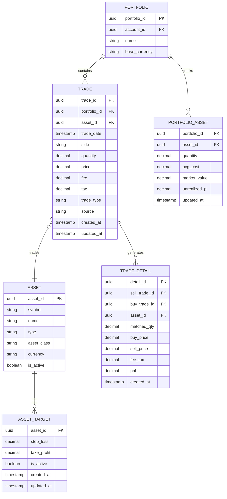
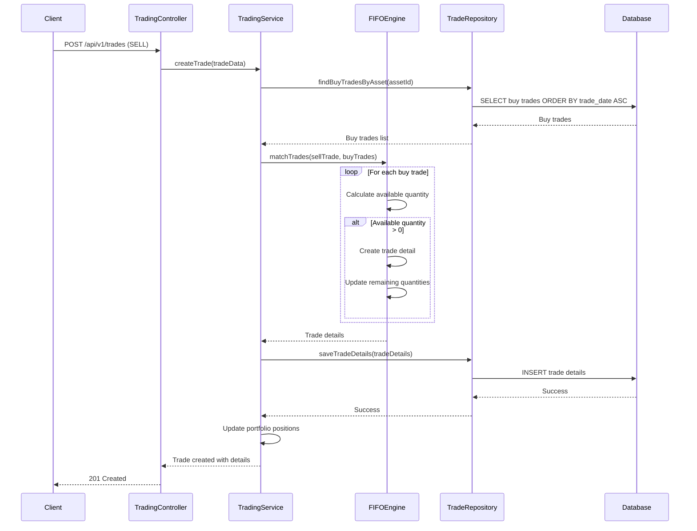
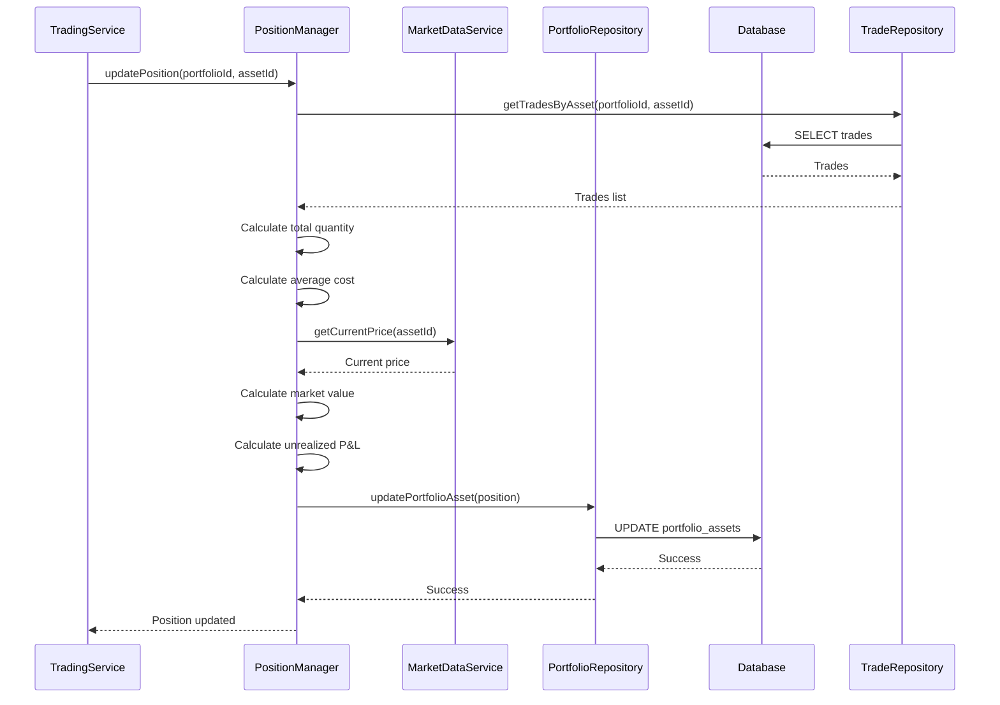

# Technical Design Document: Trading System Module

## 1. Overview

The Trading System module is responsible for managing all trading activities, including trade recording, FIFO/LIFO calculations, trade matching, position management, and risk management features like stop-loss and take-profit targets. This module handles the complete trading lifecycle from trade entry to position tracking and P&L calculations.

## 2. Requirements

### 2.1 Functional Requirements

* **Trade Recording**
  * As a trader, I want to record buy transactions so that I can track my purchases
  * As a trader, I want to record sell transactions so that I can track my sales
  * As a trader, I want to update existing trades so that I can correct mistakes
  * As a trader, I want to delete trades so that I can remove erroneous entries

* **Trade Matching and FIFO Calculation**
  * As a trader, I want the system to automatically match sell trades with buy trades using FIFO method so that I can track realized P&L accurately
  * As a trader, I want to see trade details showing which buy trades were matched with sell trades so that I can understand my trading performance
  * As a trader, I want to see realized P&L for each trade so that I can track my trading profits

* **Position Management**
  * As a trader, I want to see my current positions for each asset so that I can track my holdings
  * As a trader, I want to see the average cost of my positions so that I can understand my cost basis
  * As a trader, I want to see unrealized P&L for each position so that I can track paper profits/losses

* **Risk Management**
  * As a trader, I want to set stop-loss targets for my positions so that I can limit my losses
  * As a trader, I want to set take-profit targets for my positions so that I can lock in profits
  * As a trader, I want to receive alerts when targets are reached so that I can take action

* **Trade Analysis**
  * As a trader, I want to see a list of all my trades so that I can review my trading history
  * As a trader, I want to filter trades by asset so that I can focus on specific investments
  * As a trader, I want to see trade performance metrics so that I can improve my trading strategy

### 2.2 Non-Functional Requirements

* **Performance**: Trade recording should complete within 200ms
* **Accuracy**: FIFO calculations must be 100% accurate
* **Consistency**: Trade data must be consistent across all operations
* **Scalability**: System should handle 10,000+ trades per portfolio
* **Auditability**: All trade operations must be logged for audit purposes

## 3. Technical Design

### 3.1. Data Model Changes

The Trading System module will use the following entities:



### 3.2. API Changes

#### Trading Controller Endpoints

```typescript
// Trade Management
GET    /api/v1/trades                        // List all trades
POST   /api/v1/trades                        // Create new trade
GET    /api/v1/trades/:id                    // Get trade details
PUT    /api/v1/trades/:id                    // Update trade
DELETE /api/v1/trades/:id                    // Delete trade

// Position Management
GET    /api/v1/portfolios/:id/positions      // Get current positions
GET    /api/v1/portfolios/:id/positions/:assetId  // Get position for specific asset

// Risk Management
POST   /api/v1/assets/:id/targets            // Set stop-loss/take-profit
GET    /api/v1/assets/:id/targets            // Get current targets
PUT    /api/v1/assets/:id/targets            // Update targets
DELETE /api/v1/assets/:id/targets            // Remove targets

// Trade Analysis
GET    /api/v1/trades/analysis               // Get trade analysis
GET    /api/v1/trades/performance            // Get trading performance
```

#### Example API Requests and Responses

**Create Trade:**
```json
POST /api/v1/trades
{
  "portfolio_id": "123e4567-e89b-12d3-a456-426614174000",
  "asset_id": "456e7890-e89b-12d3-a456-426614174001",
  "trade_date": "2024-12-19T10:00:00Z",
  "side": "BUY",
  "quantity": 1000,
  "price": 28000,
  "fee": 1400,
  "tax": 0,
  "trade_type": "NORMAL",
  "source": "VNDIRECT"
}

Response:
{
  "trade_id": "789e0123-e89b-12d3-a456-426614174002",
  "portfolio_id": "123e4567-e89b-12d3-a456-426614174000",
  "asset_id": "456e7890-e89b-12d3-a456-426614174001",
  "trade_date": "2024-12-19T10:00:00Z",
  "side": "BUY",
  "quantity": 1000,
  "price": 28000,
  "fee": 1400,
  "tax": 0,
  "trade_type": "NORMAL",
  "source": "VNDIRECT",
  "status": "recorded",
  "created_at": "2024-12-19T10:00:00Z"
}
```

**Get Current Positions:**
```json
GET /api/v1/portfolios/123e4567-e89b-12d3-a456-426614174000/positions

Response:
{
  "portfolio_id": "123e4567-e89b-12d3-a456-426614174000",
  "positions": [
    {
      "asset_id": "456e7890-e89b-12d3-a456-426614174001",
      "symbol": "HPG",
      "name": "Hoa Phat Group",
      "quantity": 2000,
      "avg_cost": 27000,
      "market_price": 31000,
      "market_value": 62000000,
      "unrealized_pl": 8000000,
      "unrealized_pl_pct": 12.96
    }
  ],
  "total_positions": 1,
  "total_market_value": 62000000,
  "total_unrealized_pl": 8000000
}
```

**Set Risk Targets:**
```json
POST /api/v1/assets/456e7890-e89b-12d3-a456-426614174001/targets
{
  "stop_loss": 25000,
  "take_profit": 35000
}

Response:
{
  "asset_id": "456e7890-e89b-12d3-a456-426614174001",
  "stop_loss": 25000,
  "take_profit": 35000,
  "is_active": true,
  "created_at": "2024-12-19T10:00:00Z"
}
```

### 3.3. UI Changes

#### Frontend Components (React.js)

**Trading Interface:**
- `TradeForm.tsx`: Form for creating new trades
- `TradeList.tsx`: List of all trades with filtering
- `TradeDetails.tsx`: Detailed view of individual trades
- `EditTradeModal.tsx`: Modal for editing trades

**Position Management:**
- `PositionTable.tsx`: Table showing current positions
- `PositionCard.tsx`: Card view for individual positions
- `PositionChart.tsx`: Chart showing position performance

**Risk Management:**
- `RiskTargetsForm.tsx`: Form for setting stop-loss/take-profit
- `RiskTargetsList.tsx`: List of current risk targets
- `AlertSettings.tsx`: Settings for trade alerts

**Trade Analysis:**
- `TradeAnalysis.tsx`: Trading performance analytics
- `TradePerformanceChart.tsx`: Chart showing trading performance
- `TradeHistory.tsx`: Historical trade data

### 3.4. Logic Flow

#### FIFO Algorithm Flow



#### Position Update Flow



### 3.5. Dependencies

**New Dependencies Required:**
- `@nestjs/typeorm`: TypeORM integration for database operations
- `@nestjs/schedule`: Scheduled tasks for position updates
- `class-validator`: Input validation for trade DTOs
- `class-transformer`: Data transformation for DTOs
- `decimal.js`: Precise decimal calculations for financial data
- `moment`: Date manipulation for trade dates

**Existing Dependencies:**
- `@nestjs/common`: Core NestJS functionality
- `@nestjs/core`: NestJS framework
- `typeorm`: Database ORM
- `pg`: PostgreSQL driver
- `redis`: Redis client for caching

### 3.6. Security Considerations

* **Input Validation**: All trade data will be validated using class-validator
* **SQL Injection Prevention**: TypeORM will handle parameterized queries
* **Data Integrity**: Database transactions will ensure trade consistency
* **Access Control**: Trades will be restricted to portfolio owners
* **Audit Logging**: All trade operations will be logged
* **Rate Limiting**: Trade creation will be rate-limited to prevent abuse

### 3.7. Performance Considerations

* **Database Indexing**: Indexes on trade_date, asset_id, and portfolio_id
* **Caching**: Position data will be cached in Redis
* **Batch Processing**: FIFO calculations will be optimized for large datasets
* **Connection Pooling**: Database connections will be pooled
* **Async Processing**: Position updates will be done asynchronously
* **Pagination**: Large trade lists will be paginated

## 4. Testing Plan

### 4.1. Unit Tests
* **TradingService**: Test trade creation, FIFO calculations, and position updates
* **FIFOEngine**: Test trade matching algorithm with various scenarios
* **PositionManager**: Test position calculations and updates
* **TradingController**: Test API endpoints and error handling

### 4.2. Integration Tests
* **Trade Workflow**: Test complete trade creation and matching workflow
* **Database Integration**: Test trade persistence and retrieval
* **FIFO Algorithm**: Test FIFO matching with real data
* **Position Updates**: Test position calculation accuracy

### 4.3. Performance Tests
* **Trade Creation**: Test trade creation performance under load
* **FIFO Calculation**: Test FIFO algorithm performance with large datasets
* **Position Updates**: Test position update performance

### 4.4. User Acceptance Tests
* **Trade Recording**: Test complete trade recording workflow
* **FIFO Matching**: Test FIFO calculation accuracy
* **Position Tracking**: Test position management features
* **Risk Management**: Test stop-loss and take-profit functionality

## 5. Open Questions

1. **FIFO vs LIFO**: Should we support both FIFO and LIFO methods or just FIFO? Both.
2. **Trade Validation**: What validation rules should we apply to trades? No validation needed.
3. **Position Updates**: How frequently should positions be updated? Immediately if applicable.
4. **Risk Alerts**: How should risk alerts be delivered (email, push notification, etc.)? Define later
5. **Trade Cancellation**: Should we support trade cancellation or only deletion? yes if applicable.

## 6. Alternatives Considered

### 6.1. FIFO Algorithm Implementation
**Alternative**: Use database triggers for FIFO calculations
**Rejected**: Application-level control provides better flexibility and testing

### 6.2. Position Storage
**Alternative**: Calculate positions on-demand instead of storing them
**Rejected**: Storing positions provides better performance for frequent queries

### 6.3. Trade Matching
**Alternative**: Use event sourcing for trade matching
**Rejected**: Current approach is simpler and sufficient for requirements

### 6.4. Risk Management
**Alternative**: Integrate with external risk management systems
**Rejected**: Built-in risk management provides better control and simplicity
